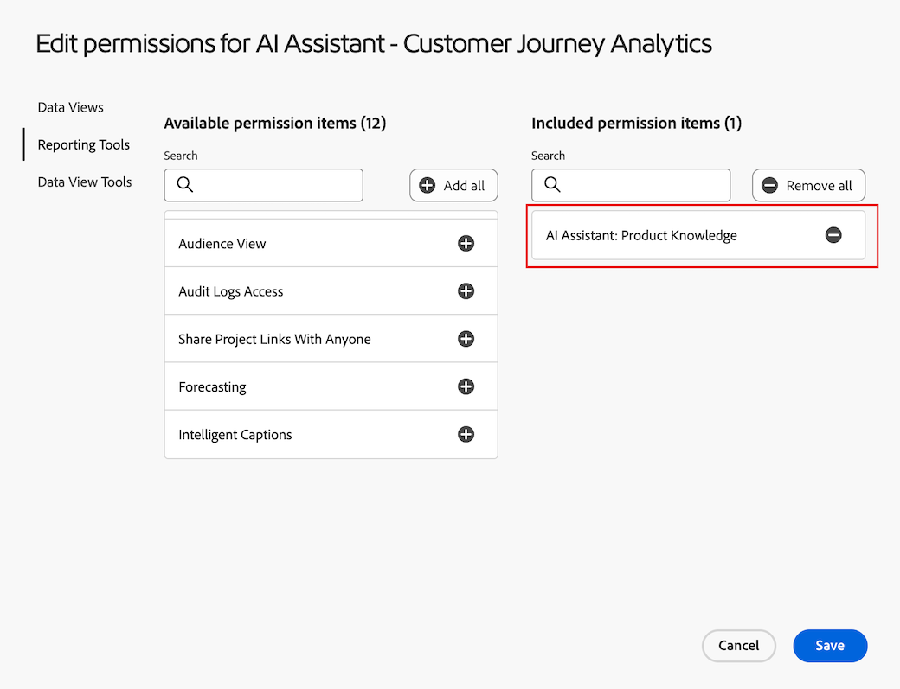
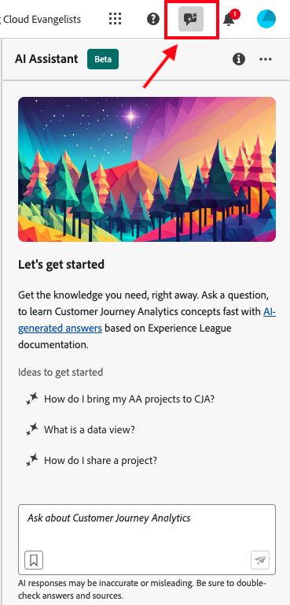
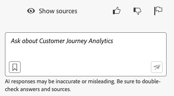

# Adobe Customer Journey Analytics 向けの AI アシスタント

AI アシスタントは、実務担当者が迅速にタスクを実行できる対話型エクスペリエンスです。 タスクが概念の理解、問題のトラブルシューティング、情報の検索のいずれを目的としているかは関係ありません。 また、AI アシスタントを使用すると、専門家でないユーザーでも専門的なタスクを実行できるため、全体的な作業の質が向上します。

Customer Journey Analytics の AI アシスタントは、Adobe Experience League のドキュメントで学習しています。 質問すると、AI アシスタントは迅速な学習を可能にする有益な回答で応答します。

初心者のユーザーは、AI アシスタントを使用して Customer Journey Analytics の概念を学習し、馴染みのない製品や機能に慣れることができます。 経験豊富なユーザーは、AI アシスタントを使用して、より高度なユースケースやヒントやテクニックを提示できます。

概念的な質問の例を次に示します。

* バッチ取り込みとストリーミング取り込みの違いは何ですか？
* Customer Journey Analytics は何に最も適していますか？
* データビューを設定するにはどうすれば良いですか？

Customer Journey Analytics の範囲外の質問（Adobe Target や Adobe Creative Cloud スイートといった、他の Adobe 製品）に関する質問には回答できません。

Customer Journey Analytics 向けの AI アシスタントは、すべての製品層で使用できます。

## 製品知識 {#knowledge}

| 製品知識 | 例 |
| --- | --- |
| 的を絞った学習 | <ul><li>Adobe Analytics と Customer Journey Analytics の違いは何ですか？</li><li>計算指標を作成するにはどうすれば良いですか？</li></ul> |
| 検出を開く | <ul><li>ワークスペースプロジェクトを書き出すにはどうすれば良いですか？</li><li>重複するワークスペースコンポーネントを見つけるにはどうすれば良いですか？</li></ul> |
| トラブルシューティング | <ul><li>データが CJA に取り込まれるのにどのくらい時間がかかりますか？</li><li>Customer Journey Analytics 接続に含めることができる派生フィールドはいくつですか？</li></ul> |

## データ分析

Customer Journey Analytics の AI アシスタントからアクセス可能な Data Insights Agent は、データに関する質問に迅速かつ効率的に回答する生成 AI 会話エージェントです。 データビューのコンポーネントと実際のデータを使用して、Analysis Workspace で関連するビジュアライゼーションを作成します。

AI アシスタント内での Data Insights Agent の使用について詳しくは、[Data Insights Agent によるデータの視覚化](/help/data-analysis-ai.md)を参照してください。

## 機能アクセス

次のパラメーターは、AI アシスタント機能へのアクセスを制御します。

* **ソリューションアクセス**：AI アシスタントは、Customer Journey Analytics では使用できますが、Adobe Analytics では使用できません。 また、Adobe Experience Platform、Adobe Journey Optimizer、Adobe Real-Time CDP やその他の Experience Platform アプリでも使用できます。

* **契約上のアクセス**：AI アシスタントを使用できない場合は、組織の管理者またはアドビアカウント担当者にお問い合わせください。 組織が AI アシスタントを使用する前に、生成 AI 関連の特定の法的条項に同意する必要があります。

* **権限**：[!UICONTROL Adobe Admin Console] では、[!UICONTROL レポートツール]の **[!UICONTROL AI アシスタント：製品知識]**&#x200B;権限によって、このツールへのアクセスが決まります。 [製品プロファイル管理者](https://helpx.adobe.com/jp/enterprise/using/manage-product-profiles.html)は、[!UICONTROL Admin Console] で次の手順に従う必要があります。
   1. **[!UICONTROL Admin Console]**／**[!UICONTROL 製品とサービス]**／**[!UICONTROL Customer Journey Analytics]**／**[!UICONTROL 製品プロファイル]**&#x200B;に移動します。
   1. [!UICONTROL AI アシスタント：製品知識]へのアクセスを提供する製品プロファイルのタイトルを選択します。
   1. 特定の製品プロファイルで、「**[!UICONTROL 権限]**」を選択します。
   1.  を選択して、**[!UICONTROL レポートツール]**&#x200B;を編集します。
   1. 「」を選択して、「**[!UICONTROL 含まれる権限項目]**」に「**AI アシスタント：製品知識**」を追加します。

      。

   1. 「**[!UICONTROL 保存]**」を選択して権限を保存します。

詳しくは、[アクセス制御](/help/technotes/access-control.md#access-control)を参照してください。

## Customer Journey Analytics UI での AI アシスタントへのアクセス

1. AI アシスタントを起動するには、Customer Journey Analytics の UI の任意のページの上部ヘッダーから AI アシスタントアイコンを選択します。

   

   AI アシスタントを初めて使用する際には、AI アシスタントの使用条件に関する免責事項が表示されます。

1. 表示されたボックスで、AI アシスタントの特定の自然言語の質問をします。

   

1. （オプション）ソースを表示するには、「**[!UICONTROL ソースを表示]**」をクリックします。回答に情報を提供したドキュメントソース（1 つまたは複数）が表示されます。

1. （オプション）回答の有用性について、サムズアップまたはサムズダウンの投票をすることもできます。

1. （オプション）不適切なコンテンツや有害なコンテンツに対して回答にフラグを付けることができます。
