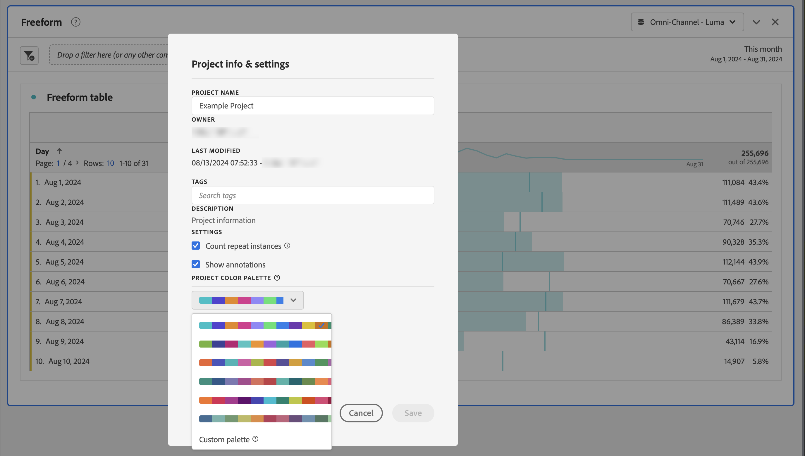

# ビジュアライゼーションカラーパレット {#visualization-color-palette}

<!-- markdownlint-disable MD034 -->

>[!CONTEXTUALHELP]
>id="workspace_project_colorpalette"
>title="プロジェクトカラーパレット"
>abstract="このプロジェクトで使用するカラーパレットを変更します。"

<!-- markdownlint-enable MD034 -->

Workspaceで使用するビジュアライゼーションカラーパレットを変更できます。 事前定義済みのカラーパレットを選択するか、会社のブランディングカラーに一致する独自のパレットを指定できます。 この機能は、Workspace のほとんどのビジュアライゼーションに影響しますが、変更概要、フリーフォームテーブルの条件付き書式およびマップビジュアライゼーションには影響 **しません**。

>[!NOTE]
>
>カラーパレットのサポートは、Internet Explorer 11 に対して有効ではありません。

。

次の点に注意してください。

* 事前に設定された 6 つのカラーパレットから選択できます。 デフォルトのパレットと 2 番目にリストされたパレットはいずれも、コントラストが最適化されており、色覚に障害のあるユーザーが利用しやすくなっています。
* 他のパレットは、色の調和を保つために最適化されています。

## カラーパレットの変更：

1. **[!UICONTROL Workspace]**/**[!UICONTROL プロジェクト]**/**[!UICONTROL プロジェクト情報および設定]** に移動します。
1. **[!UICONTROL プロジェクトカラーパレット]** ドロップダウンリストから、事前設定済みのカラースキームの 1 つを選択できます。
1. 独自のパレットを指定するには、事前設定オプションの下の **[!UICONTROL カスタムパレット]** を選択します。
1. 最大 16 個のコンマ区切りの 16 進数値（例：`#00a4e4`）を指定して、独自のカラーパレットを作成します。 例えば、4 つの値のみを指定した場合、より多くのカラーを含むビジュアライゼーションでカラーが自動的に繰り返されます。
