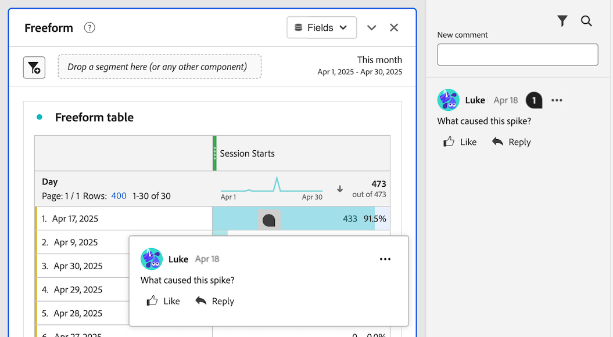
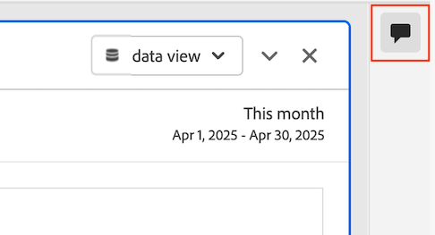
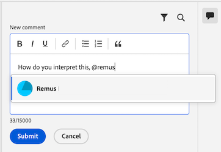

# プロジェクトでのコメントの追加と管理 {#comment-on-projects}

Analysis Workspaceのコメントを使用すると、Analysis Workspace プロジェクトのコンテキスト内でインサイトを共有したり、質問したりできます。 これにより、データに関する議論を効率化して、議論の対象となっているデータのコンテキスト内に会話を維持できます。

>[!NOTE]
>
>プロジェクトにコメントを追加および管理する機能は、プロジェクトレベルまたは組織レベルで無効にできます。 この節の説明に従ってコメントを追加および管理できない場合は、Customer Journey Analyticsの管理者またはプロジェクト所有者がこの機能を無効にしています。
>
>* **プロジェクト：** プロジェクト所有者は、[ プロジェクトの作成](/help/analysis-workspace/build-workspace-project/create-projects.md)で説明されているように、プロジェクトのこの機能を無効にできます。
>* **組織：** Customer Journey Analytics管理者は、[環境設定](/help/analysis-workspace/user-preferences.md)の説明に従って、この機能を組織に対して無効にできます。

## コメントを表示

右側のパネルのコメント領域から、またはコメントが存在する場合はコメントバッジからコメントを表示できます。

>[!NOTE]
>
>右側のパネルにコメント領域が表示される前に、プロジェクトを保存する必要があります。 プロジェクトが以前に保存されていない場合は、コメントを追加する前に[ プロジェクトを保存](/help/analysis-workspace/build-workspace-project/save-projects.md)する必要があります。

### コメント領域でのコメントの表示

Analysis Workspace プロジェクトで行われたすべてのコメントは、右側のパネルのコメント領域に表示されます。 既存のコメントの合計数は、コメントアイコンに表示されます。

1. デフォルトでは、プロジェクトを初めて開いたときに、Analysis Workspaceの各プロジェクトのコメント領域が展開されます。

   プロジェクトの右側のパネルでコメント領域アイコンを選択して、コメント領域を開いたり閉じたりします。

   

   各コメントには、コメントが投稿された日のタイムスタンプが表示されます。 コメントが現在の日付に投稿された場合は、時刻が表示されます。 日付または時刻にマウスを合わせると、コメントが投稿された日付と時刻が表示されます。

1. （オプション）コメント領域を検索するには、検索アイコン を選択し、単語またはフレーズを入力します。 コメント領域は、その単語またはフレーズを含むコメントのみを含むようにフィルタリングされます。

### プロジェクト内のコメントバッジの表示

プロジェクト ](#comment-on-a-specific-area-of-the-project)の特定の領域に[ コメントを作成すると、そのコメントに関連するプロジェクトの領域に&#x200B;**コメントバッジ** が表示されます。 コメントを表示するバッジを選択します。 バッジを選択した後、コメント自体を選択して、右側のパネルのコメント領域でコメントを強調表示できます。

番号は、プロジェクトの各バッジに表示され、作成された順序で並べ替えられます。 プロジェクトの同じ領域に複数のコメントが配置されている場合、バッジには3つのドット が表示されます。 3 ドットバッジを選択すると、その領域のすべてのコメントが表示されます。

<!-- Insert screeshot-->

プロジェクトからすべてのコメントバッジを非表示にするには：

1. Analysis Workspaceでプロジェクトを開いた状態で、Analysis Workspaceの右側のパネルでコメント領域アイコン を選択します。

1. コメント領域の下部で、「**[!UICONTROL 配置されたバッジを非表示にする]**」オプションを有効にします。

## コメントを追加

プロジェクトの特定の領域を参照するコメントを追加したり、一般的なコメントを追加したりできます。

### プロジェクトの特定の領域に対するコメント

プロジェクトの特定の領域（フリーフォームテーブルの指標の値など）にコメントを付けるには：

1. Analysis Workspaceでプロジェクトを開いた状態で、コメントを挿入するプロジェクトの領域を右クリックします。

   すべてのビジュアライゼーションでビジュアライゼーションヘッダーのコメントバッジがサポートされますが、ビジュアライゼーション内の特定のデータポイントに対するコメントバッジをサポートするのは次のビジュアライゼーションのみです。

   * フリーフォームテーブル
   * コホートテーブル
   * 行

   <!--add screenshot-->

1. 「**[!UICONTROL コメントを追加]**」を選択します。

1. 「**[!UICONTROL 新規コメント]**」フィールドに、コメントを指定します。

   コメントは最大15,000文字までで、基本的なマークアップ、ハイパーリンク、箇条書きリストと自動番号リスト、絵文字を含めることができます。

1. （オプション）「@」記号の後に名前を入力して、コメントについて他のユーザーに通知します。 @ シンボルを使用して他のユーザーに通知する方法について詳しくは、[ コメントに他のユーザーを含める](#include-others-in-a-comment)を参照してください。

1. 「**[!UICONTROL 送信]**」を選択します。

   **コメントバッジ** は、[ プロジェクト内のコメントバッジの表示](#view-comment-badges-in-a-project)で説明されているように、コメントを追加したWorkspace プロジェクトの領域に配置されます。 コメントは、右側のパネルのコメント領域の上部にも表示されます。

### プロジェクトに関する一般的なコメントの追加

Analysis Workspaceでプロジェクトにコメントを追加するには：

1. Analysis Workspaceでプロジェクトを開いた状態で、Analysis Workspaceの右側のパネルでコメント領域アイコン を選択します。<!-- add screen shot -->

1. 「**[!UICONTROL 新規コメント]**」フィールドに、コメントを指定します。

   コメントは最大15,000文字までで、基本的なマークアップ、ハイパーリンク、箇条書きリストと自動番号リスト、絵文字を含めることができます。

1. （オプション）「@」記号の後に名前を入力して、コメントについて他のユーザーに通知します。 @ シンボルを使用して他のユーザーに通知する方法について詳しくは、[ コメントに他のユーザーを含める](#include-others-in-a-comment)を参照してください。

1. 「**[!UICONTROL 送信]**」を選択します。

   コメントは、コメント領域の上部に表示されます。詳細については、「[ コメント領域でコメントを表示](#view-comments-in-the-comments-area)」を参照してください。

## コメントに他のユーザーを含める

Analysis Workspaceのコメント機能を使用すると、他のユーザーとの共同作業が容易になります。

@記号を使用してコメントにユーザーを含める場合は、次の点を考慮してください。

* 含めるユーザーは、CX エンタープライズ通知設定に基づいて通知を受け取ります。

  詳細については、「[ コメントに関する通知を受け取る](#receive-notifications-about-comments)」を参照してください。

* コメントには、組織内の誰もがCustomer Journey Analyticsにアクセスできますが、そうしても、プロジェクトを編集するためのアクセス権は自動的には付与されません。

コメントに別のユーザーを含めるには：

1. 「@」記号を入力し、含めるユーザーの名前、姓、または電子メールアドレスの入力を開始します。

   

1. ドロップダウンメニューに表示されるユーザーの名前を選択します。

## コメントへの返信

1. Analysis Workspaceで、コメントを追加するプロジェクトを開きます。

1. Analysis Workspaceの右側パネルでコメント領域アイコン を選択し、返信するコメントの横にある&#x200B;**[!UICONTROL 返信]**&#x200B;を選択します。

   返信するコメントのテキストを引用符で囲んだ元のテキストに含めるには、返信する特定のコメントまたは返信の横にある3点アイコンを選択し、**[!UICONTROL 引用返信]**&#x200B;を選択します。 見積もり返信は、コメントが参照するコメントまたは返信を示すのに適した方法です。

   または

   コメントが作成されたパネルまたはビジュアライゼーションでコメントアイコンを選択し、**[!UICONTROL 返信]**&#x200B;を選択します。

1. 「**[!UICONTROL 新規コメント]**」フィールドに、コメントを指定します。

   コメントは最大15,000文字までで、基本的なマークアップ、ハイパーリンク、箇条書きリストと自動番号リスト、絵文字を含めることができます。

1. （オプション）「@」記号の後に名前を入力して、コメントについて他のユーザーに通知します。 @ シンボルを使用して他のユーザーに通知する方法について詳しくは、[ コメントに他のユーザーを含める](#include-others-in-a-comment)を参照してください。

1. 「**[!UICONTROL 送信]**」を選択します。

## コメントに関する通知を受け取る

プロジェクト所有者と[特定のユーザー](#include-others-in-a-comment)は、CX エンタープライズ通知設定に基づく通知を受け取ります。 デフォルトでは、Customer Journey Analyticsの[CX Enterprise Notification](https://experienceleague.adobe.com/en/docs/core-services/interface/features/account-preferences#view-notifications) アイコン から表示されるアプリ内通知を受け取ります。

さらに、[ メール通知を購読](https://experienceleague.adobe.com/en/docs/core-services/interface/features/account-preferences#subscribe-to-in-app-and-email-notifications)および[Slack通知を購読](https://experienceleague.adobe.com/en/docs/core-services/interface/features/account-preferences#slack)することにより、CX Enterprise通知設定を設定して、メール通知およびSlack通知を受信できます。

## 既存のコメントのバッジを配置する

右側のパネルのコメント領域でコメントを使用できても、プロジェクトにまだバッジがない場合は、バッジを追加できます。

1. Analysis Workspaceでプロジェクトを開いた状態で、Analysis Workspaceの右側のパネルでコメント領域アイコン を選択します。

1. バッジを配置するコメントの横にある詳細アイコン を選択し、「**[!UICONTROL バッジを配置]**」を選択します。

1. 既存のコメントのバッジを配置するプロジェクトの領域を選択します。

   **コメントバッジ** が、選択したWorkspace プロジェクトの領域に配置されます。 コメントは、右側のパネルのコメント領域の上部にも表示されます。

   詳しくは、[ プロジェクト内のコメントバッジの表示](#view-comment-badges-in-a-project)を参照してください。

バッジを削除するには：

1. 削除するバッジを選択し、**[!UICONTROL バッジの削除]**&#x200B;を選択します。

   バッジは削除されますが、右側のパネルのコメント領域にはコメントが引き続き表示されます。

## 既存のコメントのバッジの移動

既存のコメント用に既に配置されているコメントバッジを移動できます。

1. Analysis Workspaceでプロジェクトを開いた状態で、移動するコメントのバッジを探します。

1. バッジを右クリックし、**[!UICONTROL 配置を移動]**&#x200B;を選択します。

1. バッジを配置するプロジェクトの領域を選択します。

<!-- add section about adding images to comments. will be available at GA. Include that "you can have a maximum of 5 images per comment, and each image can be up to 2 MB." -->

## コメントへのリンクをコピー

リンクをコメントにコピーして、リンクを他のユーザーと共有できます。 既にプロジェクトにアクセスできるユーザーのみがリンクでアクセスできます。

コメントにリンクをコピーするには：

1. Analysis Workspaceでプロジェクトを開いた状態で、Analysis Workspaceの右側のパネルでコメント領域アイコン を選択します。

1. リンクをコピーするコメントの横にある詳細アイコン を選択し、**[!UICONTROL リンクをコピー]**&#x200B;を選択します。

   リンクがシステムクリップボードにコピーされます。 リンクは、電子メールまたはその他のタイプのメッセージに貼り付けることができます。

## コメントのテキストをコピーする

コメントの本文テキストをコピーして、他のユーザーと共有できます。

コメントの本文テキストをコピーするには：

1. Analysis Workspaceでプロジェクトを開いた状態で、Analysis Workspaceの右側のパネルでコメント領域アイコン を選択します。

1. コピーするテキストを含むコメントの横にある詳細アイコン を選択し、**[!UICONTROL 本文テキストをコピー]**&#x200B;を選択します。

   コメントの本文テキストがシステムのクリップボードにコピーされます。

## コメントを追加

1. Analysis Workspaceでプロジェクトを開いた状態で、Analysis Workspaceの右側のパネルでコメント領域アイコン を選択します。

1. 承認するコメントの下に「**[!UICONTROL いいね]**」を選択します。

## コメントを削除

コメントを削除すると、元のコメントと返信や添付ファイルも削除されます。

削除されたコメントは復元できません。

コメントを削除するには：

1. Analysis Workspaceでプロジェクトを開いた状態で、Analysis Workspaceの右側のパネルでコメント領域アイコン を選択します。

1. 削除するコメントの横にある詳細アイコン を選択し、**[!UICONTROL 削除]**&#x200B;を選択します。

1. 削除を確認するには、もう一度&#x200B;**[!UICONTROL 削除]**&#x200B;を選択します。

## コメントを解決

コメントを解決すると、コメントは解決済みとしてマークされ、コメント領域から非表示になります。 コメントにバッジが関連付けられている場合、そのバッジはプロジェクトから削除されます。

コメントを解決するには：

1. Analysis Workspaceでプロジェクトを開いた状態で、Analysis Workspaceの右側のパネルでコメント領域アイコン を選択します。

1. 解決するコメントの横にある詳細アイコン を選択し、**[!UICONTROL 解決]**&#x200B;を選択します。

1. 「**[!UICONTROL 解決]**」をもう一度選択して確認します。

デフォルトでは、解決されたコメントはコメント領域に表示されません。 解決されたコメントを表示するには：

1. コメント領域でフィルターアイコンを選択し、「**[!UICONTROL 解決済みコメントを非表示]**」オプションの選択を解除します。
