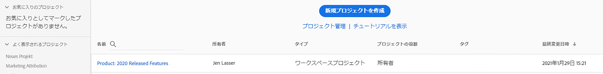
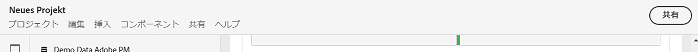
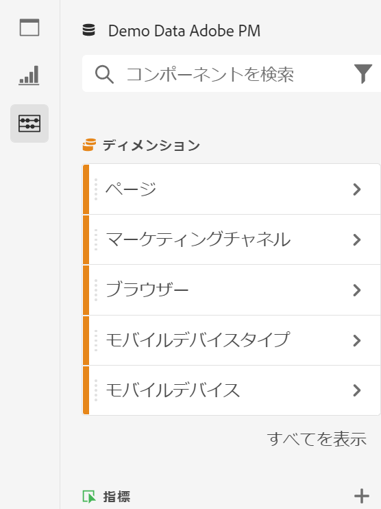
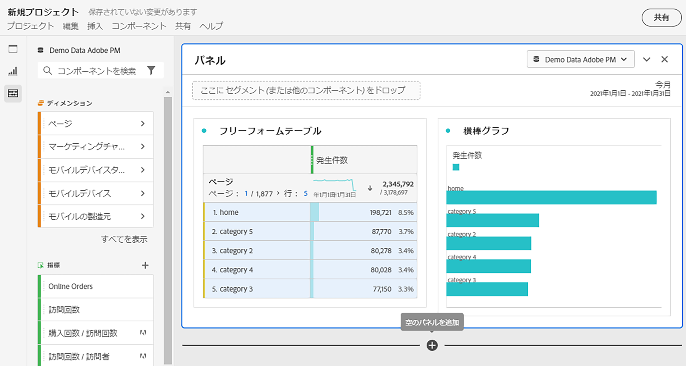
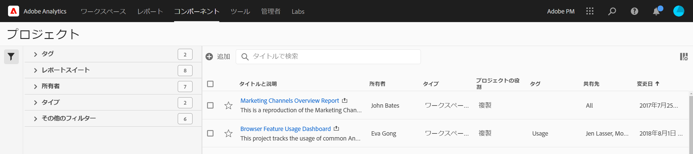

# プロジェクトの概要

Workspace プロジェクトでは、データコンポーネント、テーブル、およびビジュアライゼーションを組み合わせて、分析を作成し、組織内の任意のユーザーと共有できます。最初のプロジェクトを開始する前に、プロジェクトへのアクセス方法、プロジェクト間の移動方法、およびプロジェクトの管理方法について説明します。

## プロジェクトリスト {#project-list}

最初に **[!UICONTROL Analytics]**／**[!UICONTROL Workspace]** に移動すると、自分が所有するプロジェクトまたは自分と共有されているプロジェクトがすべて一覧表示されます。これは、以前にカスタムのランディングページを設定した場合を除き、Adobe Analytics のランディングページでもあります。

Workspace のプロジェクト一覧ページには、次の情報が表示されます。

| 要素 | 説明 |
|---|---|
| [新規プロジェクトを作成](/help/analysis-workspace/home.md) | このリンクをクリックすると、新しいプロジェクトを最初から作成できます。 |
| プロジェクトの管理 | このリンクをクリックすると、プロジェクトコンポーネントマネージャーに移動します（**[!UICONTROL Analytics]**／**[!UICONTROL コンポーネント]**／**[!UICONTROL プロジェクト]**）。ここでは、すべてのプロジェクトが一覧表示され、プロジェクトのタグ付け、共有、削除、名前の変更、承認、コピー、CSV への書き出しをおこなえます。 |
| ランディングページとして設定 | このページを Workspace ランディングページにします。 |
| [チュートリアルを表示](/help/analysis-workspace/home.md) | Analysis Workspace ビデオチュートリアルに移動します。 |
| 名前 | Workspace プロジェクトの名前。 |
| 所有者 | このプロジェクトを作成したユーザー（ユーザー自身、またはユーザー自身とそのプロジェクトを共有した他のユーザー）。 |
| タイプ | Workspace プロジェクトか[モバイルスコアカード](/help/mobile-app/home.md)のどちらであるかを示します。 |
| [プロジェクトの役割](/help/analysis-workspace/curate-share/share-projects.md) | プロジェクトの役割（所有者、編集、重複、表示）を示します。 |
| タグ | プロジェクトに適用されたタグです。 |
| 最終変更日 | プロジェクトが最後に変更された日付。 |
| お気に入りのプロジェクト | プロジェクトをお気に入りに登録するには、プロジェクトを開き、名前の横の星をクリックします。このリストは、次回 Workspace を開いたときに表示されます。 |
| 頻繁に表示するプロジェクト | 頻繁に開くすべてのプロジェクトをリストし、アクセスしやすくします。 |

## メニューバー {#menu-bar}

プロジェクト内のメニューには、プロジェクトの管理、コンポーネントの追加、ヘルプの検索などをおこなうためのオプションが表示されます。各メニューオプションには、キーボード[ショートカット](/help/analysis-workspace/build-workspace-project/fa-shortcut-keys.md)を使用してアクセスできます。

| メニュー項目 | 説明 |
|---|---|
| プロジェクト | プロジェクト管理の一般的なアクション（新規、開く、保存、名前を付けて保存、テンプレートとして保存など）が含まれます。また、「プロジェクトを更新」をクリックして、プロジェクト全体を更新し、最新のデータと定義を取得することもできます。「[CSV と PDF をダウンロード](/help/analysis-workspace/curate-share/download-send.md)」オプションを使用すると、Workspace からデータをエクスポートできます。「**プロジェクト情報および設定**」（以下を参照）には、プロジェクトを管理するための多くのオプションが用意されています。 |
| テンプレートを | 前回の操作を元に戻すか、やり直します。「すべてクリア」を選択すると、プロジェクトが最初の空白の状態にリセットされます。 |
| 前に | このメニューから、新しいパネルまたはビジュアライゼーションを挿入します。また、左側のパネルから新しいパネルやビジュアライゼーションを挿入することもできます。 |
| [コンポーネント](/help/components/overview.md) | プロジェクトから、新しいフィルター、計算指標、日付範囲またはアラートの各コンポーネントを作成します。また、左側のパネルから新しいコンポーネントを作成することもできます。コンポーネント定義が最近変更された場合は、「コンポーネントを更新」を選択すると最新の定義を取得できます。 |
| [共有](/help/analysis-workspace/curate-share/send-schedule-files.md) | 組織の受信者に対して PDF／CSV プロジェクトのキュレーション、共有およびスケジュール設定を行います。 |
| ヘルプ | ヘルプドキュメント、ビデオおよび Analytics [Experience League コミュニティ](https://experienceleaguecommunities.adobe.com/t5/adobe-analytics/ct-p/adobe-analytics-community?profile.language=ja)にアクセスします。Workspace のヒントの表示と[デバッガー](https://www.adobe.io/apis/experiencecloud/analytics/docs.html#!AdobeDocs/analytics-2.0-apis/master/reporting-tricks.md)の表示を管理します。Workspace の詳細と、プロジェクトの[パフォーマンス](/help/analysis-workspace/workspace-faq/optimizing-performance.md)に影響を与える要因を確認します。 |
| 「共有」ボタンまたは「所有者」 | プロジェクトを所有または編集している場合は、右上の「共有」ボタンからワンクリックでアクセスして、プロジェクト受信者を管理できます。プロジェクトを複製または役割を表示している場合は、プロジェクト所有者の名前が表示されます。 |

### プロジェクト情報および設定 {#info-settings}

**[!UICONTROL Workspace]**／**[!UICONTROL プロジェクト]**／**[!UICONTROL プロジェクト情報および設定]**&#x200B;では、現在アクティブなプロジェクトに関するプロジェクトレベルの情報が提供されます。

「設定」には次の項目が含まれます。

| 設定 | 説明 |
|---|---|
| プロジェクト名前 | プロジェクトに設定された名前。名前をダブルクリックすると編集できます。 |
| 作成者 | プロジェクト所有者名。 |
| 最終変更日 | プロジェクトの最終変更日。 |
| タグ | 分類を簡単にするためにプロジェクトに適用されたタグのリスト。 |
| 説明 | 説明は、プロジェクトの目的を明確にするのに役立ちます。説明をダブルクリックすると編集できます。 |
| プロジェクトで繰り返しのインスタンスをカウントします | レポート内でレポートインスタンスがカウントされるかどうかを指定します。注意：この設定は、フローまたはフォールアウトのビジュアライゼーションには適用されません。 |
| [プロジェクトカラーパレット](/help/analysis-workspace/build-workspace-project/color-palettes.md) | Workspace で使用する分類カラーパレットを変更するには、色弱のユーザー向け用に最適化されている既定のパレットを選択するか、カスタムパレットを指定します。この機能は、ほとんどのビジュアライゼーションを含む Workspace の多くの機能に影響します。 |
| [表示密度](/help/analysis-workspace/build-workspace-project/view-density.md) | 左側のパネル、フリーフォームテーブル、コホートテーブルでの垂直方向のパディングを減らし、1 画面に表示されるデータの量を増やすことができます。 |

## 左側のパネル {#left-rail}

プロジェクトでは、左側のパネルから [パネル](/help/analysis-workspace/c-panels/panels.md)、テーブル、 [ビジュアライゼーション](/help/analysis-workspace/visualizations/freeform-analysis-visualizations.md) および [コンポーネント] ルからアクセスします。これらはプロジェクトの構成要素です。

また、 [空のパネル](/help/analysis-workspace/c-panels/blank-panel.md) からもビジュアライゼーションやパネルにアクセスできます。

左側のパネルのコンポーネント（ディメンション、指標、フィルター、日付範囲）は、アクティブなパネルデータビューに関連しています。アクティブパネルの周囲に青い境界線が表示され、アクティブなデータビューがコンポーネントパネルの上部に表示されます。

## プロジェクトキャンバス {#canvas}

プロジェクトキャンバスでは、パネル、テーブル、ビジュアライゼーションおよびコンポーネントをまとめ、分析を作成できます。プロジェクトには多数のパネルを含めることができます。また、各パネルには多数のテーブルやビジュアライゼーションを含めることができます。

パネルは、期間、データビュー、分析ユースケースに従ってプロジェクトを整理する場合に役立ちます。アクティブパネルの周囲に青い境界線が表示され、左側のパネルから使用できるコンポーネントが決定されます。

プロジェクトの開始時に選択した内容に応じて、キャンバスに[フリーフォームテーブル](/help/analysis-workspace/visualizations/freeform-table/freeform-table.md)または[空のパネル](/help/analysis-workspace/c-panels/blank-panel.md)が表示されます。分析を最も簡単に開始するには、1 つまたは複数のコンポーネントを選択し、それらをプロジェクトキャンバスにドラッグ＆ドロップします。データのテーブルが自動的にレンダリングされます。[こちら](/help/analysis-workspace/visualizations/freeform-table/freeform-table.md)からテーブルを作成するための様々なオプションについて確認してください。または、アドビの[トレーニングチュートリアル](/help/analysis-workspace/home.md)を活用して、初めてプロジェクトを作成する際の手順を確認してください。

## プロジェクトマネージャー {#manager}

Analysis Workspace プロジェクトは、**Analytics／コンポーネント／プロジェクト**&#x200B;で管理できます。プロジェクトマネージャーには、特定のユーザーが作成したアイテムが表示されます。プロジェクトの所有権は、管理者／Analytics ユーザーおよびアセット／アセットを転送で新しいユーザーに譲渡できます。

プロジェクトマネージャーでは、追加、タグ付け、共有、複製／コピーなどをおこなうことができます。検索バーまたは左側のパネルのフィルターオプションを使用して、プロジェクトを検索します。タグ、所有者、プロジェクトのタイプなどでフィルターできます。

以下は、プロジェクトマネージャの一般的な操作です。これらは、1 つまたは複数のプロジェクトに対して一度に実行できます。

| アクション | 説明 |
|---|---|
| 追加 | 新しいプロジェクトをゼロから作成します。 |
| タグまたは承認 | 「タグ」または「承認」を選択すると、プロジェクトが整理され、検索しやすくなります。 |
| [共有](/help/analysis-workspace/curate-share/share-projects.md) | プロジェクトを組織内の他の Analysis Workspace ユーザーも利用できるようになります。 |
| 削除 | プロジェクトを削除します。 |
| 名前変更 | プロジェクトの名前を編集します。 |
| Copy | プロジェクトの複製を作成します。これで、新しいプロジェクトとプロジェクト ID が作成されます。元のプロジェクトに関連付けられた共有またはスケジュールはコピーされません。 |
| CSV に書き出し | プロジェクトを CSV ファイルとしてダウンロードします。このファイルには、プレーンテキストデータが含まれます。 |
