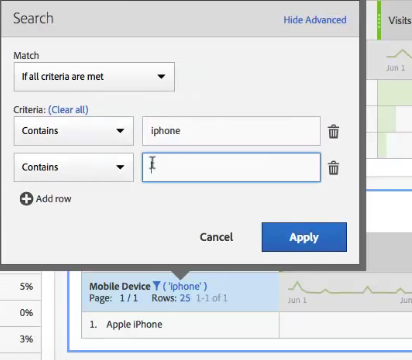

# テーブルのページネーション、フィルタリングおよび並べ替え

>[!NOTE]
>
>Customer Journey Analytics 内の Analysis Workspace に関するドキュメントを表示しています。この機能セットは、[従来の Adobe Analytics の Analysis Workspace](https://docs.adobe.com/content/help/ja-JP/analytics/analyze/analysis-workspace/home.html) とは少し異なります。[詳細情報...](/help/getting-started/cja-aa.md)

概要については、YouTube のこのビデオをご覧ください。

[Analysis Workspace のテーブルのページネーション、フィルタリングおよび並べ替え](https://www.youtube.com/watch?v=2zxpRPCGspg)

## アドバンスフィルターオプション

フリーフォームテーブルのディメンションの隣にあるフィルターアイコンをクリックし、「アドバンスを表示」をクリックすると、次の条件を使用してフィルタリングできます。

* 次を含む
* doesNotContain
* すべての語句を含む
* いずれかの語句を含む
* フレーズを含む
* いずれの語句も含まない
* このフレーズを含まない
* equals
* 次と等しくない
* startsWith
* endsWith

