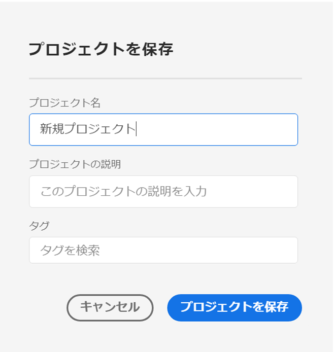
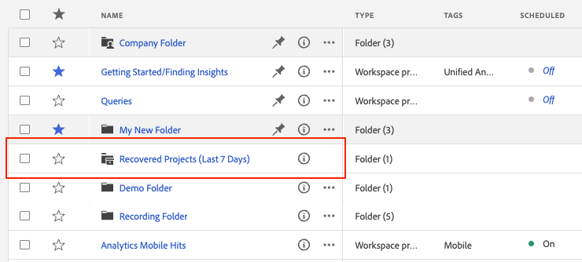
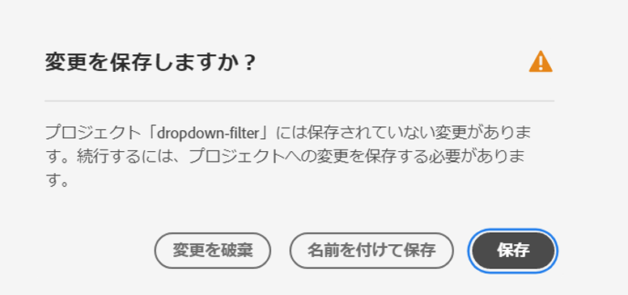
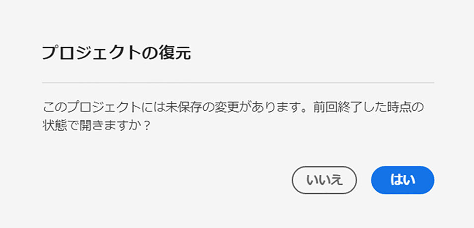

# プロジェクトの保存 {#save-projects}

<!-- markdownlint-disable MD034 -->

>[!CONTEXTUALHELP]
>id="cja_workspace_project_addnotes"
>title="メモを追加"
>abstract="保存するプロジェクト バージョンに関するメモを追加します。 これらのメモはバージョンと共に保存され、**[!UICONTROL プロジェクト]**/**[!UICONTROL 以前のバージョンを開く]** メニューからアクセスできます。"

<!-- markdownlint-enable MD034 -->

Analysis Workspaceのプロジェクトは、2 分ごとに自動的に保存されます。 また、自分でプロジェクトを保存したり、プロジェクトを複製として保存したり、プロジェクトをバージョンメモと共に保存したりすることもできます。

## 保存

プロジェクトを手動で保存するには、プロジェクトをAnalysis Workspaceで開いた状態で **[!UICONTROL プロジェクト]** を選択してから、次のオプションから選択します。

* **[!UICONTROL 保存]**

  プロジェクトに対する変更を保存します。プロジェクトを共有すると、プロジェクトの受信者にも変更内容が表示されます。

  プロジェクトを最初に保存すると、**[!UICONTROL 保存]** ダイアログが表示されます。

  

   1. 次の内容を指定します。

      * **[!UICONTROL 名前]** （必須）。 プロジェクトの名前。
      * **[!UICONTROL 説明]**。 プロジェクトの説明。
      * **[!UICONTROL タグ]**。 [!UICONTROL *タグを検索*] フィールドでタグを検索するか、**[!UICONTROL Enter]** キーを使用して新しいタグを追加します。
      * **[!UICONTROL フォルダー]**. [!UICONTROL *フォルダーを選択*] ドロップダウンメニューからフォルダーを選択します。 フォルダーを指定しない場合、プロジェクトは、新しいプロジェクトを作成した現在のフォルダーに保存されます。
      * **[!UICONTROL バージョンノート]**. *メモを追加* テキスト領域にバージョンメモを追加します。

   1. 「**[!UICONTROL 保存]**」を選択して、プロジェクトを保存します。

  プロジェクトを保存すると、実際には 90 日間保存されたプロジェクトのバージョンが保存されます。

  共有したプロジェクトを保存すると、**[!UICONTROL 共有プロジェクトへの変更を保存]** 警告ダイアログが表示され、確認を求められます。

  

   * 「**[!UICONTROL 保存]**」を選択して、プロジェクトを保存します。
   * 「**[!UICONTROL 名前を付けて保存]**」を選択して、プロジェクトを複製プロジェクトとして新しい名前で保存します。

* **[!UICONTROL メモと共に保存]**

  

  プロジェクトを保存する際に、プロジェクトで変更した内容に関するメモを追加します。 バージョンのメモを保存ダイアログで、次の手順を実行します。

   1. **[!UICONTROL メモを追加]** テキスト領域に **[!UICONTROL バージョンメモ]** を入力します。
   1. 「**[!UICONTROL 保存]**」を選択します。

  メモはプロジェクトのバージョンと共に保存され、プロジェクトの [ 以前のバージョンを開く ](open-projects.md#open-previous-version) ときに使用できます。 メモと共に保存されたバージョンは、1 年間自動的に保存されます。

* **[!UICONTROL 名前を付けて保存]**

  

  プロジェクトの複製を新しい名前で作成します。 名前を付けて保存ダイアログが表示されます。

   1. 次の内容を指定します。

      * **[!UICONTROL 名前]** （必須）。 プロジェクトの名前。
      * **[!UICONTROL 説明]**。 プロジェクトの説明。
      * **[!UICONTROL タグ]**。 [!UICONTROL *タグを検索*] フィールドでタグを検索するか、**[!UICONTROL Enter]** キーを使用して新しいタグを追加します。
      * **[!UICONTROL フォルダー]**. [!UICONTROL *フォルダーを選択*] ドロップダウンメニューからフォルダーを選択します。 フォルダーを指定しない場合、プロジェクトは、新しいプロジェクトを作成した現在のフォルダーに保存されます。
      * **[!UICONTROL バージョンノート]**. *メモを追加* テキスト領域にバージョンメモを追加します。

   1. 「**[!UICONTROL 保存]**」を選択して、プロジェクトを保存します。

  プロジェクトを別のフォルダーに保存できます。 元のプロジェクトは影響を受けません。

<!-- Cannot find this option in CJA 
| **[!UICONTROL Save as template]** | Save your project as a [custom template](https://experienceleague.adobe.com/docs/analytics/analyze/analysis-workspace/build-workspace-project/starter-projects.html) that becomes available to your organization under **[!UICONTROL Project > New]** | 
-->

## 自動保存

>[!IMPORTANT]
>
>新しいプロジェクトは自動保存されますが、新しいプロジェクトごとに **初回** 手動で保存する必要があります。
>

Analysis Workspace のすべてのプロジェクトは、2 分ごとにローカルマシンに自動で保存されます。この自動保存には、まだ手動で保存されていない、新しく作成されたプロジェクトが含まれます。

### 新規プロジェクト

Analysis Workspace では、別のプロジェクトに切り替えたり、ブラウザータブを閉じたりする際に、新しいプロジェクトを手動で保存するように求められます。

何らかの理由で、手動で保存する前に新しく作成したプロジェクトへのアクセス権が予期せず失われた場合、プロジェクトの復元バージョンは、Analysis Workspace ランディングページで **[!UICONTROL 復元されたプロジェクト（過去 7 日間）]** という名前のフォルダーに保存されます。 復元したプロジェクトを復元し、目的の場所に手動で保存します。

復元したプロジェクトを復元するには：

1. Analysis Workspace ランディングページの **[!UICONTROL 復元されたプロジェクト（過去 7 日間）]** フォルダーに移動します。

<!-- 
     
  -->

1. プロジェクトを開き、目的の場所に保存します。

### 既存のプロジェクト

何らかの理由で、まだ自動保存されていない変更内容がプロジェクトから移動した場合、Analysis Workspaceで、変更内容を保存するよう求められるか、警告メッセージが表示されます。

一般的なシナリオ：

#### 別のプロジェクトを開く

まだ自動保存されていない変更内容を含むプロジェクトで作業中に別のプロジェクトを開くと、Analysis Workspaceでは、現在のプロジェクトを保存するように求められます。

次のオプションがあります。

* **[!UICONTROL 保存]**: プロジェクトの自動保存された最新のローカルコピーを、最新の変更に置き換えます。
* **[!UICONTROL 変更を破棄]**：最新の変更を破棄します。 プロジェクトには、自動保存された最新のローカルコピーが保持されます。
* **[!UICONTROL キャンセル]**：別のプロジェクトを開き、既存のプロジェクトを開いたままにするには、このアクションをキャンセルします。

<!--  -->

#### タブから移動するかタブを閉じる

まだ自動保存されていない変更を含むプロジェクトを表示しているときにページから移動したり、ブラウザータブを閉じたりすると、ブラウザーに、未保存の変更が失われたという警告が表示されます。 終了またはキャンセルを選択できます。 ブラウザーによる警告の表示方法は、使用するブラウザーによって異なります。

### ブラウザーがクラッシュしたか、セッションがタイムアウトする

ブラウザーがクラッシュした場合、またはセッションがタイムアウトした場合、次回Analysis Workspaceにアクセスする際に、まだ自動保存されていない変更を元に戻すよう求められます。

* 自動保存された最新のコピーからプロジェクトを復元するには、「**[!UICONTROL はい]**」を選択します。

* 自動保存されたコピーを削除し、ユーザーが最後に保存したバージョンのプロジェクトを開くには、「**[!UICONTROL いいえ]**」を選択します。

<!---->

一度も保存されていない&#x200B;**新規**&#x200B;プロジェクトの場合、未保存の変更は復元できません。

<!-- Shouldn't this belong to another page?  Moved it to a new open projects page

## Open previously saved version

To open a previously saved version of a project:

1. Select **[!UICONTROL Open previous version]** from the **[!UICONTROL Project]** menu.

   

1. Review the list of previous versions available. You can switch between **[!UICONTROL All versions]** and **[!UICONTROL Only versions with notes]**.

   For each version, the list shows a timestamp
   [!UICONTROL Timestamp] and [!UICONTROL Editor] are shown, in addition to [!UICONTROL Notes] if they were added when the [!UICONTROL Editor] saved. Versions without notes are stored for 90 days; versions with notes are stored for 1 year.
1. Select a previous version and click **[!UICONTROL Load]**.
   The previous version then loads with a notification. The previous version does not become the current saved version of your project until you click **[!UICONTROL Save]**. If you navigate away from the loaded version, when you return, you will see the last saved version of the project.

-->
