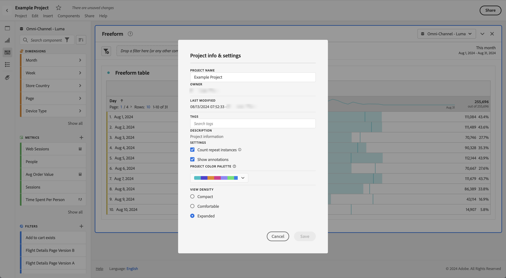

# 表示密度

表示密度を調整すると、左側のパネル、フリーフォームテーブル、コホートテーブルでの垂直方向のパディングを減らし、1 画面に表示されるデータの量を増やすことができます。選択肢は次の 3 つあります。

>[!BEGINTABS]

>[!TAB コンパクト]

最も無駄なスペースをなくした表示です。

>[!TAB 快適]

ワークスペースの通常の表示です。

>[!TAB 展開された]

これは、最も展開されたビューを持つバージョンです。

>[!ENDTABS]

表示密度を設定するには、以下のようにします。

1. Workspace で、**[!UICONTROL プロジェクト]**／**[!UICONTROL プロジェクト情報および設定]**&#x200B;に移動します。

1. 「**[!UICONTROL 表示密度]**」オプションを選択し、「**[!UICONTROL 保存]**」を選択します。
