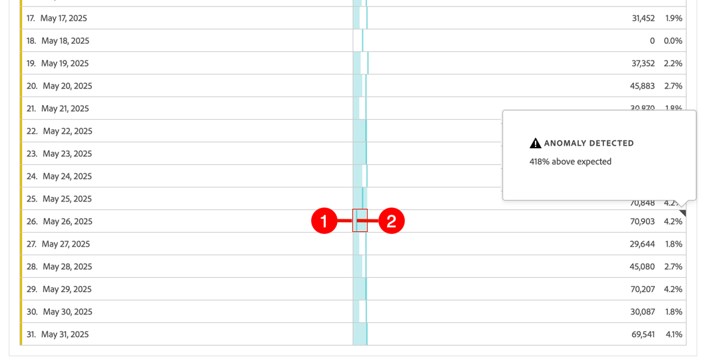
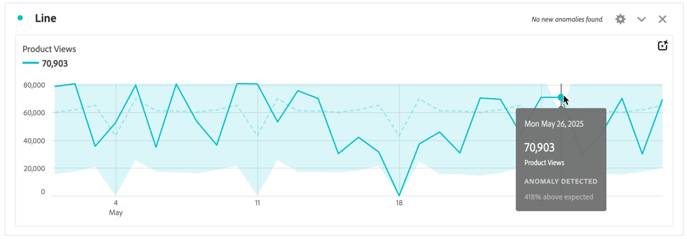
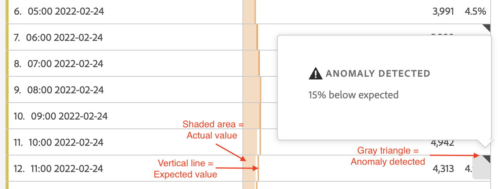
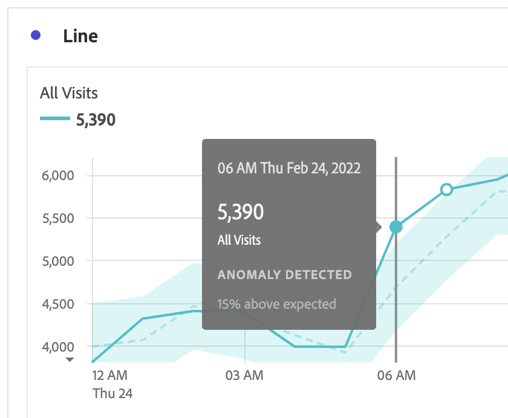

# 異常値を表示

Analysis Workspaceの異常値は、表または折れ線グラフで表示できます。

## テーブルの異常値の表示 {#section_869A87B92B574A38B017A980ED8A29C5}

時系列フリーフォームテーブルの異常値を表示できます。

1. 列ヘッダーの「」を選択し、オプションのリストで「**[!UICONTROL 異常値を表示]**」オプションが選択されていることを確認します。 詳しくは、[列設定](/help/analysis-workspace/visualizations/freeform-table/column-row-settings/column-settings.md)を参照してください。

1. 異常値は、テーブルに次のように表示されます。

   

   データの異常値が検出された各行の右上隅に◥が表示されます。

   各行➋の&#x200B;**色付きの垂直線**&#x200B;は、期待される値を示します。 各行➊の&#x200B;**色付きシェーディング領域**&#x200B;は、実際の値を示します。 線（期待値）と影になっている部分（実際の値）の比較方法は、異常値があるかどうかを決定します。 （観察は、[異常値検出で使用される統計的手法](/help/analysis-workspace/c-anomaly-detection/statistics-anomaly-detection.md)で説明されている高度な統計的手法に基づいて異常と見なされます）。

1. 行の右上隅にある◥を選択して、異常値の詳細を表示します。 これは、実際の値が期待値の上下にどの程度乖離しているかを（パーセントで）示します。

## 折れ線グラフの異常値の表示

折れ線グラフは、異常値を表示できる唯一のビジュアライゼーションです。

折れ線グラフで異常値を表示するには：

1. ビジュアライゼーションヘッダーで「」を選択し、オプションのリストで「[!UICONTROL **異常値を表示**]」オプションが選択されていることを確認します。 詳しくは、[折れ線グラフ](/help/analysis-workspace/visualizations/line.md)を参照してください。

1. （オプション）信頼区間でチャートを拡大/縮小できるようにするには、ビジュアライゼーションヘッダーで「」を選択し、「**[!UICONTROL 異常値をY軸に拡大/縮小]**」オプションを選択します。

   グラフがわかりにくくなる可能性があるので、このオプションは、デフォルトでは選択されていません。

   異常値は、折れ線グラフに次のように表示されます。

   

   データの異常値が検出されると、線上に&#x200B;**白い点**&#x200B;が表示されます。 （観察は、[異常値検出で使用される統計的手法](/help/analysis-workspace/c-anomaly-detection/statistics-anomaly-detection.md)で説明されている高度な統計的手法に基づいて異常と見なされます）。

   **薄く影になっている部分**&#x200B;は、値が発生するはずの信頼帯または期待範囲です。 この期待範囲外の値は、異常値です。

   折れ線グラフに複数の指標がある場合、異常値のみが表示され、その指標の信頼帯を表示するには、各異常値の上にマウスポインターを置く必要があります。

   **点線**&#x200B;は、正確な期待値です。

1. 異常（白い点）を選択して、次の情報を表示します。

   * 異常が発生した日付。

   * 異常値の生の値。

   * 期待値の上下のパーセント値。緑の実線で表されます。

<!--
# View anomalies in Analysis Workspace

You can view anomalies in a table or in a line chart.

## View anomalies in a table {#table}

You can view anomalies in a time-series Freeform Table.

1. Select the column settings icon in the column header, then ensure that the [!UICONTROL **Anomalies**] option is selected in the list of options. For more information, see [Column settings](/help/analysis-workspace/visualizations/freeform-table/column-row-settings/column-settings.md).

1. Click away from the settings menu to view the updated table.

   

1. Anomalies are shown in the table as follows:

   A **dark gray triangle** appears in the upper-right corner of each row where a data anomaly is detected.

   The colored **vertical line** in each row indicates the expected value. The colored **shaded area** in each row indicates the actual value. How the line (expected value) compares with the shaded area (actual value) determines whether there is an anomaly. (An observation is considered anomolous based on the advanced statistical techniques described in [Statistical techniques used in anomaly detection](/help/analysis-workspace/c-anomaly-detection/statistics-anomaly-detection.md).)

1. Select the gray triangle in the upper-right corner of a row to view details about the anomaly. This shows the extent (as a percentage) to which the actual value diverges either above or below the expected value.

## View anomalies in a line chart {#line-chart}

A Line chart is the only visualization that allows you to view anomalies.

To view anomalies in a line chart:

1. Select the settings icon in the visualization header, then ensure that the [!UICONTROL **Show anomalies**] option is selected in the list of options. For more information, see [Line](/help/analysis-workspace/visualizations/line.md).

1. (Optional) To allow the confidence interval to scale the chart, select the settings icon in the visualization header, then select the option, **[!UICONTROL Allow anomalies to Scale Y-axis]**. 

   This option is not selected by default because it can sometimes make the chart less legible.
   
1. Click away from the settings menu to view the updated line chart.

      

   Anomalies are shown in the line chart as follows:
   
   A **white dot** appears on the line wherever a data anomaly is detected. (An observation is considered anomolous based on the advanced statistical techniques described in [Statistical techniques used in anomaly detection](/help/analysis-workspace/c-anomaly-detection/statistics-anomaly-detection.md).)

   The **light shaded area** is the confidence band, or expected range, where values should occur. Any value that falls outside of this expected range is an anomaly. 

   If you have multiple metrics in the line chart, only the anomalies are shown and you have to hover over each anomaly to see the confidence band for that metric. 

   The **dotted line** is the exact expected value.

1. Click an anomaly (white dot) to view the following information:

   * The date the anomaly occurred 
   
   * The raw value of the anomaly 
   
   * The percentage value above or below the expected value, which is represented by the solid green line.
   
-->
