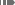

# Analysis Workspaceで予測を表示

予測は、フリーフォームテーブルまたは折れ線グラフで表示できます。

## 予測を表で表示

予測は、時系列のフリーフォームテーブルで表示できます。 条件 [!UICONTROL 予測を表示] は、のフリーフォームテーブルに対して有効です。 [ユーザーの環境設定](../user-preferences.md)を指定した場合、予測は、テーブルに追加された最初の指標列に対して自動的に表示されます。 その他の列の場合：

1. 列設定アイコンを選択します。  列ヘッダーで、 **[!UICONTROL 予測を表示]** オプションのリストでが選択されている。 詳しくは、[列設定](../visualizations/freeform-table/column-row-settings/column-settings.md)を参照してください。

1. の外側をクリック **[!UICONTROL 列設定]** メニューを使用して設定を保存し、更新されたテーブルを表示します。

予測は、次のように表に表示されます。

* 各セルの予測値と割合が **暗い灰色**.
* 予測値を示すには、予測記号  がセルの右上隅に表示されます。

## 予測を折れ線グラフで表示

折れ線グラフは、予測を表示できる唯一のビジュアライゼーションです。

1. 設定アイコンを選択します。  ビジュアライゼーションヘッダーで、 **[!UICONTROL 予測を表示]** オプションのリストでが選択されている。

1. （オプション）予測でグラフを適切にスケーリングできるようにするには、「 **[!UICONTROL 予測で Y 軸のスケールを設定する]**. このオプションは、読みにくいグラフが表示される場合があるので、デフォルトでは選択されていません。

1. の外側をクリック **[!UICONTROL 設定]** メニューを使用して、更新された折れ線グラフを表示します。

予測は、次のように折れ線グラフに表示されます。

* 折れ線グラフの指標の現在の値は、縦棒グラフで示されます。 縦線の上にマウスポインターを置くと、現在の最新の日付のポップアップが表示されます。
* 1 つ以上の指標の予測値が、縦棒グラフの右側に点線で表示されます。 指標のデータポイントにマウスポインターを置くことができます。 ポップアップが表示され、次の情報が含まれます。
   * 予測日
   * 指標の予測値
   * 指標の予測値の上限
   * 指標の予測値の下限
* 影付きの領域には、予測の信頼帯が表示されます。
