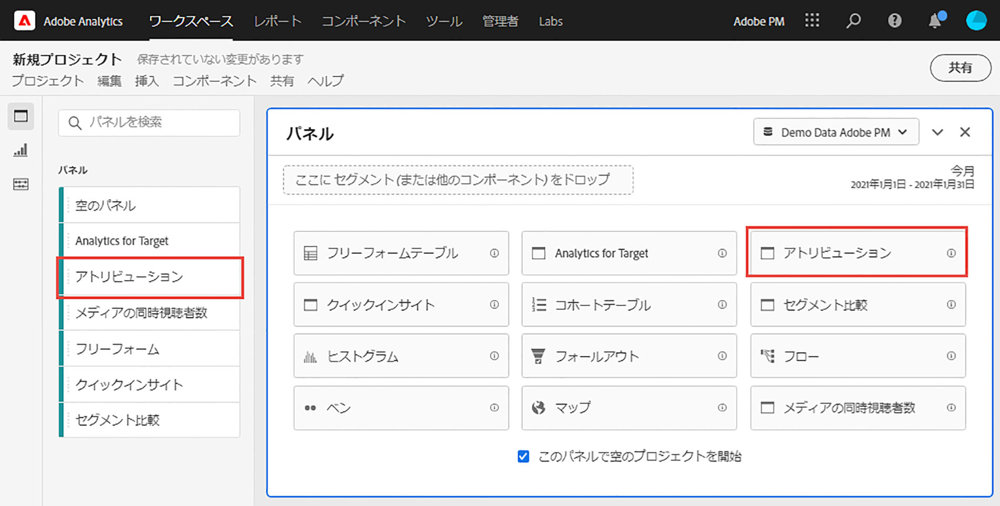
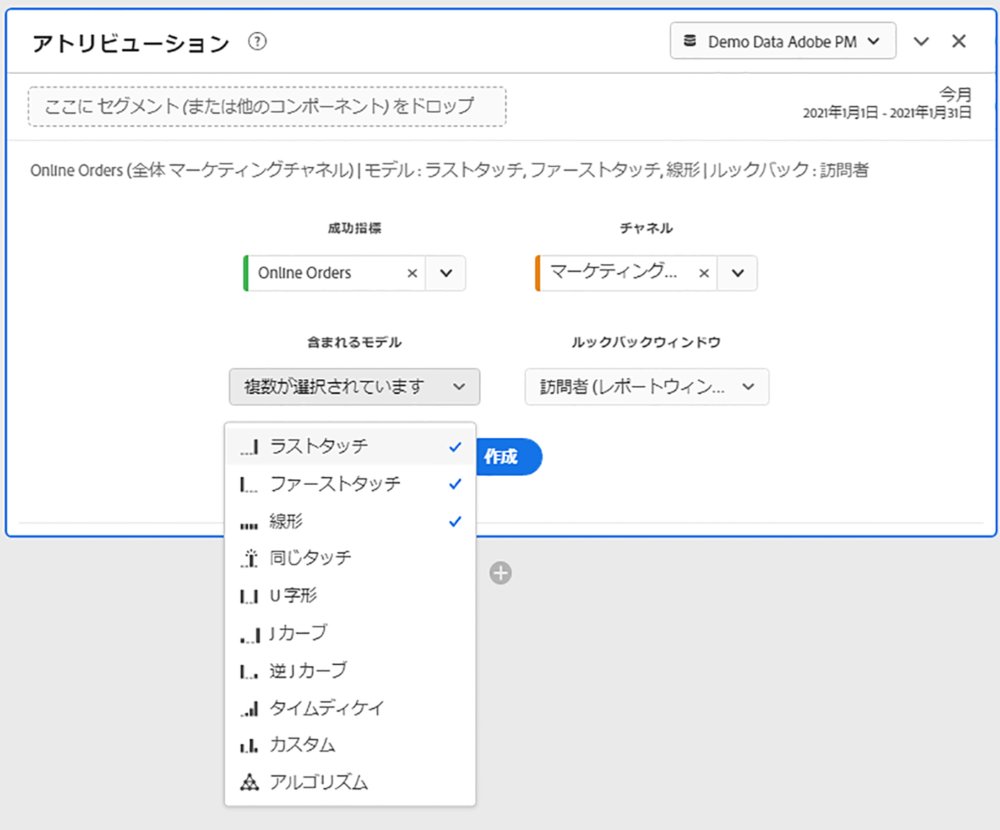
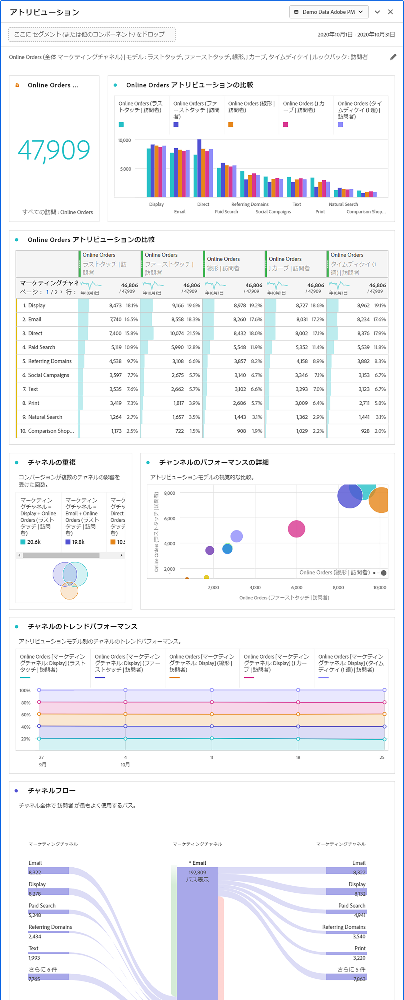

# アトリビューションパネル

[!UICONTROL アトリビューション]パネルを使用すると、各種アトリビューションモデルの比較分析を簡単に作成できます。これは、[Attribution IQ](../attribution/overview.md) の機能で、アトリビューションモデルを使用および比較するための専用のワークスペースを提供します。

## アトリビューションパネルの作成

1. 左端のパネルアイコンをクリックします。
1. [!UICONTROL アトリビューション]パネルを Analysis Workspace プロジェクトにドラッグします。

   

1. 属性を設定する指標を追加し、属性を適用するディメンションを追加します。例としては、マーケティングチャネルや、内部プロモーションなどのカスタムディメンションがあります。

   

1. 比較する[アトリビューションモデルとルックバックウィンドウ](../attribution/models.md)を選択します。

1. アトリビューションパネルは、選択したディメンションと指標のアトリビューションを比較する、豊富なデータセットとビジュアライゼーションのセットを返します。

   

## アトリビューションのビジュアライゼーション

* **っ合計指標**：レポート時間帯で発生したコンバージョンの合計数。これらは、選択したディメンションに関してアトリビューション分析がおこなわれたコンバージョンです。
* **アトリビューション比較バー**：選択したディメンションの各ディメンションアイテム間で、アトリビューションされたコンバージョンを視覚的に比較します。各棒の色は、個別のアトリビューションモデルを表します。
* **アトリビューション比較テーブル**：棒グラフと同じデータを表形式で表示します。この表で異なる列または行を選択すると、棒グラフに加えて、パネル内の他のビジュアライゼーションの一部がフィルターされます。この表は、Workspace の他のフリーフォームテーブルと同様に機能し、指標、フィルター、分類などのコンポーネントを追加できます。
* **重なり図**：上位 3 つのディメンション項目と、それらが共同でコンバージョンに参加する頻度を示すベン図。例えば、バブルの重複部分のサイズは、両方のディメンション項目に訪問者が接触したときにコンバージョンが発生した頻度を示します。隣接したフリーフォームテーブルで他の行を選択すると、その選択を反映するようにビジュアライゼーションが更新されます。
* **パフォーマンスの詳細**：散布図を使用して、最大 3 つのアトリビューションモデルを視覚的に比較できます。
* **トレンドパフォーマンス**：最上位ディメンション項目の属性コンバージョンのトレンドを表示します。 隣接したフリーフォームテーブルで他の行を選択すると、その選択を反映するようにビジュアライゼーションが更新されます。
* **フロー**：訪問者のジャーニー全体を通して、どのチャネルが最もよく使用されているか、およびその順番を確認できます。
