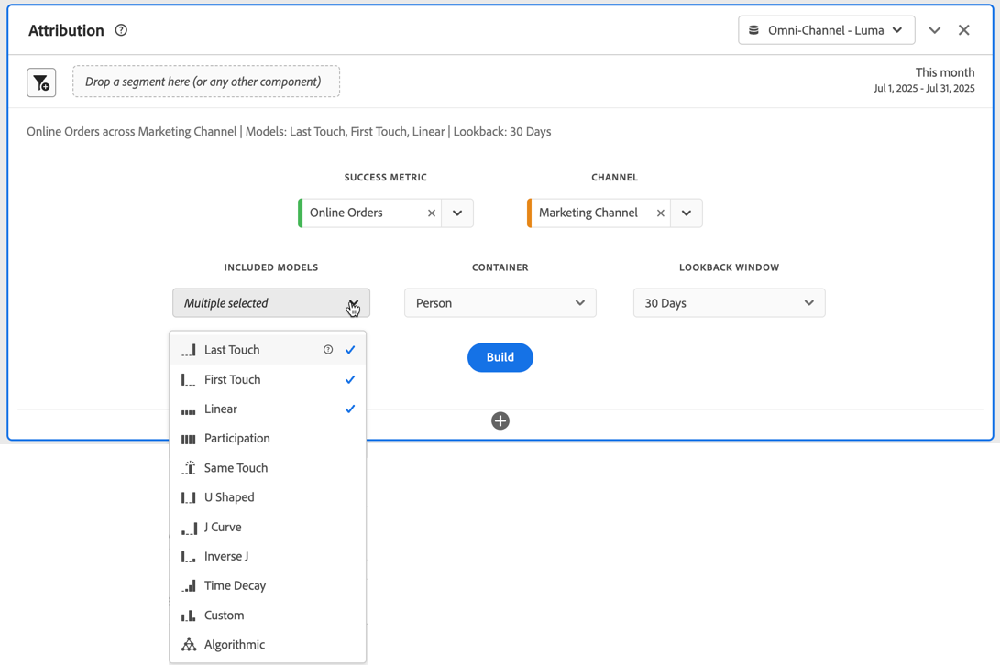
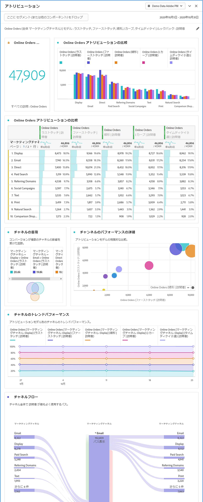

# アトリビューションパネル {#attribution-panel}

<!-- markdownlint-disable MD034 -->

>[!CONTEXTUALHELP]
>id="workspace_attribution_button"
>title="アトリビューション"
>abstract="成功指標、チャネルおよびルックバックウィンドウを使用して、アトリビューションモデルをすばやく比較および視覚化します。"
>additional-url="https://www.youtube.com/watch?v=Yu0hy2klzA0" text="Attribution IQ パネル"

>[!CONTEXTUALHELP]
>id="workspace_attribution_panel"
>title="アトリビューションパネル"
>abstract="成功指標のアトリビューションモデルをすばやく比較および視覚化します。 チャネル（ディメンション）、含めるモデルおよびルックバックウィンドウを選択します。"
>additional-url="https://www.youtube.com/watch?v=Yu0hy2klzA0" text="Attribution IQ パネル"

<!-- markdownlint-enable MD034 -->

>[!BEGINSHADEBOX]

_この記事では、この記事の_  _**Adobe Analytics**&#x200B;版の&#x200B;_Customer Journey Analytics](/help/assets/icons/CustomerJourneyAnalytics.svg)_****_ _ アトリビューションパネル ](https://experienceleague.adobe.com/ja/docs/analytics/analyze/analysis-workspace/panels/attribution)を参照してください。[ アトリビューションパネル _。![

>[!ENDSHADEBOX]

**[!UICONTROL アトリビューション]**&#x200B;パネルを使用すると、各種アトリビューションモデルの比較分析を簡単に作成できます。 パネルには、アトリビューションモデルを使用および比較する専用のワークスペースが用意されています。

Customer Journey Analytics を使用すると、以下が可能になるので、アトリビューションを強化できます。

* 有料メディアに勝るアトリビューションの定義：マーケティングキャンペーンだけでなくあらゆるディメンション、指標、チャネル、イベントをモデルに適用できます（例：内部検索）。
* 無制限のアトリビューションモデル比較の利用：必要な数のモデルを動的に比較できます。
* 実装の変更の回避：レポート時間処理とコンテキスト対応セッションで、カスタマージャーニーのコンテキストを実行時間に組み込んで適用できます。
* アトリビューションシナリオに最適なセッションの作成。
* アトリビューションのセグメント別分類：すべての重要なセグメントにわたってマーケティングチャネルのパフォーマンスを容易に比較できます（例：新規顧客とリピート顧客、製品 X と製品 Y、ロイヤルティまたは CLV）。
* チャネルのクロスオーバー分析およびマルチタッチ分析の調査：ベン図やヒストグラムを使用でき、アトリビューション結果のトレンドを追跡できます。
* 主要なマーケティングシーケンスの視覚的分析：コンバージョンにつながったパスをマルチノードのフローおよびフォールアウトビジュアライゼーションで視覚的に調査できます。
* 計算指標の構築：任意の数のアトリビューション割り当て方法を使用できます。

## 使用

**[!UICONTROL アトリビューション]**&#x200B;パネルを使用するには：

1. **[!UICONTROL アトリビューション]**&#x200B;パネルを作成します。 パネルの作成方法について詳しくは、[パネルの作成](panels.md#create-a-panel)を参照してください。

1. パネルの[入力](#panel-input)を指定します。

1. パネルの[出力](#panel-output)を確認します。

### パネル入力

次の入力設定を使用して、アトリビューションパネルを設定できます。

1. 属性を設定する&#x200B;**[!UICONTROL チャネル]**&#x200B;から&#x200B;**[!UICONTROL 成功指標]**&#x200B;とディメンションを追加します。 例としては、マーケティングチャネルや、内部プロモーションなどのカスタムディメンションがあります。

   

1. **[!UICONTROL 含まれるモデル]**&#x200B;から1つ以上の[属性モデル ](#attribution-models)を選択し、**[!UICONTROL コンテナ]**&#x200B;から[ コンテナ ](#container)を選択し、比較に使用する&#x200B;**[!UICONTROL ルックバックウィンドウ]**&#x200B;から[ ルックバックウィンドウ ](#lookback-window)を選択します。

1. 「**[!UICONTROL 作成]**」を選択して、パネル内のビジュアライゼーションを作成します。

### パネル出力

**[!UICONTROL アトリビューション]**&#x200B;パネルには、選択したディメンションと指標のアトリビューションを比較するデータとビジュアライゼーションの豊富なセットが返されます。

### アトリビューションのビジュアライゼーション

次のビジュアライゼーションは、パネル出力の一部です。

* **合計指標**：選択したディメンションに起因する、レポート時間枠で発生したコンバージョンの合計数。
* **アトリビューション比較バー**：選択したディメンションの各ディメンションアイテム間で、アトリビューションされたコンバージョンを視覚的に比較します。 各棒の色は、個別のアトリビューションモデルを表します。
* **アトリビューション比較テーブル**：棒グラフと同じデータを表形式で表示します。 このテーブルで異なる列または行を選択すると、棒グラフに加えて、パネル内の他のビジュアライゼーションの一部がセグメント化されます。 このテーブルは、Workspace の他のフリーフォームテーブルと同様に機能し、指標、セグメント、分類などのコンポーネントを追加できます。
* **重なり図**：上位 3 つのディメンション項目と、それらが共同でコンバージョンに関わる頻度を示すベン図ビジュアライゼーション。 例えば、バブルの重複部分のサイズは、両方のディメンション項目にユーザーが接触したときにコンバージョンが発生した頻度を示します。 隣接したフリーフォームテーブルで他の行を選択すると、その選択を反映するようにビジュアライゼーションが更新されます。
* **パフォーマンスの詳細**：最大 3 つのアトリビューションモデルを視覚的に比較する散布図ビジュアライゼーション。
* **トレンドパフォーマンス**：最上位ディメンション項目の属性コンバージョンのトレンドを表示します。 隣接したフリーフォームテーブルで他の行を選択すると、その選択を反映するようにビジュアライゼーションが更新されます。
* **フロー**：ユーザーのジャーニー全体を通して、どのチャネルが最もよく使用されているか、およびその順序を確認できます。

## アトリビューションモデル

{{attribution-models-details}}

## コンテナ

{{attribution-container}}

## ルックバックウィンドウ

{{attribution-lookback-window}}

## 例

{{attribution-example}}

>[!MORELIKETHIS]
>
> [パネルの作成](/help/analysis-workspace/c-panels/panels.md#create-a-panel)
>
