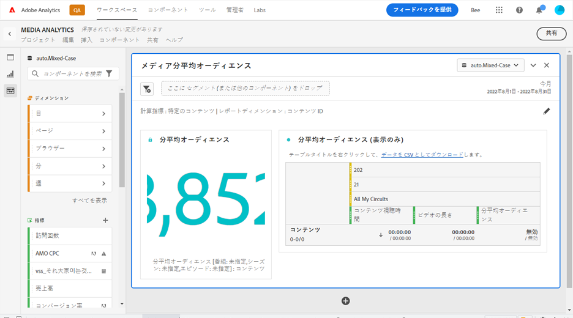

# メディア分平均オーディエンスパネル {#media-average-minute-audience-panel}

<!-- markdownlint-disable MD034 -->

>[!CONTEXTUALHELP]
>id="workspace_mediaminuteaverageaudience_button"
>title="メディア分平均オーディエンス"
>abstract="パネルを作成して、特定のコンテンツまたは特定の期間の分平均オーディエンスを分析します。"

<!-- markdownlint-enable MD034 -->

<!-- markdownlint-disable MD034 -->

>[!CONTEXTUALHELP]
>id="workspace_mediaaverageminuteaudience_panel"
>title="メディア分平均オーディエンス"
>abstract="特定のメディアコンテンツのパフォーマンスまたはカスタム期間のパフォーマンスを表示します。レポートディメンションを指定し、オプションでコンテンツをセグメント化します。"

<!-- markdownlint-enable MD034 -->

>[!BEGINSHADEBOX]

_この記事では、_ _&#x200B;**Customer Journey Analytics**&#x200B;_ のメディア分平均オーディエンスパネルについて説明します。 _この記事の_  _&#x200B;**Adobe Analytics** バージョンについて詳しくは、[メディア分平均オーディエンスパネル](https://experienceleague.adobe.com/ja/docs/analytics/analyze/analysis-workspace/panels/average-minute-audience-panel)を参照してください。_

>[!ENDSHADEBOX]

>[!NOTE]
>
>**[!UICONTROL メディア分平均オーディエンス]**&#x200B;パネルは、Customer Journey Analytics 用ストリーミングメディアコレクションを購入したお客様のみが使用できます。
>
>詳しくは、アドビ担当営業または販売店か、アドビアカウントチームにお問い合わせください。
>

Analysis Workspace では、分平均オーディエンスは次の情報を提供できます

* 特定のメディアストリームの視聴に費やした時間を、コンテンツの期間で割った値、または
* 選択した精度で、カスタム期間中に視聴に費やした時間。

メディア分平均オーディエンスパネルを使用すると、あらゆる長さやジャンルのプログラムを比較して、コンテンツの平均消費量を理解できます。例えば、30 分のシットコムと 3 時間のスポーツイベントを比較すると、平均消費量を理解できます。

さらに、メディア分平均オーディエンスパネルを使用して、このデジタル分平均オーディエンスを、線形 TV 分平均指標と比較したり追加したりできます。

メディア分平均オーディエンスパネルでは、分平均オーディエンス指標に対して次のメリットがあります。

* カスタム期間をサポートします

* ビューを処理した後に期間の分類を更新できます（期間の分類が存在しなかったか、修正する必要がある場合）

  指標を使用する際にこの更新を行うと、期間の分類は存在しません（分類が存在しなかった場合）。 または、期間の分類が古くなっています（分類が存在したが正しくない場合）。

## 使用

**[!UICONTROL メディア分平均オーディエンス]**&#x200B;パネルを使用するには：

1. **[!UICONTROL メディア分平均オーディエンス]**&#x200B;パネルを作成します。パネルの作成方法について詳しくは、[パネルの作成](panels.md#create-a-panel)を参照してください。

1. ストリーミングメディアコレクションから設定されたコンポーネントを含むパネルのデータビューを選択します。

1. パネルの[入力](#panel-input)を指定します。

1. パネルの[出力](#panel-output)を確認します。

### パネル入力

この節で説明している入力設定を使用して、メディア分平均オーディエンスパネルを設定します。

1. 次の入力設定を指定します。

   | 設定 | 説明 |
   |---------|------------|
   | **パネルの日付範囲** | パネルの日付範囲のデフォルトは「[!UICONTROL **今月**]」です。一度に 1 日または複数の月を表示するように編集できます。  このビジュアライゼーションは、1440 行のデータ（例えば、分単位の精度で 24 時間）に制限されています。日付範囲と精度の組み合わせの結果が 1440 行を超える場合、精度は日付範囲全体に対応するように自動的に更新されます。 |
   | [!UICONTROL **ここにセグメント（または他のコンポーネント）をドロップ**] | 他のパネルと同様に、この設定では、作成したセグメントに基づいて選択内容がセグメント化されます。この設定は、特定のプラットフォーム、ライブストリームまたはその他の一般的なメディアセグメントを調べる優れた方法です。 |
   | [!UICONTROL **指標の計算対象**] | [**[!UICONTROL 特定のコンテンツ]**](#specific-content)の分平均オーディエンスを表示するかどうかを選択します。 または、[**[!UICONTROL カスタム期間]**](#custom-time-period)の分平均オーディエンスを表示する場合も同様です。  次の場合に&#x200B;[!UICONTROL **カスタム期間**]&#x200B;を選択します。 <ul><li>期間を使用できない場合、または </li><li>複数のコンテンツを含む時系列の分平均オーディエンスを表示する場合、または</li><li>（ライブストリームやイベント中など）特定の期間が割り当てられていないコンテンツの場合</li></ul></li></li></ul> 
この設定により、ワークフローとレポートの出力が変更されます。
 |

1. [ 指標の計算対象 ](#specific-content) ドロップダウンメニューで選択したオプションに応じて、[!UICONTROL **特定のコンテンツ**] または [ カスタム期間 ](#custom-time-period) を続けます。

#### 特定のコンテンツ

1. [パネル入力を設定](#panel-inputs)する際に、[!UICONTROL **指標の計算対象**]&#x200B;ドロップダウンメニューで「[!UICONTROL **特定のコンテンツ**]」を選択した場合は、次の設定オプションを指定します。

   | 設定 | 説明 |
   |---------|------------|
   | [!UICONTROL **レポートディメンション**] | 特定のコンテンツを選択する場合、レポート出力を選択して、ビデオ名またはコンテンツ ID フィールドを使用し、コンテンツとそれに関連する分平均オーディエンスを表示できます。 |
   | [!UICONTROL **コンテンツのフィルター基準（オプション）**] | 目的とする表示やデータの構造によって特定のコンテンツをフィルタリングする方法を選択します。 <ul>[!UICONTROL **番組、シーズン、エピソード**]：使用可能な番組がドロップダウンに表示され、検索を使用してフィルタリングできます（または、左の列から番組名をドラッグ＆ドロップします）。 そこで選択を終了して、番組のすべてのシーズンを表示するか、個々のシーズン、次に個々のエピソードでフィルタリングできます。この設定では、選択した期間の番組、シーズンまたはエピソードのデータを表示します。</li><li>[!UICONTROL **カスタムディメンション**]：番組名がカスタムディメンションの下にある場合は、ディメンション（任意）ドロップダウンメニューで検索するか、左列の検索を使用して見つけることができます。 ディメンション項目は、その選択に基づいて自動的に入力され、エピソードとして扱われます。</li><li>[!UICONTROL **なし**]：選択した項目の分平均オーディエンスデータを持つすべてのビデオ名が表示されます（このオプションはデフォルトで選択されています）。</li></ul> |

1. [特定のコンテンツの詳細設定](#specific-content-advanced-settings)に進んで、詳細設定を指定します。

#### 特定のコンテンツの詳細設定

1. [!UICONTROL **指標の計算対象**]&#x200B;ドロップダウンメニューで「[!UICONTROL **特定のコンテンツ**]」を選択し、「[!UICONTROL **詳細設定を表示**]」を選択して、次の設定オプションを指定します。

   | オプション | 説明 |
   |---------|------------|
   | **[!UICONTROL テーブル設定]** | デフォルトオプションの「**[!UICONTROL テーブル内の計算値を表示]**」では、分平均オーディエンスの分子と分母がテーブルの前の列として表示されます。このオプションを選択解除すると、これら 2 つの列が削除されます。 分平均オーディエンス列は、ビデオ名またはコンテンツ ID の横のテーブルに残ります。 |
   | **[!UICONTROL 滞在時間指標]** | デフォルトの「**[!UICONTROL コンテンツ視聴時間]**」オプション（コンテンツ視聴時間のみを含む）を選択できます。または、**[!UICONTROL メディア視聴時間]**（コンテンツ時間と広告時間を含む）を分平均オーディエンスの分子の計算に使用することを選択できます。 |

1. 「[!UICONTROL **作成**]」を選択して、メディア分平均オーディエンスパネルの作成を完了します。

1. メディア分平均オーディエンスパネルの使用方法について詳しくは、[パネル出力](#panel-output)を参照してください。

#### カスタム期間

1. [パネル入力を設定](#panel-inputs)する際に、[!UICONTROL **指標の計算対象**]&#x200B;ドロップダウンメニューで「[!UICONTROL **カスタム期間**]」を選択した場合は、次の設定オプションを指定します。

   | オプション | 説明 |
   |---------|------------|
   | **[!UICONTROL 精度]** | デフォルトの精度は [!UICONTROL **5 分**]&#x200B;ですが、選択された期間の範囲内で、時系列の分母として使用される任意の精度を選択できます。例えば、精度を 5 分にして午後 12:00～12:30 に設定した場合、30 分間全体の分平均オーディエンスと、5 分間ごとの分平均オーディエンスを含んだ 6 つの行が返されます。これらの行は、時系列グラフのデータポイントとして使用されます。 |
   | [!UICONTROL **コンテンツのフィルター基準（オプション）**] | 目的とする表示やデータの構造によって特定のコンテンツをフィルタリングする方法を選択します。 <ul>[!UICONTROL **番組、シーズン、エピソード**]：使用可能な番組がドロップダウンに表示され、検索を使用してフィルタリングできます（または、左の列から番組名をドラッグ＆ドロップします）。 そこで選択を終了して、番組のすべてのシーズンを表示するか、個々のシーズン、次に個々のエピソードでフィルタリングできます。この設定では、選択した期間の番組、シーズンまたはエピソードのデータを表示します。</li><li>[!UICONTROL **カスタムディメンション**]：番組名がカスタムディメンションの下にある場合は、ディメンション（オプション）メニューで検索するか、左列の検索を使用して見つけることができます。 ディメンション項目は、その選択に基づいて自動的に入力され、エピソードとして扱われます。</li><li>[!UICONTROL **なし**]：選択した項目の分平均オーディエンスデータを持つすべてのビデオ名が表示されます（このオプションはデフォルトで選択されています）。</li></ul> |

1. [カスタム期間の詳細設定](#custom-time-period-advanced-settings)に進んで、詳細設定を指定します。

#### カスタム期間の詳細設定

1. [!UICONTROL **指標の計算対象**]&#x200B;ドロップダウンメニューで「[!UICONTROL **カスタム期間**]」を選択し、「[!UICONTROL **詳細設定を表示**]」を選択して、次の設定オプションを指定します。

   | オプション | 説明 |
   |---------|------------|
   | **[!UICONTROL テーブル設定]** | デフォルト設定では、テーブル内の計算値が表示され、分平均オーディエンスの分子と分母がテーブルの前の列として表示されます。このオプションの選択を解除すると、2 つの列が削除され、期間の横の分平均オーディエンスのみが残ります。 |

1. 「[!UICONTROL **作成**]」を選択して、メディア分平均オーディエンスパネルの作成を完了します。

1. メディア分平均オーディエンスパネルの使用方法について詳しくは、[パネル出力](#panel-output)を参照してください。

### パネル出力

パネル出力は、[パネル入力を設定](#panel-inputs)する際に&#x200B;[!UICONTROL **指標の計算対象**]&#x200B;ドロップダウンメニューで「[!UICONTROL **特定のコンテンツ**]」または「[!UICONTROL **カスタム期間**]」のどちらを選択したかによって異なります。

#### 特定のコンテンツ

メディア分平均オーディエンスパネルは、次の値を返します。

* 選択期間全体の合計分平均オーディエンス
* テーブルに表示される個々のビデオのフィルターおよび分平均オーディエンス
* 詳細設定が選択されている場合は、コンテンツ視聴時間とビデオの長さ（期間）

パネルを編集および再作成するには、右上の  を選択します。

#### 特定のコンテンツのデータソース

メディア分平均オーディエンスパネルでは、分平均オーディエンス指標のみを使用してデータを収集します。パネルでは、分類や他の指標は使用できません。

| 指標 | 説明 |
|--------|-------------|
| **[!UICONTROL 分平均オーディエンス]** | メディアストリームの視聴に費やした時間を、分類で提供されたビデオの長さ（期間）で割った値です。 |

#### カスタム期間 {#custom-time-period-output}

メディア分平均オーディエンスパネルは、次の値を返します。

* 選択期間全体の合計分平均オーディエンス

* 最大と最小の分平均オーディエンス

* 選択期間全体の分平均オーディエンスを示す線系列グラフ。

* 精度のフィルターと分平均オーディエンス、および期間ごとのコンテンツ視聴時間と精度を示すテーブル

  このテーブルは、詳細設定の「[!UICONTROL **テーブル内の計算値を表示**]」オプションを選択した場合にのみ表示されます。

パネルを編集および再作成するには、右上の  を選択します。

#### カスタム期間のデータソース

メディア分平均オーディエンスパネルでは、分平均オーディエンス指標のみを使用してデータを収集します。パネルでは、分類や他の指標は使用できません。

| 指標 | 説明 |
|---|---|
| **[!UICONTROL 分平均オーディエンス]** | メディアストリームの視聴に費やした時間を、選択期間全体または選択した精度（分単位）で割った値です。 |

>[!MORELIKETHIS]
>
> [パネルの作成](/help/analysis-workspace/c-panels/panels.md#create-a-panel)
> [メディア同時視聴者数パネル](media-concurrent-viewers.md)
> [メディア再生滞在時間パネル](media-playback-time-spent.md)
>