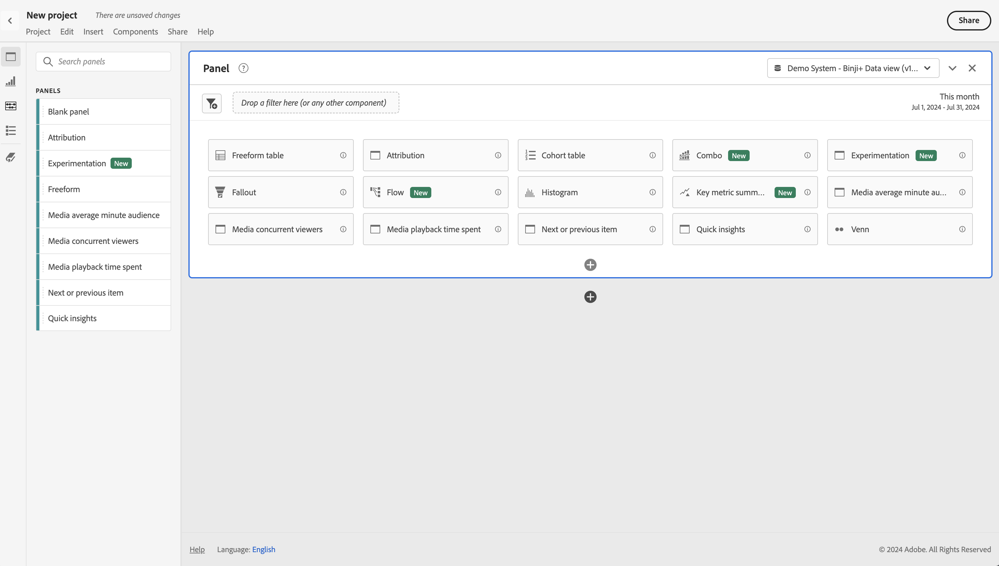

# 空のパネル {#blank-panel}

<!-- markdownlint-disable MD034 -->

>[!CONTEXTUALHELP]
>id="workspace_blankpanel_button"
>title="空のパネル"
>abstract="完全にカスタマイズされた分析を構築するのに作成できる選択したパネルまたはビジュアライゼーションを表示します。"
>additional-url="https://www.youtube.com/watch?v=SYaioiwBTrk" text="Analysis Workspace のパネル"

<!-- markdownlint-enable MD034 -->

>[!BEGINSHADEBOX]

_この記事では、_&#x200B;の空白パネルについて説明します。_**Customer Journey Analytics**_。 _この記事の_  _**Adobe Analytics** バージョンについては、[空白パネル ](https://experienceleague.adobe.com/ja/docs/analytics/analyze/analysis-workspace/panels/blank-panel)を参照してください。_

>[!ENDSHADEBOX]

**[!UICONTROL 空白のパネル]**&#x200B;には、完全にカスタマイズされた分析を構築するのに作成できる、選択したパネル（で示されます）またはビジュアライゼーションが表示されます。

## 使用

**[!UICONTROL 空白のパネル]**&#x200B;を使用するには：

1. **[!UICONTROL 空白のパネル]**&#x200B;を作成します。 パネルの作成方法について詳しくは、[パネルの作成](panels.md#create-a-panel)を参照してください。

   

1. 使用可能なオプションからビジュアライゼーションまたはパネルを選択します。

   * パネルを選択すると、空白のパネルが選択したパネルに切り替わります。
   * ビジュアライゼーションを選択すると、そのビジュアライゼーションが空白のパネルに追加されます。

   例えば、ビジュアライゼーション（ **[!UICONTROL コホートテーブル]**&#x200B;など）を選択してパネルに追加したり、パネル（**[!UICONTROL アトリビューション]**&#x200B;など）を選択してパネルをアトリビューションパネルに変更したりします。

次のことができます。

* パネル&#x200B;**内**&#x200B;の「」を選択して、別のビジュアライゼーションを追加します。 ビジュアライゼーションを選択できるポップアップが表示されます。

  | ..を選択 | ...を作成するには |
  |---|---|
  |  | [フリーフォームテーブル](/help/analysis-workspace/visualizations/freeform-table/freeform-table.md) |
  |  | [折れ線グラフ](/help/analysis-workspace/visualizations/line.md) |
  |  | [棒グラフ](/help/analysis-workspace/visualizations/bar.md) |
  |  | [数値の概要](/help/analysis-workspace/visualizations/summary-number-change.md) |
  |  | [テキスト](/help/analysis-workspace/visualizations/text.md) |
  |  | [フォールアウト](/help/analysis-workspace/visualizations/fallout/fallout-flow.md) |
  |  | [フロー](/help/analysis-workspace/visualizations/c-flow/flow.md) |
  |  | [積み重ね面グラフ](/help/analysis-workspace/visualizations/area.md) |
  |  | [コホートテーブル](/help/analysis-workspace/visualizations/cohort-table/t-cohort.md) |
  |  | [ブレット](/help/analysis-workspace/visualizations/bullet-graph.md) |
  |  | [ドーナツ](/help/analysis-workspace/visualizations/donut.md) |
  |  | [変更の概要](/help/analysis-workspace/visualizations/summary-number-change.md) |
  |  | [ヒストグラム](/help/analysis-workspace/visualizations/histogram.md) |
  |  | [散布図](/help/analysis-workspace/visualizations/scatterplot.md) |
  |  | [ベン図](/help/analysis-workspace/visualizations/venn.md) |
  |  | [ツリーマップ](/help/analysis-workspace/visualizations/treemap.md) |

* パネル&#x200B;**外**&#x200B;の「」を選択して、別の空のパネルを追加します。

>[!MORELIKETHIS]
>
>[パネルの作成](/help/analysis-workspace/c-panels/panels.md#create-a-panel)
>
