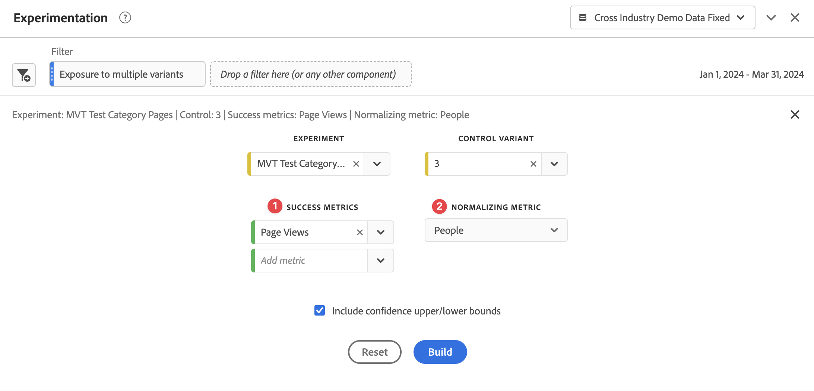

# 実験パネル {#experimentation-panel}

>[!CONTEXTUALHELP]
>id="workspace_experimentation_button"
>title="実験"
>abstract="パネルを作成して、様々なユーザーエクスペリエンス、マーケティングまたはメッセージングのバリエーションを比較します。また、特定の結果を導くのに最適なバリエーションを判断します。"

>[!CONTEXTUALHELP]
>id="workspace_experimentation_panel"
>title="実験"
>abstract="様々なユーザーエクスペリエンス、マーケティングまたはメッセージングのバリエーションを比較して、特定の結果を導く上で最適な判断を下せます。実験、比較対象のコントロールバリアント、成功指標および標準化指標を指定します。オプションで、信頼性の上限と下限を設定します。"

>[!BEGINSHADEBOX]

_この記事では、_  _&#x200B;**Customer Journey Analytics** の実験パネルについて説明します。_ __  _&#x200B;**Adobe Analytics** で Adobe Target のアクティビティと実験を分析する方法については、[Analytics for Target パネル](https://experienceleague.adobe.com/ja/docs/analytics/analyze/analysis-workspace/panels/a4t-panel)を参照してください。_

>[!ENDSHADEBOX]

**[!UICONTROL 実験]**&#x200B;パネルを使用すると、アナリストは様々なユーザーエクスペリエンス、マーケティングまたはメッセージングのバリエーションを比較して、特定の結果を導くのに最適なものを判断できます。A/B 実験の上昇率と信頼性は、Target や Journey Optimizer などのアドビのソリューション、BYO（bring-your-own）データなど、オンラインまたはオフラインのあらゆる実験プラットフォームで評価できます。

詳しくは、[Adobe Customer Journey Analytics と Adobe Target の統合](https://experienceleague.adobe.com/ja/docs/target/using/integrate/cja/target-reporting-in-cja)を参照してください。

## アクセス制御 {#access}

実験パネルは、すべての Customer Journey Analytics ユーザーが使用できます。管理者権限やその他の権限は必要ありません。 ただし、前提条件では、管理者のみが実行できるアクションが必要です。

## 計算指標の関数

上昇率および信頼性の 2 つの高度な関数が利用できます。詳しくは、[リファレンス - 高度な関数](/help/components/calc-metrics/cm-adv-functions.md)を参照してください。

## 前提条件

実験パネルを使用するには、次の前提条件に従う必要があります。

### 実験データセットへの接続の作成

推奨されるデータスキーマは、実験データを[オブジェクト配列](https://experienceleague.adobe.com/ja/docs/experience-platform/xdm/ui/fields/array)に配置することです。この配列には、2 つの異なるディメンションでの実験データとバリアントデータが含まれます。両方のディメンションは、**単一**&#x200B;のオブジェクト配列である必要があります。実験データとバリアントデータを区切り文字列で区切った単一のディメンションに実験データがある場合、パネルで使用するために、データビューの[部分文字列](/help/data-views/component-settings/substring.md)の設定を使用してディメンションを 2 つに分割できます。

実験データが Adobe Experience Platform に[取り込まれ](https://experienceleague.adobe.com/ja/docs/experience-platform/ingestion/home)たら、[Customer Journey Analytics で 1 つ以上の実験データセットへの接続を作成します](/help/connections/create-connection.md)。

### データビューでのコンテキストラベルの追加

Customer Journey Analytics データビューの設定では、管理者はディメンションや指標に[コンテキストラベル](/help/data-views/component-settings/overview.md)をディメンションや指標に追加し、目的に合わせて[!UICONTROL 実験]パネルなどの Customer Journey Analytics サービスでこれらのラベルを使用できます。実験パネルには、次の 2 つの事前定義済みのラベルが使用されます。

* [!UICONTROL 実験的な実験]
* [!UICONTROL 実験バリアント]

実験データを含むデータビューで、2 つのディメンション（1 つは実験データを含むもの、もう 1 つはバリアントデータを含むもの）を選択します。次に、これらのディメンションに&#x200B;**[!UICONTROL 実験]**&#x200B;ラベルと&#x200B;**[!UICONTROL 実験バリアント]**&#x200B;ラベルを付けます。

これらのラベルが存在しない場合、操作する実験がないため、実験パネルは機能しません。

## 使用

**[!UICONTROL 実験]**&#x200B;パネルを使用するには：

1. **[!UICONTROL 実験]**&#x200B;パネルを作成します。パネルの作成方法について詳しくは、[パネルの作成](panels.md#create-a-panel)を参照してください。

1. パネルの[入力](#panel-input)を指定します。

1. パネルの[出力](#panel-output)を確認します。

   >[!IMPORTANT]
   >
   >Customer Journey Analytics データビューで必要な設定が完了していない場合は、先に進む前に「[!UICONTROL データビューで実験ディメンションとバリアントディメンションを設定してください]」というメッセージが表示されます。
   >

### パネル入力

実験パネルを使用するには：

1. パネル入力設定を行います。

   

   | 設定 | 定義 |
   | --- | --- |
   | **[!UICONTROL 日付範囲]** | 選択した実験に対して Customer Journey Analytics で受信した最初のイベントに基づいて、実験パネルの日付範囲が自動設定されます。必要に応じて、日付範囲をより具体的な期間に制限または拡張できます。 |
   | **[!UICONTROL 実験]** | どのエクスペリエンスを永続的に保持することが最適かを判断するために、エンドユーザーに公開されたエクスペリエンスに対する一連のバリエーションです。実験は、2 つ以上のバリアントで構成され、そのうちの 1 つがコントロールバリアントと見なされます。 この設定には、データビューで&#x200B;**[!UICONTROL 実験]**&#x200B;ラベルが付けられたディメンションと、過去 6 か月分の実験データが事前に入力されています。 |
   | **[!UICONTROL コントロールバリアント]** | エンドユーザーのエクスペリエンスにおいて、より優れた代替策を特定するために比較する、複数の選択肢の 1 つです。1 つのバリアントをコントロールとして選択する必要があり、1 つのバリアントのみがコントロールバリアントと見なされます。 この設定には、データビューで&#x200B;**[!UICONTROL バリアント]**&#x200B;ラベルが付けられたディメンションが事前に入力されています。この設定により、この実験に関連付けられているバリアントデータを取得します。 |
   | **[!UICONTROL 成功指標]** ➊ | ユーザーがバリアントと比較する指標。 コンバージョン指標に対して最も望ましい結果を持つバリアント（最高または最低）が、実験の&#x200B;*最もパフォーマンスの高いバリアント*&#x200B;として宣言されます。 最大 5 つの指標を追加できます。 |
   | **[!UICONTROL 指標の標準化]** ➋ | テストが実行される基準（**[!UICONTROL グローバルアカウント]** [!BADGE B2B Edition]{type=Informative url="https://experienceleague.adobe.com/ja/docs/analytics-platform/using/cja-overview/cja-b2b/cja-b2b-edition" newtab=true tooltip="Customer Journey Analytics B2B Edition"}、**[!UICONTROL アカウント]** [!BADGE B2B Edition]{type=Informative url="https://experienceleague.adobe.com/ja/docs/analytics-platform/using/cja-overview/cja-b2b/cja-b2b-edition" newtab=true tooltip="Customer Journey Analytics B2B Edition"}、**[!UICONTROL 商談]** [!BADGE B2B Edition]{type=Informative url="https://experienceleague.adobe.com/ja/docs/analytics-platform/using/cja-overview/cja-b2b/cja-b2b-edition" newtab=true tooltip="Customer Journey Analytics B2B Edition"}、**[!UICONTROL 購買グループ]** [!BADGE B2B Edition]{type=Informative url="https://experienceleague.adobe.com/ja/docs/analytics-platform/using/cja-overview/cja-b2b/cja-b2b-edition" newtab=true tooltip="Customer Journey Analytics B2B Edition"}、**[!UICONTROL 人物]**、**[!UICONTROL セッション]**&#x200B;または&#x200B;**[!UICONTROL イベント]**）。例えば、テストでは、いくつかのバリエーションのコンバージョン率を比較できます。**[!UICONTROL コンバージョン率]**&#x200B;は、ページビューとして計算されます。 |
   | **[!UICONTROL 信頼性の上限／下限を含める]** | 信頼性レベルの上限と下限を表示するには、このオプションを有効にします。 |

1. 「**[!UICONTROL 作成]**」を選択します。

### パネル出力

実験パネルは、豊富なデータとビジュアライゼーションのセットを返し、実験のパフォーマンスをより深く理解するのに役立ちます。パネルの上部には、選択したパネル設定を示す[変更の概要](../visualizations/summary-number-change.md)ビジュアライゼーションが表示されます。右上の編集鉛筆を選択すると、いつでもパネルを編集できます。

また、実験が決定的かどうかを示すテキストの概要を取得し、結果の概要を示します。 結論は統計的有意差に基づいています（[統計方法](#adobes-statistical-methodology)を参照）。上昇率と信頼性が最も高く、最もパフォーマンスの高いバリアントの概要数値概要数を確認できます。

選択した各成功指標に対して、[フリーフォームテーブル](../visualizations/freeform-table/freeform-table.md)ビジュアライゼーションとコンバージョン率の[折れ線グラフ](../visualizations/line.md)ビジュアライゼーションが表示されます。

>[!NOTE]
>
>このパネルは、現在、A/A テストの分析をサポートしていません。

#### 結果の解釈

1. **実験は決定的です**：実験レポートを表示するたびに、この時点までの実験で累積したデータが分析されます。分析では、*少なくとも 1 つ*&#x200B;のバリアントで、*常に*&#x200B;有効な信頼度が 95％のしきい値を超えると、実験を決定的と宣言します。2 アーム以上の場合は、複数の仮説テストを補正するためにボンフェロンニ補正を適用します。

2. **最も効果の高いバリアント**：実験が決定的であると宣言された場合、コンバージョン率の最も高いバリアントには、「最もパフォーマンスの高いバリアント」というラベルが付けられます。このバリアントは、コントロールバリアントかベースラインバリアントであり、または&#x200B;*常に*&#x200B;有効な信頼性が 95％の（ボンフェロンニ補正が適用された）しきい値を超えるバリアントの 1 つである必要があります。

3. **コンバージョン率**：表示されるコンバージョン率は、成功指標値 ➊ と標準化指標値 ➋ の比率です。 なお、指標がバイナリ（実験の各単位に対して 1 または 0）でない場合、この値は 1 より大きくなることがあります。

4. **上昇率**：実験レポートの概要には、ベースラインに対する上昇率が表示されます。これは、ベースラインに対する特定のバリアントのコンバージョン率が向上した割合をパーセントで表す指標です。正確に定義すると、特定のバリアントとベースラインのパフォーマンスの差を、ベースラインのパフォーマンスで割って、パーセントで表します。

5. **信頼性**：表示される常に有効な信頼性は、特定のバリアントがコントロールバリアントと同じであることを示す証拠がどれくらいあるかを表す確率的な指標です。信頼性が高いほど、コントロールバリアントおよびコントロールバリアント以外のパフォーマンスが等しいという仮定に対する証拠が少ないことを示します。信頼性は、特定のバリアントとコントロールの間のコンバージョン率の差がより小さく観測された確率（のパーセント表現）です。実際には、基礎となる真のコンバージョン率に違いはありません。*p*&#x200B;値に関しては、表示される信頼性は、1 - *p*&#x200B;値です。

>[!NOTE]
>
>結果の完全な説明では、結果が決定的であるかどうかの宣言だけでなく、利用可能な証拠（例えば、実験設計、サンプルサイズ、コンバージョン率、信頼性など）をすべて考慮します。結果がまだ決定的でない場合でも、あるバリアントが別のバリアントと異なるという、説得力のある証拠が存在する場合があります（例えば、信頼区間がほぼ重なっていないなど）。連続的なスペクトルで解釈されるすべての統計的証拠に基づいて意思決定が行われることが理想です。

## アドビの統計方法 {#statistics}

解釈が容易で、安全な統計的推論を提供するために、アドビでは、[常に有効な信頼性シーケンス](https://arxiv.org/abs/2103.06476)に基づく統計方法を採用しています。

信頼性シーケンスは、信頼区間の&#x200B;*連続的な*&#x200B;アナログです。信頼性シーケンスとは何かを理解するには、実験を 100 回繰り返すと仮定します。そして、実験に加わる&#x200B;*新規ユーザーごとに*、平均ビジネス指標（メール開封率など）とそれに関連する 95％信頼性シーケンスの推定値を計算します。

95％の信頼性シーケンスは、実行した 100 件の実験のうち 95 件のビジネス指標の「true」値を含んでいます（95％の信頼区間は、同じ 95％の範囲を保証するために、新規ユーザーごとの計算ではなく、実験ごとに 1 回のみの計算となります）。したがって、信頼性シーケンスを使用すると、結果を「覗き見」て確認することができるので、偽陽性のエラー率を増やすことなく、実験を継続的に監視できます。

## 非ランダム化ディメンションの解釈 {#non-randomized}

Adobe Customer Journey Analytics を使用すると、アナリストは任意のディメンションを実験として選択できます。しかし、実験として選択されたディメンションが、ユーザーのランダム化の対象になっているものでない場合は、分析をどう解釈するのでしょうか？

例えば、ユーザーに表示される広告について考えてみます。*広告 A* ではなく&#x200B;*広告 B* を表示することにした場合に、何らかの指標（例えば、平均売上高など）の変化の測定に関心があるとします。広告 A ではなく広告 B を表示することの因果的効果は、マーケティングの決定を下すうえで非常に重要です。広告 A を表示するという現状を、広告 B を表示するという別の戦略に置き換えた場合、この因果的効果は、母集団全体の平均売上高として測定できます。

A/B テストは、このような介入の効果を客観的に測定するための、業界内の絶対的標準です。A/B テストが因果的な推定を導き出す決定的な理由は、考えられるバリアントの 1 つを受け取る顧客のランダム化にあります。

では、ランダム化によって達成されないディメンションについて考えてみましょう。例えば、顧客の米国州などです。顧客は主にニューヨークとカリフォルニアの 2 つの州の出身だとします。冬物衣料品ブランドの平均売上高は、地域の天候の違いにより、2 つの州で異なる可能性があります。このような状況では、冬物衣料品の売上の真の因果的要因は天候であり、顧客の地理的な州が異なるという事実ではない可能性があります。

Adobe Customer Journey Analytics の実験パネルを使用すると、データを顧客の州による平均売上高の違いとして分析できます。このような状況では、出力には因果的な解釈が含まれません。しかし、そのような分析でも興味を引く可能性があります。これは、顧客の州による平均売上高の違いの推定値（と不確実さの尺度）を提供します。この値は、*統計的仮説テスト*&#x200B;とも呼ばれます。この分析の結果は興味深いものになるかもしれませんが、必ずしも実用的ではありません。単に、ディメンションの取り得る値の 1 つに顧客をランダム化しておらず、またランダム化できないことがあるからです。

次の図は、これらの状況を対比したものです。

介入 X が結果 Y に与える影響を測定する場合、両者の実際の原因が交絡因子 C である可能性があります。X で顧客をランダム化してデータが得られなければ、影響は測定しにくく、分析で C が明示的に説明されます。ランダム化により X の C への依存が解消されるので、他の変数を気にせずに X の Y への影響を測定できます。

## 実験での計算指標の使用 {#use-in-experimentation}

>[!NOTE]
>
>Adobe Customer Journey Analytics と Adobe Journey Optimizer の両方を使用する組織の場合、この節の情報は、Journey Optimizer 内の実験機能にも当てはまります。

すべての計算指標が実験パネルに対応しているわけではありません。

次の指標または定数のいずれかを含む計算指標は、実験パネルに対応していません。

* [概要データセット](https://experienceleague.adobe.com/ja/docs/analytics-platform/using/cja-dataviews/summary-data)のベース指標
* 相互に除算または乗算されるベース指標（例：`Revenue`/`Orders` など）
* ベース指標に追加またはベース指標から減算される定数（例：`Revenue+50` など）
* 次のいずれかの基本指標。
   * People

実験パネルと互換性のない計算指標では、計算指標を作成する際に、「[!UICONTROL **製品の互換性**]」フィールドに [!UICONTROL **Customer Journey Analytics のすべての場所（実験を除く）**]&#x200B;という値が使用されます。計算指標の作成について詳しくは、[指標の作成](/help/components/calc-metrics/cm-workflow/cm-build-metrics.md)を参照してください。

## 実験パネルでの計算指標の使用

[実験パネルでの計算指標の使用](https://experienceleaguecommunities.adobe.com/t5/adobe-analytics-blogs/using-derived-metrics-in-cja-s-experimentation-panel/ba-p/593119?profile.language=ja)について詳しくは、このブログ投稿を参照してください。

>[!MORELIKETHIS]
>[Adobe Customer Journey Analytics 実験を習得する](https://experienceleaguecommunities.adobe.com/t5/adobe-analytics-blogs/mastering-adobe-customer-journey-analytics-experimentation-your/ba-p/732338?profile.language=ja)
>
