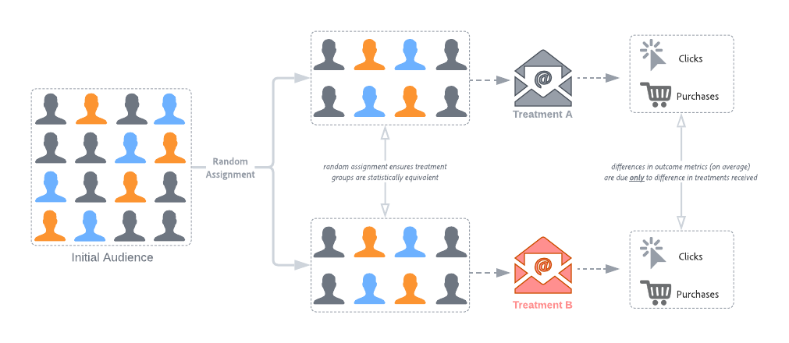

# CJA の実験パネルでの統計的手法の概要

この記事では、CJA の実験パネルで使用される統計指標について説明します。 CJA は、高度な統計手法を使用して **信頼性** これはいつでも有効で、必要な期間実験を実行し、結果を継続的に監視できます。

この記事では、A/B テストの仕組みと、Adobeの ***任意の時間の有効な信頼性シーケンス***. エキスパートユーザーの場合、技術的な詳細と参照情報が最後に含まれます。

## A/B テストと因果関係

A/B テストは、「介入」のある種の原因的影響を評価する際に「金の基準」としてしばしば表現されます。 ランダム化試験（オンラインテストの観点から見ると、Web サイト、メッセージまたは E メールの特定のバリエーションにランダムに選択したユーザーを公開し、別のランダムに選択したユーザーのセットを他のユーザーに公開します） **バリアント** または **治療**. 暴露後、我々は結果を測定する **指標** 興味を持っているのは、（例：メールの開封、購読、購入）です。

下の図に示すように、各バリアントグループにランダムにユーザーを割り当てた場合、平均的にグループは同じ特性を共有します。 したがって、結果の違いは、受け取ったバリアントの違い、つまり、我々は、 **原因** 我々の介入と我々が興味を持つ成果との間のリンク これにより、ビジネス目標の最適化に関して、厳密で説明可能な、データに基づく意思決定をおこなえるので、A/B テストは、現代のパーソナライゼーション実務者のツールキットの基本的な部分です。

さて、重要な問題は、観察された違いが「実際の効果」なのか、ランダムさに起因するのかです。 直感的に、グループ間の結果指標にわずかな違いしかない場合、これは偶然に見られた可能性がありますが、大きな違いは「現実」になる可能性が高いです。 ここでの技術的用語は、私たちの測定値が *見積もり* 各バリアントグループの平均値の真の値。 統計的推論技術は、私たちの推定における不確実性の量を定量化する方法を与えます — ここでは、 **p 値** および **信頼区間** 発生しますが、これらを理解するには、まず統計的誤差を理解する必要があります。

## 統計的テストとエラーの制御

多くの統計的推論手法は、次の 2 種類のエラーを制御するように設計されています。 **偽陽性** （Type-I エラー）および **偽陰性** (Type-II Errors) 次の表に、これらを示します。

偽陽性は、実際には真の場合に、null 仮説の誤った却下です。 オンライン A/B テストの場合、これは、結果のビジネス指標が実際には同じであった場合に、バリアントアーム間で異なると（誤って）結論付けることを意味します。 実験を実行する前に、通常、しきい値を選択します *α*. 実験が実行された後、 *p*-value が計算され、 *p &lt; α*. 一般的に使用されるしきい値は、 *α*= 0.05 とは、長い目で見れば、100 個の実験のうち 5 個が偽陽性であると予想されることを意味します。

一方、偽陰性は、実際に偽の場合に null 仮説を却下しなかったことを意味します。 A/B テストの場合、実際に異なる場合は、null 仮説を拒否しません（戻り値仮説では、結果のビジネス指標がバリアントアーム間で同じであることを示します）。 このタイプのエラーを制御するには、通常、実験で特定の **累乗**（1 — として定義）*β* （つまり、1 から型 II エラーの確率を引いた値）。

ほとんどの統計的推論手法では、決定する効果のサイズとエラー許容値 (*α* および *β*) を事前に設定しておきます。 ただし、Adobeの手法は、任意のサンプルサイズに対して、継続的に結果を確認できるように設計されています。

## Adobeの統計的手法： _いつでも有効な信頼性シーケンス_

解釈が容易で安全な統計的推論を提供するために、Adobeは、 [_いつでも有効な信頼性シーケンス_](https://doi.org/10.48550/arXiv.2103.06476).

信頼シーケンスは、信頼区間の「順次」アナログです。 信頼性のシーケンスとは何かを理解するには、実験を 100 回繰り返し、平均ビジネス指標（E メールの開封率など）とそれに関連する 95%信頼性シーケンスの推定値を計算すると仮定します。 *新規ユーザ* が実験に入る 95%の信頼シーケンスは、実行した 100 件の実験のうち 95 件のビジネス指標の「true」値を含みます。 (95%の信頼区間は、同じ 95%の範囲を保証するために、実験ごとに 1 回だけ計算できます。新しいユーザーが 1 人もいない )。 したがって、信頼性シーケンスを使用すると、偽陽性のエラー率を増やすことなく、実験を継続的に監視できます。つまり、結果で「ピーク」するのを可能にします。

以下のアニメーションに、1 つの実験に対する信頼性シーケンスと信頼区間の違いを示します。

信頼性シーケンスは、A/B テストの焦点を *推定* 統計的有意性のしきい値に基づいて null の仮説を拒否するか否かではなく、仮説テスト（治療間の手段の違いの正確な推定に焦点を当てる）ではなく、

ただし、$p$-values （または Confidence）と信頼区間の関係と同様に、信頼シーケンスと常に有効な$p$-values （または常に有効な信頼）の間にも関係があります。 CJA は、信頼性などの数量に慣れているので、レポートでいつでも有効な信頼性を提供します。

信頼シーケンスの理論的基礎は、マーティンゲールと呼ばれるランダム変数の配列の研究から得られます。 主な成果は以下の通りですが、実践者にとっての留意点は次のとおりです。

> 信頼シーケンスは、信頼区間の「安全」な順次類似として解釈できます。A/B テストのデータをいつでも見て解釈でき、安全に停止したり、実験を続行したりできます。 対応する Anytime Valid Confidence ( または *p*-value) は、解釈しても安全です。

統計的手法は「いつでも有効」なので、同じサンプルサイズで適用される固定ホライズン手法よりも控えめな方法になることに注意する必要があります。 これは、「いつでも有効」であることを意味します *p* — 値は、通常、対応する固定水平線よりも大きくなります *p* — 値（常に有効な信頼性が小さくなります）

## 結果の解釈

1. **実験は決定的だ**:Adobeは、実験レポートを表示するたびに、この時点まで実験に累積したデータを分析し、有効な信頼性が 95%のしきい値を超えると、いつでも実験を「最終的」と宣言します。 *少なくとも 1 つ* （複数の仮説テスト用に補正するために、2 つ以上の腕がある場合にボンフェロンニ補正を適用した場合）。

2. **最も効果の高いバリアント**:実験が最終的な結果を得ると宣言された場合、コンバージョン率の最も高いバリアントは「最もパフォーマンスの高いバリアント」というラベルが付けられます。 このバリアントは、コントロールバリアントかベースラインバリアントか、95%の有効な信頼のしきい値を超えるバリアントの 1 つ（ボンフェロンニ補正が適用されている場合）である必要があります。

3. **コンバージョン率**:表示されるコンバージョン率は、成功指標値と標準化指標値の比率です。 指標がバイナリでない場合（実験の各単位に対して 1 または 0）は、1 より大きい場合があります。

4. **上昇率**:実験レポートの概要には、ベースラインに対する上昇率が表示されます。これは、ベースラインに対する特定のバリアントのコンバージョン率が向上した割合を示す尺度です。 正確に定義すると、特定のバリアントとベースラインのパフォーマンスの違いを、ベースラインのパフォーマンスで割ったパーセンテージで表します。

5. **信頼性**:表示されている Anytime Valid Confidence は、特定のバリアントが対照バリアントと同じであることの確率的な証拠の量を示す尺度です。 信頼性が高いほど、対照および非対照バリアントのパフォーマンスが等しいと仮定した場合の証拠が少なくなります。 より正確に言えば、表示される信頼性は、実際には真の基礎となるコンバージョン率に違いがない場合、特定のバリアントと対照の間のコンバージョン率の違いが小さく観測された確率（パーセントで表現）です。 次の条件で *p* — 値、表示される信頼性は 1 — です。 *p*-value.

ただし、結果の完全な説明では、最終的な結果の宣言だけでなく、利用可能なすべての証拠（実験設計、サンプルサイズ、コンバージョン率、信頼性など）を考慮する必要があります。 結果がまだ「最終的な」ものでない場合でも、あるバリアントが別のバリアントと異なるという、説得力のある証拠が残る場合があります（例えば、信頼区間がほぼ重複しない）。 意思決定は、すべての統計的証拠に基づいて通知され、連続的なスペクトルで解釈されるのが理想的です。
