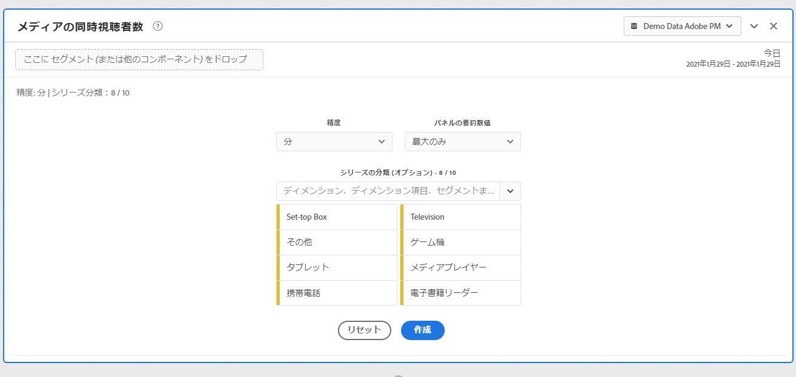
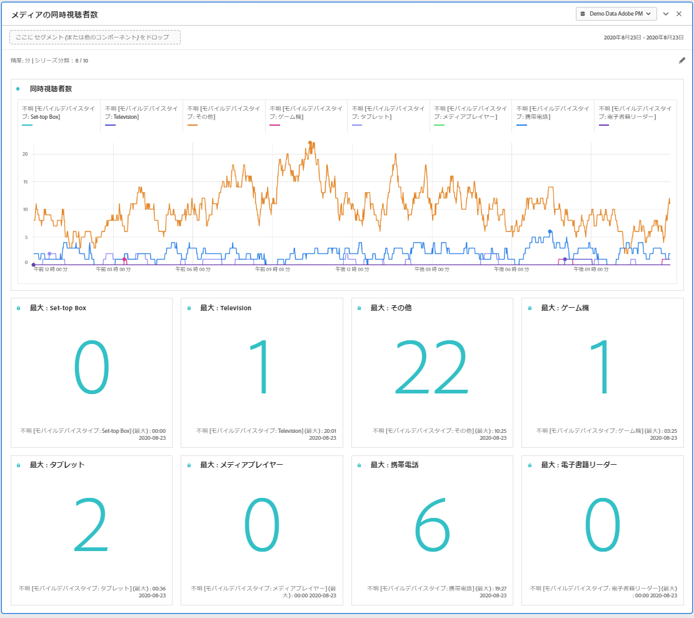
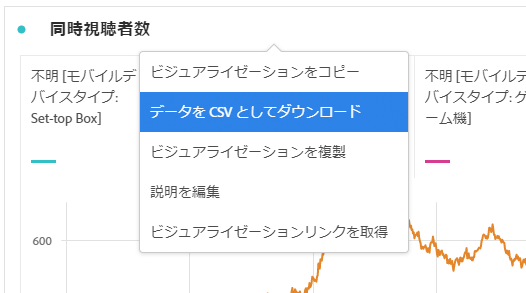

# メディア同時視聴者数パネル {#media-concurrent-viewers-panel}

<!-- markdownlint-disable MD034 -->

>[!CONTEXTUALHELP]
>id="cja_workspace_mediaconcurrentviewers_button"
>title="メディア同時閲覧者数"
>abstract="パネルを作成して、特定のコンテンツまたは特定の期間の分平均オーディエンスを分析します。"

<!-- markdownlint-enable MD034 -->

<!-- markdownlint-disable MD034 -->

>[!CONTEXTUALHELP]
>id="cja_workspace_mediaconcurrentviewers_panel"
>title="メディア同時閲覧者数"
>abstract="同時視聴者数の推移を分析、ピーク時の同時実行を表示、または分類して比較します。  **精度**：同時視聴者数を表示する期間を選択します。 **パネルの概要数値**： 各行の日付または時刻の詳細と共に概要数値を表示するオプション。最大値は、ピーク時の同時実行の詳細を示します。最小値は、トラフの詳細を示します。 **系列の分類（オプション）**：セグメント、ディメンション、ディメンション項目または日付範囲でビジュアライゼーションを分類できます。一度に 10 行まで表示できます。分類は 1 つのレベルに制限されます。"

<!-- markdownlint-enable MD034 -->

>[!NOTE]
>
>メディア分平均オーディエンスパネルは、Customer Journey Analytics用のストリーミングメディアコレクションアドオンを購入したお客様のみが利用できます。
>
>詳しくは、Adobeの営業担当またはAdobeアカウントチームにお問い合わせください。
>

**[!UICONTROL メディア同時視聴者数]** パネルを使用すると、同時実行性のピークに関する詳細や、分類機能と比較機能を使用して、時系列の同時視聴者数を分析できます。

同時視聴者数を分析して、同時実行のピークが発生した場所や離脱が発生した場所を把握し、コンテンツの品質と視聴者エンゲージメントに関する貴重なインサイトを提供できます。 また、ボリュームや規模のトラブルシューティングや計画にも役立ちます。

Analysis Workspaceでは、同時視聴者数指標は、セッション数に関係なく、特定の時点におけるメディアストリームを視聴しているユニークなユーザーの数です。

+++ この機能のビデオデモをご覧ください。

>[!VIDEO](https://video.tv.adobe.com/v/330177/?quality=12)

{{videoaa}}

+++

## 用途

**[!UICONTROL メディア同時視聴者数]** パネルを使用するには：

1. **[!UICONTROL メディア同時視聴者数]** パネルを作成します。 パネルの作成方法について詳しくは、[ パネルの作成 ](panels.md#create-a-panel) を参照してください。

1. ストリーミングメディアコレクションアドオンから設定されたコンポーネントを含むパネルのデータビューを選択していることを確認してください。

1. パネルの [ 入力 ](#panel-input) を指定します。

1. パネルの [output](#panel-output) を確認します。

### パネル入力

次の入力設定を使用して、メディアの同時視聴者数パネルを設定できます。

| 設定 | 説明 |
|---|---|
| **[!UICONTROL パネルの日付範囲]** | パネルの日付範囲のデフォルトは「今日」です。 一度に 1 日または複数の月を表示するように編集できます。   この視覚化は、1440 行のデータに制限されています（例えば、分レベルの粒度で 24 時間）。日付範囲と精度の組み合わせの結果が 1440 行を超える場合、精度は自動的に更新され、日付範囲全体に対応します。 |
| **[!UICONTROL 精度]** | 精度のデフォルトは「分」です。 この視覚化は、1440 行のデータに制限されています（例えば、分レベルの粒度で 24 時間）。日付範囲と精度の組み合わせの結果が 1440 行を超える場合、精度は自動的に更新され、日付範囲全体に対応します。 |
| **[!UICONTROL パネルの要約数値]** | 同時視聴者数の日時の詳細を表示するには、概要番号を使用できます。最大値は、ピーク同時実行性の詳細を示します。**[!UICONTROL 最小]** トラフの詳細を表示します。  パネルのデフォルトでは「最大値」のみが表示されますが、「最小値」に変更するか、「最大値」と「最小値」の両方を表示するように変更できます。  内訳を使用している場合は、それぞれの概要番号が表示されます。 |
| **[!UICONTROL シリーズの分類]** | オプションとして、フィルター、ディメンション、ディメンション項目または日付範囲でビジュアライゼーションを分類できます。  一度に 10 行まで表示できます。 分類は 1 つのレベルに制限されます。  ディメンションをドラッグすると、選択したパネルの日付範囲に基づいて、上位のディメンション項目が自動的に選択されます。  日付範囲を比較するには、2 つ以上の日付範囲をシリーズ分類フィルターにドラッグします。 |

次に、「最大のみ ]**の要約数値を使用して、「**[!UICONTROL  分 **[!UICONTROL 精度]** 用に設定されたパネルの例を示します。 **[!UICONTROL その他]**、**[!UICONTROL テーブル]**、**[!UICONTROL 携帯電話]**、**[!UICONTROL ゲームコンソール]**、**[!UICONTROL メディアプレーヤー]**、**[!UICONTROL セットトップボックス]**、**[!UICONTROL テレビ]** で分類されます。

### パネル出力

メディアの同時視聴者数パネルは、最大および／または最小の同時視聴者数の詳細を含む折れ線グラフと概要番号を返します。 パネルの上部に、選択したパネル設定を示す概要行が表示されます。

 を選択すると、いつでもパネルを編集および再構築できます。

シリーズの分類を選択すると、折れ線グラフに線と次の各項目の概要番号が表示されます。

### データソース

このパネルで使用できる唯一の指標は **[!UICONTROL 同時視聴者数]** です。

| 指標 | 説明 |
|---|---|
| **[!UICONTROL 同時視聴者数]** | セッション数に関係なく、特定の時点でメディアストリームを閲覧しているユニークなユーザーの数。 |

このビューでは、フリーフォームテーブルは使用できません。 データソースを表示するには、折れ線グラフのビジュアライゼーションのコンテキストメニューからデータソースをダウンロードし、「**[!UICONTROL データを CSV 形式でダウンロード]**」を選択します。  シリーズの分類が含まれています。

## よくある質問（FAQ）

| 質問 | 回答 |
|---|---|
| フリーフォームテーブルはどこにありますか？ データソースの確認方法を教えてください。 | このビューでは、フリーフォームテーブルは使用できません。 折れ線グラフのコンテキストメニューからデータソースをダウンロードし、「**[!UICONTROL データを CSV としてダウンロード]**」を選択します。 |
| 精度が変更されたのはなぜですか？ | この視覚化は、1440 行のデータに制限されています（例えば、分レベルの粒度で 24 時間）。日付範囲と精度の組み合わせの結果が 1440 行を超える場合、精度は日付範囲全体に対応するように自動的に更新されます。   大きい日付範囲から小さい日付範囲に変更する場合、日付範囲が変更されると、精度は許容できる最小の詳細に更新されます。 より高い精度を表示するには、パネルを編集して再構築します。 |
| ビデオ名、フィルター、コンテンツタイプなどの比較方法を教えてください。 | 単一のビジュアライゼーション内のこれらの項目を比較するには、フィルター、ディメンションまたはシリーズ分類フィルター内の特定のディメンション項目をドラッグします。  ビューの分類は 10 個に制限されています。 10 を超える表示を行うには、複数のパネルを使用する必要があります。 |
| 日付範囲の比較方法を教えてください。 | 単一のビジュアライゼーション内の日付範囲を比較するには、2 つ以上の日付範囲をドラッグして、シリーズの分類を使用します。 日付範囲は、パネルの日付範囲より優先されます。 |
| ビジュアライゼーションのタイプを変更する方法を教えてください。 | このパネルでは、時系列の線のビジュアライゼーションのみが可能です。 |
| 異常値検出を実行できますか？ | いいえ。このパネルでは異常値検出は利用できません。 |
| アクティブセッションではなく、一意のユーザーを使用する理由。 | ユニークなユーザーを使用すると、（セッションの終了と開始が同時に行われる）ショーの境界で不要なスパイクを削除できます。 |
| 同時視聴者数の精度を分単位よりも細かくするとはどういう意味ですか？ | 精度が 1 分を超える場合、同時視聴者数はその時間範囲内のすべての分におけるユニーク同時視聴者数の合計です。 例えば、時間レベルの精度の同時ビューアは、その時間内のすべての分のユニーク同時ビューアの合計です。 |
| ワークスペースパネルには、同時視聴者数レポートと同じ情報が表示されますか？ | いいえ。Analysis Workspaceでは、同時視聴者数指標は、特定の時点におけるメディアストリームを視聴しているユニークなユーザーの数として定義されます。 セッション数に関係なく。   この指標は、同時アクティブセッションを使用する、「レポート」セクションの「同時ビューア」レポートとは異なります。 ユニークな人物を使用すると、（セッションの終了と開始が同時に行われる）ショーの境界で不要なピークが削除されます。 |

<!-- For more information about Media Concurrent Viewers, visit [MA doc page]( https://url). -->

>[!MORELIKETHIS]
>
>[ パネルを作成 ](/help/analysis-workspace/c-panels/panels.md#create-a-panel)
>[メディア再生滞在時間パネル ](media-playback-time-spent.md)
>[メディア分平均オーディエンスパネル ](average-minute-audience-panel.md)
>