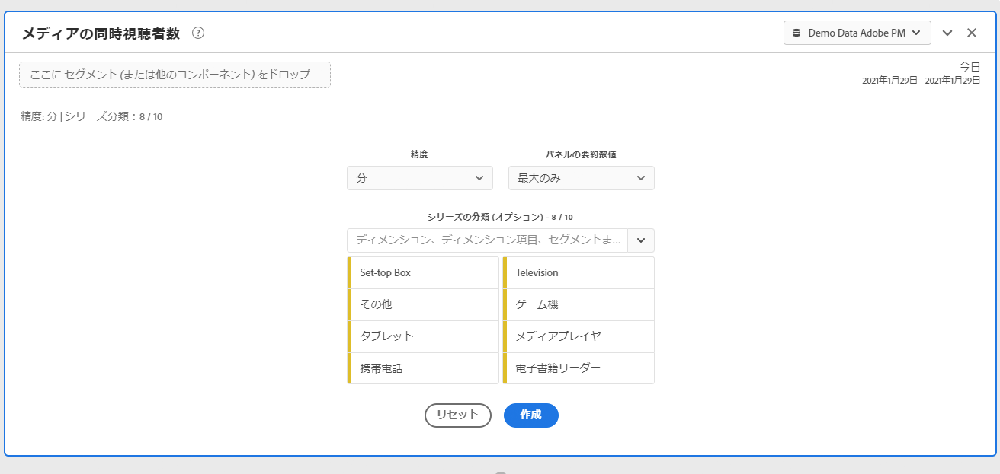
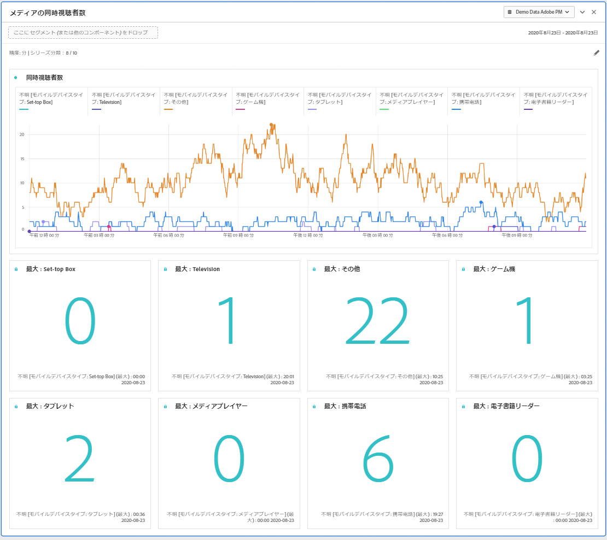
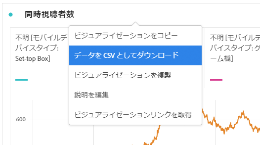

# メディア同時視聴者数パネル {#media-concurrent-viewers-panel}

<!-- markdownlint-disable MD034 -->

>[!CONTEXTUALHELP]
>id="workspace_mediaconcurrentviewers_button"
>title="メディア同時視聴者数"
>abstract="特定の期間の同時視聴者数を分析するパネルを作成します。"

<!-- markdownlint-enable MD034 -->

<!-- markdownlint-disable MD034 -->

>[!CONTEXTUALHELP]
>id="workspace_mediaconcurrentviewers_panel"
>title="メディア同時視聴者数"
>abstract="同時視聴者数の推移を分析し、ピーク時の同時実行を表示して、オプションでセグメント、ディメンション、ディメンション項目または日付範囲を使用して分類および比較します。"

<!-- markdownlint-enable MD034 -->

>[!BEGINSHADEBOX]

_この記事では、この記事の_  _&#x200B;**Adobe Analytics**&#x200B;版の&#x200B;_Customer Journey Analytics_&#x200B;**&#x200B;**&#x200B;_ _ メディア同時視聴者数パネル [&#128279;](https://experienceleague.adobe.com/ja/docs/analytics/analyze/analysis-workspace/panels/media-concurrent-viewers)を参照してください。 メディア同時視聴者数パネル _。

>[!ENDSHADEBOX]

>[!NOTE]
>
>メディア分平均オーディエンスパネルは、Customer Journey Analytics 用ストリーミングメディアコレクションアドオンを購入したお客様のみが使用できます。
>
>詳しくは、アドビ担当営業または販売店か、アドビアカウントチームにお問い合わせください。
>

**[!UICONTROL メディア同時視聴者数]**&#x200B;パネルを使用すると、同時実行のピークの詳細と分類および比較機能を使用して、経時的に同時視聴者を分析できます。

同時閲覧者数を分析して、ピーク同時実行が発生した場所や離脱が発生した場所を把握し、コンテンツと閲覧者エンゲージメントの質に関する貴重なインサイトを得ることができます。 また、容量や規模のトラブルシューティングや計画にも役立ちます。

Analysis Workspace では、同時視聴者数指標は、セッション数にかかわらず、特定の時点におけるメディアストリームを視聴しているユニークユーザー数です。

>[!BEGINSHADEBOX]

デモビデオについて詳しくは、 [メディア同時視聴者数パネル](https://experienceleague.adobe.com/ja/docs/analytics-learn/tutorials/analysis-workspace/using-panels/media-concurrent-viewers-panel-in-analysis-workspace){target="_blank"}を参照してください。

{{videoaa}}

>[!ENDSHADEBOX]

## 使用

**[!UICONTROL メディア同時視聴者数]**&#x200B;パネルを使用するには：

1. **[!UICONTROL メディア同時視聴者数]**&#x200B;パネルを作成します。 パネルの作成方法について詳しくは、[パネルの作成](panels.md#create-a-panel)を参照してください。

1. ストリーミングメディアコレクションから設定されたコンポーネントを含むパネルのデータビューを選択します。

1. パネルの[入力](#panel-input)を指定します。

1. パネルの[出力](#panel-output)を確認します。

### パネル入力

次の入力設定を使用して、メディア同時視聴者数パネルを設定できます。

| 設定 | 説明 |
|---|---|
| **[!UICONTROL パネルの日付範囲]** | パネルの日付範囲のデフォルトは「今日」です。  一度に 1 日または複数の月を表示するように編集できます。   この視覚化は、1440 行のデータに制限されています（例えば、分レベルの粒度で 24 時間）。  日付範囲と精度の組み合わせの結果が 1440 行を超える場合、精度は日付範囲全体に対応するように自動的に更新されます。 |
| **[!UICONTROL 精度]** | 精度のデフォルトは分単位です。 このビジュアライゼーションは、1,440行のデータに制限されています（例えば、分単位の精度で24時間）。  日付範囲と精度の組み合わせの結果が 1440 行を超える場合、精度は日付範囲全体に対応するように自動的に更新されます。 |
| **[!UICONTROL パネルの概要番号]** | 同時視聴者数の日時の詳細を表示するには、概要番号を使用できます。 最大値は、ピーク同時実行性の詳細を示します。 **[!UICONTROL 最小値]**&#x200B;は、トラフの詳細を示します。  パネルのデフォルトでは「最大」のみが表示されますが、「最小」または「最大」と「最小」の両方を表示するように変更できます。  分類を使用している場合は、それぞれに概要番号が表示されます。 |
| **[!UICONTROL シリーズの分類]** | オプションとして、セグメント、ディメンション、ディメンション項目または日付範囲でビジュアライゼーションを分類できます。 一度に 10 行まで表示できます。 分類は 1 つのレベルに制限されます。 ディメンションをドラッグすると、選択したパネルの日付範囲に基づいて、上位のディメンション項目が自動的に選択されます。 日付範囲を比較するには、2 つ以上の日付範囲をシリーズ分類セグメントにドラッグします。 |

次に、**[!UICONTROL 最大のみ]**&#x200B;の概要番号を使用して、**[!UICONTROL 分]**&#x200B;の精度に設定されたパネルの例を示します。 **[!UICONTROL その他]**、**[!UICONTROL テーブル]**、**[!UICONTROL 携帯電話]**、**[!UICONTROL ゲームコンソール]**、**[!UICONTROL メディアプレーヤー]**、**[!UICONTROL セットトップボックス]**、**[!UICONTROL テレビ]**&#x200B;に分類されます。

### パネル出力

メディアの同時視聴者数パネルは、最大および／または最小の同時視聴者数の詳細を含む折れ線グラフと概要番号を返します。  パネルの上部に、選択したパネル設定を示すサマリー行が表示されます。

「」を選択すると、いつでもパネルを編集および再作成できます。

シリーズの分類を選択した場合は、折れ線グラフに線と以下の各項目の概要番号が表示されます。

### データソース

このパネルで使用できる指標は&#x200B;**[!UICONTROL 同時視聴者数]**&#x200B;のみです。

| 指標 | 説明 |
|---|---|
| **[!UICONTROL 同時視聴者数]** | セッション数にかかわらず、特定の時点におけるメディアストリームを視聴しているユニークユーザー数です。 |

このビューでは、フリーフォームテーブルは使用できません。  データソースを表示するには、折れ線グラフビジュアライゼーションのコンテキストメニューからデータソースをダウンロードし、「**[!UICONTROL データを CSV としてダウンロード]**」を選択します。  シリーズの分類が含まれています。

## よくある質問（FAQ）

| 質問 | 回答 |
|---|---|
| フリーフォームテーブルはどこにありますか？ データソースの確認方法を教えてください。 | このビューでは、フリーフォームテーブルは使用できません。  折れ線グラフのコンテキストメニューからデータソースをダウンロードし、「**[!UICONTROL データを CSV としてダウンロード]**」を選択します。 |
| 精度が変更されたのはなぜですか？ | この視覚化は、1440 行のデータに制限されています（例えば、分レベルの粒度で 24 時間）。  日付範囲と精度の組み合わせの結果が 1440 行を超える場合、精度は日付範囲全体に対応するように自動的に更新されます。  広い日付範囲から狭い日付範囲に変更する場合、日付範囲が変更されると、精度は許容できる最小の詳細度に更新されます。 より高い精度を表示するには、パネルを編集して再作成します。 |
| ビデオ名、セグメント、コンテンツタイプなどを比較するにはどうすればよいですか？ | 単一のビジュアライゼーション内でこれらの項目を比較するには、セグメント、ディメンションまたはシリーズ分類セグメント内の特定のディメンション項目をドラッグします。  ビューの分類は 10 個に制限されています。  10 を超える表示を行うには、複数のパネルを使用する必要があります。 |
| 日付範囲の比較方法を教えてください。 | 単一のビジュアライゼーション内の日付範囲を比較するには、2 つ以上の日付範囲をドラッグして、シリーズの分類を使用します。  これらの日付範囲がパネルの日付範囲より優先されます。 |
| ビジュアライゼーションのタイプを変更する方法を教えてください。 | このパネルでは、時系列の線のビジュアライゼーションのみが可能です。 |
| 異常値検出を実行できますか？ | いいえ。  このパネルでは異常値検出は利用できません。 |
| アクティブセッションではなく、ユニークユーザーを使用するのはなぜですか？ | ユニークユーザーを使用すると、（セッションの終了と開始が同時に行われる）番組の境界で不要なスパイクを削除できます。 |
| 同時視聴者数の精度を分単位よりも細かくするとはどういう意味ですか？ | 精度が 1 分を超える場合、同時視聴者数はその時間範囲内のすべての分におけるユニーク同時視聴者数の合計です。  例えば、時間レベルの精度の同時視聴者数は、その時間内のすべての分のユニーク同時視聴者数の合計です。 |
| ワークスペースパネルには、同時視聴者数レポートと同じ情報が表示されますか？ | いいえ。  Analysis Workspace では、同時視聴者数指標は、特定の時点におけるメディアストリームを視聴しているユニークユーザー数として定義されます。 セッション数には関係ありません。  この指標は、同時アクティブセッションを使用する、「レポート」セクションの同時視聴者数レポートとは異なります。 ユニークユーザーを使用すると、（セッションの終了と開始が同時に行われる）番組の境界で不要なピークが削除されます。 |

<!-- For more information about Media Concurrent Viewers, visit [MA doc page]( https://url). -->

>[!MORELIKETHIS]
>
>[&#x200B; パネルを作成](/help/analysis-workspace/c-panels/panels.md#create-a-panel)
>[メディア再生滞在時間パネル](media-playback-time-spent.md)
>[メディア分平均オーディエンスパネル](average-minute-audience-panel.md)
>