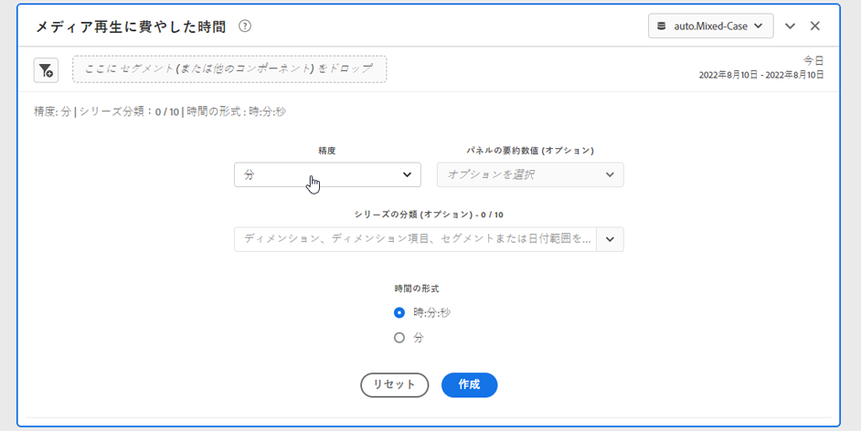

# メディア再生滞在時間パネル {#media-playback-time-spent-panel}

<!-- markdownlint-disable MD034 -->

>[!CONTEXTUALHELP]
>id="workspace_mediaplaybacktimespent_button"
>title="メディア再生滞在時間"
>abstract="様々なレベルの精度でビデオ消費の推移を分析するためのパネルを作成し、分類して比較できます。"

<!-- markdownlint-enable MD034 -->

<!-- markdownlint-disable MD034 -->

>[!CONTEXTUALHELP]
>id="workspace_mediaplaybacktimespent_panel"
>title="メディア再生滞在時間"
>abstract="ビデオ消費の推移を分析し、様々な精度を選択して、オプションでフィルター、ディメンション、ディメンション項目または日付範囲を使用して分類および比較します。"

<!-- markdownlint-enable MD034 -->

>[!BEGINSHADEBOX]

_この記事では、_**Customer Journey Analytics_ のメディア再生滞在時間パネルについて説明します**_。 _この記事の_{AdobeAnalytics[ _**Adobe Analytics](https://experienceleague.adobe.com/en/docs/analytics/analyze/analysis-workspace/panels/media-playback-time-spent) バージョンについては、 メディア再生滞在時間パネル** を参照してください。_

>[!ENDSHADEBOX]

>[!NOTE]
>
>メディア分平均オーディエンスパネルを使用できるのは、Customer Journey Analytics用 Streaming Media Collection アドオンを購入したお客様のみです。
>詳しくは、Adobe営業担当またはAdobe アカウントチームにお問い合わせください。
>

**[!UICONTROL メディア再生滞在時間]** パネルを使用すると、同時実行のピークに関する詳細や、分類機能と比較機能を使用して、時間の経過と共に再生を分析できます。

Analysis Workspaceでの再生滞在時間は、特定の時点でメディアストリームの視聴に費やされた時間です。 これには、一時停止、バッファー、開始までの時間が含まれます。

ストリーミングメディアコレクションアドオンを購入したお客様は、再生滞在時間を分析して、コンテンツの品質と閲覧者のエンゲージメントに関する貴重なインサイトを得ることができます。 また、ボリュームや規模のトラブルシューティングや計画を行う際にも役立ちます。

再生滞在時間は、次の点を理解するのに役立ちます。

* ピーク同時実行性が発生した場所。

* ドロップオフが発生した場所。

>[!BEGINSHADEBOX]

デモビデオについては、[ メディア再生滞在時間 ](https://video.tv.adobe.com/v/338699){target="_blank"} を参照してください。

{{videoaa}}

>[!ENDSHADEBOX]

## 使用

**[!UICONTROL メディア再生滞在時間]** パネルを使用するには：

1. **[!UICONTROL メディア再生滞在時間]** パネルを作成します。 パネルの作成方法について詳しくは、[パネルの作成](panels.md#create-a-panel)を参照してください。

1. ストリーミングメディアコレクションから設定されたコンポーネントを含むパネルのデータビューを選択していることを確認してください。

1. パネルの[入力](#panel-input)を指定します。

1. パネルの[出力](#panel-output)を確認します。

### パネル入力

次の入力設定を使用して、メディア再生滞在時間パネルを設定できます。

| 設定 | 説明 |
|---|---|
| パネルの日付範囲 | パネルの日付範囲のデフォルトは「今日」です。一度に 1 日または複数の月を表示するように編集できます。 この視覚化は、1440 行のデータに制限されています（例えば、分レベルの粒度で 24 時間）。日付範囲と精度の組み合わせの結果が 1440 行を超える場合、精度は自動的に更新され、日付範囲全体に対応します。 |
| 精度 | 精度のデフォルトは「分」です。 この視覚化は、1440 行のデータに制限されています（例えば、分レベルの粒度で 24 時間）。日付範囲と精度の組み合わせの結果が 1440 行を超える場合、精度は自動的に更新され、日付範囲全体に対応します。 |
| パネルの要約数値 | 再生滞在時間の日時の詳細を表示するには、概要番号を使用できます。最大値は、ピーク同時実行性の詳細を示します。最小値は、トラフの詳細を示します。 合計値は、選択範囲に費やした合計再生滞在時間を加算したものです。パネルのデフォルトでは、最大値のみが表示されますが、最小値、合計値、またはこれら 3 つの組み合わせを表示するように変更できます。 内訳を使用している場合は、それぞれの概要番号が表示されます。 |
| シリーズの分類 | オプションとして、フィルター、ディメンション、ディメンション項目または日付範囲でビジュアライゼーションを分類できます。
 - 一度に 10 行まで表示できます。分類は 1 つのレベルに制限されます。

- ディメンションをドラッグすると、選択したパネルの日付範囲に基づいて、上位のディメンション項目が自動的に選択されます。
 - 日付範囲を比較するには、2 つ以上の日付範囲をシリーズ分類フィルターにドラッグします。 |
| 時刻の形式 | 再生滞在時間は、`Hours:Minutes:Seconds` （デフォルト）または `Minutes` （整数で表示され、0.5 で切り上げられます）で表示できます。 |
| 日付順の表示 | 少なくとも 2 つの日付範囲フィルターをシリーズの分類として配置した場合は、オーバーレイ（デフォルト）または順次を選択するオプションが表示されます。 [ オーバーレイ ] では、共通の X 軸の開始を持つ線分が並行して表示され、[ 順次 ] では、特定の X 軸の開始を持つ線分が表示されます。 データが上に並ぶ場合（例えば、フィルター 1 が午後 8:44 で終わり、フィルター 2 が午後 8:45 で始まる場合）、行が順に表示されます。 |

### パネル出力

メディア再生滞在時間パネルは、折れ線グラフと概要番号を返し、再生滞在時間の最大値、最小値および合計（あるいはその両方）の詳細が含まれます。パネルの上部に、選択したパネル設定を示す概要行が表示されます。

 を選択して、いつでもパネルを編集および再構築できます。

シリーズの分類を選択すると、折れ線グラフに線と次の各項目の概要番号が表示されます。

### データソース

このパネルで使用できる唯一の指標は「再生滞在時間」です。

| 指標 | 説明 |
|---|---|
| 再生滞在時間 | 視聴されたコンテンツの合計 `hours:minutes:seconds` （または `minutes`）。選択した精度で、一時停止、バッファー、開始のための時間を含みます。 |

## よくある質問（FAQ）

| 質問 | 回答 |
|---|---|
| フリーフォームテーブルはどこにありますか？ データソースの確認方法を教えてください。 | 

このビューでは、フリーフォームテーブルは使用できません。 データソースをダウンロードするには、折れ線グラフのコンテキストメニューで、CSV ファイルをダウンロードするためのオプションを選択します。
 |
| 
精度が変更されたのはなぜですか？
 | 
この視覚化は、1440 行のデータに制限されています（例えば、分レベルの粒度で 24 時間）。日付範囲と精度の組み合わせの結果が 1440 行を超える場合、精度は日付範囲全体に対応するように自動的に更新されます。

大きい日付範囲から小さい日付範囲に変更する場合、日付範囲が変更されると、精度は許容できる最小の詳細に更新されます。 より高い精度を表示するには、パネルを編集して再構築します。
 |
| 

ビデオ名、フィルター、コンテンツタイプなどの比較方法を教えてください。
 | 
単一のビジュアライゼーション内でこれらを比較するには、フィルター、ディメンションまたはシリーズ分類フィルター内の特定のディメンション項目をドラッグします。

ビューの分類は 10 個に制限されています。 10 を超える表示を行うには、複数のパネルを使用する必要があります。
 |
| 日付範囲の比較方法を教えてください。 | 単一のビジュアライゼーション内の日付範囲を比較するには、2 つ以上の日付範囲をドラッグして、シリーズの分類を使用します。 これらの日付範囲は、パネルの日付範囲より優先されます。 |
| ビジュアライゼーションのタイプを変更する方法を教えてください。 | 

このパネルでは、時系列の線のビジュアライゼーションのみが可能です。
 |
| 異常値検出を実行できますか？ | 

いいえ。このパネルでは異常値検出は利用できません。
 |

>[!MORELIKETHIS]
>
>[パネルの作成](/help/analysis-workspace/c-panels/panels.md#create-a-panel)
>[メディア分平均オーディエンスパネル ](average-minute-audience-panel.md)
>[メディアの同時視聴者数パネル ](media-concurrent-viewers.md)
>
