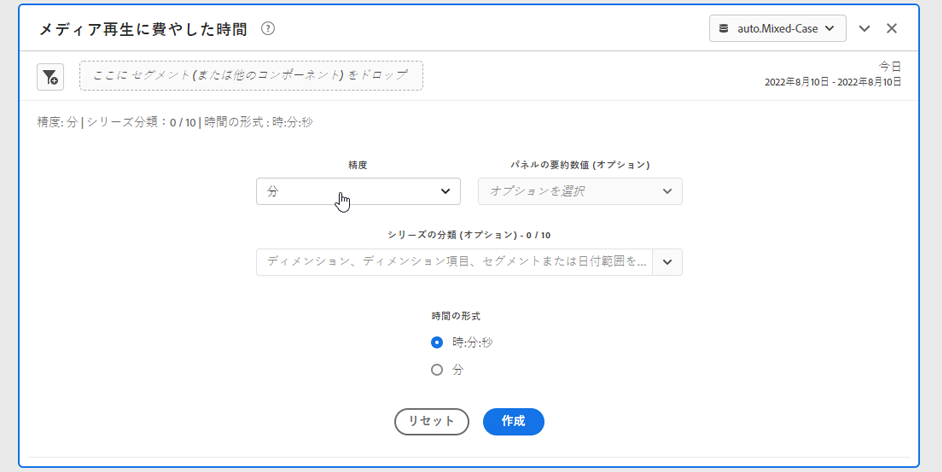

# メディア再生滞在時間パネルの入力と出力 {#Inputs-and-outputs}

次の入出力設定を使用して、メディア再生滞在時間パネルをカスタマイズできます。

## パネル入力 {#Input}

次の入力設定を使用して、メディア再生滞在時間パネルを設定できます。

| 設定 | 説明 |
|---|---|
| パネルの日付範囲 | パネルの日付範囲のデフォルトは「今日」です。一度に 1 日または複数の月を表示するように編集できます。 この視覚化は、1440 行のデータに制限されています（例えば、分レベルの粒度で 24 時間）。日付範囲と精度の組み合わせの結果が 1440 行を超える場合、精度は自動的に更新され、日付範囲全体に対応します。 |
| 精度 | 精度のデフォルトは「分」です。 この視覚化は、1440 行のデータに制限されています（例えば、分レベルの粒度で 24 時間）。日付範囲と精度の組み合わせの結果が 1440 行を超える場合、精度は自動的に更新され、日付範囲全体に対応します。 |
| パネルの要約数値 | 再生滞在時間の日時の詳細を表示するには、概要番号を使用できます。最大値は、ピーク同時実行性の詳細を示します。最小値は、トラフの詳細を示します。 合計値は、選択範囲に費やした合計再生滞在時間を加算したものです。パネルのデフォルトでは、最大値のみが表示されますが、最小値、合計値、またはこれら 3 つの組み合わせを表示するように変更できます。 内訳を使用している場合は、それぞれの概要番号が表示されます。 |
| シリーズの分類 | オプションとして、セグメント、ディメンション、ディメンション項目または日付範囲でビジュアライゼーションを分類できます。
 - 一度に 10 行まで表示できます。分類は 1 つのレベルに制限されます。

 - ディメンションをドラッグすると、選択したパネルの日付範囲に基づいて、上位のディメンション項目が自動的に選択されます。
 - 日付範囲を比較するには、2 つ以上の日付範囲をシリーズ分類フィルターにドラッグします。 |
| 時刻の形式 | 再生滞在時間は、時:Minutes:秒（デフォルト）または分（整数で表示され、四捨五入されます）で表示できます。 |
| 日付順の表示 | 少なくとも 2 つの日付範囲セグメントをシリーズ分類として配置した場合は、オーバーレイ（デフォルト）または順次を選択するオプションが表示されます。オーバーレイでは、共通の X 軸の開始を持つ線が並行して表示され、順次では、特定の X 軸の開始を持つ線が表示されます。データが上に並ぶ場合（例えば、セグメント 1 が午後 8:44 で終わり、セグメント 2 が午後 8:45 で始まる場合）、行が順に表示されます。 |

### デフォルトのビュー

## パネル出力 {#Output}

メディア再生滞在時間パネルは、折れ線グラフと概要番号を返し、再生滞在時間の最大値、最小値および合計（あるいはその両方）の詳細が含まれます。パネルの上部に、選択したパネル設定を示す概要行が表示されます。

右上の編集鉛筆アイコンをクリックすると、いつでもパネルを編集および再構築できます。

シリーズの分類を選択した場合は、折れ線グラフに線と次の各項目の概要番号が表示されます。

### データソース

このパネルで使用できる唯一の指標は「再生滞在時間」です。

| 指標 | 説明 |
|---|---|
| 再生滞在時間 | 視聴されたコンテンツの合計（時:minutes:秒または分）。選択した精度で、一時停止、バッファー、開始のための時間を含みます。 |
