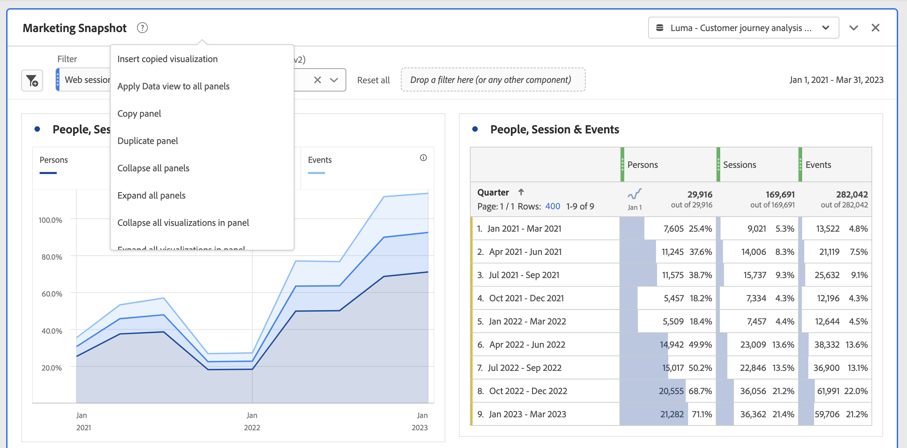

# パネルの概要

[!UICONTROL パネル] は、テーブルとビジュアライゼーションのコレクションです。パネルには、Workspace の左上のアイコンまたは [空欄パネル](/help/analysis-workspace/c-panels/blank-panel.md). パネルは、期間、データビュー、分析ユースケースに従ってプロジェクトを整理する場合に役立ちます。

## パネルタイプ

[!UICONTROL Customer Journey Analytics] の Analysis Workspace では、次のパネルタイプを使用できます。

| パネル名 | 説明 |
| --- | --- |
| [空のパネル](/help/analysis-workspace/c-panels/blank-panel.md) | 使用可能なパネルおよびビジュアライゼーションから選択し、分析を開始します。 |
| [クイックインサイトパネル](quickinsight.md) | フリーフォームテーブルとそれに伴うビジュアライゼーションを素早く作成し、インサイトを迅速に分析して取得できます。 |
| [アトリビューションパネル](attribution.md) | 任意のディメンションとコンバージョン指標を使用して、アトリビューションモデルをすばやく比較および視覚化します。 |
| [フリーフォームパネル](freeform-panel.md) | 無制限の比較および分類を実行し、ビジュアライゼーションを追加して豊かなデータのストーリーを示します。 |
| [メディアの同時視聴者数パネル](media-concurrent-viewers.md) | 同時実行のピークの詳細と分類および比較機能を使用して、経時的に同時視聴者を分析します。 |
| [メディア再生滞在時間パネル](media-playback-timespent/media-playback-time-spent.md) | 再生に費やした時間を分析して、同時実行のピークが発生した場所やドロップオフが発生した場所を把握します。 |

分析を開始するるには、[!UICONTROL クイックインサイト]パネル、[!UICONTROL 空白]パネル、[!UICONTROL フリーフォーム]パネルが最適です。一方、[!UICONTROL Attribution IQ] は、より高度な分析に適しています。プロジェクトでは `"+"` ボタンが使用できるので、いつでも空白のパネルを追加できます。

デフォルトの開始パネルは[!UICONTROL フリーフォーム]パネルですが、[空白パネル](/help/analysis-workspace/c-panels/blank-panel.md)をデフォルトにすることも可能です。

## カレンダー {#calendar}

パネルカレンダーは、パネル内のテーブルおよびビジュアライゼーションのレポート範囲を制御します。

メモ：テーブル、ビジュアライゼーション、パネルドロップゾーン内で（紫色の）日付範囲コンポーネントを使用すると、パネルカレンダーが上書きされます。

パネルカレンダーの詳細設定で、分レベルの日付範囲を適用できます。何日にもわたる日付範囲でレポートを作成する場合、開始時刻は最初の日、終了時刻は範囲の最終日に適用されます。

## ドロップゾーン {#dropzone}

パネルドロップゾーンを使用すると、パネル内のすべてのテーブルとビジュアライゼーションにフィルターとドロップダウンフィルターを適用できます。1 つのパネルに 1 つまたは複数のフィルターを適用できます。各フィルターの上のタイトルは、編集（鉛筆）マークをクリックすることで変更できます。また、右クリックして削除することもできます。

### フィルター

パネルのドロップゾーンに左のパネルからフィルターをドラッグ＆ドロップして、パネルのフィルター処理を開始します。

### アドホックフィルター

フィルター以外のコンポーネントをドロップゾーンに直接ドラッグしてアドホックフィルターを作成することもできるので、フィルタービルダーへの移行にかかる時間と手間を節約できます。この方法で作成されたフィルターは、イベントレベルのフィルターとして自動的に定義されます。 この定義を変更するには、フィルターの横にある情報アイコン（i）、鉛筆の形をした編集アイコンの順にクリックし、フィルタービルダーで編集します。

アドホックフィルターはクイックフィルターの一種で、プロジェクトのローカルフィルターです。 公開しない限り、左側のパネルに表示されません。

詳しくは、 [クイックフィルター](/help/components/filters/quick-filters.md).

### 静的ドロップダウンフィルター

ドロップダウンフィルターを使用すると、データを制御された方法で操作できます。 例えば、モバイルデバイスタイプにドロップダウンフィルターを追加すると、タブレット、携帯電話、デスクトップ別にパネルをフィルタリングできます。

ドロップダウンフィルターを使用して、多くのプロジェクトを 1 つに統合することもできます。例えば、同じプロジェクトに異なる国フィルターが適用された複数のバージョンがある場合、すべてのバージョンを 1 つのプロジェクトに統合して「国」ドロップダウンフィルターを追加できます。

静的ドロップダウンフィルターを作成するには：

* ディメンション項目を使用するドロップダウンフィルターの場合は、左パネルで目的のディメンションの横にある右矢印アイコンをクリックします。 このアクションを実行すると、使用可能なすべてのディメンション項目が表示されます。 次を使用して、このリストから複数のディメンション項目を選択 `[Shift + Click]` または `[Ctrl + Click]`をクリックし、パネルドロップゾーンにドロップします。 **保持しながら`[Shift]`**.
* 指標、フィルター、日付範囲など、他のコンポーネントを使用するドロップダウンフィルターの場合は、 `[Shift + Click]` または `[Ctrl + Click]`. パネルドロップゾーンに選択をドロップします **保持しながら`[Shift]`**. このコンテキストでは、すべてのコンポーネントタイプがフィルターとして扱われます。
* 1 つのドロップダウンフィルターに含めることができるコンポーネントタイプは 1 つだけです。 選択範囲に複数のコンポーネントタイプを含める場合、コンポーネントタイプごとに個別のドロップダウンフィルターが作成されます。 例えば、選択範囲に指標とディメンション項目の両方を含めると、2 つの異なるドロップダウンフィルターが作成されます。 1 つのドロップダウンフィルターにはディメンション項目が含まれ、もう 1 つには指標が含まれます。

ドロップダウンリストからオプションの 1 つを選択して、パネル内のデータを変更します。 また、「 **[!UICONTROL フィルターなし]**.

ドロップダウンフィルターを右クリックすると、次のオプションが表示されます。

* **[!UICONTROL ラベルを追加]**:プロジェクトにドロップダウンフィルターを追加すると、コンポーネント名にラベルが自動的に設定されます。 ラベルを削除した場合は、このオプションを使用して再度追加できます。
* **[!UICONTROL ラベルを削除]**:ドロップダウンフィルターの上のテキストを削除します。
* **[!UICONTROL ドロップダウンフィルターを削除]**:パネルからドロップダウンフィルターを削除します。

プロジェクトにドロップダウンフィルターを追加する方法について詳しくは、[ビデオをご覧ください](https://experienceleague.adobe.com/docs/analytics-learn/tutorials/analysis-workspace/using-panels/using-panels-to-organize-your-analysis-workspace-projects.html?lang=ja)。

### 動的ドロップダウンフィルター

動的ドロップダウンフィルターを使用すると、パネルのレポート範囲内のデータと、他のドロップダウンフィルターの値に基づいて、使用可能な値を決定できます。 例えば、国ディメンションと市区町村ディメンションを使用して、2 つの動的なドロップダウンを作成できます。 UICONTROL 国ドロップダウンリストから国を選択すると、市区町村ドロップダウンリストは動的に調整され、その国内の市区町村のみが表示されます。

この同じ概念は、すべてのディメンションに適用されます。パネルの日付範囲および選択したフィルター内に表示されるディメンション項目のみが表示されます。 静的ドロップダウンフィルターで選択したDimension項目は、動的ドロップダウンフィルターで使用できる値に影響します。 しかし、逆は真ではありません。動的ドロップダウンフィルターで選択したDimension項目は、静的ドロップダウンフィルターで使用できる値には影響しません。

将来収集される特定のディメンション項目が予想される場合は、ディメンション項目の手動選択を使用できます。 また、動的ドロップダウンフィルターをクリアして、値が含まれないようにすることもできます。そのため、他の動的ドロップダウンフィルターにより多くの値を含めることができます。 選択 **[!UICONTROL すべてクリア]** をクリックして、そのパネルのすべてのドロップダウンフィルターから選択をクリアします。

動的ドロップダウンフィルターを作成するには：

* 単一のディメンションをパネルドロップゾーンにドラッグ&amp;ドロップします **保持しながら`[Shift]`**.
* 動的ドロップダウンフィルターは、指標、フィルターまたは日付範囲では使用できません。
* ドロップダウンフィルターを右クリックし、「 」を選択します。 **[!UICONTROL フィルターを削除]** をクリックして削除します。

動的ドロップダウンフィルターを右クリックすると、静的ドロップダウンフィルターと同じオプションが表示されます。

## 右クリックメニュー {#right-click}

パネルの追加機能は、パネルのヘッダーを右クリックすると使用できます。

次の設定があります。

| 設定 | 説明 |
| --- | --- |
| [!UICONTROL コピーしたパネル／ビジュアライゼーションを挿入] | コピーしたパネルやビジュアライゼーションをプロジェクト内の別の場所、または別のプロジェクトに貼り付け（「挿入」）できます。 |
| [!UICONTROL パネルをコピー] | 右クリックしてパネルをコピーし、プロジェクト内の別の場所に挿入したり、別のプロジェクトに挿入したりできます。 |
| [!UICONTROL パネルを複製] | 現在のビジュアライゼーションの完全な複製を作成して、修正できます。 |
| [!UICONTROL すべてのパネルを折りたたむ／展開] | すべてのプロジェクトパネルを折りたたんだり展開したりします。 |
| [!UICONTROL パネル内のすべてのビジュアライゼーションを折りたたむ／展開] | 現在のパネル内のすべてのビジュアライゼーションを折りたたんだり展開したりします。 |
| [!UICONTROL 説明を編集] | パネルの説明テキストを追加（または編集）します。 |
| [!UICONTROL パネルリンクを取得] | プロジェクト内の特定のパネルに他のユーザーを誘導できます。受信者は、リンクをクリックした後、リンク先の正確なパネルにリダイレクトされる前にログインする必要があります。 |
