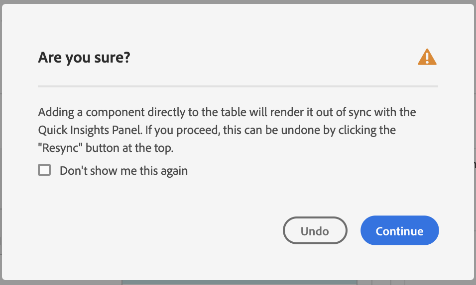

# クイックインサイトパネル

[!UICONTROL クイックインサイト]は、アナリスト以外のユーザーおよび [!UICONTROL Analysis Workspace] の新規ユーザーに対して、ビジネスの質問にすばやく簡単に答える方法を学ぶためのガイダンスを提供します。また、テーブルを自分で作ることなく、簡単な質問にすばやく答えたいと考える上級ユーザーにとっても優れたツールです。

この [!UICONTROL Analysis Workspace] を初めて使用する際に、どのビジュアライゼーションが最も役立つか、どのディメンションと指標がインサイトを促進するか、項目をドラッグ＆ドロップする場所、フィルターを作成する場所などを知りたいと思うかもしれません。

これを支援するために、[!UICONTROL クイックインサイト]では、[!UICONTROL Analysis Workspace] での会社のデータコンポーネント使用状況に応じて、会社が最もよく使用するディメンション、指標、フィルターおよび日付範囲を表示するアルゴリズムを活用します。実際、以下に示すように、ドロップダウンリストには、「[!UICONTROL 人気]」とタグ付けされたディメンション、指標およびフィルターが表示されます。

[!UICONTROL クイックインサイト]：

* データテーブルと付属のビジュアライゼーションを [!UICONTROL Analysis Workspace] で適切に構築できます。
* [!UICONTROL Analysis Workspace] の基本的なコンポーネントやパーツに関する用語と語彙を学びます。
* ディメンションの簡単な分類を行ったり、複数の指標を追加したり、[!UICONTROL フリーフォームテーブル]内でフィルターを容易に比較したりできます。
* 様々なビジュアライゼーションタイプを変更または試して、分析の検索ツールをすばやく直感的に見つけます。

## 基本的な主要用語

以下に、理解する必要がある基本用語の一部を示します。各データテーブルは、データストーリーを伝えるために使用する 2 つ以上の構築要素（コンポーネント）で構成されています。

| 構築要素（コンポーネント） | 定義 |
|---|---|
| [!UICONTROL ディメンション] | ディメンションは、プロジェクトで表示、分類、比較できる指標データの説明または特性です。ディメンションは、ディメンション項目に分類される数以外の値および日付です。例えば、「ブラウザー」や「ページ」はディメンションです。 |
| [!UICONTROL ディメンション項目] | ディメンション項目は、ディメンションの個々の値です。例えば、ブラウザーディメンションのディメンション項目は、「Chrome」、「Firefox」、「Edge」などです。 |
| [!UICONTROL 指標] | 指標は、ビュー数、クリックスルー数、リロード数、平均滞在時間、数量、注文件数、売上高など、人物のアクティビティに関する量的な情報です。 |
| [!UICONTROL ビジュアライゼーション] | Workspace には、棒グラフ、ドーナツグラフ、ヒストグラム、折れ線グラフ、マップ、散布図など、データを視覚的に表現する[様々なビジュアライゼーション](/help/analysis-workspace/visualizations/freeform-analysis-visualizations.md)があります。 |
| [!UICONTROL ディメンションの分類] | ディメンションの分類は、ディメンションを他のディメンションで逐語的に分類する方法です。この例では、米国の州をモバイルデバイスで分類してモバイルデバイスの訪問回数を州別に取得したり、モバイルデバイスをモバイルデバイスタイプ別、地域別、内部キャンペーン別に分類したりできます。 |
| [!UICONTROL フィルター] | フィルターを使用すると、特性や web サイトでのインタラクションに基づいて人物のサブセットを特定できます。例えば、属性（ブラウザーのタイプ、デバイス、訪問回数、国、性別）、インタラクション（キャンペーン、キーワード検索、検索エンジン）、出口と入口（Facebook からの人物、定義済みのランディングページ、参照ドメイン）、カスタム変数（フォームフィールド、定義済みカテゴリ、顧客 ID）に基づいて、[!UICONTROL 訪問者]フィルターを作成できます。 |

## クイックインサイトの基本を学ぶ

1. 提供された資格情報を使用して、Customer Journey Analytics にログインします。
1. 「[!UICONTROL Workspace]」に移動し、「**[!UICONTROL 新規プロジェクトを作成]**」をクリックして、「**[!UICONTROL クイックインサイト]**」をクリックします（このパネルには、左側のパネルの&#x200B;**[!UICONTROL パネル]**&#x200B;メニューからもアクセスできます）。

   

   

1. 最初に使用する際には、[!UICONTROL クイックインサイトパネル]の基本について説明する短いチュートリアルに従ってください。または、クリックして&#x200B;**[!UICONTROL チュートリアルをスキップ]**&#x200B;します。
1. ディメンション（オレンジ色）、指標（緑色）、フィルター（青色）、日付範囲（紫色）のいずれかの構築要素（コンポーネントとも呼ばれる）を選択します。自動的に作成されるテーブルに対して、少なくとも 1 つのディメンションと 1 つの指標を選択する必要があります。

   

   構築要素を選択する方法は 3 つあります。
   * データセットを左側のパネルからドラッグ＆ドロップします。
   * 何をしたいかがわかっている場合は、入力を始めれば[!UICONTROL クイックインサイト]が空白を埋めます。
   * ドロップダウンをクリックし、リストを検索します。

1. 少なくとも 1 つのディメンションと 1 つの指標を追加すると、以下の情報が作成されます。

   * ディメンション（ここでは US States）が垂直方向に、指標（ここでは Visits）が上部に水平方向に表示されたフリーフォームテーブル。以下の表を確認してください。

   

   * 付属のビジュアライゼーション（この場合は[棒グラフ](/help/analysis-workspace/visualizations/bar.md)）。生成されるビジュアライゼーションは、テーブルに追加したデータのタイプに基づいています。時間ベースのデータ（日別／月別の[!UICONTROL 訪問回数]など）は、デフォルトで[!UICONTROL 折れ線]グラフになります。時間ベースでないデータ（[!UICONTROL デバイス]ごとの[!UICONTROL 訪問回数]）は、デフォルトで[!UICONTROL 棒グラフ]になります。ビジュアライゼーションのタイプを変更するには、ビジュアライゼーションのタイプの横にあるドロップダウン矢印をクリックします。

1. （オプション）ディメンションの横にある右矢印をクリックすることで、ディメンションを掘り下げて、ディメンション項目を表示します。

1. 後述の「その他のヒント」の説明に従って、さらに絞り込みを追加してみてください。

1. **[!UICONTROL プロジェクト／保存]**&#x200B;をクリックして、プロジェクトを保存します。

## その他のヒント

他の便利なヒントは、[!UICONTROL クイックインサイトビルダー]に表示されます。ヒントの中には、最後のアクションに応じて表示されるものもあります。

* 最初に、**[!UICONTROL その他のヒント]**&#x200B;のチュートリアルに「ヘルプ」からアクセスして、完了します。[!UICONTROL クイックインサイト]タイトルの横のアイコンこのチュートリアルは、少なくとも 1 つのディメンションと 1 つの指標を持つプロジェクトを作成してから 24 時間後に表示されます。

  

* **分類基準**：ディメンションで最大 3 レベルの分類を使用して、本当に必要なデータに掘り下げることができます。

  

* **その他の指標を追加**：AND 演算子を使用してテーブルに追加することで、さらに最大 2 つの指標を追加できます。

  

* **その他のフィルターを追加**：AND または OR 演算子を使用してテーブルに追加することで、さらに最大 2 つのフィルターを追加できます。「Mobile Users OR Loyal Visitors」を追加したら、表がどうなるかを見てみると、指標の上で、お互いに隣り合っています。「Mobile Users AND Loyal Visitors」を追加すると、両方のフィルターの結果が一緒に表示され、表内で各フィルターが重なって表示されます。

  

## 既知の制限事項

テーブル内で直接編集しようとすると、[!UICONTROL クイックインサイト]パネルが同期されなくなります。パネルの右上にある「**[!UICONTROL ビルダーを再同期]**」をクリックすると、[!UICONTROL クイックインサイト]を以前の設定に戻すことができます。

何かを直接テーブルに追加する前に、以下の警告が表示されます。

そうしないと、直接作成したテーブルは、従来のフリーフォームテーブルとして動作し、新規ユーザーにとって役立つ機能が使用できなくなります。
