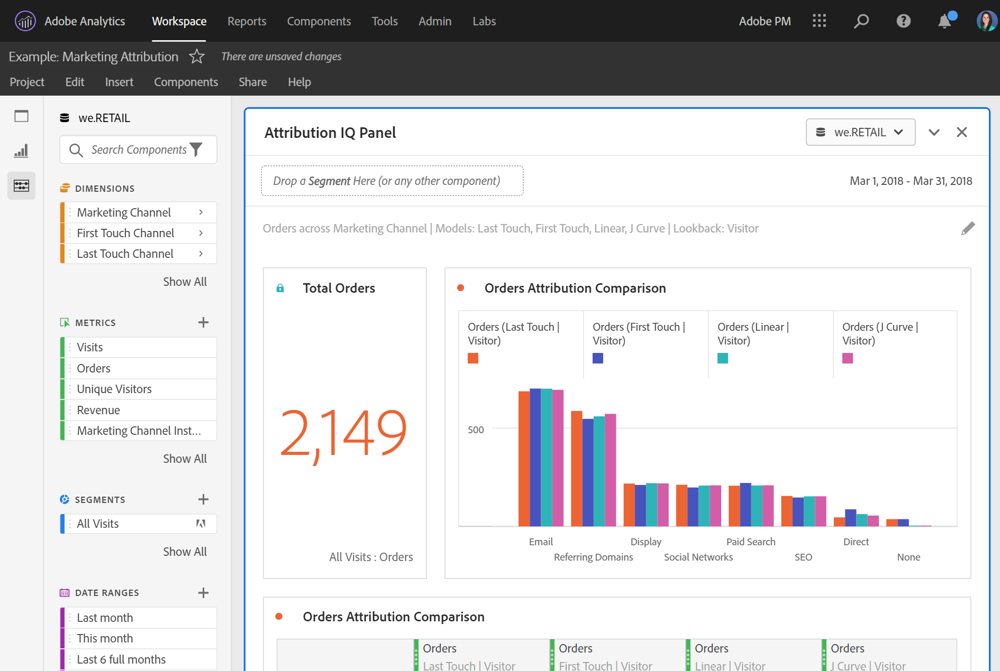

# プロジェクトのキュレーション

キュレーションを使用すると、プロジェクトを共有する前にコンポーネント（ディメンション、指標、フィルター、日付範囲）を制限できます。 受信者がプロジェクトを開くと、キュレーションされたコンポーネントの制限付きセットが表示されます。キュレーションはオプションですが、プロジェクトを共有する前に行うことをお勧めします。

>[!NOTE]
> 製品プロファイルは、ユーザーに表示されるコンポーネントを管理する主要メカニズムです。これらは、[Adobe Experience CloudAdmin Console](https://experienceleague.adobe.com/docs/core-services/interface/manage-users-and-products/admin-getting-started.html)を通じて管理されます。 キュレーションはセカンダリフィルターです。

## プロジェクトキュレーションの適用

1. **[!UICONTROL 共有]**／**[!UICONTROL プロジェクトデータをキュレート]** をクリックします。
プロジェクトで使用されるコンポーネントが自動的に追加されます。
1. （オプション）他のコンポーネントを追加するには、共有するコンポーネントを左側のレールから「[!UICONTROL コンポーネントをキュレーション ]」フィールドにドラッグします。
1. 「**[!UICONTROL 完了]**」をクリックします。

キュレーションは、[!UICONTROL 共有]メニューで「**[!UICONTROL キュレーションと共有]**」をクリックして適用することもできます。このオプションは、プロジェクト内で使用されているコンポーネントに合わせて、プロジェクトを自動的にキュレーションします。上記の手順に従って、追加のコンポーネントを追加できます。

## キュレーションされたプロジェクトの表示

キュレーションされたプロジェクトを受信者が開くと、ユーザーには、定義したキュレーション済みのコンポーネントのセットのみが表示されます。

## プロジェクトキュレーションの削除

プロジェクトのキュレーションを削除し、左側のレールのコンポーネントの完全なセットを復元するには：

1. **[!UICONTROL 共有]**／**[!UICONTROL プロジェクトデータをキュレート]**&#x200B;をクリックします。
1. 「**[!UICONTROL キュレーションを削除]**」をクリックします。
1. 「**[!UICONTROL 完了]**」をクリックします。

## コンポーネントのキュレーションオプション

キュレーションされたプロジェクトでは、受信者に、左側のレールに「**[!UICONTROL すべての]**&#x200B;コンポーネントを表示」オプションが表示されます。 「[!UICONTROL すべてを表示]」は、以下に応じて異なるコンポーネントセットを表示します。

* ユーザーの権限レベル（管理者／非管理者）
* プロジェクトの役割（所有者／編集者／その他）
* 適用されるキュレーションのタイプ（プロジェクトレベル）

| キュレーションのタイプ | 管理者は、 | 管理者以外のプロジェクト所有者（またはロールの編集）は、 | 管理者以外の重複ロールは、 |
| --- | --- | --- | --- |
| **データビューから「非表示」になるコンポーネント** | レポートに使用できるすべてのデータビューコンポーネント（非表示のコンポーネントでは、「すべて表示」をクリックする必要があります） | レポートには使用できません | レポートには使用できません |
| **データビューに追加または削除されたコンポーネント** | データビューに追加されたコンポーネントのみ（非表示または非表示になっていない）。 管理者は、データビューで定義されていないフィールドやコンポーネントに関するレポートを作成できません。 | データビューに追加されたコンポーネント、またはユーザーが所有または共有したコンポーネントのみ。 非表示のコンポーネントは使用できません（VRSキュレーションなど）。 | DVに追加されたコンポーネントのみが非表示にならず、プロジェクトキュレーションに含まれています。 |
| **プロジェクト内のキュレーションされたコンポーネント** | レポートに使用できるすべてのデータビューコンポーネント（非表示のコンポーネントでは、「すべて表示」をクリックする必要があります） | 非表示以外のすべてのデータビューコンポーネント（「すべて表示」のクリックが必要） | キュレーションされたコンポーネントと、ユーザーが所有または共有しているコンポーネントのみ |
| **非表示のコンポーネントを含むデータビューを使用する、キュレーションされたプロジェクト** | レポートに使用できるすべてのデータコンポーネント（非表示およびキュレーションされていないコンポーネントでは、「すべて表示」をクリックする必要があります） | キュレーションされていないすべてのプロジェクトコンポーネント、非表示でないすべてのデータビューコンポーネント、およびユーザーが所有または共有する任意のコンポーネント | キュレーションされたコンポーネントのみ、さらにユーザーが所有または共有するコンポーネント |
