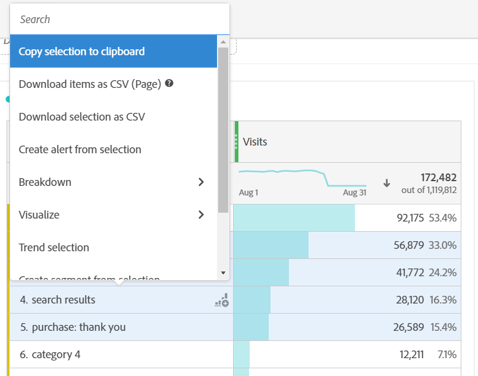

# PDF ファイルまたは CSV ファイルのダウンロード

>[!NOTE]
>
>Customer Journey Analytics 内の Analysis Workspace に関するドキュメントを表示しています。この機能セットは、[従来の Adobe Analytics の Analysis Workspace](https://experienceleague.adobe.com/docs/analytics/analyze/analysis-workspace/home.html) とは少し異なります。[詳細情報...](/help/getting-started/cja-aa.md)

Analysis Workspace からデータをエクスポートする方法は、ツール以外で分析するデータのセットと、その情報を受け取る必要があるユーザーに応じて異なります。エクスポートされたデータは、コピーされたデータの形式、CSV、PDF ファイルにすることができます。通常、ファイルにビジュアライゼーションを含める場合は PDF をお勧めします。プレーンテキストデータを含める場合は CSV（またはコピーしたデータ）をお勧めします。

## プロジェクトを CSV または PDF 形式でダウンロード {#download-project}

**[!UICONTROL プロジェクト／PDF（または CSV）形式でダウンロード]**&#x200B;に移動して、完全なプロジェクトをダウンロードできます。ダウンロードしたファイルには、プロジェクト内に表示されているすべてのテーブルとビジュアライゼーションが含まれています。ファイルにビジュアライゼーションを含める場合は PDF をお勧めしますが、プレーンテキストデータを含める場合は CSV が適しています。

プロジェクトをダウンロードする場合は、次の点に注意してください。

* プロジェクトのダウンロードを要求すると、プロジェクトは保存済みまたは未保存になる場合があります。ただし、[スケジュール](https://experienceleague.adobe.com/docs/analytics/analyze/analysis-workspace/curate-share/t-schedule-report.html)できるのは、保存したプロジェクトだけです。
* PDF 形式でレンダリングする前に Adobe サーバーでプロジェクトが再実行されるので、ブラウザーでダウンロードした PDF は、書き出しに数分かかる場合があります。PDF がブラウザーでダウンロードされるまで、プロジェクトを終了しないことをお勧めします。ただし、待っている間も引き続きプロジェクトに変更を加えることができます。PDF のレンダリングに 5 分以上かかる場合は、代わりに電子メールで送信するよう求められます。
* PDF ダウンロードは、ページ番号が適用されない単一ページとしてレンダリングされます。
* プロジェクトが PDF にレンダリングされると、ページ上の内容がレンダリングされます。プロジェクトにカスタムサイズのビジュアライゼーションとパネルが含まれている場合、内容が切り詰められないように、自動サイズに変更する必要があります（右上隅のボタン）。

## データをクリップボードにコピー（ホットキー：Ctrl+C）{#copy-data}

右クリックオプション&#x200B;**[!UICONTROL クリップボードにコピー]**&#x200B;を使用すると、Workspace からデータをすばやくコピーして他の場所に貼り付けることができます。

* 表示されたテーブルをコピーする場合は、テーブルのヘッダーを右クリックし、「**データをクリップボードにコピー**」を選択します。
* データのサブセットをコピーする場合は、テーブル内に選択範囲を作成し、右クリックして、「**選択範囲をクリップボードにコピー**」を選択します。

また、ホットキー `Ctrl+C` は、選択した内容をクリップボードにコピーします。コピーが完了したら、別のツールに移動して、情報を貼り付けることができます（または `Ctrl+V` を押します）。

## データを CSV としてダウンロード {#download-data}

右クリックオプション「**[!UICONTROL データを CSV 形式でダウンロード]**」を使用すると、データのテーブルまたはビジュアライゼーションのデータソースを CSV としてダウンロードできます。

* 任意のテーブルまたはビジュアライゼーションのヘッダーで、「**[!UICONTROL データを CSV 形式でダウンロード]**」を右クリックします。これにより、テーブルに表示されたデータやビジュアライゼーションの基になるデータソースが CSV 形式でダウンロードされます。注意：マップのビジュアライゼーションは、このオプションをサポートしていません。
* テーブル内で選択が行われた場合、このオプションでは「**[!UICONTROL 選択内容を CSV 形式でダウンロード]**」と表示されます。 このオプションを選択した項目のみがダウンロードされます。表示されているテーブル全体ではダウンロードされません。

## 項目を CSV としてダウンロード {#download-items}

テーブルに表示される 400 行を超えるデータを分析する場合は、テーブルのヘッダーまたは行を右クリックし、「**項目を CSV 形式でダウンロード（ディメンション名）**」を選択します。このオプションでは、フィルターとフィルターが適用された状態で、選択したディメンションに対して最大50,000個のディメンション項目（テーブルの並べ替えに基づく）をエクスポートします。 テーブルの上部からこのオプションを選択した場合、テーブルの最初のディメンションがエクスポートされます。 フリーフォームテーブルに制限は適用されませんが、最適なパフォーマンスを確保するために、「項目をダウンロード」オプションを 20 列未満のテーブルで使用することをお勧めします。

>[!TIP]
>
> ディメンションが 50,000 項目を超える場合は、異なる並べ替え指標が適用されたファイルをダウンロードするか、フィルターを適用します。例えば、あるダウンロードでは訪問回数の降順で並べ替え、2 回目のダウンロードでは訪問回数の昇順で並べ替えます。この説明は、ロングテールの項目を取得するのに役立ちます。

プロジェクト内で複数のタスクを使用できます。また、ダウンロードの処理中に、同じタブで新しい Workspace プロジェクトに移動することもできます。新しいブラウザータブを開くと、ダウンロードは一時停止します。 Workspace を完全に終了するか、ブラウザータブを閉じると、ダウンロードはキャンセルされます。

### ダウンロードした項目ファイル

このテーブルの機能は、次のようにダウンロードされたファイルに適用されます。

* すべてのパネルフィルターがフィルターとして適用されます。
* テーブルで選択されたディメンションの&#x200B;**上**&#x200B;の分類は、各列よりも上のフィルターとして適用されます。
* テーブル内で選択されたディメンションよりも&#x200B;**下**&#x200B;の分類は削除されます。

上の例では、ページ項目が、パネルフィルター（新規訪問者顧客）と上記のコンポーネント（マーケティングチャネル= Eメール）をフィルターとして適用し、下記のコンポーネント（モバイルデバイスタイプ）をダウンロードしたCSVから削除します。

### ダウンロード通知

ファイルがダウンロードされると、進行状況を示す情報通知が表示されます。 「**[!UICONTROL ダウンロードをキャンセル]**」をクリックすると、いつでもダウンロードをキャンセルできます。 トーストを閉じても、ダウンロードは&#x200B;**キャンセルされませんt**。

ファイルが完了すると、完了通知が表示され、ファイルがブラウザーにダウンロードされます。

一度に複数のダウンロードをリクエストすると、前のダウンロードが完了するまで、後続の各ダウンロードはキューに追加されるという通知が届きます。

## FAQ {#faq}

| 質問 | 回答 |
| --- | --- |
| ダウンロードした PDF が 1 ページになるのはなぜですか？ | 現時点では、Workspace でダウンロードされた PDF にページ番号は付けられません。 |
| 「アイテムを CSV 形式でダウンロード」オプションを使用して 50,000 個を超えるアイテムを書き出すことはできますか？ | 各ダウンロードには最大 50,000 個のディメンションアイテムを含めることができますが、テーブルの種類を変更してテールがより長いアイテムを取得したり、フィルターを適用して特定のアイテムをダウンロードしたりできます。 |
| 「**[!UICONTROL ビジュアライゼーションをコピー]**」は何を実行しますか？ | 「**[!UICONTROL ビジュアライゼーションをコピー]**」はエクスポートオプションではありません。Workspace 内のある場所から別の場所にビジュアライゼーションまたはパネルをコピーできます。 例えば、同じプロジェクト内のパネル間、またはプロジェクト間でコピーできます。[内部リンクビデオ](https://experienceleague.adobe.com/docs/analytics-learn/tutorials/analysis-workspace/visualizations/intra-linking-in-analysis-workspace.html) |
