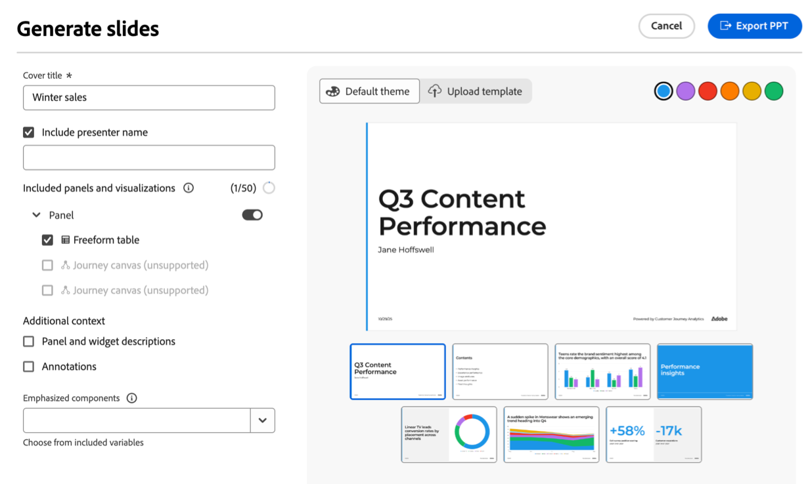
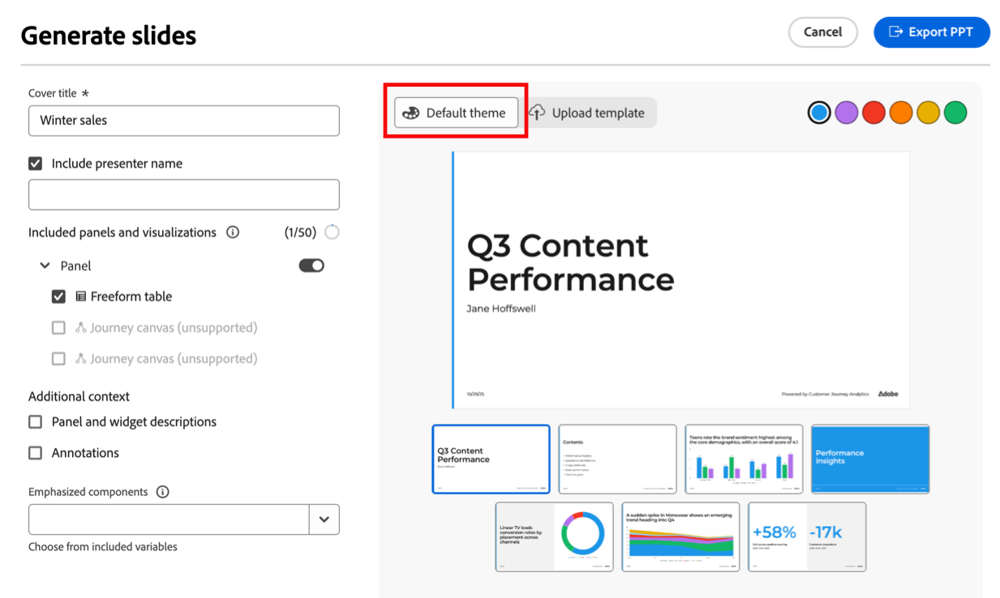
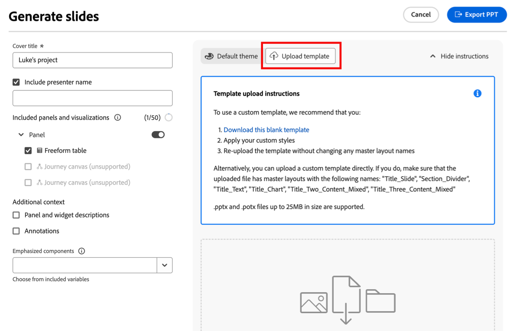
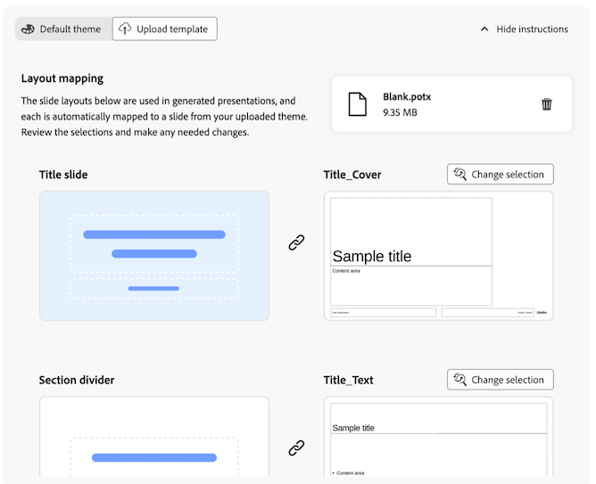
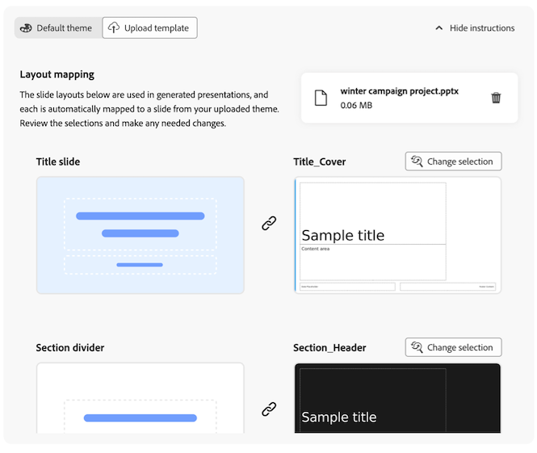

# Data storytelling: Workspace レポートからスライドプレゼンテーションを生成する {#generate-powerpoint}

>[!NOTE]
>
>Data StorytellingはData Insights Agentの下のスキルであり、対象となるお客様は期間限定で利用できます。 Data Insights Agent へのアクセスは、2026年3月31日（PT）に終了する予定です。Data Insights Agentまたはその他のAdobe Experience Platform Agentsを中断することなく引き続き使用するには、Adobeのアカウント担当者にお問い合わせください。Adobe Experience Platform Agent Orchestratorのライセンスについて詳しくは、こちらをご覧ください。

[必要な権限](#permission-requirements-to-generate-slides)を持つユーザーは、Analysis Workspace プロジェクトに基づいて.pptx プレゼンテーションを自動生成できます。 これらのスライドプレゼンテーションを作成する際に、Customer Journey Analyticsはデータから主要なインサイトを特定し、関係者が利用できるスライドに変換することで、ストーリーを自動的に作成します。

この生成されたデータストーリーにより、Workspaceプロジェクトから成果を導き出すために必要な時間、労力、専門知識を削減できます。 アナリストは、データ探索に重点を置くことができるとともに、Customer Journey Analyticsが経営陣のストーリーを構築し、フォーマットを整え、ビジネスへの影響をステークホルダーに伝えることができるようになります。

## スライドプレゼンテーションのデータストーリーについて

**データストーリー**&#x200B;は、Workspace データに基づいてCustomer Journey Analyticsが作成するストーリーです。 Customer Journey Analyticsでは、生成AIを使用して、スライドのプレゼンテーションに含めるパネルやビジュアライゼーション内の重要なテーマを特定します。 インサイトを生成し、重複排除とスコアリングのプロセスを経て、データストーリーの構築に使用するインサイトのサブセットを特定します。

次の節では、データストーリーが提供する追加値、ストーリーの形成に役立つプロジェクトに必要な要素、および.pptx プレゼンテーション出力に含まれる主要な要素について説明します。

### データストーリーが提供する付加価値

データストーリーは、データ分析経験の浅いユーザーもデータにアクセスできるようにすることで、Workspaceプロジェクトに価値とインサイトを提供します。

データストーリーは、次の方法で特定のWorkspace プロジェクトの分析を補完します。

* 顧客の行動や

* 重要なインサイトのハイライト

* 特定の変数が過小評価されているか、または過小評価されているかを評価する

* 隠れたトレンドや異常値などの要因を把握する

* 次のステップに向けたアイデアを創出

### データストーリーを形成するプロジェクト要素

Analysis Workspaceでは、次のプロジェクト要素を考慮してデータストーリーを作成します。

* ディメンション間および指標間の関係

* 分析の基礎となる個々の要素（ディメンション、指標、フィルター、フリーフォームテーブル構造、ビジュアライゼーション、パネル）

* パネル、表、ビジュアライゼーションに指定された名前

* フリーフォームテーブル内の指標の順序（優先度を決定するため）

* パネル内のビジュアライゼーションの順序（優先度を決定するため）

* 概要番号と概要テキスト（データストーリーで強調表示する必要がある指標を決定するため）

### データストーリーのプレゼンテーション要素

データストーリーは、タイトルスライド、エグゼクティブサマリースライド、詳細スライド、セクション区切りで構成されます。

**タイトルスライド：**&#x200B;指定したタイトルとプレゼンター名が表示されます。 スピーカーノートには、テーマとストーリーがどのように作成されたか、生成および使用されたインサイトの数、使用されたパネルの数などの情報が記載されています。

**エグゼクティブサマリー：**&#x200B;最も価値の高いインサイトを優先し、1～5行の文章からなる包括的なストーリーを作成します。

**詳細スライド：** Workspace プロジェクトのテーブル、パネル、ビジュアライゼーションに関連するインサイトを生成します。 インサイトは、傾向、季節性、異常値、相関性で構成されます。

**セクション区切り記号：**&#x200B;適切に配置され、名前が付けられたセクション区切り記号でインサイトを分割します。

## Workspace プロジェクトに基づく .pptx プレゼンテーションの生成

<!-- markdownlint-disable MD034 -->

>[!CONTEXTUALHELP]
>id="cja-powerpoint-include-visualizations"
>title="含まれるパネルとビジュアライゼーション"
>abstract="プレゼンテーションに含めるパネルとビジュアライゼーションを選択します。最大 50 個のビジュアライゼーションを含めることができます。"

<!-- markdownlint-enable MD034 -->

<!-- markdownlint-disable MD034 -->

>[!CONTEXTUALHELP]
>id="cja-presentation-emphasized-components"
>title="強調されたコンポーネント"
>abstract="プレゼンテーションで強調するビジュアライゼーションから最大 5 つの指標と 5 つのディメンションを選択します。選択した指標は斜体、ディメンションは太字、ディメンション項目はコントラストカラー（対比色）で表示されます。"

<!-- markdownlint-enable MD034 -->

1. スライドのプレゼンテーションのベースとして使用するデータを含むWorkspace プロジェクトに移動します。

1. ページの右上隅にある「**[!UICONTROL スライドを生成]**」を選択します。

   スライドを生成ダイアログが表示されます。

   

1. 次の情報を指定します。

   | オプション | 説明 |
   |---------|----------|
   | **[!UICONTROL 表紙タイトル]** | プレゼンテーションのタイトルを指定します。 このタイトルは、プレゼンテーションのタイトルスライドに表示されます。 |
   | **[!UICONTROL 発表者の名前を含める]** | 発表者の名前を指定します。 この名前は、プレゼンテーションのタイトルスライドの表紙の下に表示されます。 |
   | **[!UICONTROL パネルとビジュアライゼーションを含む]** | プレゼンテーションに含めるパネルとビジュアライゼーションを選択します。 最大 50 個のビジュアライゼーションを含めることができます。
ビジュアライゼーションがグレー表示されている場合、その後にテキスト **[!UICONTROL （サポートされていません）]**&#x200B;または&#x200B;**[!UICONTROL （制限データ）]**&#x200B;が続きます。
<ul><li>**サポートされていません**：ほとんどのパネルとビジュアライゼーションがサポートされています。 サポートされていないパネルとビジュアライゼーションについて詳しくは、[ サポートされていないプロジェクト要素と機能](#unsupported-project-elements-and-features)を参照してください。</li><li>**制限付きデータ**：このビジュアライゼーションには、組織が適用するデータガバナンスポリシーによって書き出すことが制限されているコンポーネントが含まれています。 システム管理者に連絡して、どのコンポーネントが書き出しから制限されているかを確認し、制限されたコンポーネントを削除してからスライドを生成します。</li></ul> |
   | **[!UICONTROL コンポーネントを強調]** | プレゼンテーションで強調する指標とディメンションをビジュアライゼーションから選択します。 データストーリーのテーマや全体的なストーリーを作成すると、選択したコンポーネントのランクが上がり、重みが増します。 
強調を適用しない場合、コンポーネントは次のようにプレゼンテーションに表示されます。<ul><li>**指標とディメンション：**&#x200B;斜体</li><li>**Dimension項目：**&#x200B;引用符</li></ul>

強調を適用すると、コンポーネントは次のようにプレゼンテーションに表示されます。
<ul><li>**指標とディメンション：**&#x200B;斜体と太字</li><li>**Dimension項目：**&#x200B;対応するディメンションが強調されている場合の太字
ディメンション項目がチャートでハイライト表示されている場合、ディメンション項目にもカラーが適用されます。
</li></ul> |

   <!-- 
   add this later: - **[!UICONTROL Panel and visualization descriptions]** - Choose whether to include panel and visualization descriptions in your generated slide presentation. - 
   - **[!UICONTROL Annotations]** - Choose whether annotations are visible in your generated slide presentation. For more information about annotations, see [Annotations overview](/help/components/annotations/overview.md).  -  
   -->

1. （条件付き）少ない手順でスライドを生成する場合や、スライドのプレゼンテーションに企業テーマが必要ない場合は、**[!UICONTROL デフォルトテーマ]**&#x200B;を選択します。

   目的の色を選択して、プレゼンテーションのカラーテーマを選択するだけです。

   

1. （条件付き）スライド プレゼンテーションを企業テーマと一致させる必要がある場合は、**[!UICONTROL テンプレートをアップロード]**&#x200B;を選択します。 このオプションでは、カスタムテンプレートをアップロードし、カスタムスタイルを適用する必要があります。

   アップロードした最新のカスタムテンプレートは、ブラウザーキャッシュにローカルに保存され、今後のスライドプレゼンテーションの生成時に使用できます。

   

   カスタムテンプレートをアップロードするには、次のいずれかの操作を行います。

   +++（推奨）空白のテンプレートをダウンロードして変更する

   1. [この空のテンプレート ](https://d30ln29764hddd.cloudfront.net/deploy/builds/data-storytelling.2025-10-20T15:10:19/resources/components/Blank.potx?)をダウンロードします。

   1. 空白のテンプレートにカスタムスタイルを適用します。

   1. マスターレイアウト名を変更せずにテンプレートを再アップロードします。

      ファイルシステムから、カスタムスタイルが適用された空白のテンプレートをドロップエリアにドラッグします。

      または

      「**[!UICONTROL 参照]**」を選択し、ファイルシステムからカスタムスタイルが適用されている空白のテンプレートを参照して選択します。

   1. **[!UICONTROL レイアウトマッピング]** セクションでは、生成されたプレゼンテーションで使用される各スライドレイアウトが、アップロードしたテーマのスライドに自動的にマッピングされます。 選択内容を確認して、正しいことを確認します。

      

   1. （条件付き）スライドレイアウトが正しくマッピングされていない場合は、アップロードしたプレゼンテーションから選択したスライドの上の&#x200B;**[!UICONTROL 選択範囲を変更]**&#x200B;を選択し、レイアウトに一致するスライドを選択します。

      誤ってマッピングされた各スライドについて、このプロセスを繰り返します。

   +++

   +++カスタムテンプレートを直接アップロードする 

   1. ファイルシステムから、カスタムテンプレートをドロップエリアにドラッグします。

      または

      「**[!UICONTROL 参照]**」を選択し、ファイルシステムからカスタムテンプレートを参照して選択します。

      アップロードしたファイルに、「Title_Slide」、「Section_Divider」、「Title_Text」、「Title_Chart」、「Title_Two_Content_Mixed」、「Title_Three_Content_Mixed」という名前のマスターレイアウトがあることを確認します。

      最大 25 個のマスターレイアウトがサポートされています。

      最大 25 MB の .pptx ファイルと .potx ファイルがサポートされています。

   1. **[!UICONTROL レイアウトマッピング]** セクションでは、生成されたプレゼンテーションで使用される各スライドレイアウトが、アップロードしたテーマのスライドに自動的にマッピングされます。 選択内容を確認して、正しいことを確認します。

      

   1. （条件付き）スライドレイアウトが正しくマッピングされていない場合は、アップロードしたプレゼンテーションから選択したスライドの上の&#x200B;**[!UICONTROL 選択範囲を変更]**&#x200B;を選択し、レイアウトに一致するスライドを選択します。

      誤ってマッピングされた各スライドについて、このプロセスを繰り返します。

   +++

1. 「**[!UICONTROL PPTを書き出し]**」を選択します。

   .pptx プレゼンテーションが自動的にワークステーションにダウンロードされます。

1. （推奨） .pptx プレゼンテーションを開いてレビューします。 必要な変更を加えます。

## スライドを生成するための権限の要件

>[!AVAILABILITY]
>
>お客様の組織がWorkspace プロジェクトからスライドプレゼンテーションを生成するアクセス権がない場合は、Adobe アカウント担当者に連絡してライセンスの詳細を確認してください。

スライドを生成する機能は、必要なライセンスを持つ組織のすべてのユーザーに対して、デフォルトで有効になっています。

スライドを生成するライセンスを持つ組織の製品プロファイル管理者は、必要に応じてアクセスを無効にできます。

[!UICONTROL Adobe Admin Console]では、[!UICONTROL  レポートツール ] **[!UICONTROL データstorytelling]**&#x200B;権限によって、この機能へのアクセス権が決まります。 [製品プロファイル管理者](https://helpx.adobe.com/jp/enterprise/using/manage-product-profiles.html)は、アクセスを無効にする場合、[!UICONTROL Admin Console]で次の手順に従う必要があります。
1. **[!UICONTROL Admin Console]**／**[!UICONTROL 製品とサービス]**／**[!UICONTROL Customer Journey Analytics]**／**[!UICONTROL 製品プロファイル]**&#x200B;に移動します。
1. [!UICONTROL Data storytelling]へのアクセスを提供する製品プロファイルのタイトルを選択します。
1. 特定の製品プロファイルで、「**[!UICONTROL 権限]**」を選択します。
1.  を選択して、**[!UICONTROL レポートツール]**&#x200B;を編集します。
1. を選択して、**含まれる権限項目**&#x200B;から&#x200B;**[!UICONTROL Data storytelling]**&#x200B;を削除します。

   <!--add screenshot of permission in the admin console-->

1. 「**[!UICONTROL 保存]**」を選択して権限を保存します。

詳しくは、[ アクセス制御](/help/technotes/access-control.md#user-level-access)の[ ユーザーレベルのアクセス ](/help/technotes/access-control.md#access-control)を参照してください。

## サポートされていないプロジェクト要素と機能 {#unsupported}

プロジェクトで使用される次のAnalysis Workspace要素と機能は、スライドの生成時にはサポートされません。

* アトリビューションパネル

  このパネルは、設定オプションが表示されるときにグレー表示されます。

  その他のすべてのパネルは、Workspace プロジェクトから生成されるスライドに含めることができます。

* 一部のビジュアライゼーション

  ほとんどのビジュアライゼーションは、Workspace プロジェクトから生成されるスライドに含めることができます。 ただし、次のビジュアライゼーションは含めることができず、設定オプションが表示されるときにグレー表示されます。

   * 面グラフ

   * ブレット

   * コホートテーブル

   * コンボ

   * 複数のディメンション列を持つフリーフォームテーブル（1つのディメンション列を持つテーブルがサポートされています）

   * ジャーニーキャンバス

   * 散布図

   * ツリーマップ

* ガイド付き分析

* データガバナンスポリシーによる書き出しが制限されているコンポーネント

  詳しくは、[失敗した書き出しのトラブルシューティング ](/help/components/exports/troubleshoot-exports.md)を参照してください。

## 限定的なサポートにとどまるプロジェクト要素および機能

* 分類

  関連するインサイトを生成する際の重複排除およびスコアリングプロセスの一環として、フリーフォームテーブル内の各分類を個別に分析し、単一のフリーフォームテーブル内の最初の5つの分類のみを分析します。

  分類の最初のレベルのみがサポートされます。 分類の内訳はプレゼンテーションには含まれません。
