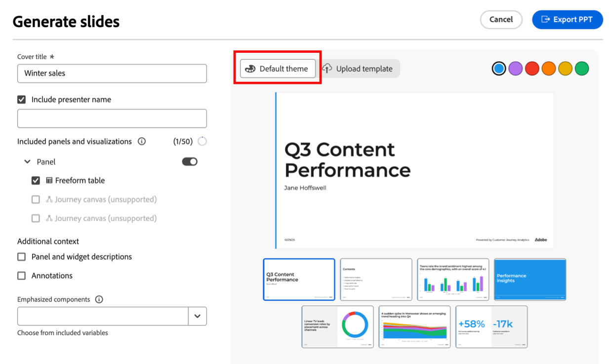

# Data storytelling: Workspace レポートからスライドプレゼンテーションを生成します {#generate-powerpoint}

[&#x200B; 必要な権限 &#x200B;](#permission-requirements-to-generate-slides) を持つユーザーは、Analysis Workspace プロジェクトから.pptx プレゼンテーションを自動生成できます。 これらのスライドプレゼンテーションを作成する場合、Customer Journey Analyticsでは、主要なインサイトを特定して関係者に対応するスライドに変換することで、データからストーリーを自動的に作成します。

この機能により、Workspace プロジェクトから結果を出すために必要な時間と労力が削減されます。また、エグゼクティブの物語をすばやく構築し、ビジネスへの影響を関係者に伝えることができます。

この自動生成されたデータストーリーを使用すると、アナリストはデータの調査に専念でき、Customer Journey Analyticsは関係者が使用できるようにアナリストの調査結果をキュレーションおよび書式設定します。

## スライドプレゼンテーションのデータストーリーについて

Analysis Workspaceでは、生成 AI を使用して、スライドプレゼンテーション内にデータストーリーを作成します。 これらのデータストーリーは、追加のコンテキストを提供し、重要なハイライトを表示し、次の手順のアイデアを提供することで、特定のWorkspace プロジェクトの分析を補完します。 隠れたトレンド、異常値、要因、主な推進要因を呼び出す

### データストーリーによって提供される付加価値

データストーリーは、次の方法で特定のWorkspace プロジェクトの分析を補完します。

* 追加のコンテキストの提供

* 重要なインサイトのハイライト表示

* 隠れたトレンド、異常値、その他の要因を指摘する

* 主要なドライバーの特定

* 次のステップに向けたアイデアの提供

### データストーリーを形成するプロジェクト要素

Analysis Workspaceは、次のプロジェクト要素を考慮してデータストーリーを作成します。

* ディメンション間および指標間の関係

* 分析の基礎を形成する個々の要素（ディメンション、指標、フィルター、フリーフォームテーブル構造、ビジュアライゼーションおよびパネル）

* パネル、テーブル、ビジュアライゼーションに付けられた名前

* フリーフォームテーブルでの指標の順序（優先度を決定するため）

* 数値の概要とテキストの概要（データストーリーでハイライト表示する必要がある指標を決定するため）

### データストーリーのプレゼンテーション要素

データストーリーは、エグゼクティブサマリースライド、詳細スライド、セクションデバイダーで構成されます。

**エグゼクティブサマリー：** 最も価値の高いインサイトを優先し、1 文から 5 文の長さの包括的なストーリーを作成します。

**詳細スライド：** Workspace プロジェクトのテーブル、パネル、ビジュアライゼーションに関連するインサイトを生成します。 インサイトは、トレンド、季節性、異常値、相関関係で構成されます。

**セクション区切り：** 適切に配置され名前が付けられたセクション区切りでインサイトを分割します。

## Workspace プロジェクトに基づいて.pptx プレゼンテーションを生成する

<!-- markdownlint-disable MD034 -->

>[!CONTEXTUALHELP]
>id="cja-powerpoint-include-visualizations"
>title="含まれるパネルとビジュアライゼーション"
>abstract="プレゼンテーションに含めるパネルとビジュアライゼーションを選択します。 最大 50 個のビジュアライゼーションを含めることができます。"

<!-- markdownlint-enable MD034 -->

<!-- markdownlint-disable MD034 -->

>[!CONTEXTUALHELP]
>id="cja-presentation-emphasized-components"
>title="強調されたコンポーネント"
>abstract="プレゼンテーションで強調するビジュアライゼーションから最大 5 つの指標と 5 つのディメンションを選択します。 選択した指標は斜体、ディメンションは太字、ディメンション項目は対照的な色で表示されます。"

<!-- markdownlint-enable MD034 -->

1. スライド プレゼンテーションの基礎として使用するデータを含むWorkspace プロジェクトに移動します。

1. ページの右上隅にある「**[!UICONTROL スライドを生成]**」を選択します。

   スライドを生成ダイアログが表示されます。

   

1. 次の情報を指定します。

   | オプション | 説明 |
   |---------|----------|
   | **[!UICONTROL 表題]** | プレゼンテーションのタイトルを指定します。 このタイトルは、プレゼンテーションのタイトル スライドに表示されます。 |
   | **[!UICONTROL 発表者名を含める]** | 発表者の名前を指定してください。 この名前は、プレゼンテーションのタイトル スライドの表紙の下に表示されます。 |
   | **[!UICONTROL 含めるパネルとビジュアライゼーション]** | プレゼンテーションに含めるパネルとビジュアライゼーションを選択します。 最大 50 個のビジュアライゼーションを含めることができます。
ほとんどのパネルとビジュアライゼーションがサポートされています。 サポートされていないパネルとビジュアライゼーションについては、[&#x200B; サポートされていないプロジェクト要素と機能 &#x200B;](#unsupported-project-elements-and-features) を参照してください。
 |
   | **[!UICONTROL パネルとビジュアライゼーションの説明]** | |
   | **[!UICONTROL 注釈]** | |
   | **[!UICONTROL コンポーネントを強調]** | プレゼンテーションで強調するビジュアライゼーションから最大 5 つの指標と 5 つのディメンションを選択します。
強調を適用しない場合、コンポーネントは次のようにプレゼンテーションに表示されます。<ul><li>**指標およびディメンション：** 斜体</li><li>**Dimension項目：** 引用符</li></ul>

強調を適用すると、コンポーネントはプレゼンテーション内で次のように表示されます。
<ul><li>**指標とディメンション：** 斜体と太字</li><li>**Dimension項目：** 対応するディメンションが強調されている場合の太字
また、ディメンション項目がグラフでハイライト表示されている場合は、ディメンション項目に色が適用されます。
</li></ul> |

1. （条件付き）より少ない手順ですばやくスライドを生成する場合や、スライドプレゼンテーションに企業テーマが必要ない場合は、「**[!UICONTROL デフォルトのテーマ]**」を選択します。

   希望の色を選択するだけで、プレゼンテーションのカラーテーマを選択できます。

   

1. （条件付き）スライドプレゼンテーションが企業のテーマと一致する必要がある場合は、**[!UICONTROL テンプレートをアップロード]** を選択します。 このオプションを使用するには、カスタムテンプレートをアップロードし、カスタムスタイルを適用する必要があります。

   

   カスタムテンプレートをアップロードするには、次のいずれかを行います。

   * （推奨）空のテンプレートをダウンロードして変更します。

      1. この空白のテンプレートをダウンロードします。<!--add link-->

      1. 空白のテンプレートにカスタムスタイルを適用します。

      1. マスターレイアウト名を変更せずにテンプレートを再アップロードします。

   * カスタムテンプレートを直接アップロードします。

      1. ファイルシステムから、カスタムテンプレートをドロップ領域にドラッグします。

         または

         「**[!UICONTROL 参照]**」を選択して、ファイルシステムからカスタムテンプレートを参照して選択します。

         アップロードするファイルに、「Title_Slide」、「Section_Divider」、「Title_Text」、「Title_Chart」、「Title_Two_Content_Mixed」、「Title_Three_Content_Mixed」という名前のマスターレイアウトがあることを確認してください

         最大 25MB の.pptx および.potx ファイルがサポートされています。

1. 「**[!UICONTROL PPT をエクスポート]**」を選択します。

1. （推奨）.ppt プレゼンテーションを確認および編集し、次のセクション [&#x200B; 以前に生成したプレゼンテーションからスライドを編集する &#x200B;](#edit-slides-from-a-previously-generated-presentation) で説明するように、必要な変更を行います。

## 以前に生成したプレゼンテーションからスライドを編集する

## 生成された.pptx プレゼンテーションのダウンロード

## スライドを生成するための権限要件

>[!AVAILABILITY]
>
>Workspace プロジェクトからスライドプレゼンテーションを作成するアクセス権がない場合、ライセンスの詳細については、Adobe アカウント担当者にお問い合わせください。
>
>この機能は、必要なライセンスを持つ組織のすべてのユーザーに対して、デフォルトで有効になっています。

組織がスライドを生成するライセンスを持つ製品プロファイル管理者は、必要に応じてアクセスを無効にすることができます。

[!UICONTROL Adobe Admin Console] では、[!UICONTROL &#x200B; レポートツール &#x200B;] **[!UICONTROL データstorytelling]** 権限によってこの機能へのアクセスが決まります。 [&#x200B; 製品プロファイル管理者 &#x200B;](https://helpx.adobe.com/enterprise/using/manage-product-profiles.html) がアクセスを無効にする場合は、[!UICONTROL Admin Console] で次の手順に従う必要があります。
1. **[!UICONTROL Admin Console]**／**[!UICONTROL 製品とサービス]**／**[!UICONTROL Customer Journey Analytics]**／**[!UICONTROL 製品プロファイル]**&#x200B;に移動します。
1. [!UICONTROL Data storytelling] へのアクセス権を付与する製品プロファイルのタイトルを選択します。
1. 特定の製品プロファイルで、「**[!UICONTROL 権限]**」を選択します。
1.  を選択して、**[!UICONTROL レポートツール]**&#x200B;を編集します。
1.  を選択して、**含まれる権限項目** から **[!UICONTROL Data storytelling]** を削除します。

   <!--add screenshot of permission in the admin console-->

1. 「**[!UICONTROL 保存]**」を選択して権限を保存します。

詳しくは、[&#x200B; アクセス制御 &#x200B;](/help/technotes/access-control.md#user-level-access) の [&#x200B; ユーザーレベルアクセス &#x200B;](/help/technotes/access-control.md#access-control) を参照してください。

## サポートされていないプロジェクト要素と機能 {#unsupported}

次のAnalysis Workspaceの要素および機能は、プロジェクトで使用され、スライドの生成時にはサポートされません。

* アトリビューションパネル

  このパネルは、設定オプションが表示されると淡色表示されます。

  Workspace プロジェクトから生成されるスライドには、その他のすべてのパネルを含めることができます。

* ビジュアライゼーション

  ほとんどのビジュアライゼーションは、Workspace プロジェクトから生成されたスライドに含めることができます。 ただし、次のビジュアライゼーションは含まれず、設定オプションが表示されるとグレー表示されます。

   * コホートテーブル

   * ジャーニーキャンバス

   * ブレット

   * コンボ

   * 散布図

   * ツリーマップ

* 分類

* ガイド付き分析

