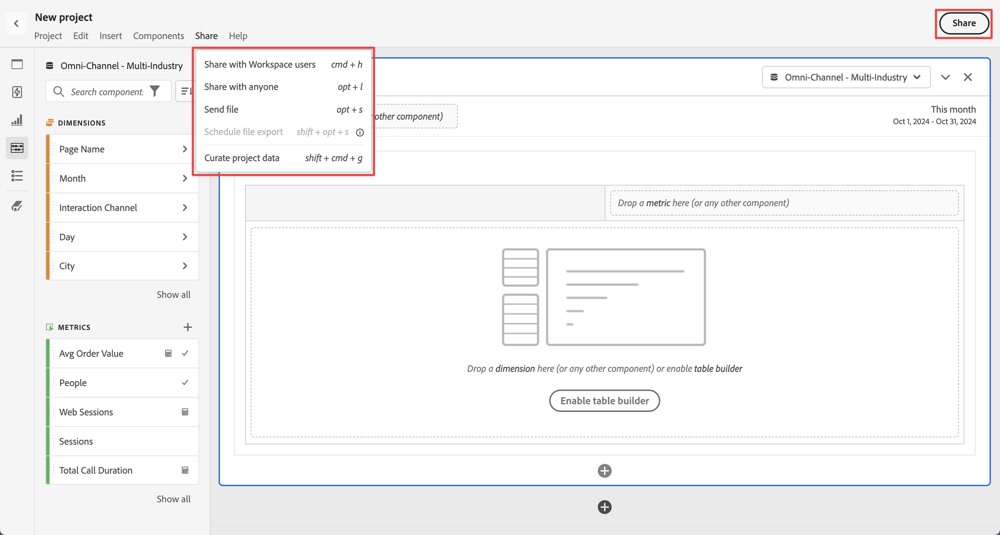

# プロジェクトのキュレーションと共有の概要

Analysis Workspaceの **[!UICONTROL 共有]** メニューを使用するか、インターフェイスの右上にある「**[!UICONTROL 共有]**」を選択すると、プロジェクトをキュレーションして共有したり、プロジェクトをPDFまたは CSV ファイルとして組織内または他のユーザーに送信したりできます。

| オプション | 説明 |
|---|---|
| **[!UICONTROL プロジェクトデータをキュレート]** | プロジェクトで使用できるコンポーネント（ディメンション、指標、セグメント、日付範囲）を制限します。[詳細情報](/help/analysis-workspace/curate-share/curate.md) |
| **[!UICONTROL Workspace ユーザーと共有]** | プロジェクトを組織内の他の Analysis Workspace ユーザーも利用できるようになります。特定のユーザーと共有するか、共有可能なリンクを作成して、プロジェクトへのクイックアクセスができます。ユーザーはログインする必要があります。[詳細情報](/help/analysis-workspace/curate-share/share-projects.md) |
| **[!UICONTROL 任意のユーザーと共有]** | Customer Journey Analyticsへのアクセス権を持たないユーザーにAnalysis Workspace プロジェクトへの読み取り専用アクセス権を付与します。 [詳細情報](/help/analysis-workspace/curate-share/share-projects.md) |
| **[!UICONTROL ファイルを送信]** | プロジェクトを CSV または PDF 形式で、指定した受信者にすぐに送信します。[詳細情報](/help/analysis-workspace/curate-share/t-schedule-report.md) |
| **[!UICONTROL ファイルの書き出しをスケジュール]** | プロジェクトを CSV または PDF 形式でスケジュールに従って指定した受信者に送信します。[詳細情報](/help/analysis-workspace/curate-share/t-schedule-report.md) |

