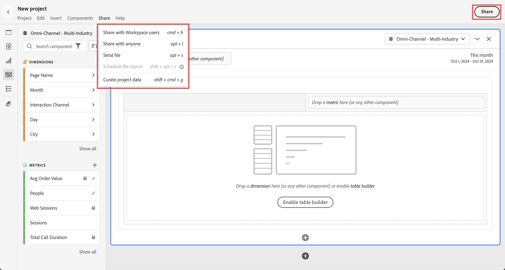

# プロジェクトのキュレーションと共有の概要

プロジェクトをキュレーションして共有したり、プロジェクトをPDFまたはCSV ファイルとして組織内の受信者に送信したり、Analysis Workspaceの&#x200B;**[!UICONTROL Share]** メニューまたはインターフェイスの右上の&#x200B;**[!UICONTROL Share]**&#x200B;を選択した場合に使用できるオプションを使用して、他のユーザーとプロジェクトを送信したりできます。

| オプション | 説明 |
|---|---|
| **[!UICONTROL プロジェクトデータをキュレート]** | プロジェクトで使用できるコンポーネント（ディメンション、指標、セグメント、日付範囲）を制限します。 [詳細情報](/help/analysis-workspace/curate-share/curate.md) |
| **[!UICONTROL Workspace ユーザーと共有]** | プロジェクトを組織内の他の Analysis Workspace ユーザーも利用できるようになります。 特定のユーザーと共有するか、共有可能なリンクを作成して、プロジェクトへのクイックアクセスができます。 ユーザーはログインする必要があります。 [詳細情報](/help/analysis-workspace/curate-share/share-projects.md) |
| **[!UICONTROL 任意のユーザーと共有]** | Customer Journey Analyticsへのアクセス権を持たないユーザーに、Analysis Workspace プロジェクトへの読み取り専用アクセス権を付与します。 [詳細情報](/help/analysis-workspace/curate-share/share-projects.md) |
| **[!UICONTROL ファイルを送信]** | プロジェクトを CSV または PDF 形式で、指定した受信者にすぐに送信します。 [詳細情報](/help/analysis-workspace/export/t-schedule-report.md) |
| **[!UICONTROL ファイルの書き出しをスケジュール]** | プロジェクトを CSV または PDF 形式でスケジュールに従って指定した受信者に送信します。 [詳細情報](/help/analysis-workspace/export/t-schedule-report.md) |

