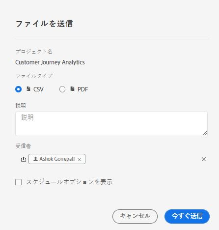
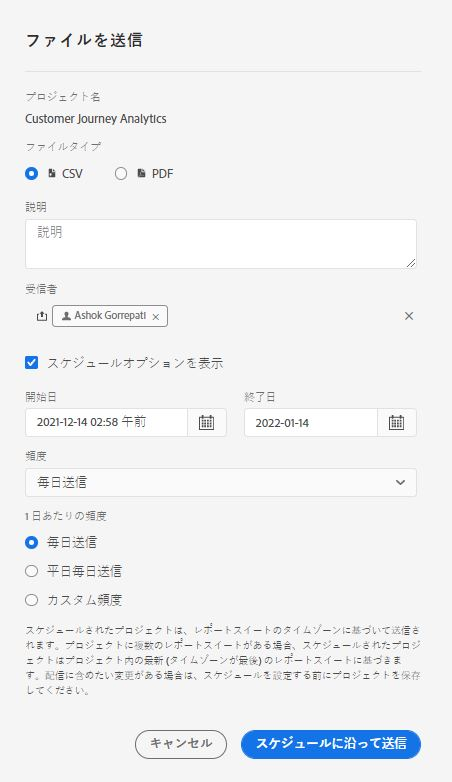

# プロジェクトのスケジュール

ワークスペースから **[!UICONTROL 共有]** メニューを使用して、選択した受信者に電子メールでAnalysis Workspaceプロジェクトを送信できます。 ファイルは CSV 形式または PDF 形式で送信できます。

## ファイルを今すぐ送信 {#now}

電子メールで受信者に直ちにファイルを送信するには、以下を実行します。

1. クリック **[!UICONTROL 共有] > [!UICONTROL ファイルを書き出し]**.
1. ファイルタイプを指定します。
   * [!UICONTROL **CSV**]:プレーンテキストデータが必要な場合は、このオプションを選択します。
   * [!UICONTROL **PDF**]:ダウンロードしたファイルに、プロジェクト内の表示（表示）されたすべてのテーブルとビジュアライゼーションを含める場合は、このオプションを選択します。
1. （オプション）受信するファイルについて説明する説明を E メールに追加します。
1. 受信者またはグループを追加します。電子メールアドレスを入力することもできます。
1. （Healthcare Shield のお客様のみ）パスワードを入力します。予定レポートのパスワード保護の節を参照してください。
1. 「**[!UICONTROL 今すぐ送信]**」をクリックします。
1. （任意）「**[!UICONTROL スケジュールオプションを表示する]** 」をクリックして、配信スケジュールを指定します。

## ファイルをスケジュールに従って送信 {#schedule}

定期的なスケジュールでファイルを電子メールで受信者に送信するには、以下を実行します。

1. クリック **[!UICONTROL 共有] > [!UICONTROL スケジュールファイルの書き出し]**.
1. ファイルタイプ（CSV または PDF）を指定します。
1. （任意）電子メールに含まれる、受信ファイルについての説明を追加します。
1. 受信者またはグループを追加します。電子メールアドレスを入力することもできます。
1. （Healthcare Shield のお客様のみ）パスワードを入力します。予定レポートのパスワード保護の節を参照してください。
1. 入力時に「開始」と「終了」を変更して、スケジュールを配信する範囲を指定します。終了日は、スケジュールの作成日または変更日から 1 年以内に設定する必要があります。
1. 配信頻度を指定します。頻度ごとに異なるカスタマイズが可能です。
1. 「**[!UICONTROL 送信スケジュール]**」をクリックします。

## スケジュール済みプロジェクトマネージャー {#manager}

スケジュールされたAnalysis Workspaceプロジェクトは、以下で管理できます。 **[!UICONTROL Analytics] > [!UICONTROL コンポーネント] > [!UICONTROL スケジュール済みプロジェクト]**.

スケジュール済みプロジェクトマネージャーでは、定期的なプロジェクトスケジュールを編集および削除できます。検索バーまたは左側のパネルのフィルターオプションを使用して、スケジュールを検索します。タグ、承認されたスケジュール、所有者などでフィルターできます。

| フィールド | 説明 |
| --- | --- |
| [!UICONTROL お気に入り] | 星アイコンを選択すると、このスケジュールがお気に入りになります。 |
| [!UICONTROL スケジュール ID] | この ID は、主にデバッグ目的で使用されます。 |
| [!UICONTROL タイトルと説明] | このプロジェクトのタイトルと説明です。 |
| [!UICONTROL 所有者] | プロジェクトを作成し所有しているユーザー。 |
| [!UICONTROL タグ] | （任意）タグ付けは、プロジェクトを整理するのに適した方法です。すべてのユーザーがタグを作成し、1 つ以上のタグをプロジェクトに適用できます。ただし、タグを表示できるのは、自分が所有しているプロジェクトか、自分と共有されているプロジェクトに限られます。 |
| [!UICONTROL 配信先] | このスケジュールされたプロジェクトの受信者。 |
| [!UICONTROL 有効期限] | スケジュールの頻度に関係なく、有効期限は最大 1 年に設定できます。 |
| [!UICONTROL 頻度] | このスケジュールされたプロジェクトを受信者に送信する頻度。 |
| [!UICONTROL 実行時間] | このスケジュールされたプロジェクトが送信される時刻。 |
| [!UICONTROL クエリ数] | このプロジェクトに対するクエリの数。 |

スケジュール済みプロジェクトマネージャーでの一般的な操作は次のとおりです。

| アクション | 説明 |
|---|---|
| **[!UICONTROL スケジュールを編集]** | スケジュールのタイトルをクリックして、配信設定を更新します。 |
| **[!UICONTROL スケジュールを削除]** | リストでスケジュール済みのプロジェクトを選択し、メニューから「削除」をクリックします。これにより、プロジェクトで選択したスケジュールが削除されます。プロジェクト自体は削除されません。 |
| **[!UICONTROL タグを追加]** | リストでスケジュール済みのプロジェクトを選択し、「タグ」または「承認」を選択してスケジュールを整理し、検索しやすくします。 |
| **[!UICONTROL 失敗スケジュールを表示]** | 左側のパネル／その他のフィルター／失敗に移動して、失敗したスケジュールを表示します。 |
| **[!UICONTROL 期限切れスケジュールを表示]** | 左側のパネル／その他のフィルター／期限切れに移動して、期限切れのスケジュールを表示します。新しい配信スケジュールを設定するには、スケジュールのタイトルをクリックします。 |
| **[!UICONTROL スケジュール ID を表示]** | 右上の列のオプションに移動し、表にスケジュール ID 列を追加します。スケジュール ID は、多くの場合デバッグに役立ちます。 |

スケジュールされたプロジェクトマネージャーには、特定のユーザーが作成したアイテムが表示されます。ユーザーアカウントがアプリケーションで無効になっている場合、予定されたすべての配信が停止されます。

## スケジュールされたプロジェクトのパスワード保護 {#password}

>[!NOTE]
>
>スケジュールされたプロジェクトをパスワードで保護するオプションは、[Healthcare Shield](https://business.adobe.com/jp/solutions/experience-cloud-for-healthcare.html) アドオン製品を購入された CJA のお客様のみに表示されます。

アドビは、スケジュールされたプロジェクトを .pdf 形式と .csv 形式のどちらで送信した場合でも、パスワードを使用して暗号化します。

Healthcare Shield SKU を購入して有効にすると、次の 2 つの状況において、スケジュールされたプロジェクトのパスワードを作成するプロンプトがポップアップ表示されます。

* 誰かがスケジュールされたプロジェクトを新規作成する場合。

* 既存のスケジュールされたプロジェクトが送信されようとしている場合。現在スケジュールされているプロジェクトは、パスワード保護が行われるまで無効になります。スケジュールされたプロジェクトの所有者に、この影響に関するメールが送信されます。

### パスワード要件

パスワード要件は、アドビの規格に準拠しており、数字 1 文字以上および特殊文字 1 文字以上を含める 8 文字以上のパスワードが必要です。

### 新しくスケジュールされたプロジェクトのパスワード保護

1. プロジェクトを保存したら、**[!UICONTROL 共有]**／**[!UICONTROL 今すぐファイルを送信]**&#x200B;または[!UICONTROL 共有]／**[!UICONTROL スケジュールに従ってファイルを送信]**&#x200B;に移動します。
1. [今すぐファイルを送信](https://experienceleague.adobe.com/docs/analytics-platform/using/cja-workspace/curate-share/t-schedule-report.html?lang=ja#now)または[スケジュールに従ってファイルを送信](https://experienceleague.adobe.com/docs/analytics-platform/using/cja-workspace/curate-share/t-schedule-report.html?lang=ja#schedule)で、上記の手順に従います。

### 既存のスケジュール済みプロジェクトのパスワード保護

プロジェクトがスケジュールされる前に、プロジェクトの所有者に次のようなメールが送信されます。

1. Customer Journey Analytics にログインし直します。
1. 「**[!UICONTROL スケジュールされたプロジェクトを表示]**」をクリックします。
1. **[!UICONTROL スケジュールされたプロジェクトを編集]**&#x200B;ダイアログで、パスワードを入力、再入力します。
1. スケジュールされたプロジェクトの受信者に（のみ）、このパスワードを知らせます。

