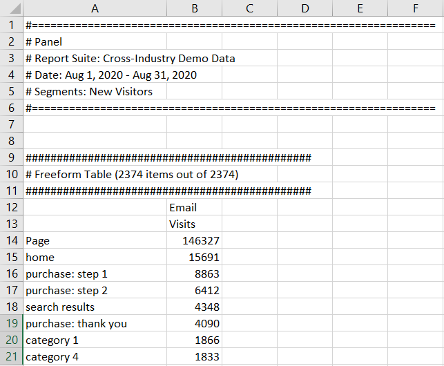

# Customer Journey Analyticsデータをダウンロード

Customer Journey Analyticsデータを個人のワークステーションにダウンロードできます。 これは、コピーされたデータ、CSV、PDFの形式で指定できます。 ダウンロードしたファイルにビジュアライゼーションを含める場合は、通常、PDFをお勧めします。 単にプレーンテキストデータが必要な場合は、CSV およびコピーしたデータをお勧めします。

Customer Journey Analyticsデータを書き出すその他の方法も利用できます。詳しくは、[ 書き出しの概要 ](/help/analysis-workspace/export/export-project-overview.md) を参照してください。

## CSV またはPDFとしてダウンロード {#download-project}

プロジェクトをダウンロードする際は、次の点に注意してください。

* プロジェクトを CSV またはPDF形式でダウンロードする場合、プロジェクトのダウンロードをリクエストすると、プロジェクトが保存または未保存になる場合があります。 ただし、[スケジュール](/help/analysis-workspace/export/t-schedule-report.md)できるのは、保存したプロジェクトだけです。

* プロジェクトをPDFとしてダウンロードする場合：
   * PDF形式でレンダリングする前にAdobeサーバーでプロジェクトが再実行されるので、ダウンロードの書き出しに数分かかる場合があります。 PDF がブラウザーでダウンロードされるまで、プロジェクトを終了しないことをお勧めします。ただし、待っている間も引き続きプロジェクトに変更を加えることができます。PDF のレンダリングに 5 分以上かかる場合は、代わりにメールで送信するよう求められます。
   * ダウンロードは、ページネーションが適用されない単一ページとしてレンダリングされます。
   * PDFのレンダリングには、Workspaceのページの内容が含まれます。 プロジェクトにカスタムサイズのビジュアライゼーションとパネルが含まれている場合、内容が切り詰められないように、自動サイズに変更する必要があります（右上隅のボタン）。
   * フリーフォームテーブル内にある [ ハイパーリンク ](/help/analysis-workspace/visualizations/freeform-table/freeform-table-hyperlinks.md) は、ダウンロードしたPDFでは機能しません。

プロジェクトを CSV またはPDFファイルとしてダウンロードするには：

1. ダウンロードを行う形式に応じて、次のいずれかの操作を行います。

   * **PDF：****[!UICONTROL プロジェクト]**／**[!UICONTROL PDF をダウンロード]**&#x200B;を選択します。

     ダウンロードしたファイルに、プロジェクトで表示される（表示可能な）すべてのテーブルとビジュアライゼーションを含める場合は、このオプションを選択します。

   * **CSV：****[!UICONTROL プロジェクト]**／**[!UICONTROL CSV をダウンロード]**&#x200B;を選択します。

     ダウンロードしたファイルをプレーンテキストにする場合は、このオプションを選択します。

   

1. （条件付き）PDF のダウンロードを選択した場合は、プロジェクトのダウンロード準備が整ったら、メッセージが表示されます。「[!UICONTROL **ダウンロード**]」を選択します。

## クリップボードにコピー（ホットキー：Ctrl+C） {#copy-data}

右クリックオプション **[!UICONTROL クリップボードにコピー]** を使用すると、WorkspaceからCustomer Journey Analyticsデータをすばやくコピーして、サードパーティのツールに貼り付けることができます。

* 表示されたテーブルをコピーする場合は、テーブルのヘッダーを右クリックし、「**データをクリップボードにコピー**」を選択します。
* データのサブセットをコピーする場合は、テーブル内に選択を行い、右クリックして「**選択内容をクリップボードにコピー**」します。

>[!TIP]
>
>ホットキー `Ctrl+C` を使用して選択内容をクリップボードにコピーしたあと、`Ctrl+V` を使用して、サードパーティツールにペーストできます。

## CSV としてダウンロード {#download-data}

右クリックオプション **[!UICONTROL データを CSV 形式でダウンロード]** を使用すると、Customer Journey Analyticsデータのテーブルまたはビジュアライゼーションのデータソースを CSV としてダウンロードできます。

* 任意のテーブルまたはビジュアライゼーションのヘッダーで、右クリックして「**[!UICONTROL データを CSV 形式でダウンロード]**」を選択します。これにより、テーブルに表示されたCustomer Journey Analyticsデータやビジュアライゼーションの基になるデータソースが CSV 形式でダウンロードされます。

  >[!NOTE]
  >
  >  注意：マップのビジュアライゼーションは、このオプションをサポートしていません。

* テーブル内で右クリックし、「**[!UICONTROL 選択内容を CSV 形式でダウンロード]**」を選択します。このオプションでは選択内容のみがダウンロードされ、表示されているテーブル全体はダウンロードされません。

## 項目を CSV としてダウンロード {#download-items}

テーブルに表示される 400 行を超えるデータを分析する場合は、テーブルのヘッダーまたは任意の行を右クリックし、「**項目を CSV 形式でダウンロード （_ディメンション名_）**」を選択します。このオプションでは、選択したディメンションに対して最大 50,000 個のディメンション項目（テーブルの並べ替えに基づいて）を書き出し、並べ替えオプションとフィルターを適用します。 テーブルの上部からこのオプションを選択した場合、テーブルの最初のディメンションがエクスポートされます。 フリーフォームテーブルに制限は適用されませんが、最適なパフォーマンスを確保するために、「項目をダウンロード」オプションを 20 列未満のテーブルで使用することをお勧めします。

>[!TIP]
>
> ディメンションが 50,000 項目を超える場合は、異なる並べ替え指標が適用されたファイルをダウンロードするか、フィルターを適用します。例えば、あるダウンロードでは訪問回数の降順で並べ替え、2 回目のダウンロードでは訪問回数の昇順で並べ替えます。この説明は、ロングテールの項目を取得するのに役立ちます。

プロジェクト内で複数のタスクを使用できます。また、ダウンロードの処理中に、同じタブで新しい Workspace プロジェクトに移動することもできます。新しいブラウザータブを開くと、ダウンロードは一時停止します。Workspace を完全に終了するか、ブラウザータブを閉じると、ダウンロードはキャンセルされます。

### ダウンロードした項目ファイル {#items-file}

このテーブルの機能は、次のようにダウンロードされたファイルに適用されます。

* すべてのパネルフィルターがフィルターとして適用されます。
* テーブルで選択されたディメンションの&#x200B;**上**&#x200B;の分類は、各列よりも上のフィルターとして適用されます。
* テーブル内で選択されたディメンションよりも&#x200B;**下**&#x200B;の分類は削除されます。

上の例では、パネルフィルター（新規訪問者のお客様）と上のコンポーネント（マーケティングチャネル = 電子メール）がフィルターとして適用された状態でページ項目がダウンロードされ、下のコンポーネント（モバイルデバイスタイプ）がダウンロードされた CSV から削除されます。

### ダウンロード通知 {#notifications}

ファイルがダウンロードされると、進行状況を示す情報通知が表示されます。 「**[!UICONTROL ダウンロードをキャンセル]**」をクリックすると、いつでもダウンロードをキャンセルできます。 トーストを閉じても、ダウンロードは&#x200B;**キャンセルされませんt**。

ファイルが完了すると、完了通知が表示され、ファイルがブラウザーにダウンロードされます。

一度に複数のダウンロードをリクエストすると、前のダウンロードが完了するまで、後続の各ダウンロードはキューに追加されるという通知が届きます。

## 機密データのダウンロード {#sensitive}

**[!UICONTROL ダウンロードの適用]**[ データガバナンスポリシー ](/help/data-views/data-governance.md) がレポート対象のデータビューでオンになっている場合、Workspace プロジェクトのダウンロード（メール送信やPDFファイルの共有など）をすると、機密としてラベル付けされたデータフィールドがハッシュ化されます。 Workspace のこれらのフィールドに関して引き続き分析を行えますが、プロジェクトをメールで送信しようとした場合やその他の方法で共有しようとした場合、ブロックされたフィールドは .pdf または .csv ファイルで空として表示されます。

機密としてラベル付けされたデータフィールドが [!UICONTROL  データビュー ] に含まれている場合、画面からデータを選択してコピーするオプションは、[!UICONTROL  データビュー ] 内のすべてのデータについて制限されます。

## FAQ {#faq}

| 質問 | 回答 |
| --- | --- |
| ダウンロードした PDF が 1 ページになるのはなぜですか？ | 現時点では、Workspace でダウンロードされた PDF にページ番号は付けられません。 |
| 「アイテムを CSV 形式でダウンロード」オプションを使用して 50,000 個を超えるアイテムを書き出すことはできますか？ | 各ダウンロードには最大 50,000 個のディメンションアイテムを含めることができますが、テーブルの種類を変更してテールがより長いアイテムを取得したり、フィルターを適用して特定のアイテムをダウンロードしたりできます。 |
| 「**[!UICONTROL ビジュアライゼーションをコピー]**」は何を実行しますか？ | 「[!UICONTROL **データをクリップボードにコピー**]」または「[!UICONTROL **選択範囲をクリップボードにコピー**]」とは異なり、「**[!UICONTROL ビジュアライゼーションをコピー]**」の右クリックオプションは書き出しオプションではありません。Workspace 内のある場所から別の場所にビジュアライゼーションまたはパネルをコピーできます。 例えば、同じプロジェクト内のパネル間、またはプロジェクト間でコピーできます。[内部リンクビデオ](https://experienceleague.adobe.com/docs/analytics-learn/tutorials/analysis-workspace/visualizations/intra-linking-in-analysis-workspace.html?lang=ja) |
