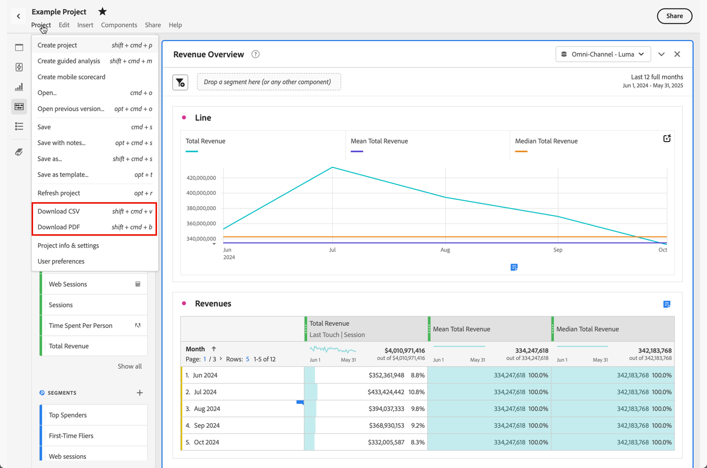
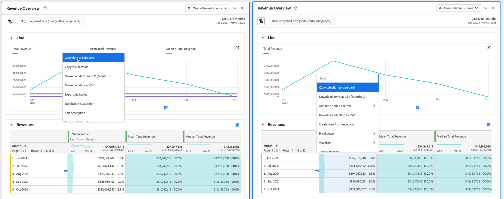
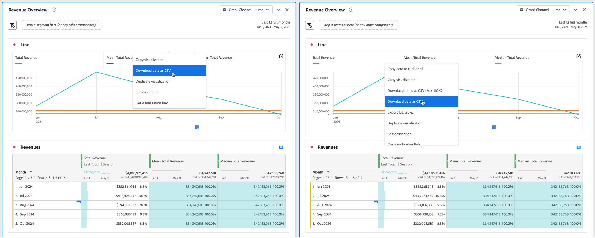
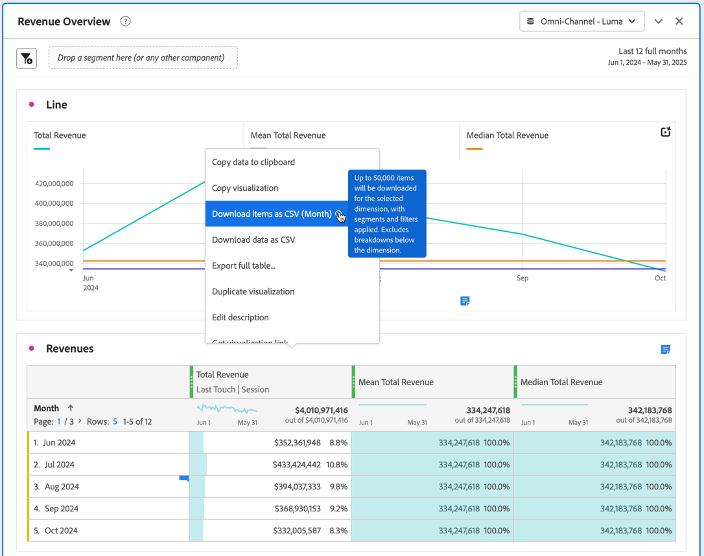
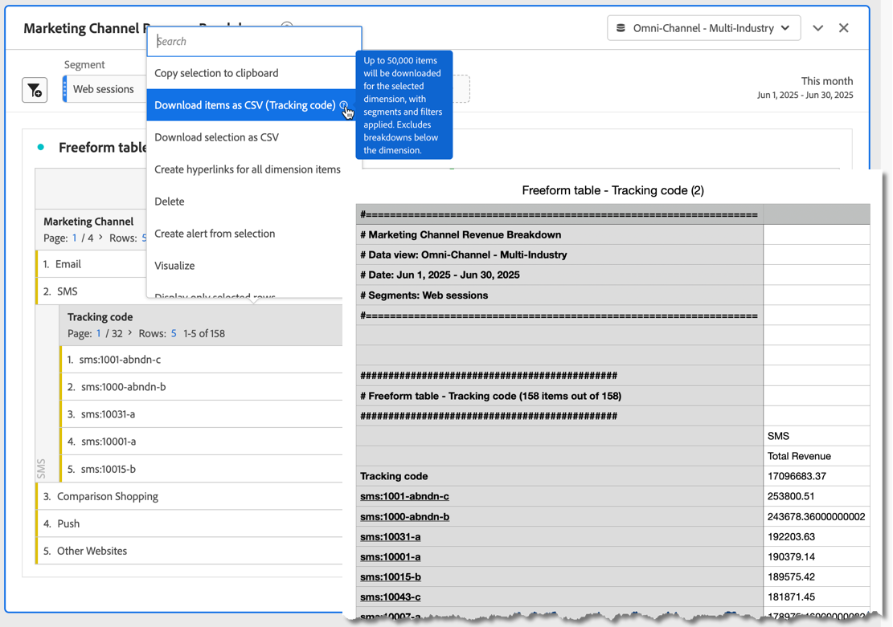

# プロジェクトとデータのダウンロード

Analysis Workspace プロジェクトとデータをローカルデバイスにダウンロードできます。 このダウンロードは、データのコピー、CSV （コンマ区切り値データ）ファイル、またはPDF（ポータブルドキュメントフォーマット）ドキュメントに使用できます。

* ダウンロードしたファイルにビジュアライゼーションを含める場合は、「PDF」オプションを選択します。
* プレーンテキストデータが必要な場合は、「CSVとコピー済みデータ」オプションを選択します。

Customer Journey Analytics データを書き出す他の方法については、[書き出しの概要](/help/analysis-workspace/export/export-project-overview.md)を参照してください。

## プロジェクトをPDFまたはCSV ファイルとしてダウンロード {#download-project}

### プロジェクトをPDF ファイルとしてダウンロード

PDFとしてプロジェクトをダウンロードする際は、次の点を考慮してください。

* プロジェクトがワークステーションにダウンロードされるまで、プロジェクトを離れないでください。 PDFをレンダリングするためにAdobe サーバー上でプロジェクトを再実行するため、ダウンロードには数分かかる場合があります。 ダウンロードのレンダリング中も、引き続きプロジェクトに変更を加えることができます。 PDFのレンダリングに5分以上かかる場合は、代わりに[PDF](../curate-share/send-schedule-files.md)に電子メールを送信するように求められます。
* ダウンロードは、ページ番号が適用されない単一ページとしてレンダリングされます。
* PDFには、Analysis Workspaceのブラウザーページに表示される内容が含まれています。 切り捨てられたコンテンツを避けるには、を選択して、カスタムサイズのビジュアライゼーションまたはパネルのサイズを自動的に変更します。
* フリーフォームテーブル内の[ ハイパーリンク ](/help/analysis-workspace/visualizations/freeform-table/freeform-table-hyperlinks.md)は、ダウンロードしたPDFでクリックできます。

プロジェクトをPDF ファイルとしてダウンロードするには：

1. 「**[!UICONTROL プロジェクト]**」 > 「**[!UICONTROL PDFをダウンロード]**」を選択します。

   緑色のバーが表示され、次のメッセージが表示されます。 **[!UICONTROL ダウンロードがリクエストされました。 お待ちください。]**

1. ダウンロードの準備が整うと、緑色のバーが表示され、次のメッセージが表示されます。 **[!UICONTROL *プロジェクトの名前&#x200B;*PDFの準備ができました。]**

1. 緑色のバーで「**[!UICONTROL ダウンロード]**」を選択します。

   ブラウザーの設定に応じて、PDFは以前に設定したフォルダーに自動的にダウンロードされるか、PDFがダウンロードされるフォルダーを選択するように求められます。

   ファイル名は、*プロジェクト名*～*レポートスイート名*～*日付*&#x200B;で構成されています。 例：`Example Project - Omni-Channel - Luma - Jun 30, 2025.pdf`。

### プロジェクトをCSV ファイルとしてダウンロード

1. **[!UICONTROL プロジェクト]**/**[!UICONTROL CSVをダウンロード]**&#x200B;を選択します。

   ブラウザーの設定に応じて、CSV ファイルは以前に設定したフォルダーに自動的にダウンロードされるか、CSV ファイルがダウンロードされるフォルダーを選択するように求められます。

   ファイル名は、*プロジェクト名*～*レポートスイート名*～*日付*&#x200B;で構成されています。 例：`Example Project - Omni-Channel - Luma - Jun 30, 2025.csv`。

## ビジュアライゼーション内のデータをクリップボードにコピーする {#copy-data}

コンテキストメニューの「**[!UICONTROL クリップボードにコピー]**」オプションを使用すると、Analysis Workspaceからデータをすばやくコピーして、サードパーティツールに貼り付けることができます。

* 表示されたテーブルデータをコピーする場合は、テーブルヘッダーを選択し、コンテキストメニューから「**データをクリップボードにコピー**」を選択します。
* データのサブセットをコピーする場合は、テーブルで選択し、コンテキストメニューから「**選択範囲をクリップボードにコピー**」を選択します。

>[!TIP]
>
>ホットキー&#x200B;**_cmd + c_** （macOS）または&#x200B;**_ctrl + c_** （Windows）を使用して、選択範囲をクリップボードにコピーできます。 次に、**_cmd + v_** （macOS）または&#x200B;**_ctrl + v_** （Windows）を使用して、データを貼り付けます。

{zoomable="yes"}

## ビジュアライゼーション内のデータをCSV ファイルとしてダウンロードする {#download-data}

コンテキストメニューの「CSVとしてダウンロード」オプションを使用すると、任意のビジュアライゼーションのデータテーブルまたはデータソースをCSVとしてダウンロードできます。

それには、次の手順を実行します。

* 任意のテーブルまたはビジュアライゼーションのヘッダーから、コンテキストメニューから「**[!UICONTROL データをCSVとしてダウンロード]**」を選択します。 これにより、テーブルに表示されたデータやビジュアライゼーションの基になるデータソースが CSV 形式でダウンロードされます。

<!-- 
Only relevant as soon as CJA supports Map visualization 
  >[!NOTE]
  >
  >  Note: the Map visualization does not support this option.
-->

* テーブル内で、コンテキストメニューから「**[!UICONTROL 選択をCSV]**&#x200B;としてダウンロード」を選択します。 このオプションでは選択内容のみがダウンロードされ、表示されているテーブル全体はダウンロードされません。

## 項目をCSV ファイルとしてダウンロード {#download-items}

表内の表示される400行を超えるデータを分析する場合は、表見出しまたは任意の行のコンテキストメニューから&#x200B;**項目をCSV （_Dimension名_）**&#x200B;としてダウンロードを選択します。 このオプションでは、選択したディメンションに対して、並べ替えオプションとフィルターを適用した最大 50,000 個のディメンション項目（テーブルの並べ替えに基づく）を書き出します。テーブルの上部からこのオプションを選択すると、テーブルの最初のディメンションが書き出されます。

フリーフォームテーブルには制限は適用されません。 最適なパフォーマンスを確保するために、20列未満のテーブルでこのオプションを使用することをお勧めします。

>[!TIP]
>
> ディメンションが 50,000 項目を超える場合は、異なる並べ替え指標が適用されたファイルをダウンロードするか、セグメントを適用します。例えば、あるダウンロードでは訪問回数の降順で並べ替え、2 回目のダウンロードでは訪問回数の昇順で並べ替えます。この説明は、ロングテールの項目を取得するのに役立ちます。

プロジェクト内で複数のタスクを使用できます。また、ダウンロードの処理中に、同じタブで新しい Workspace プロジェクトに移動することもできます。新しいブラウザータブを開くと、ダウンロードは一時停止します。Workspace を完全に終了するか、ブラウザータブを閉じると、ダウンロードはキャンセルされます。

### ダウンロードした項目ファイル {#items-file}

フリーフォームテーブルの次の機能は、ダウンロードしたファイルに適用されます。

* すべてのパネルセグメントがフィルターとして適用されます。
* テーブルで選択されたディメンションの&#x200B;**上**&#x200B;の分類は、各列よりも上のフィルターとして適用されます。
* テーブル内で選択されたディメンションよりも&#x200B;**下**&#x200B;の分類は削除されます。

### ダウンロード通知 {#notifications}

ファイルがダウンロードされると、次の通知が表示されます。

* 青い&#x200B;**[!UICONTROL _テーブル名&#x200B;_-_Dimension _.csvがリクエストされました。_x _%完了]**進行状況を示します。 いつでもダウンロードをキャンセルするには、「**[!UICONTROL ダウンロードをキャンセル]**」を選択します。 メッセージを閉じる場合は、を選択します。これにより、ダウンロードがキャンセルされません。
* ファイルのダウンロードが完了すると、緑色の&#x200B;**[!UICONTROL _テーブル名&#x200B;_-_Dimension _.csvがダウンロードされました]**。 ファイルは、ブラウザー用に設定されたダウンロードフォルダーにダウンロードされます。

一度に複数のダウンロードをリクエストする場合、前のダウンロードが完了するまで、追加のダウンロードがキューに入れられるという通知が届きます。

## 機密データのダウンロード {#sensitive}

データのダウンロードを防ぐ[ データガバナンスポリシー](/help/data-views/data-governance.md)を想像してみてください。 このポリシーは、レポート対象のデータビューでオンになっています。 その結果、プロジェクトのダウンロード（PDF ファイルを電子メールで送信したり共有したりする場合など）では、機密性の高いデータフィールドがハッシュ化されます。 Analysis Workspaceでもこれらのフィールドについて分析できます。 プロジェクトを電子メールで送信するか、その他の方法で共有しようとすると、PDFまたはCSV ファイルに機密データフィールドが空として表示されます。

機密性の高いラベルが付いたデータフィールドがデータビューに含まれる場合、画面からデータを選択してコピーするオプションは、データビュー内のすべてのデータに対して制限されます。

## FAQ {#faq}

| 質問 | 回答 |
| --- | --- |
| ダウンロードしたPDFが1 ページのみなのはなぜですか？ | [PDFのダウンロード ](#download-as-csv-or-pdf)機能では、ダウンロードしたPDFにページネーションを設定できません。 |
| **[!UICONTROL 項目をCSV]**&#x200B;としてダウンロードするオプションを使用して、50,000件以上の項目を書き出せますか？ | 各ダウンロードには最大 50,000 個のディメンションアイテムを含めることができますが、テーブルの種類を変更してテールがより長いアイテムを取得したり、フィルターを適用して特定のアイテムをダウンロードしたりできます。 |
| 「**[!UICONTROL ビジュアライゼーションをコピー]**」は何を実行しますか？ | [!UICONTROL **クリップボードにデータをコピー**]&#x200B;または&#x200B;[!UICONTROL **クリップボードに選択範囲をコピー**]&#x200B;とは異なり、**[!UICONTROL ビジュアライゼーションをコピー]** コンテキストメニューオプションは書き出しオプションではありません。 このオプションを使用すると、Workspaceのある場所から別の場所に[ ビジュアライゼーション ](/help/analysis-workspace/visualizations/freeform-analysis-visualizations.md#context-menu)または[ パネル ](/help/analysis-workspace/c-panels/panels.md#context-menu)をコピーできます。 例えば、同じプロジェクト内のパネル間の移動、または別のプロジェクト間の移動などです。 |
