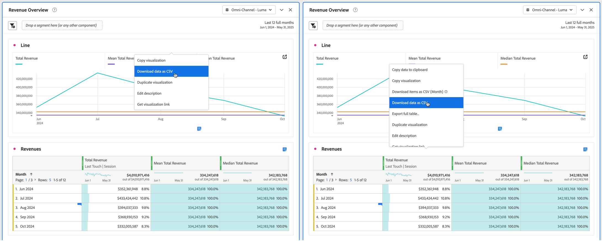

# プロジェクトとデータのダウンロード

Analysis Workspace プロジェクトとデータをローカルデバイスにダウンロードできます。 このダウンロードは、データのコピー、CSV （コンマ区切り値データ）ファイルまたはPDF（Portable Document Format）ドキュメントにすることができます。

* ダウンロードしたファイルにビジュアライゼーションを含める場合は、「PDF」オプションを選択します。
* プレーンテキストデータのみが必要な場合は、「CSV」オプションと「コピーしたデータ」オプションを選択します。

Customer Journey Analytics データを書き出すその他の方法については、[ 書き出しの概要 ](/help/analysis-workspace/export/export-project-overview.md) を参照してください。

## プロジェクトをPDFまたは CSV ファイルとしてダウンロードする {#download-project}

### プロジェクトをPDF ファイルとしてダウンロードする

プロジェクトを as a PDFとしてダウンロードする場合は、次の点に注意してください。

* プロジェクトがワークステーションにダウンロードされるまで、プロジェクトから移動しないでください。 PDFがレンダリングされるように、Adobe サーバーでプロジェクトが再実行されるので、ダウンロードには数分かかることがあります。 ダウンロードのレンダリング中も、引き続きプロジェクトに変更を加えることができます。 PDFのレンダリングに 5 分以上かかる場合は、代わりに [PDFにメールを送信 ](../curate-share/send-schedule-files.md) するよう求められます。
* ダウンロードは、ページ番号が適用されない単一ページとしてレンダリングされます。
* PDFには、Analysis Workspaceのブラウザーページに表示される内容が含まれています。 コンテンツが切り詰められるのを防ぐには、 を選択して、カスタムサイズのビジュアライゼーションまたはパネルのサイズを自動で調整します。
* フリーフォームテーブル内の [ ハイパーリンク ](/help/analysis-workspace/visualizations/freeform-table/freeform-table-hyperlinks.md) は、ダウンロードしたPDFでクリックできます。

プロジェクトをPDF ファイルとしてダウンロードするには：

1. **[!UICONTROL プロジェクト]**/**[!UICONTROL PDFをダウンロード]** を選択します。

   緑色のバーが表示され、次のメッセージが表示されます。**[!UICONTROL ダウンロードがリクエストされました。 お待ちください。]**

1. ダウンロードの準備が整うとすぐに、緑色のバーが表示され、次のメッセージが表示されます。**[!UICONTROL *プロジェクト名 *PDFの準備が整いました。]**

1. 緑のバーで「**[!UICONTROL ダウンロード]**」を選択します。

   ブラウザーの設定に応じて、PDFが以前に設定したフォルダーに自動的にダウンロードされるか、PDFのダウンロード先となるフォルダーを選択するよう求められます。

   ファイル名は、*プロジェクト名* - *レポートスイート名* - *日付* で構成されます。 例：`Example Project - Omni-Channel - Luma - Jun 30, 2025.pdf`。

### プロジェクトを CSV ファイルとしてダウンロード

1. **[!UICONTROL プロジェクト]**/**[!UICONTROL CSV をダウンロード]** を選択します。

   ブラウザーの設定に応じて、CSV ファイルは自動的に、以前に設定したフォルダーにダウンロードされます。または、CSV ファイルがダウンロードされるフォルダーを選択するよう求められます。

   ファイル名は、*プロジェクト名* - *レポートスイート名* - *日付* で構成されます。 例：`Example Project - Omni-Channel - Luma - Jun 30, 2025.csv`。

## ビジュアライゼーション内のデータをクリップボードにコピー {#copy-data}

コンテキストメニューの **[!UICONTROL クリップボードにコピー]** オプションを使用すると、Analysis Workspaceからデータをすばやくコピーし、サードパーティのツールに貼り付けることができます。

* 表示されたテーブルデータをコピーする場合は、テーブルヘッダーを選択し、コンテキストメニューから **データをクリップボードにコピー** を選択します。
* データのサブセットをコピーする場合は、テーブルに選択範囲を作成し、コンテキストメニューから **選択範囲をクリップボードにコピー** を選択します。

>[!TIP]
>
>ホットキー **_cmd + c_** （macOS）または **_ctrl + c_** （Windows）を使用して、選択範囲をクリップボードにコピーできます。 次に、**_cmd + v_** （macOS）または **_ctrl + v_** （Windows）を使用して、データを貼り付けます。

{zoomable="yes"}

## ビジュアライゼーション内のデータを CSV ファイルとしてダウンロード {#download-data}

コンテキストメニューの「CSV としてダウンロード」オプションを使用すると、データのテーブルまたはビジュアライゼーションのデータソースを CSV としてダウンロードできます。

それには、次の手順を実行します。

* 任意のテーブルまたはビジュアライゼーションのヘッダーで、コンテキストメニューから **[!UICONTROL データを CSV としてダウンロード]** を選択します。 これにより、テーブルに表示されたデータやビジュアライゼーションの基になるデータソースが CSV 形式でダウンロードされます。

<!-- Only relevant as soon as CJA supports Map visualization 
  >[!NOTE]
  >
  >  Note: the Map visualization does not support this option.
-->

* コンテキストメニューからテーブル内の **[!UICONTROL 選択を CSV としてダウンロード]** を選択します。 このオプションでは選択内容のみがダウンロードされ、表示されているテーブル全体はダウンロードされません。

## 項目を CSV ファイルとしてダウンロード {#download-items}

テーブルに表示されている 400 行を超えるデータを分析する場合は、テーブルヘッダーまたは任意の行のコンテキストメニューから「**項目を CSV としてダウンロード（_Dimension名_）**」を選択します。 このオプションでは、選択したディメンションに対して、並べ替えオプションとフィルターを適用した最大 50,000 個のディメンション項目（テーブルの並べ替えに基づく）を書き出します。テーブルの上部からこのオプションを選択した場合、テーブルの最初のディメンションがエクスポートされます。

フリーフォームテーブルに制限は適用されません。 最適なパフォーマンスを確保するために、20 列未満のテーブルでこのオプションを使用することをお勧めします。

>[!TIP]
>
> ディメンションが 50,000 項目を超える場合は、異なる並べ替え指標が適用されたファイルをダウンロードするか、セグメントを適用します。例えば、あるダウンロードでは訪問回数の降順で並べ替え、2 回目のダウンロードでは訪問回数の昇順で並べ替えます。この説明は、ロングテールの項目を取得するのに役立ちます。

プロジェクト内で複数のタスクを使用できます。また、ダウンロードの処理中に、同じタブで新しい Workspace プロジェクトに移動することもできます。新しいブラウザータブを開くと、ダウンロードは一時停止します。Workspace を完全に終了するか、ブラウザータブを閉じると、ダウンロードはキャンセルされます。

### ダウンロードした項目ファイル {#items-file}

ダウンロードされたファイルには、フリーフォームテーブルの次の機能が適用されます。

* すべてのパネルセグメントがフィルターとして適用されます。
* テーブルで選択されたディメンションの&#x200B;**上**&#x200B;の分類は、各列よりも上のフィルターとして適用されます。
* テーブル内で選択されたディメンションよりも&#x200B;**下**&#x200B;の分類は削除されます。

### ダウンロード通知 {#notifications}

ファイルがダウンロードされると、次の通知が表示されます。

* 青い **[!UICONTROL _テーブル名 _-_Dimension _.csv がリクエストされています。_x _% 完了]**&#x200B;進行状況を示します。 ダウンロードをキャンセルするには、「**[!UICONTROL ダウンロードをキャンセル]**」を選択します。 メッセージを閉じる場合は、「」を選択します。この場合、ダウンロードはキャンセルされません。
* 緑色の **[!UICONTROL _テーブル名 _-_Dimension _.csv がダウンロードされました]**&#x200B;ファイルのダウンロードが完了すると、完了通知が表示されます。 ファイルがブラウザーに設定されたダウンロードフォルダーにダウンロードされます。

一度に複数のダウンロードをリクエストすると、前のダウンロードが完了するまで、追加の各ダウンロードはキューに入れられるという通知が届きます。

## 機密データのダウンロード {#sensitive}

データのダウンロードを防ぐ [ データガバナンスポリシー ](/help/data-views/data-governance.md) を想像します。 レポート対象のデータビューでこのポリシーをオンにする。 その結果、プロジェクトのダウンロード（メール送信やPDF ファイルの共有など）によって、機密としてラベル付けされたデータフィールドがハッシュ化されます。 Analysis Workspaceのこれらのフィールドに対して、引き続き分析を行うことができます。 プロジェクトをメールで送信しようとした場合や共有しようとした場合、PDFまたは CSV ファイルでは、機密データフィールドが空として表示されます。

機密としてラベル付けされたデータフィールドがデータビューに含まれている場合、画面からデータを選択してコピーするオプションは、データビュー内のすべてのデータに対して制限されます。

## FAQ {#faq}

| 質問 | 回答 |
| --- | --- |
| ダウンロードしたPDFが 1 ページのみで構成されているのはなぜですか？ | [PDFをダウンロード ](#download-as-csv-or-pdf) 機能では、ダウンロードされた PDF にページ番号は付けられません。 |
| 「**[!UICONTROL 項目を CSV としてダウンロード]**」オプションを使用して 50,000 個を超える項目を書き出すことはできますか？ | 各ダウンロードには最大 50,000 個のディメンションアイテムを含めることができますが、テーブルの種類を変更してテールがより長いアイテムを取得したり、フィルターを適用して特定のアイテムをダウンロードしたりできます。 |
| 「**[!UICONTROL ビジュアライゼーションをコピー]**」は何を実行しますか？ | [!UICONTROL **データをクリップボードにコピー**] または [!UICONTROL **選択範囲をクリップボードにコピー**] とは異なり、**[!UICONTROL ビジュアライゼーションをコピー]** コンテキストメニューオプションはエクスポートオプションではありません。 このオプションを使用すると、Workspace内のある場所から別の場所に [ ビジュアライゼーションをコピー ](/help/analysis-workspace/visualizations/freeform-analysis-visualizations.md#context-menu) または [ パネルをコピー ](/help/analysis-workspace/c-panels/panels.md#context-menu) できます。 例えば、同じプロジェクト内のパネル間、またはプロジェクト間でコピーできます。 |
