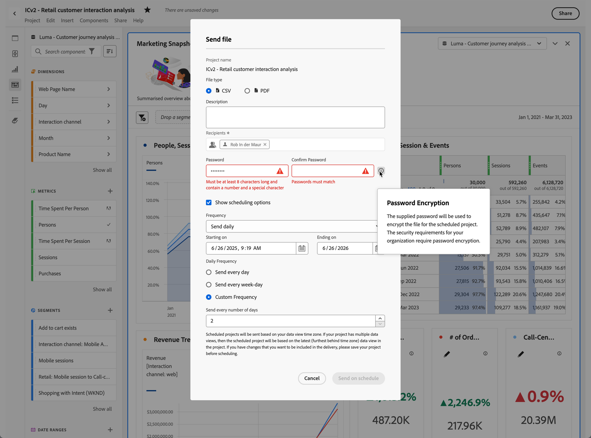

# プロジェクトの送信とスケジュール

Customer Journey Analytics プロジェクトをファイルとして、選択したユーザーにメールで送信できます。 アドホックでファイルを送信することも、スケジュールに従って送信するようにプロジェクトを設定することもできます。 プロジェクトは CSV 形式またはPDF形式で送信できます。

プロジェクトに適用されたタグは、書き出しに自動的に適用されます。

[書き出しの概要](/help/analysis-workspace/export/export-project-overview.md)の説明に従って、Customer Journey Analytics データを書き出す他の方法も使用できます。

## ファイルを送信

メールで受信者にファイルを送信するには、次の手順に従います。

1. **[!UICONTROL 共有 &#x200B;]/[!UICONTROL &#x200B; ファイルを送信]** を選択します。
1. 次のいずれかのファイルタイプを指定します。
   * [!UICONTROL **CSV**]：プレーンテキストデータが必要な場合は、このオプションを選択します。
   * [!UICONTROL **PDF**]：ダウンロードしたファイルに、プロジェクト内に表示されているすべてのテーブルとビジュアライゼーションを含める場合は、このオプションを選択します。
1. （任意） **[!UICONTROL 説明]** を使用して、メールに含める説明を追加します。
1. 受信者またはグループを追加します。メールアドレスを入力することもできます。
1. （Healthcare Shield のお客様のみ）パスワードを入力して [ 予定レポートをパスワードで保護 ](#password-protect-a-new-scheduled-project) ます。
1. （任意） **[!UICONTROL スケジュールオプションを表示]** を選択して [ ファイルの書き出しをスケジュール ](#schedule-file-export) します。
1. **[!UICONTROL 今すぐ送信]** をクリックします。 「**[!UICONTROL キャンセル]**」を選択すると、キャンセルします。

## ファイルの書き出しをスケジュール {#schedule}

受信者にメールでスケジュールに従ってファイルを送信するには

1. **[!UICONTROL 共有 &#x200B;]/[!UICONTROL &#x200B; ファイル書き出しをスケジュール]** を選択します。
1. 次のいずれかのファイルタイプを指定します。
   * [!UICONTROL **CSV**]：プレーンテキストデータが必要な場合は、このオプションを選択します。
   * [!UICONTROL **PDF**]：ダウンロードしたファイルに、プロジェクト内に表示されているすべてのテーブルとビジュアライゼーションを含める場合は、このオプションを選択します。
1. （任意） **[!UICONTROL 説明]** を使用して、メールに含める説明を追加します。
1. 受信者またはグループを追加します。メールアドレスを入力することもできます。
1. （Healthcare Shield のお客様のみ）パスワードを入力して [ 予定レポートをパスワードで保護 ](#password-protect-a-new-scheduled-project) ます。
1. **[!UICONTROL スケジュールオプションを表示]** が選択されていることを確認します。
1. **[!UICONTROL 頻度]** を選択します。 次のいずれかを選択できます。

   | 頻度 | オプション |
   |---|---|
   | **[!UICONTROL 1 時間ごとに送信]** | **[!UICONTROL 時間数ごとに送信]** の値を入力します。 |
   | **[!UICONTROL 毎日送信]** | **[!UICONTROL 1 日の頻度]**:**[!UICONTROL 毎日送信]**、**[!UICONTROL 平日ごとに送信]**、または **[!UICONTROL カスタム頻度]** を選択します。  「カスタム頻度 **[!UICONTROL を選択した場合は、]** 日数ごとに送信 **[!UICONTROL の値を入力し]** す。 |
   | **[!UICONTROL 毎週送信]** | **[!UICONTROL 週数ごとに送信]** の値を入力します。 **[!UICONTROL 曜日]** を選択します。 |
   | **[!UICONTROL 毎月曜日に送信]** | **[!UICONTROL 曜日]** と **[!UICONTROL 週]** を選択します。 |
   | **[!UICONTROL 毎月日ごとに送信]** | **[!UICONTROL その月のこの日に送信]** から値を選択します。 |
   | **[!UICONTROL 毎年、その月の日ごとに送信]** | 「**[!UICONTROL 曜日]**」を選択し、「**[!UICONTROL 週]**」を選択して、「**[!UICONTROL 月]**」を選択します。 |
   | **[!UICONTROL 特定の日付で毎年送信]** | **[!UICONTROL 月]** を選択し、**[!UICONTROL その月のこの日に送信]** から値を選択します。 |

1. 開始日を **[!UICONTROL 開始日]** に入力します。 または、「」を選択して、カレンダーから開始日を選択します。

1. 終了日を **[!UICONTROL 終了日]** に入力します。 または、「」を選択して、カレンダーから終了日を選択します。
1. 「**[!UICONTROL スケジュールに従って送信]**」を選択します。 「**[!UICONTROL キャンセル]**」を選択すると、キャンセルします。

## スケジュールされたプロジェクトのパスワード保護 {#password}

<!-- markdownlint-disable MD034 -->

>[!CONTEXTUALHELP]
>id="workspace_sendfile_password"
>title="パスワードの暗号化"
>abstract="指定されたパスワードは、スケジュールされたプロジェクトのファイルを暗号化するために使用されます。組織のセキュリティ要件では、パスワードの暗号化が必須です。"

<!-- markdownlint-enable MD034 -->

>[!NOTE]
>
>スケジュールされたプロジェクトをパスワードで保護するオプションは、[Healthcare Shield](https://business.adobe.com/solutions/industries/healthcare.html) アドオン製品を購入された Customer Journey Analytics のお客様のみに表示されます。

アドビは、スケジュールされたプロジェクトを .pdf 形式と .csv 形式のどちらで送信した場合でも、パスワードを使用して暗号化します。

Healthcare Shield SKU を購入して有効にすると、次の状況でスケジュールされたプロジェクトのパスワードを作成するプロンプトが表示されます。

* 誰かがスケジュールされたプロジェクトを新規作成する場合。

* 既存のスケジュールされたプロジェクトが送信されようとしている場合。現在スケジュールされているプロジェクトは、パスワード保護が行われるまで無効になります。スケジュールされたプロジェクトの所有者に、この要件を通知するメールが送信されます。

### パスワード要件

パスワード要件は、アドビの規格に準拠しており、数字 1 文字以上および特殊文字 1 文字以上を含める 8 文字以上のパスワードが必要です。

### 新しくスケジュールされたプロジェクトのパスワード保護

1. プロジェクトを保存したら、**[!UICONTROL 共有]**／**[!UICONTROL 今すぐファイルを送信]**&#x200B;または&#x200B;**[!UICONTROL 共有]**／**[!UICONTROL スケジュールに従ってファイルを送信]**&#x200B;に移動します。
1. [今すぐファイルを送信](https://experienceleague.adobe.com/docs/analytics-platform/using/cja-workspace/export/t-schedule-report.html#now)または[スケジュールに従ってファイルを送信](https://experienceleague.adobe.com/docs/analytics-platform/using/cja-workspace/export/t-schedule-report.html#schedule)で、上記の手順に従います。

### 既存のスケジュール済みプロジェクトのパスワード保護

既存のスケジュール済みプロジェクトをパスワードで保護すると、プロジェクト所有者に次のようなメールが届きます。

1. Customer Journey Analytics にログインします。
1. 「**[!UICONTROL スケジュールされたプロジェクトを表示]**」を選択します。
1. **[!UICONTROL スケジュールされたプロジェクトを編集]**&#x200B;ダイアログで、パスワードを入力、再入力します。
1. スケジュールされたプロジェクトの受信者に、このパスワードを知らせます。スケジュールされたプロジェクトの受信者でない人物にパスワードを配布しないでください。

## スケジュール済みプロジェクトマネージャー {#manager}

スケジュールされたAnalysis Workspace プロジェクトは、**[!UICONTROL コンポーネント]**/**[!UICONTROL スケジュールされたプロジェクト]** を使用して、メインインターフェイスから管理できます。 詳しくは、[スケジュール済みプロジェクト](/help/components/scheduled-projects-manager.md)を参照してください。
