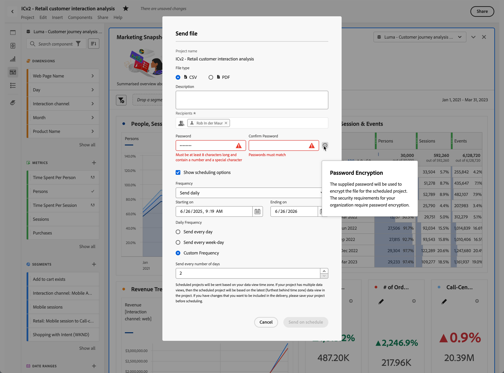
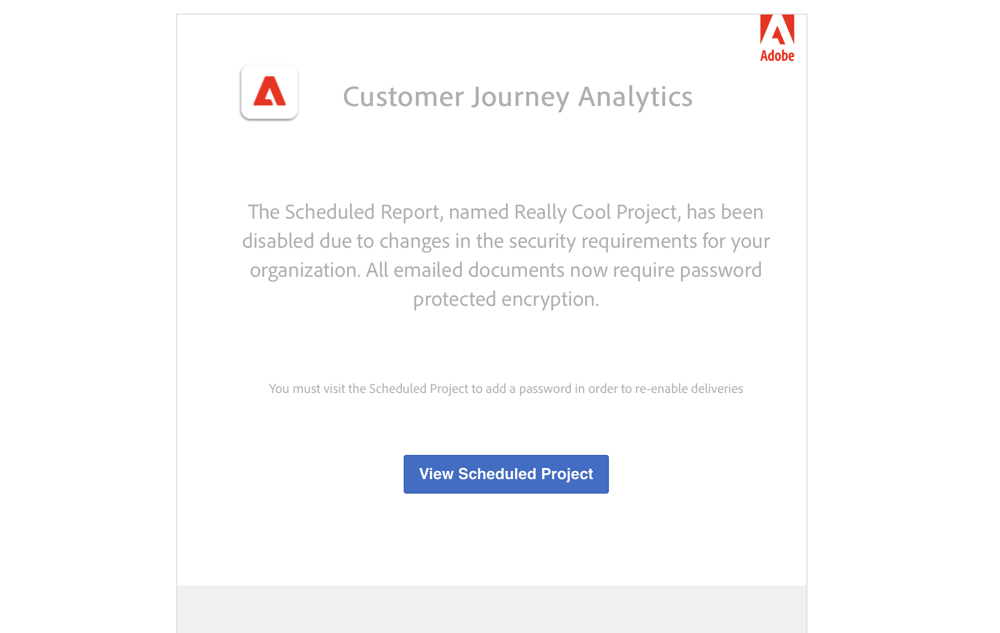

# プロジェクトの送信とスケジュール

選択したユーザーに電子メールでCustomer Journey Analytics プロジェクトをファイルとして送信できます。 ファイルを一時的に送信することも、スケジュールに従って送信するようにプロジェクトを設定することもできます。

ファイルを送信する際には、次の点に注意してください。

* ファイルは CSV 形式または PDF 形式で送信できます。

* プロジェクトに適用されたタグは、書き出しに自動的に適用されます。

[書き出しの概要](/help/analysis-workspace/export/export-project-overview.md)の説明に従って、Customer Journey Analytics データを書き出す他の方法も使用できます。

## ファイルを送信

受信者に電子メールでファイルを送信するには：

1. **[!UICONTROL 共有] / [!UICONTROL &#x200B; ファイルを送信]**&#x200B;を選択します。
1. 次のいずれかのファイルタイプを指定します。
   * [!UICONTROL **CSV**]：プレーンテキストデータが必要な場合は、このオプションを選択します。
   * [!UICONTROL **PDF**]：ダウンロードしたファイルに、プロジェクト内に表示されているすべてのテーブルとビジュアライゼーションを含める場合は、このオプションを選択します。
1. （オプション） **[!UICONTROL 説明]**&#x200B;を使用して、メールに含める説明を追加します。
1. 受信者またはグループを追加します。 メールアドレスも入力できます。
1. （Healthcare Shieldのお客様のみ）スケジュール済みレポートをパスワードで保護する[にパスワードを提供します](#password-protect-a-new-scheduled-project)。
1. （オプション）「**[!UICONTROL スケジュール設定オプションを表示]**」から「[&#x200B; ファイルの書き出しをスケジュール &#x200B;](#schedule-file-export)」を選択します。
1. 「**[!UICONTROL 今すぐ送信]**」をクリックします。 「**[!UICONTROL キャンセル]**」を選択すると、キャンセルします。

## ファイルの書き出しをスケジュール {#schedule}

スケジュール上のファイルを受信者に電子メールで送信するには：

1. **[!UICONTROL 共有]/[!UICONTROL &#x200B; ファイルの書き出しをスケジュール]**&#x200B;を選択します。
1. 次のいずれかのファイルタイプを指定します。
   * [!UICONTROL **CSV**]：プレーンテキストデータが必要な場合は、このオプションを選択します。
   * [!UICONTROL **PDF**]：ダウンロードしたファイルに、プロジェクト内に表示されているすべてのテーブルとビジュアライゼーションを含める場合は、このオプションを選択します。
1. （オプション） **[!UICONTROL 説明]**&#x200B;を使用して、メールに含める説明を追加します。
1. 受信者またはグループを追加します。 メールアドレスも入力できます。
1. （Healthcare Shieldのお客様のみ）スケジュール済みレポートをパスワードで保護する[にパスワードを提供します](#password-protect-a-new-scheduled-project)。
1. **[!UICONTROL スケジュール設定オプションを表示]**&#x200B;が選択されていることを確認します。
1. **[!UICONTROL 頻度]**&#x200B;を選択します。 次のいずれかを選択できます。

   | 頻度 | オプション |
   |---|---|
   | **[!UICONTROL 1時間ごとに送信]** | **[!UICONTROL 時間ごとに送信]**&#x200B;する値を入力してください。 |
   | **[!UICONTROL 毎日送信]** | **[!UICONTROL 毎日の頻度]**&#x200B;を選択：**[!UICONTROL 毎日の送信]**、**[!UICONTROL 毎週毎日の送信]**、または&#x200B;**[!UICONTROL カスタム頻度]**。  「**[!UICONTROL カスタム頻度]**」を選択した場合、**[!UICONTROL 日数ごとに送信]**&#x200B;の値を入力します。 |
   | **[!UICONTROL 毎週送信]** | **[!UICONTROL 週ごとに送信]**&#x200B;する値を入力してください。 「**[!UICONTROL 週の日]**」を選択します。 |
   | **[!UICONTROL 曜日ごとに月単位で送信]** | **[!UICONTROL 週の日]**&#x200B;と&#x200B;**[!UICONTROL 週の月]**&#x200B;を選択します。 |
   | **[!UICONTROL 月ごとの月次送信]** | **[!UICONTROL 月のこの日に送信]**&#x200B;から値を選択します。 |
   | **[!UICONTROL 月の日付ごとに毎年送信]** | **[!UICONTROL 週の日]**&#x200B;を選択し、**[!UICONTROL 月]**&#x200B;を選択し、**[!UICONTROL 年の月]**&#x200B;を選択します。 |
   | **[!UICONTROL 特定の日付ごとに毎年送信]** | **[!UICONTROL 年の月]**&#x200B;を選択し、**[!UICONTROL 月のこの日に送信]**&#x200B;から値を選択します。 |

1. **[!UICONTROL 開始日を]**&#x200B;から入力してください。 または、を選択して、カレンダーから開始日を選択します。

1. 終了日を&#x200B;**&#x200B;**&#x200B;に入力してください。 または、を選択して、カレンダーから終了日を選択します。
1. 「**[!UICONTROL スケジュールに送信]**」を選択します。 「**[!UICONTROL キャンセル]**」を選択すると、キャンセルします。

## スケジュールされたプロジェクトのパスワード保護 {#password}

<!-- markdownlint-disable MD034 -->

>[!CONTEXTUALHELP]
>id="workspace_sendfile_password"
>title="パスワードの暗号化"
>abstract="指定されたパスワードは、スケジュールされたプロジェクトのファイルを暗号化するために使用されます。 組織のセキュリティ要件では、パスワードの暗号化が必須です。"

<!-- markdownlint-enable MD034 -->

>[!NOTE]
>
>スケジュールされたプロジェクトをパスワードで保護するオプションは、[Healthcare Shield](https://business.adobe.com/jp/solutions/industries/healthcare.html) アドオン製品を購入された Customer Journey Analytics のお客様のみに表示されます。

アドビは、スケジュールされたプロジェクトを .pdf 形式と .csv 形式のどちらで送信した場合でも、パスワードを使用して暗号化します。

Healthcare Shield SKU を購入して有効にすると、次の状況でスケジュールされたプロジェクトのパスワードを作成するプロンプトが表示されます。

* 誰かがスケジュールされたプロジェクトを新規作成する場合。

* 既存のスケジュールされたプロジェクトが送信されようとしている場合。 現在スケジュールされているプロジェクトは、パスワード保護が行われるまで無効になります。 スケジュールされたプロジェクトの所有者に、この要件を通知するメールが送信されます。

### パスワード要件

パスワード要件は、アドビの規格に準拠しており、数字 1 文字以上および特殊文字 1 文字以上を含める 8 文字以上のパスワードが必要です。

### 新しくスケジュールされたプロジェクトのパスワード保護

1. プロジェクトを保存したら、**[!UICONTROL 共有]**／**[!UICONTROL 今すぐファイルを送信]**&#x200B;または&#x200B;**[!UICONTROL 共有]**／**[!UICONTROL スケジュールに従ってファイルを送信]**&#x200B;に移動します。
1. [今すぐファイルを送信](https://experienceleague.adobe.com/docs/analytics-platform/using/cja-workspace/export/t-schedule-report.html?lang=ja#now)または[スケジュールに従ってファイルを送信](https://experienceleague.adobe.com/docs/analytics-platform/using/cja-workspace/export/t-schedule-report.html?lang=ja#schedule)で、上記の手順に従います。

### 既存のスケジュール済みプロジェクトのパスワード保護

既存のスケジュール済みプロジェクトをパスワードで保護すると、プロジェクト所有者は次のようなメールを受信します。

1. Customer Journey Analytics にログインします。
1. 「**[!UICONTROL スケジュールされたプロジェクトを表示]**」を選択します。
1. **[!UICONTROL スケジュールされたプロジェクトを編集]**&#x200B;ダイアログで、パスワードを入力、再入力します。
1. スケジュールされたプロジェクトの受信者に、このパスワードを知らせます。 スケジュールされたプロジェクトの受信者でない人物にパスワードを配布しないでください。

## スケジュール済みプロジェクトマネージャー {#manager}

スケジュールされたAnalysis Workspace プロジェクトは、**[!UICONTROL コンポーネント]**/**[!UICONTROL スケジュールされたプロジェクト]**&#x200B;を使用して、メイン インターフェイスから管理できます。 詳しくは、[スケジュール済みプロジェクト](/help/components/scheduled-projects-manager.md)を参照してください。
