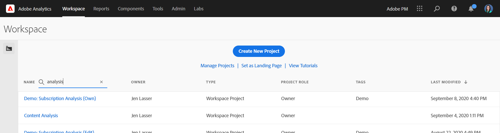
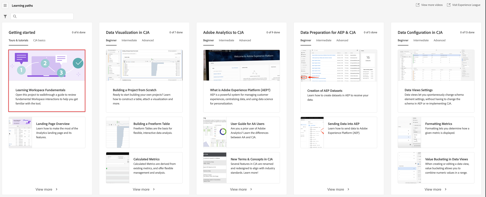

# Analysis Workspace の概要

>[!NOTE]
>
>Customer Journey Analytics 内の Analysis Workspace に関するドキュメントを表示しています。この機能セットは、[従来の Adobe Analytics の Analysis Workspace](https://experienceleague.adobe.com/docs/analytics/analyze/analysis-workspace/home.html?lang=ja#analysis-workspace) とは少し異なります。[詳細情報...](/help/getting-started/cja-aa.md)

Analysis Workspace は分析をすばやく構築してインサイトを共有できる、柔軟なブラウザーツールです。ドラッグ&amp;ドロップのインターフェイスを使用して、分析の作成、ビジュアライゼーションの追加をおこない、データを活用、データセットをキュレーション、組織内の任意のユーザーとプロジェクトを共有およびスケジュールできます。

数分しか時間が取れない場合は、この短い概要を視聴し、何ができるかをご確認ください。

>[!VIDEO](https://video.tv.adobe.com/v/26266/?quality=12)

## Customer Journey Analytics へのログイン {#login}

Analysis Workspace を使い始めるには、[experience.adobe.com/analytics](https://experience.adobe.com/analytics) に移動して、Customer Journey Analytics にログインします。これまでに特定のプロジェクトを選択したことがない場合は、ワークスペースプロジェクトリストのホームページに移動します。

## トレーニングチュートリアルの使用 {#training-tutorial}

ログインしたらまず、Analysis Workspace トレーニングチュートリアルに移動します。このチュートリアルでは、ワークスペースで最初の分析を構築するための一般的な用語と手順を説明します。チュートリアルを開始するには、「**[!UICONTROL 新規プロジェクトを作成]**」をクリックし、新しいプロジェクトモーダル内で「**トレーニングチュートリアル**」を選択します。

## 新規プロジェクトを作成 {#new-project}

チュートリアルが完了したら、最初のプロジェクトの構築を開始する準備が整います。**新しいプロジェクトモーダル**&#x200B;には、分析を開始するための様々なオプションが用意されています。ブラウザーと Customer Journey Analytics ダッシュボードモバイルアプリのどちらで分析を共有するかに応じて、空のプロジェクトまたは[空のモバイルスコアカード](/help/mobile-app/curator.md)のどちらで開始するかを選択できます。

## 分析の構築 {#analysis}

ワークスペースプロジェクトでは、左パネルから&#x200B;**パネル、テーブル、ビジュアライゼーションおよびコンポーネント**&#x200B;にアクセスします。これらはプロジェクトの構成要素です。

### コンポーネント

**コンポーネント**&#x200B;は、ディメンション、指標、フィルターまたは日付範囲です。これらすべてを&#x200B;**[!UICONTROL フリーフォームテーブル]**&#x200B;で組み合わせることで、ビジネスに関する質問への回答を開始することができます。分析を開始する前に、各[コンポーネントのタイプ](/help/components/overview.md)について理解しておく必要があります。コンポーネントの用語を習得したら、**[!UICONTROL フリーフォームテーブル]**&#x200B;でドラッグ&amp;ドロップを開始し、[分析を構築](/help/analysis-workspace/build-workspace-project/freeform-overview.md)します。

### ビジュアライゼーション

次に、棒グラフや折れ線グラフなどの&#x200B;**ビジュアライゼーション**&#x200B;をデータに追加して、データに命を吹き込みます。左端のパネルで、中央の&#x200B;**[!UICONTROL ビジュアライゼーション]**&#x200B;アイコンを選択し、使用可能な[ビジュアライゼーション](/help/analysis-workspace/visualizations/freeform-analysis-visualizations.md)の完全なリストを表示します。

### パネル

**パネル**&#x200B;を使用すると、プロジェクト内の分析を整理し、多数のテーブルやビジュアライゼーションを含めることができます。Analysis Workspace で提供される多くのパネルは、少数のユーザー入力に基づいてフルセットの分析を生成します。左端のパネルで上部の&#x200B;**[!UICONTROL パネル]**&#x200B;アイコンを選択し、使用可能な [パネル](/help/analysis-workspace/c-panels/panels.md)の完全なリストを表示します。

## その他のリソース {#resources}

* アドビでは、数百もの[Analytics ビデオトレーニングチュートリアル](https://experienceleague.adobe.com/docs/analytics-learn/tutorials/overview.html?lang=ja)を提供しています。
