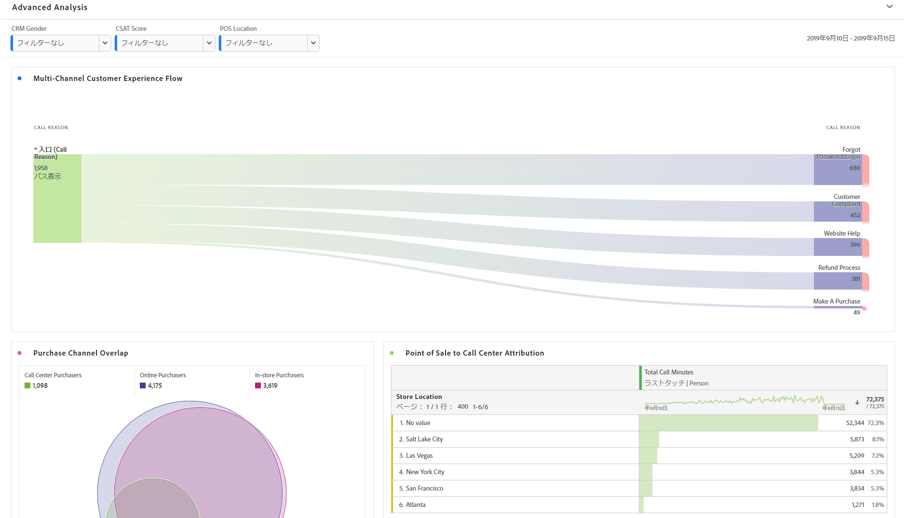
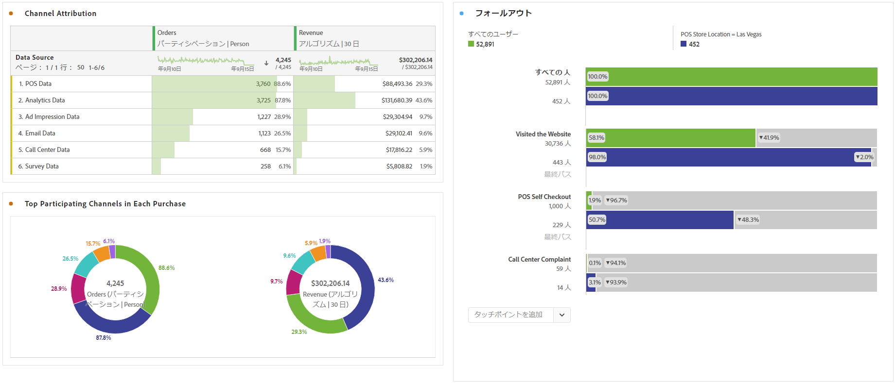

# アドバンス分析の実行

>[!NOTE]
>
>Customer Journey Analytics 内の Analysis Workspace に関するドキュメントを表示しています。この機能セットは、[従来の Adobe Analytics の Analysis Workspace](https://docs.adobe.com/content/help/ja-JP/analytics/analyze/analysis-workspace/home.html) とは少し異なります。[詳細情報...](/help/getting-started/cja-aa.md)

高度な分析では、 [フロー](/help/analysis-workspace/visualizations/c-flow/flow.md) 図、 [Attribution IQ](/help/analysis-workspace/attribution/overview.md), [フォールアウト](/help/analysis-workspace/visualizations/fallout/fallout-flow.md) 図および [ディメンション分類](/help/components/dimensions/t-breakdown-fa.md).

