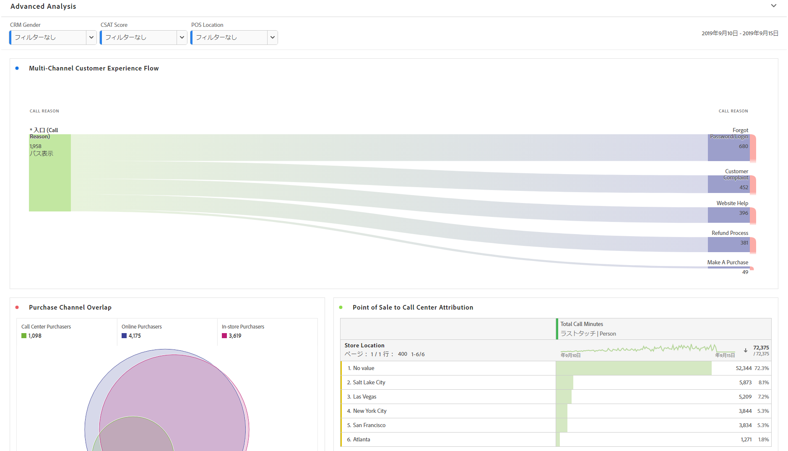
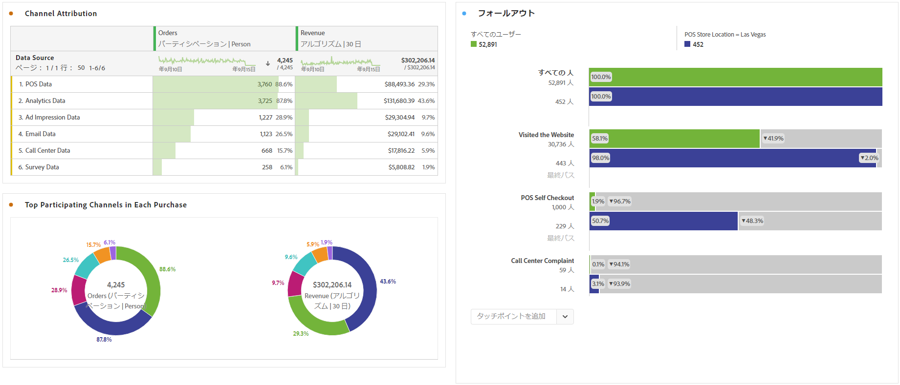

# アドバンス分析の実行

以下に説明するように、アドバンス分析レポートおよびビジュアライゼーションの作成を開始する前に、[基本分析](/help/analysis-workspace/perform-basic-analysis.md)を理解しておく必要があります。

アドバンス分析では、[フロー](/help/analysis-workspace/visualizations/c-flow/flow.md)図、[アトリビューション](/help/analysis-workspace/c-panels/attribution.md)、[フォールアウト](/help/analysis-workspace/visualizations/fallout/fallout-flow.md)図、[ディメンションの分類](/help/components/dimensions/t-breakdown-fa.md)などの機能を活用します。

