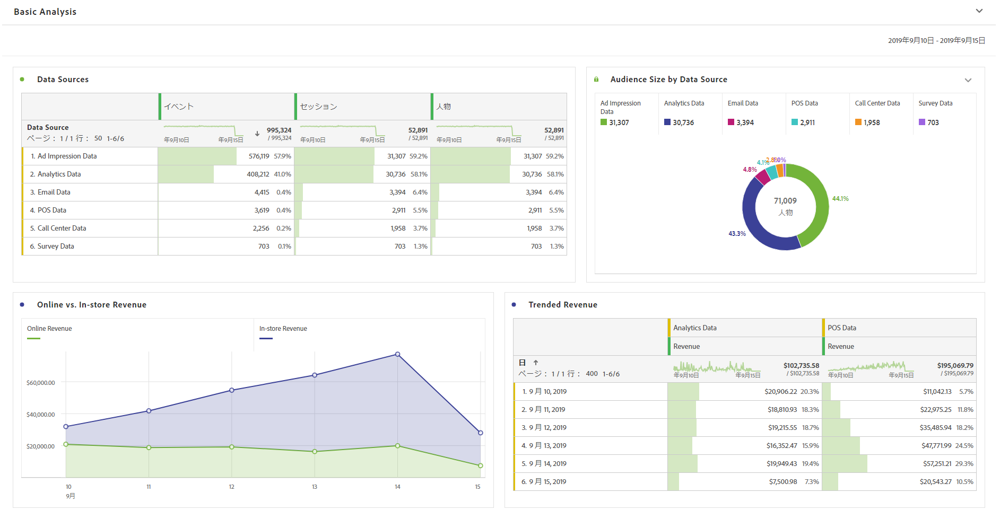
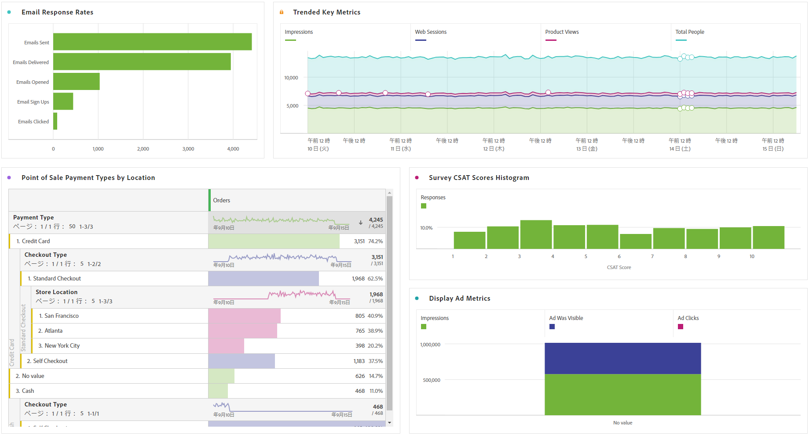

# 基本分析の実行

>[!NOTE]
>
>Customer Journey Analytics 内の Analysis Workspace に関するドキュメントを表示しています。この機能セットは、[従来の Adobe Analytics の Analysis Workspace](https://experienceleague.adobe.com/docs/analytics/analyze/analysis-workspace/home.html?lang=ja) とは少し異なります。[詳細情報...](/help/getting-started/cja-aa.md)

接続とデータビューを作成した後、Analysis Workspace の機能と柔軟性を使用して、取得したデータを分析します。ディメンションや指標を自由に試してドラッグし、ディメンションや指標のアトリビューション設定、フレンドリ名、タイムゾーン、セッション設定などを変更できます。

ワークスペースの基本的なビジュアライゼーションの例を以下に示します。例えば、次のことができます。

* 最も多くのイベント、セッションおよび訪問者を示すデータソースのランクレポートを作成する。

* 2 つのデータソースを時間の経過と共に比較した、オンラインの売上高と実店舗の売上高のトレンドレポートを作成する。

* 広告インプレッションデータ、Customer Journey Analytics データ、メールデータ、POS データ、コールセンターデータ、調査データなど、データソース別にオーディエンスサイズを示します。

