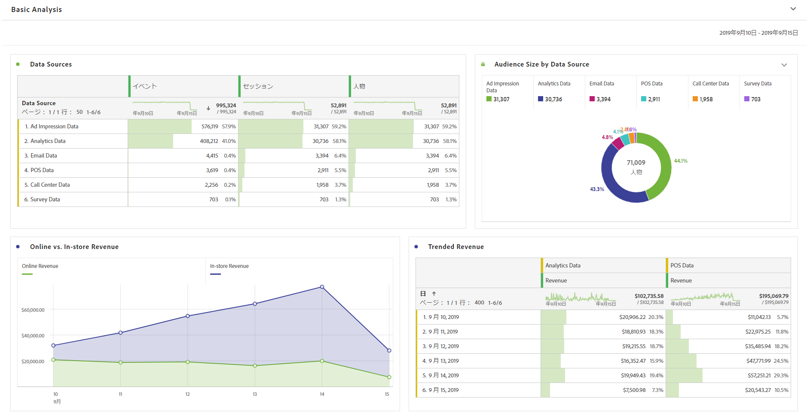
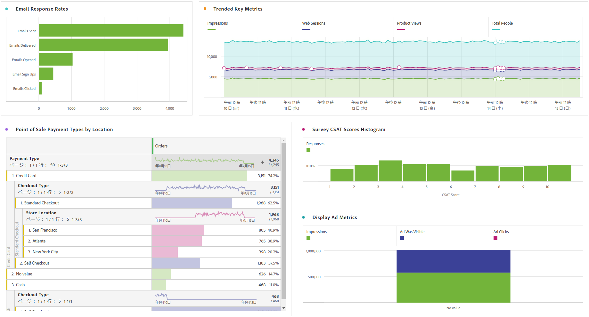

# 基本分析の実行

Customer Journey Analytics では、Analysis Workspace の機能と柔軟性を使用してデータを分析できます。

>[!TIP]
>
>Analysis Workspace で使用可能なデータがない場合は、以下を含む[データ取り込みプロセス](/help/data-ingestion/data-ingestion.md)に従っていることを確認します。<ul><li>[接続を作成](/help/connections/create-connection.md#create-and-configure-the-connection)  新しいデータ、バックフィルデータ、またはその両方を読み込むように接続が設定されていることを確認します。</li><li>[データセットを追加](/help/connections/create-connection.md#add-and-configure-datasets)</li><li>[データビューの作成](/help/data-views/create-dataview.md)</li></ul>

ディメンションや指標を自由に試してドラッグし、ディメンションや指標のアトリビューション設定、フレンドリ名、タイムゾーン、セッション設定などを変更できます。

ワークスペースの基本的なビジュアライゼーションの例を以下に示します。 例えば、次のことができます。

* 最も多くのイベント、セッションおよび訪問者を示すデータソースのランクレポートを作成する。

* 2 つのデータソースを時間の経過と共に比較した、オンラインの売上高と実店舗の売上高のトレンドレポートを作成する。

* 広告インプレッションデータ、Customer Journey Analytics データ、メールデータ、POS データ、コールセンターデータ、調査データなど、データソース別にオーディエンスサイズを示します。

