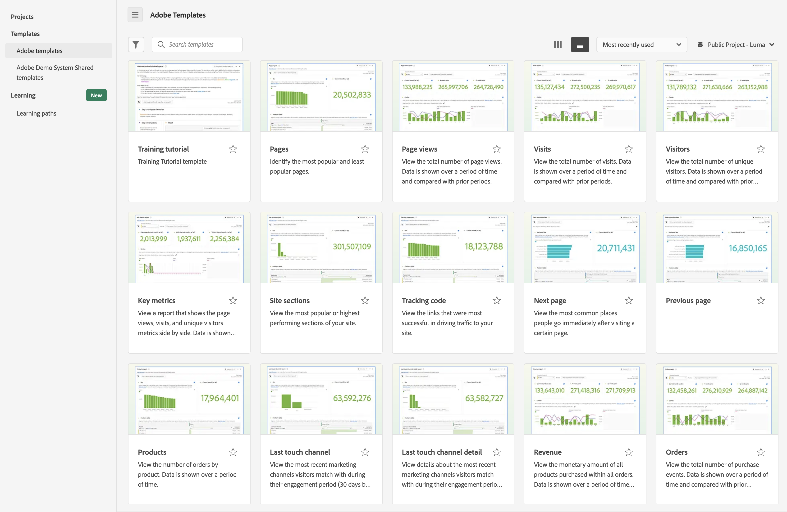

# テンプレートの使用

Analysis Workspace のテンプレート（または会社テンプレート）を使用すると、最も一般的なレポートシナリオに対する簡易的なインサイトを得ることができます。テンプレートを使用して回答できる質問の例を以下に示します。

* サイトを訪問した人数
* ユニーク訪問者の訪問者の数（1 回のみカウント）
* 訪問者がサイトに到達した方法（リンクを辿ったか、直接そこに到達したか）
* 訪問者がサイトコンテンツの検索に使用したキーワード
* 訪問者が特定のページまたはサイト全体に滞在した期間
* 訪問者がクリックしたリンク、および訪問者がサイトを離れたタイミング
* 収益またはコンバージョンイベントの生成に最も効果的なマーケティングチャネル
* ビデオの視聴に費やした時間
* 訪問者がサイトに訪問するために使用したブラウザーとデバイス

次に、Analysis Workspace の「[!UICONTROL テンプレート]」タブからテンプレートにアクセスして使用する方法について説明します。

## テンプレートへのアクセスと実行

1. Analysis Workspace で、「[!UICONTROL **ワークスペース**]」タブを選択します。

   

1. 「[!UICONTROL **テンプレート**]」セクションで、次のいずれかのタブを選択します。

   * **[!UICONTROL Adobe テンプレート]**：アドビが提供するすべてのテンプレートを表示します。

   * **[!UICONTROL _login_company_name _テンプレート]**：組織用に作成されたすべての会社テンプレートを表示します。

     会社テンプレートを作成できるのは管理者のみです。会社テンプレートの作成方法について詳しくは、[テンプレートの作成と管理](/help/analysis-workspace/templates/create-templates.md)を参照してください。

1. 使用可能なテンプレートの表示方法を変更するには、次のいずれかのオプションを使用します。

   * 列表示  アイコンまたはカードビュー  アイコンを選択して、テンプレートを列表示で表示するか、カードビューで表示するかを選択します。

   * カードビュー  を使用する場合は、**[!UICONTROL 最後に使用した項目]**、**[!UICONTROL 一番人気]**、**[!UICONTROL アルファベット順]**、**[!UICONTROL カテゴリ順]**&#x200B;の並べ替え順序から選択します。

1. 検索フィールドに、検索するテンプレートの名前を入力し、テンプレートのリストから選択します。

   または

   表示するテンプレートのカテゴリを選択し、テンプレートのリストからテンプレートを選択します。

   >[!TIP]
   >
   >矢印キーを使用してメニューを移動するには、スラッシュ（/）キーを押してから、下矢印キーを押します。Enter キーを押して、選択したテンプレートを読み込みます。

   使用可能なテンプレートのリストについては、[使用可能なテンプレート](#available-templates)の節を参照してください。

1. （オプション）データビューで使用できないコンポーネントを含むテンプレートを表示できます（デフォルトでは、データビューで使用可能なコンポーネントを使用する場合にのみテンプレートが表示されます）。

   >[!NOTE]
   >
   >これらのテンプレートを使用する前に、管理者はまず、欠落しているコンポーネントに必要なコンテキストラベルをデータビューに追加する必要があります。詳しくは、[テンプレートの使用](/help/analysis-workspace/templates/create-templates.md)の[特定のテンプレートのデータビューへの欠落しているコンポーネントの追加](/help/analysis-workspace/templates/create-templates.md#add-missing-components-to-the-data-view-for-a-given-template)を参照してください。
   >
   >コンテキストラベルについて詳しくは、[コンポーネント設定](/help/data-views/component-settings/overview.md)を参照してください。

   1. セグメントアイコンを選択します。

   1. 追加のコンポーネントを必要とするテンプレートを表示するには、「**[!UICONTROL 使用準備が整っていません]**」を選択します。

      

1. テンプレートを選択し、選択したテンプレートに基づいてレポートを作成します。

1. （条件付き）テンプレートにデータビューで使用できないコンポーネントが含まれている場合は、互換性のないデータビューダイアログが表示され、データビューがテンプレートと互換性がないことと、欠落しているコンポーネントが示されます。

   次のいずれかの操作を行います。

   * **[!UICONTROL データビューを変更]**&#x200B;ドロップダウンメニューで別のデータビューを選択します。

   * 「**[!UICONTROL 強制的に続行]**」を選択して、欠落しているコンポーネントを含むテンプレートを表示します。

## テンプレートに基づくプロジェクトの作成 {#use-reports}

テンプレートは、ニーズに正確に適合しない場合もありますが、必要に応じて近づける可能性があります。このような場合は、テンプレートをプロジェクトの開始点として使用し、特定の目的に合わせてカスタマイズできます。

変更した後にテンプレートから移動すると、変更を保存するか破棄するように求められます。テンプレートに対する変更を保存すると、テンプレートが新しいプロジェクトとして保存されます。

テンプレートをカスタマイズしてプロジェクトとして保存するには：

1. Customer Journey Analytics で、「[!UICONTROL **Workspace**]」タブを選択します。

1. 「[!UICONTROL **テンプレート**]」タブを選択します。

1. 表示するテンプレートを選択します。例えば、「[!UICONTROL **一番人気**]」で、[!UICONTROL **ページ**]&#x200B;テンプレートを選択します。

   Analysis Workspace に表示されるページテンプレートには、2 つの[ビジュアライゼーション](/help/analysis-workspace/visualizations/freeform-analysis-visualizations.md)（[棒グラフ](/help/analysis-workspace/visualizations/bar.md)と[概要番号](/help/analysis-workspace/visualizations/summary-number-change.md)）および[フリーフォームテーブル](/help/analysis-workspace/visualizations/freeform-table/freeform-table.md)が表示されます。使用される指標は発生件数です。

   <!--update screenshot. The following is AA -->

   

1. 次のいずれかの操作を行います。

   * テンプレートを表示する。
   * 上部のセグメントドロップゾーンに、1 つ以上のセグメントをドラッグする。例えば、[!UICONTROL **モバイル顧客**]&#x200B;セグメントをドラッグし、結果を表示します。
   * 右上のカレンダーに移動して、日付範囲を変更する。
   * ディメンション分類を追加し、他の指標をドラッグして、通常はニーズに合わせてテンプレートをカスタマイズする。

1. （オプション）[!UICONTROL **プロジェクト**]／[!UICONTROL **保存**]&#x200B;を選択して、テンプレートをプロジェクトとして保存します。

   テンプレートが新しいプロジェクトとして保存されます。既存のテンプレートは変更されません。レポートをプロジェクトとして保存する方法について詳しくは、[プロジェクトの保存](/help/analysis-workspace/build-workspace-project/save-projects.md)を参照してください。

## 使用可能なテンプレート

使用可能なすべての事前定義済みテンプレートにアクセスするには：

1. Adobe Analytics で、「[!UICONTROL **Workspace**]」タブを選択し、「[!UICONTROL **テンプレート**]」タブを選択します。

   事前定義済みのテンプレートは、カテゴリ別に整理されます。

   <!--add screenshot-->

1. カテゴリを選択すると、そのカテゴリ内のテンプレートが表示されます。

   以下のセクションは、使用可能なカテゴリに対応し、各テンプレートに関する情報を提供します。

   * **[[!UICONTROL 一番人気]](#most-popular)**

   * **[[!UICONTROL Web]**／**[!UICONTROL エンゲージメント]](#engagement)**

   * **[[!UICONTROL Web]**／**[!UICONTROL コンバージョン]](#web-conversion)**

   * **[[!UICONTROL Web]**／**[!UICONTROL オーディエンス]](#web-audience)**

   * **[[!UICONTROL Web]**／**[!UICONTROL 獲得]](#web-acquisition)**

   * **[[!UICONTROL モバイル]**／**[!UICONTROL モバイルアプリ]](#mobile-mobile-app)**

   * **[[!UICONTROL モバイル]**／**[!UICONTROL モバイルデバイス情報]](#mobile-mobile-device-information)**

   * **[[!UICONTROL 時間分割]](#time-parting)**

   * **[[!UICONTROL クロスチャネル]](#cross-channel)**

   * **[[!UICONTROL その他のチャネル]](#other-channels)**

   * **[[!UICONTROL AJO]](#ajo)**

### 一番人気 {#most-popular}

<!--AA only-->

>[!CONTEXTUALHELP]
>id="aa-template--unitsOvertimeReport"
>title="すべての注文内で購入されたユニットの合計数を表示します。データは、一定期間にわたって表示され、前の期間と比較されます。"
>abstract="**これにより**、時間の経過とともにユニット販売数がどのように増加または減少しているかをより深く理解できます。セグメントを適用することにより、どの顧客や地域が最も多くのユニットを購入していて、それらのユニット販売数が時間の経過とともにどのように変化しているかを把握できます。 **学習内容に基づいて**、様々な操作を行うことができます。例えば、最近ローンチされたマーケティングキャンペーンの有効性について、キャンペーンのローンチ前後のユニット販売数を比較することで評価できます。また、前年の休日中のユニット販売数を比較することもできます。 このテンプレートでは、日ディメンションとユニット数指標を使用します。"

<!--both AA and CJA-->

>[!CONTEXTUALHELP]
>id="template--training"
>title="トレーニングチュートリアルテンプレート"
>abstract="最初の分析を作成する一般的な Analysis Workspace の用語と手順について説明します。"

>[!CONTEXTUALHELP]
>id="template--pagesRankedReport"
>title="一番人気のあるページと人気のないページを特定します。"
>abstract="**これにより**、オーディエンスのことや、オーディエンスが最も興味を持つ情報の種類をより深く理解できます。 **学習内容に基づいて**、さまざまな操作を行うことができます。例えば、あまり多く閲覧されていないページの閲覧回数を増やすためにページのメタデータを調整したり、最も多く閲覧されたページのコンテンツの改善に時間を費やしたりできます。 このテンプレートでは、ページディメンションとページビュー指標を使用します。"

>[!CONTEXTUALHELP]
>id="template--pageViewsOvertimeReport"
>title="ページビューの合計数を表示します。データは、一定期間にわたって表示され、前の期間と比較されます。 "
>abstract="**これにより**、サイト上のトラフィックが時間の経過とともにどのように増加または減少するかを把握しやすくなります。 **学習内容に基づいて**、様々な操作を行うことができます。例えば、最近ローンチされたマーケティングキャンペーンの有効性について、キャンペーンのローンチ前後のサイトトラフィックを比較することで評価できます。または、前年の休日のトラフィックと比較することもできます。 このテンプレートでは、日ディメンションとページビュー指標を使用します。"

>[!CONTEXTUALHELP]
>id="template--visitsOvertimeReport"
>title="訪問の合計数を表示します。データは、一定期間にわたって表示され、前の期間と比較されます。"
>abstract="**これにより**、サイト上のトラフィックが時間の経過とともにどのように増加または減少するかを把握しやすくなります。 **学習内容に基づいて**、様々な操作を行うことができます。例えば、最近ローンチされたマーケティングキャンペーンの有効性について、キャンペーンのローンチ前後のサイトトラフィックを比較することで評価できます。または、前年の休日のトラフィックと比較することもできます。 このテンプレートでは、日ディメンションと訪問指標を使用します。"

>[!CONTEXTUALHELP]
>id="template--visitorsOvertimeReport"
>title="ユニーク訪問者の合計数を表示します。データは、一定期間にわたって表示され、前の期間と比較されます。 "
>abstract="**これにより**、サイトのリーチとオーディエンスサイズが時間の経過とともに、あるいは前の時期と比較してどのように増加または減少しているかを把握しやすくなります。 **学習内容に基づいて**、様々な操作を行うことができます。例えば、最近ローンチされたマーケティングキャンペーンがサイトへの新規訪問者の引き付けに成功したかどうかを、キャンペーンのローンチ前後でユニーク訪問者を比較することで評価できます。また、休日にサイトを訪問した人の数を前年と比較することもできます。 このテンプレートでは、日ディメンションとユニーク訪問者指標を使用します。 "

>[!CONTEXTUALHELP]
>id="template--keyMetricsReport"
>title="ページビュー指標、訪問指標、ユニーク訪問者指標を並べたレポートを表示します。データは、一定期間にわたって表示され、前の期間と比較されます。"
>abstract="**これにより**、これらの重要な指標を比較して、サイトのユニーク訪問者の数、ページへ訪問の数、セッションの数の全体像を知ることができます。 **学習した内容に基づいて**、様々な操作を行うことができます。例えば、特定の週または月にサイトを訪問した各ユーザーが閲覧したページの平均数や、1 年の特定の時間またはマーケティングキャンペーンを実行する前後の平均数の変化を評価できます。 このテンプレートでは、日ディメンション、ページビュー指標、訪問指標およびユニーク訪問者指標を使用します。"

>[!CONTEXTUALHELP]
>id="template--siteSectionRankedReport"
>title="サイトで最も人気のあるセクションやパフォーマンスの高いセクションを表示します。"
>abstract="**これにより**、サイトのどのセクションが最もよく訪問されたかをより深く理解できます。 **学習内容に基づいて**、様々な操作を行うことができます。例えば、提供した製品やサービスのうち、どれが最も訪問者の興味を引いたかを評価できます。 このテンプレートでは、サイトセクションディメンションと訪問指標を使用します。"

>[!CONTEXTUALHELP]
>id="template--next-page-report"
>title="特定のページにアクセスした直後に訪問者が最も一般的な場所を表示します。"
>abstract="**これにより**、特定のページにアクセスした後のユーザーの行動をより深く理解できます。 **学習内容に基づいて**、様々な操作を行うことができます。例えば、訪問者をより望ましいページ（購入やレビューを行うためのページなど）に誘導するようにページデザインやレイアウトを最適化できるかどうかを評価できます。 このテンプレートでは、ページディメンションとイベント指標を使用します。"

>[!CONTEXTUALHELP]
>id="template--previous-page-report"
>title="特定のページにアクセスした直前に訪問者が最も一般的な場所を表示します。"
>abstract="**これにより**、特定のページに最も多くのトラフィックを誘導しているページをより深く理解できます。 **学習内容に基づいて**、様々な操作を行うことができます。例えば、前のページとして表示されないページに、現在のページへのより目立つリンクが必要かどうかを評価できます。"

>[!CONTEXTUALHELP]
>id="template--campaignRankedReport"
>title="サイトへのトラフィックを推進するのに最も成功したリンクを表示します。"
>abstract="**これにより**、サイトへのアクセスに最もよく使用されたトラッキングコード（および関連付けられているリンク）がどれかをより深く理解できます。 **学習内容に基づいて**、様々な操作を行うことができます。例えば、どこにサイトへのリンクを追加するかについての戦略を調整できます。 このテンプレートでは、トラッキングコードディメンションと訪問指標を使用します。"

>[!CONTEXTUALHELP]
>id="template--productsRankedReport"
>title="注文数を製品別に表示します。データは一定期間にわたって表示されます。"
>abstract="**これにより**、需要が最も高い製品と低い製品がどれかを把握できます。 **学習内容に基づいて**、様々な操作を行うことができます。例えば、マーケティング戦略を調整して、パフォーマンスの高い製品を宣伝したり、パフォーマンスの低い製品を改善または製造中止にしたりすることができます。また、データの分析に基づいて製品在庫を調整することもできます。 このテンプレートでは、製品ディメンションと注文指標を使用します。"

>[!CONTEXTUALHELP]
>id="template--lastTouchChannelRankedReport"
>title="エンゲージメント期間中（デフォルトでは 30 日間）に訪問者と一致した最新のマーケティングチャネルを表示します。"
>abstract="**これにより**、コンバージョンにつながるサイトに訪問者を誘導する際に最も効果的だったマーケティングチャネルはどれだったかを理解できます。 **学習内容に基づいて**、様々な操作を行うことができます。例えば、パフォーマンスの高いチャネルに割り当てるリソースを増やしたり、パフォーマンスの低いチャネルに割り当てるリソースを減らしたりすることができます。 このテンプレートでは、ラストタッチチャネルディメンションとユニーク訪問者指標を使用します。"

>[!CONTEXTUALHELP]
>id="template--lastTouchChannelDetailRankedReport"
>title="エンゲージメント期間中（デフォルトでは 30 日間）に訪問者と一致した最新のマーケティングチャネルに関する詳細を表示します。"
>abstract="**これにより**、コンバージョンにつながるサイトに訪問者を誘導する際に最も効果的だったマーケティングチャネルはどれだったかだけでなく、それらのマーケティングチャネルに関する詳細も理解できます。例えば、訪問者がサイトを訪問し、「有料検索」マーケティングチャネルと一致した場合、チャネルの詳細を使用して、どの検索エンジンが使用されたか、どのキーワードを検索したかを確認できます。 **学習内容に基づいて**、様々な操作を行うことができます。例えば、パフォーマンスの高いチャネルに割り当てるリソースを増やしたり、パフォーマンスの低いチャネルに割り当てるリソースを減らしたりすることができます。 このテンプレートでは、ラストタッチチャネルの詳細ディメンションとユニーク訪問者指標を使用します。 "

>[!CONTEXTUALHELP]
>id="template--revenueOvertimeReport"
>title="すべての注文内で購入した製品の金額を表示します。データは、一定期間にわたって表示され、前の期間と比較されます。"
>abstract="**これにより**、時間の経過とともに売上高がどのように増加または減少しているかを理解できます。この指標を任意のディメンションと組み合わせて、売上高に貢献したディメンション項目を確認できます。 **学習内容に基づいて**、様々な操作を行うことができます。例えば、以前のトレンドを基に将来の売上高を予想できます。また、トラッキングコードディメンションなど、別のディメンションを追加して、どのキャンペーンが最も高い売上を生んでいるかを特定することもできます。 このテンプレートでは、日ディメンションと売上高指標を使用します。"

>[!CONTEXTUALHELP]
>id="template--ordersOvertimeReport"
>title="購入イベントの合計数を表示します。データは、一定期間にわたって表示され、前の期間と比較されます。"
>abstract="**これにより**、製品やサービスに対する関心が時間の経過とともにどのように増加または減少しているかをより深く理解できます。セグメントを適用することにより、どの顧客や地域が最も多く注文していて、それらの注文が時間の経過とともにどのように変化しているかを把握できます。 **学習内容に基づいて**、様々な操作を行うことができます。例えば、最近ローンチされたマーケティングキャンペーンの有効性について、キャンペーンのローンチ前後の注文数を比較することで評価できます。また、前年の休日の注文数と比較することもできます。 このテンプレートでは、日ディメンションと注文数指標を使用します。"

次のテンプレートを表示できます。

| テンプレート名 | このテンプレートを使用する理由 <!-- What do you do with it? What can it help you learn? and What are the potential actions? --> |
| --- | --- | 
| [!UICONTROL **トレーニングチュートリアル**] | 最初の分析を作成する一般的な Analysis Workspace の用語と手順について説明します。 |
| [!UICONTROL **ページ**] | <!--duplicated in Engagement section--> 一番人気のあるページと人気のないページを特定します。 
**これにより**、オーディエンスのことや、オーディエンスが最も興味を持つ情報の種類をより深く理解できます。

**学習内容に基づいて**、さまざまな操作を行うことができます。例えば、あまり多く閲覧されていないページの閲覧回数を増やすためにページのメタデータを調整したり、最も多く閲覧されたページのコンテンツの改善に時間を費やしたりできます。

このテンプレートでは、ページディメンションとページビュー指標を使用します。
 |
| [!UICONTROL **ページビュー数**] | <!--duplicated in Engagement section--> ページビューの合計数を表示します。データは、一定期間にわたって表示され、前の期間と比較されます。 
**これにより**、サイト上のトラフィックが時間の経過とともにどのように増加または減少するかを把握しやすくなります。

**学習内容に基づいて**、様々な操作を行うことができます。例えば、最近ローンチされたマーケティングキャンペーンの有効性について、キャンペーンのローンチ前後のサイトトラフィックを比較することで評価できます。または、前年の休日のトラフィックと比較することもできます。

このテンプレートでは、日ディメンションとページビュー指標を使用します。
 |
| [!UICONTROL **Web 訪問回数**] | <!--duplicated in Engagement section--> 訪問の合計数を表示します。データは、一定期間にわたって表示され、前の期間と比較されます。 
**これにより**、サイト上のトラフィックが時間の経過とともにどのように増加または減少するかを把握しやすくなります。

**学習内容に基づいて**、様々な操作を行うことができます。例えば、最近ローンチされたマーケティングキャンペーンの有効性について、キャンペーンのローンチ前後のサイトトラフィックを比較することで評価できます。または、前年の休日のトラフィックと比較することもできます。

このテンプレートでは、日ディメンションと訪問指標を使用します。
 |
| [!UICONTROL **Web 訪問者数**] | <!--duplicated in Engagement section--> ユニーク訪問者の合計数を表示します。データは、一定期間にわたって表示され、前の期間と比較されます。 
**これにより**、サイトのリーチとオーディエンスサイズが時間の経過とともに、あるいは前の時期と比較してどのように増加または減少しているかを把握しやすくなります。

**学習内容に基づいて**、様々な操作を行うことができます。例えば、最近ローンチされたマーケティングキャンペーンがサイトへの新規訪問者の引き付けに成功したかどうかを、キャンペーンのローンチ前後でユニーク訪問者を比較することで評価できます。また、休日にサイトを訪問した人の数を前年と比較することもできます。

このテンプレートでは、日ディメンションとユニーク訪問者指標を使用します。
 |
| [!UICONTROL **主要指標**] | <!--duplicated in Engagement section--> ページビュー指標、訪問指標、ユニーク訪問者指標を並べたレポートを表示します。データは、一定期間にわたって表示され、前の期間と比較されます。 
**これにより**、これらの重要な指標を比較して、サイトのユニーク訪問者の数、ページへ訪問の数、セッションの数の全体像を知ることができます。

**学習内容に基づいて**、様々な操作を行うことができます。例えば、特定の週または月にサイトを訪問した各ユーザーが閲覧したページの平均数や、1 年の特定の時間またはマーケティングキャンペーンを実行する前後の平均数の変化を評価できます。 

このテンプレートでは、日ディメンション、ページビュー指標、訪問指標およびユニーク訪問者指標を使用します。
 |
| [!UICONTROL **サイトセクション**] | サイトで最も人気のあるセクションやパフォーマンスの高いセクションを表示します。 
**これにより**、サイトのどのセクションが最もよく訪問されたかをより深く理解できます。

**学習内容に基づいて**、様々な操作を行うことができます。例えば、提供した製品やサービスのうち、どれが最も訪問者の興味を引いたかを評価できます。
 
このテンプレートでは、サイトセクションディメンションと訪問指標を使用します。
 |
| [!UICONTROL **次のページ**] | 特定のページにアクセスした直後に訪問者が最も一般的な場所を表示します。 
**これにより**、特定のページにアクセスした後のユーザーの行動をより深く理解できます。

**学習内容に基づいて**、様々な操作を行うことができます。例えば、訪問者をより望ましいページ（購入やレビューを行うためのページなど）に誘導するようにページデザインやレイアウトを最適化できるかどうかを評価できます。
 
このテンプレートでは、ページディメンションとイベント指標を使用します。
 |
| [!UICONTROL **前のページ**] | 特定のページにアクセスした直前に訪問者が最も一般的な場所を表示します。 
**これにより**、特定のページに最も多くのトラフィックを誘導しているページをより深く理解できます。

**学習内容に基づいて**、様々な操作を行うことができます。例えば、前のページとして表示されないページに、現在のページへのより目立つリンクが必要かどうかを評価できます。

このテンプレートでは、ページディメンションとイベント指標を使用します。
 |
| [!UICONTROL **トラッキングコード**] | サイトへのトラフィックを推進するのに最も成功したリンクを表示します。 
**これにより**、サイトへのアクセスに最もよく使用されたトラッキングコード（および関連付けられているリンク）がどれかをより深く理解できます。

**学習内容に基づいて**、様々な操作を行うことができます。例えば、どこにサイトへのリンクを追加するかについての戦略を調整できます。

このテンプレートでは、トラッキングコードディメンションと訪問指標を使用します。
 |
| [!UICONTROL **製品**] | 注文数を製品別に表示します。データは一定期間にわたって表示されます。 
**これにより**、需要が最も高い製品と低い製品がどれかを把握できます。

**学習内容に基づいて**、様々な操作を行うことができます。例えば、マーケティング戦略を調整して、パフォーマンスの高い製品を宣伝したり、パフォーマンスの低い製品を改善または製造中止にしたりすることができます。また、データの分析に基づいて製品在庫を調整することもできます。

このテンプレートでは、製品ディメンションと注文数指標を使用します。
 |
| [!UICONTROL **ラストタッチチャネル**] | エンゲージメント期間中（デフォルトでは 30 日間）に訪問者と一致した最新のマーケティングチャネルを表示します。
**これにより**、コンバージョンにつながるサイトに訪問者を誘導する際に最も効果的だったマーケティングチャネルはどれだったかを理解できます。

**学習内容に基づいて**、様々な操作を行うことができます。例えば、パフォーマンスの高いチャネルに割り当てるリソースを増やしたり、パフォーマンスの低いチャネルに割り当てるリソースを減らしたりすることができます。

このテンプレートでは、ラストタッチチャネルディメンションとユニーク訪問者指標を使用します。
 |
| [!UICONTROL **ラストタッチチャネルの詳細**] | エンゲージメント期間中（デフォルトでは 30 日間）に訪問者と一致した最新のマーケティングチャネルに関する詳細を表示します。
**これにより**、コンバージョンにつながるサイトに訪問者を誘導する際に最も効果的だったマーケティングチャネルはどれだったかだけでなく、それらのマーケティングチャネルに関する詳細も理解できます。例えば、訪問者がサイトを訪問し、「有料検索」マーケティングチャネルと一致した場合、チャネルの詳細を使用して、どの検索エンジンが使用されたか、どのキーワードを検索したかを確認できます。

**学習内容に基づいて**、様々な操作を行うことができます。例えば、パフォーマンスの高いチャネルに割り当てるリソースを増やしたり、パフォーマンスの低いチャネルに割り当てるリソースを減らしたりすることができます。

このテンプレートでは、ラストタッチチャネルの詳細ディメンションとユニーク訪問者指標を使用します。
 |
| [!UICONTROL **売上高**] | <!--duplicated in Web Conversion section-->すべての注文内で購入した製品の金額を表示します。データは、一定期間にわたって表示され、前の期間と比較されます。
**これにより**、時間の経過とともに売上高がどのように増加または減少しているかを理解できます。この指標を任意のディメンションと組み合わせて、売上高に貢献したディメンション項目を確認できます。

**学習内容に基づいて**、様々な操作を行うことができます。例えば、以前のトレンドを基に将来の売上高を予想できます。また、トラッキングコードディメンションなど、別のディメンションを追加して、どのキャンペーンが最も高い売上を生んでいるかを特定することもできます。

このテンプレートでは、日ディメンションと売上高指標を使用します。
 |
| [!UICONTROL **注文件数**] | <!--duplicated in Web Conversion section-->購入イベントの合計数を表示します。データは、一定期間にわたって表示され、前の期間と比較されます。 
**これにより**、製品やサービスに対する関心が時間の経過とともにどのように増加または減少しているかをより深く理解できます。セグメントを適用することにより、どの顧客や地域が最も多く注文していて、それらの注文が時間の経過とともにどのように変化しているかを把握できます。

**学習内容に基づいて**、様々な操作を行うことができます。例えば、最近ローンチされたマーケティングキャンペーンの有効性について、キャンペーンのローンチ前後の注文数を比較することで評価できます。また、前年の休日の注文数と比較することもできます。

このテンプレートでは、日ディメンションと注文数指標を使用します。
 |

### Web：エンゲージメント {#web-engagement}

<!--AA only-->

>[!CONTEXTUALHELP]
>id="aa-template--real-time"
>title="サイトで現在収集されているディメンションと指標を表示します。"
>abstract="**これにより**、サイトのトレンドをより深く理解できます。 **学習内容に基づいて**、様々な操作を行うことができます。例えば、現在のマーケティングコンテンツやキャンペーンのパフォーマンスに対応し、アクティブに管理できます。"

>[!CONTEXTUALHELP]
>id="aa-template--timeSpentVisitOvertimeReport"
>title="訪問者が各訪問中にサイトに滞在した平均時間を表示します。データは、一定期間にわたって表示され、前の期間と比較されます。"
>abstract="**これにより**、訪問者のエンゲージメントレベルと、訪問者がサイトに滞在した時間をより深く理解できます。 **学習内容に基づいて**、様々な操作を行うことができます。例えば、サイトの変更によって訪問者がサイトに滞在する時間が長くなったかどうかを評価できます。 このテンプレートでは、日ディメンションと訪問あたりの滞在時間（秒）指標を使用します。"

>[!CONTEXTUALHELP]
>id="aa-template--timePriorRankedReport"
>title="成功イベントの前にユーザーが滞在した平均時間を表示します。"
>abstract="**これにより**、訪問者が購入などの目的のアクションを実行するのにかかる時間をより深く理解できます。 **学習内容に基づいて**、様々な操作を行うことができます。例えば、サイトの変更によって訪問者が成功イベントに迅速に到達する能力が向上したかどうかを評価できます。 このテンプレートでは、イベント前の時間ディメンションとユニーク訪問者指標を使用します。"

>[!CONTEXTUALHELP]
>id="aa-template--falloutReport"
>title="事前に定義された一連のページを通じて、ユーザーが移動または続行する場所を表示します。"
>abstract="**これにより**、ユーザーがフォールアウトしているユーザージャーニーの場所をより深く理解できます。 **学習内容に基づいて**、様々な操作を行うことができます。例えば、サイト上の特定のプロセス（購入や登録のプロセスなど）を通じたコンバージョン率を分析することや、サイト上のイベント間の相関関係を分析することができます（例えば、プライバシーポリシーを閲覧したユーザーのうち製品を購入したユーザーの割合など）。また、このテンプレートを使用して、同じレポート内の 2 つの異なるセグメントを並べて比較することもできます。 このテンプレートでは、フォールアウトビジュアライゼーションを使用します。"

>[!CONTEXTUALHELP]
>id="aa-template--cross-device-analysis"
>title="ジャーニーのすべてのポイントでユーザーが使用したデバイスを表示します。"
>abstract="**これにより**、ブランドとやり取りするユーザーの数、ユーザーが使用するデバイスのタイプ、複数のデバイスの使用がエクスペリエンスに与える影響をより深く理解できます。例えば、モバイルデバイスでタスクを開始し、後でデスクトップに移動してタスクを完了する頻度はどのくらいか。ユーザーがあるデバイスから別のデバイスへと移動する際の、最も一般的なパスは何か。どこからドロップアウトするか。成功した場所はどこか。その他。 **学習内容に基づいて**、様々な操作を行うことができます。例えば、モバイルエクスペリエンス向けにユーザージャーニーの特定の部分を最適化できます。 このテンプレートでは、フロービジュアライゼーション、フォールアウトビジュアライゼーション、コホート分析、人物指標および一意のデバイス指標を使用します。"

>[!CONTEXTUALHELP]
>id="aa-template--web-retention"
>title="忠実な顧客が誰であるか、そして彼らがサイトで何をしているかを表示します。"
>abstract="**これにより**、平均的なユーザーがサイトを訪問した回数、ユーザーがサイトに戻る頻度、再訪問の間の日数をより深く理解できます。 **学習内容に基づいて**、様々な操作を行うことができます。例えば、ユーザーをサイトに呼び戻すのに最も効果的なコンテンツを分析できます。 このテンプレートでは、訪問指標とユニーク訪問者指標を使用します。"

>[!CONTEXTUALHELP]
>id="aa-template--audio-consumption-template"
>title="すべてのデジタルデバイス全体でのメディアオーディオ消費のトレンドと上位指標を表示します。"
>abstract="**これにより**、訪問者がサイト上でオーディオコンテンツを消費する方法をより深く理解できます。 **学習内容に基づいて**、様々な操作を行うことができます。例えば、最も消費されているコンテンツを分析できます。 このテンプレートでは、訪問指標とユニーク訪問者指標を使用します。"

>[!CONTEXTUALHELP]
>id="aa-template--media-recency-frequency-loyalty"
>title="すべてのデジタルデバイス全体でのメディア消費のトレンドと上位指標を表示します。"
>abstract="**これにより**、平均的なユーザーがサイトを訪問した回数、ユーザーがサイトに戻る頻度、再訪問の間の日数をより深く理解できます。 **学習内容に基づいて**、様々な操作を行うことができます。例えば、ユーザーをサイトに呼び戻すのに最も効果的なコンテンツを分析できます。 このテンプレートでは、訪問指標とユニーク訪問者指標を使用します。"

>[!CONTEXTUALHELP]
>id="aa-template--reloadsRankedReport"
>title="再読み込み中にディメンション項目が存在した回数を表示します。訪問者によるブラウザーの更新は、再読み込みをトリガーする最も一般的な方法です。"
>abstract="**これにより**、特定のページで問題が発生し、訪問者にページを再読み込みするプロンプトが表示されるタイミングを特定できます。 **学習内容に基づいて**、様々な操作を行うことができます。例えば、対処する必要がある問題が発生したページを評価できます。 このテンプレートでは、再読み込み指標を使用します。"

>[!CONTEXTUALHELP]
>id="aa-template--timeSpentPageRankedReport"
>title="訪問者が各訪問中にサイトに滞在した平均時間を表示します。データは、一定期間にわたって表示され、前の期間と比較されます。"
>abstract="**これにより**、訪問者のエンゲージメントレベルと、訪問者がサイトに滞在した時間をより深く理解できます。 **学習内容に基づいて**、様々な操作を行うことができます。例えば、サイトの変更によって訪問者がサイトに滞在する時間が長くなったかどうかを評価できます。 このテンプレートでは、日ディメンションと訪問あたりの滞在時間（秒）指標を使用します。"

>[!CONTEXTUALHELP]
>id="aa-template--entryPageOriginalRankedReport"
>title="訪問者の全期間を通じて、最初にサイトを訪問したときにアクセスする上位のページを表示します。"
>abstract="**これにより**、サイトへのトラフィックを最も多く推進しているページを理解したり、サイトの訪問者が最初に持った印象を把握したりできます。 **学習内容に基づいて**、様々な操作を行うことができます。例えば、訪問者がサイトへの最初のアクセスで得るエクスペリエンスを最適化したり、訪問者がサイトに入ったときに最初に表示されるページが居心地が良く、サイトの他の領域へ移動する必要なリンクを提供していることを確認したりすることができます。 このテンプレートでは、セッション指標を使用します。また、棒グラフビジュアライゼーションとフリーフォームテーブルビジュアライゼーションも使用します。"

>[!CONTEXTUALHELP]
>id="aa-template--singlePageVisitsRankedReport"
>title="単一の個別ページで構成された訪問数を表示します。"
>abstract="**これにより**、訪問者のエンゲージメントレベルと、訪問者がサイトに滞在した時間をより深く理解できます。 **学習内容に基づいて**、様々な操作を行うことができます。例えば、サイトの変更によって訪問者がサイトに滞在する時間が長くなったかどうかを評価できます。 このテンプレートでは、単一ページ訪問数ディメンションを使用します。"

>[!CONTEXTUALHELP]
>id="aa-template--sitePerformanceOverview"
>title="Adobe Experience Manager サイトのパフォーマンスデータを表示します。"
>abstract="**これにより**、Adobe Experience Manager の価値実現をより深く理解できます。 **学習内容に基づいて**、様々な操作を行うことができます。例えば、Experience Manager の設定を最適化できます。"

>[!CONTEXTUALHELP]
>id="aa-template--formsPerformanceOverview"
>title="Adobe Experience Manager Forms のパフォーマンスデータを表示します。"
>abstract="**これにより**、Adobe Experience Manager の価値実現をより深く理解できます。 **学習内容に基づいて**、様々な操作を行うことができます。例えば、Experience Manager の設定を最適化できます。"

>[!CONTEXTUALHELP]
>id="aa-template--itp-impact"
>title="データの収集とレポートに関する Intelligent Tracking Prevention（ITP）の効果を表示および分析します。"
>abstract="**これにより**、ITP によって課された cookie 制限による潜在的なデータ損失をより深く理解できます。 **学習内容に基づいて**、様々な操作を行うことができます。例えば、ITP の影響を最小限に抑えるために分析設定を適応できます。"

<!--Both AA and CJA-->

>[!CONTEXTUALHELP]
>id="template_time_spent"
>title="訪問者が各訪問中にサイトに滞在した平均時間と、成功イベントの前にユーザーが費やした平均時間を表示します。データは、一定期間にわたって表示され、前の期間と比較されます。"
>abstract="**これにより**、訪問者のエンゲージメントレベルと、訪問者が購入などの目的のアクションを実行するのにかかる時間をより深く理解できます。 **学習内容に基づいて**、様々な操作を行うことができます。例えば、サイトの変更によって訪問者が成功イベントに迅速に到達する能力が向上したかどうかを評価できます。 このテンプレートでは、日ディメンションと訪問あたりの滞在時間（秒）指標を使用します。"

>[!CONTEXTUALHELP]
>id="template--web-content-consumption"
>title="どの web コンテンツが最も消費され、ユーザーのエンゲージメントを高めているかを表示します。"
>abstract="**これにより**、ユーザーが最初にサイトを訪問した際にどこに移動しているか、ユーザーが最も訪問しているサイトのセクションはどれか、ユーザーをサイトから離れさせる可能性が最も高いページはどれかをより深く理解できます。 **学習内容に基づいて**、様々な操作を行うことができます。例えば、ユーザーを最も重要なページに誘導するサイト上の経路やユーザーをサイトから離れさせる可能性が高いページを評価できます。 このテンプレートは、ページディメンションとページビュー指標、訪問指標、ユニーク訪問者指標、入場率指標、バウンス率指標、退場率指標およびコンテンツ速度指標を使用します。また、入場、退場、上位のセクションにフロービジュアライゼーションを使用します。"

>[!CONTEXTUALHELP]
>id="template--media-content-consumption"
>title="どのメディアコンテンツが最も消費され、ユーザーのエンゲージメントを高めているかを表示します。"
>abstract="**これにより**、ユーザーがどこから最初にサイトに入るのか、ユーザーが最も訪問しているサイトのセクションはどれか、ユーザーをサイトから離れさせる可能性が最も高いページはどれかをより深く理解できます。 **学習内容に基づいて**、様々な操作を行うことができます。例えば、ユーザーを最も重要なページに誘導するサイト上の経路やユーザーをサイトから離れさせる可能性が高いページを評価できます。 このテンプレートは、ページディメンションとページビュー指標、訪問指標、ユニーク訪問者指標、入場率指標、バウンス率指標、退場率指標およびコンテンツ速度指標を使用します。また、入口、出口、上位のセクションを示すフロービジュアライゼーション、最も一般的なページのページビューを表示する散布図ビジュアライゼーション、バケット化された時間でページビューを表示する棒グラフビジュアライゼーション、サイトでの平均滞在時間のトレンド表示を行う折れ線グラフビジュアライゼーションも使用します。"

>[!CONTEXTUALHELP]
>id="template--flowreport"
>title="人々がある場所を訪問する直後または直前に行く最も一般的な場所を表示します。"
>abstract="**これにより**、トラフィックが特定のページからサイトの他の部分にどのように移動するかを理解し、特定のページに到達するまでの訪問者の経路を理解できます。 **学習内容に基づいて**、様々な操作を行うことができます。例えば、訪問者をより望ましいページ（購入やレビューを行うためのページなど）に誘導するようにページデザインやレイアウトを最適化できるかどうかを評価できます。または、訪問者が前のページから現在のページに来る時に、そこにある情報がその訪問者の求めている方向性やアクションを提供する可能性が高いかどうかを評価します。または、前のページとして表示されないページに、現在のページへのより目立つリンクを貼る必要があるかどうかを評価することもできます。 このテンプレートは、次または前の項目パネルを使用します。"

>[!CONTEXTUALHELP]
>id="template--page-summary-report"
>title="プロパティをまたいだ任意のページに関する主要な情報を表示します。ページビュー、トレンドライン、フロービジュアライゼーションなどを表示します。"
>abstract="**これにより**、訪問者が特定のページをどのように閲覧しているかをより深く理解できます。 **学習内容に基づいて**、様々な操作を行うことができます。例えば、一定期間のページのパフォーマンスを分析したり、ページへのトラフィックを推進する要因をより深く理解したりすることができます。 このテンプレートでは、ページビュー指標を使用します。また、折れ線グラフビジュアライゼーションとフロービジュアライゼーションも使用します。"

>[!CONTEXTUALHELP]
>id="template--entryPageRankedReport"
>title="訪問者が最初にサイトを訪問したときにアクセスする上位のページを表示します。"
>abstract="**これにより**、サイトへのトラフィックを最も多く推進しているページを理解したり、サイトの訪問者が最初に持った印象を把握したりできます。 **学習内容に基づいて**、様々な操作を行うことができます。例えば、訪問者がサイトへの最初のアクセスで得るエクスペリエンスを最適化したり、訪問者がサイトに入ったときに最初に表示されるページが居心地が良く、サイトの他の領域へ移動する必要なリンクを提供していることを確認したりすることができます。 このテンプレートでは、セッション指標を使用します。また、棒グラフビジュアライゼーションとフリーフォームテーブルビジュアライゼーションも使用します。"

>[!CONTEXTUALHELP]
>id="template--exitPageRankedReport"
>title="訪問者がサイトを離れる直前にアクセスした上位のページを表示します。"
>abstract="**これにより**、どのページが訪問者をサイトから離れさせているかをより深く理解できます。 **学習内容に基づいて**、様々な操作を行うことができます。例えば、一般的な出口ページを更新して、退出前のエクスペリエンスを最適化したり、コンテンツやリンクを追加して、訪問者がサイトに留まるようにしたりすることができます。 このテンプレートでは、セッション指標を使用します。また、棒グラフビジュアライゼーションとフリーフォームテーブルビジュアライゼーションも使用します。"

>[!CONTEXTUALHELP]
>id="template--productUsageOverviewReport"
>title="Customer Journey Analytics 製品が組織内でどのように使用されているかを表示します。"
>abstract="**これにより**、Customer Journey Analytics を使用している人の数、使用頻度、長期にわたる使用傾向をより良く理解できます。また、作成中のプロジェクトの数、これらのプロジェクトの詳細（最も一般的に使用されるコンポーネント、ビジュアライゼーション、パネルなど）、他の多くの使用状況の統計も確認できます。 **学習内容に基づいて**、様々な操作を行うことができます。 例えば、未使用のプロジェクトまたはコンポーネントを削除することや、人気のある機能に関するユーザートレーニングを提供することができます。"

>[!CONTEXTUALHELP]
>id="template--content-analytics"
>title="最もパフォーマンスの高いコンテンツとコンテンツ属性について説明します。"
>abstract="**これにより**、コンテンツのパフォーマンスを詳細なレベルで把握できます。個々のアセットや特定の属性のパフォーマンスを確認できます。コンテンツ分析では、AI を使用して属性を自動的に生成し、コンテンツにタグを付けます。 <a href="https://experienceleague.adobe.com/ja/docs/analytics-platform/using/content-analytics/content-analytics" target="&quot;_blank&quot;">詳細情報</a>。 **学習内容に基づいて**、様々な操作を行うことができます。例えば、ホームページでパフォーマンスの高いアセットを宣伝したり、パフォーマンスの高い属性を含むように特定のセグメントのコンテンツをパーソナライズしたり、古くなり始めたコンテンツのローテーションを行ったりすることができます。"

次のテンプレートを表示できます。

| テンプレート名 | このテンプレートを使用する理由 <!-- What do you do with it? What can it help you learn? and What are the potential actions? --> |
| --- | --- | 
| [!UICONTROL **主要指標**] | <!--duplicated in Most popular section--> ページビュー指標、訪問指標、ユニーク訪問者指標を並べたレポートを表示します。データは、一定期間にわたって表示され、前の期間と比較されます。 
**これにより**、これらの重要な指標を比較して、サイトのユニーク訪問者の数、ページへ訪問の数、セッションの数の全体像を知ることができます。

**学習内容に基づいて**、様々な操作を行うことができます。例えば、特定の週または月にサイトを訪問した各ユーザーが閲覧したページの平均数や、1 年の特定の時間またはマーケティングキャンペーンを実行する前後の平均数の変化を評価できます。 

このテンプレートでは、日ディメンション、ページビュー指標、訪問指標およびユニーク訪問者指標を使用します。
 |
| [!UICONTROL **ページビュー数**] | <!--duplicated in Most popular section-->ページビューの合計数を表示します。データは、一定期間にわたって表示され、前の期間と比較されます。 
**これにより**、サイト上のトラフィックが時間の経過とともにどのように増加または減少するかを把握しやすくなります。

**学習内容に基づいて**、様々な操作を行うことができます。例えば、最近ローンチされたマーケティングキャンペーンの有効性について、キャンペーンのローンチ前後のサイトトラフィックを比較することで評価できます。または、前年の休日のトラフィックと比較することもできます。

このテンプレートでは、日ディメンションとページビュー指標を使用します。
 |
| [!UICONTROL **ページ**] | <!--duplicated in Most popular section-->一番人気のあるページと人気のないページを特定します。 
**これにより**、オーディエンスのことや、オーディエンスが最も興味を持つ情報の種類をより深く理解できます。

**学習内容に基づいて**、さまざまな操作を行うことができます。例えば、あまり多く閲覧されていないページの閲覧回数を増やすためにページのメタデータを調整したり、最も多く閲覧されたページのコンテンツの改善に時間を費やしたりできます。

このテンプレートでは、ページディメンションとページビュー指標を使用します。
 |
| [!UICONTROL **訪問回数**] | <!--duplicated in Most popular section-->訪問の合計数を表示します。データは、一定期間にわたって表示され、前の期間と比較されます。 
**これにより**、サイト上のトラフィックが時間の経過とともにどのように増加または減少するかを把握しやすくなります。

**学習内容に基づいて**、様々な操作を行うことができます。例えば、最近ローンチされたマーケティングキャンペーンの有効性について、キャンペーンのローンチ前後のサイトトラフィックを比較することで評価できます。または、前年の休日のトラフィックと比較することもできます。

このテンプレートでは、日ディメンションと訪問指標を使用します。
 |
| [!UICONTROL **訪問者**] | <!--duplicated in Most popular section-->ユニーク訪問者の合計数を表示します。データは、一定期間にわたって表示され、前の期間と比較されます。 
**これにより**、サイトのリーチとオーディエンスサイズが時間の経過とともに、あるいは前の時期と比較してどのように増加または減少しているかを把握しやすくなります。

**学習内容に基づいて**、様々な操作を行うことができます。例えば、最近ローンチされたマーケティングキャンペーンがサイトへの新規訪問者の引き付けに成功したかどうかを、キャンペーンのローンチ前後でユニーク訪問者を比較することで評価できます。また、休日にサイトを訪問した人の数を前年と比較することもできます。

このテンプレートでは、日ディメンションとユニーク訪問者指標を使用します。
 |
| [!UICONTROL **滞在時間**] | 訪問者が各訪問中にサイトに滞在した平均時間と、成功イベントの前にユーザーが費やした平均時間を表示します。データは、一定期間にわたって表示され、前の期間と比較されます。 
**これにより**、訪問者のエンゲージメントレベルと、訪問者が購入などの目的のアクションを実行するのにかかる時間をより深く理解できます。

**学習内容に基づいて**、様々な操作を行うことができます。例えば、サイトの変更によって訪問者が成功イベントに迅速に到達する能力が向上したかどうかを評価できます。

このテンプレートでは、日ディメンションと訪問あたりの滞在時間（秒）指標を使用します。
 |
| [!UICONTROL **サイトセクション**] | <!--duplicated in Most popular section-->サイトで最も人気のあるセクションやパフォーマンスの高いセクションを表示します。 
**これにより**、サイトのどのセクションが最もよく訪問されたかをより深く理解できます。

**学習内容に基づいて**、様々な操作を行うことができます。例えば、提供した製品やサービスのうち、どれが最も訪問者の興味を引いたかを評価できます。
 
このテンプレートでは、サイトセクションディメンションと訪問指標を使用します。
 |
| [!UICONTROL **Web コンテンツ消費**] | どの web コンテンツが最も消費され、ユーザーのエンゲージメントを高めているかを表示します。
**これにより**、ユーザーが最初にサイトを訪問した際にどこに移動しているか、ユーザーが最も訪問しているサイトのセクションはどれか、ユーザーをサイトから離れさせる可能性が最も高いページはどれかをより深く理解できます。

**学習内容に基づいて**、様々な操作を行うことができます。例えば、ユーザーを最も重要なページに誘導するサイト上の経路やユーザーをサイトから離れさせる可能性が高いページを評価できます。
 
このテンプレートでは、ページディメンションとページビュー指標、訪問指標、ユニーク訪問者指標、入場率指標、バウンス率指標、退場率指標およびコンテンツ速度指標を使用します。また、入場、退場、上位のセクションにフロービジュアライゼーションを使用します。
 |
| [!UICONTROL **メディアコンテンツ消費**] | どのメディアコンテンツが最も消費され、ユーザーのエンゲージメントを高めているかを表示します。
**これにより**、ユーザーがどこから最初にサイトに入るのか、ユーザーが最も訪問しているサイトのセクションはどれか、ユーザーをサイトから離れさせる可能性が最も高いページはどれかをより深く理解できます。

**学習内容に基づいて**、様々な操作を行うことができます。例えば、ユーザーを最も重要なページに誘導するサイト上の経路やユーザーをサイトから離れさせる可能性が高いページを評価できます<!-- not sure about these takeaways... -->。
 
このテンプレートでは、ページディメンションとページビュー指標、訪問指標、ユニーク訪問者指標、入場率指標、バウンス率指標、退場率指標およびコンテンツ速度指標を使用します。また、入口、出口、上位のセクションを示すフロービジュアライゼーション、最も一般的なページのページビューを表示する散布図ビジュアライゼーション、バケット化された時間でページビューを表示する棒グラフビジュアライゼーション、サイトでの平均滞在時間のトレンド表示を行う折れ線グラフビジュアライゼーションも使用します。
 |
| [!UICONTROL **次または前のページフロー**] | 特定のページを訪問した直後と直前に訪問者が訪れる最も一般的な場所のフロービジュアライゼーションを表示します。 
**これにより**、トラフィックが特定のページからサイトの他の部分にどのように移動するかを理解し、特定のページに到達するまでの訪問者の経路を理解できます。

**学習内容に基づいて**、様々な操作を行うことができます。例えば、訪問者をより望ましいページ（購入やレビューを行うためのページなど）に誘導するようにページデザインやレイアウトを最適化できるかどうかを評価できます。または、訪問者が前のページから現在のページに来る時に、そこにある情報がその訪問者の求めている方向性やアクションを提供する可能性が高いかどうかを評価します。または、前のページとして表示されないページに、現在のページへのより目立つリンクを貼る必要があるかどうかを評価することもできます。

このテンプレートでは、次または前の項目パネルを使用します。
 |
| **ページの概要** | プロパティをまたいだ任意のページに関する主要な情報を表示します。ページビュー、トレンドライン、フロービジュアライゼーションなどを表示します。  
**これにより**、訪問者が特定のページをどのように閲覧しているかをより深く理解できます。

**学習内容に基づいて**、様々な操作を行うことができます。例えば、一定期間のページのパフォーマンスを分析したり、ページへのトラフィックを推進する要因をより深く理解したりすることができます。

このテンプレートでは、ページビュー指標を使用します。また、折れ線グラフビジュアライゼーションとフロービジュアライゼーションも使用します。
 |
| **入口ページ** | 訪問者が最初にサイトを訪問したときにアクセスする上位のページを表示します。 
**これにより**、サイトへのトラフィックを最も多く推進しているページを理解したり、サイトの訪問者が最初に持った印象を把握したりできます。

**学習内容に基づいて**、様々な操作を行うことができます。例えば、訪問者がサイトへの最初のアクセスで得るエクスペリエンスを最適化したり、訪問者がサイトに入ったときに最初に表示されるページが居心地が良く、サイトの他の領域へ移動する必要なリンクを提供していることを確認したりすることができます。

このテンプレートでは、セッション指標を使用します。また、棒グラフビジュアライゼーションとフリーフォームテーブルビジュアライゼーションも使用します。
 |
| **出口ページ** | 訪問者がサイトを離れる直前にアクセスした上位のページを表示します。
**これにより**、どのページが訪問者をサイトから離れさせているかをより深く理解できます。 

**学習内容に基づいて**、様々な操作を行うことができます。例えば、一般的な出口ページを更新して、退出前のエクスペリエンスを最適化したり、コンテンツやリンクを追加して、訪問者がサイトに留まるようにしたりすることができます。

このテンプレートでは、セッション指標を使用します。また、棒グラフビジュアライゼーションとフリーフォームテーブルビジュアライゼーションも使用します。
 |
| **製品使用状況の概要** | Customer Journey Analytics 製品が組織内でどのように使用されているかを表示します。 
**これにより**、Customer Journey Analytics を使用している人の数、使用頻度、長期にわたる使用傾向をより良く理解できます。また、作成中のプロジェクトの数、これらのプロジェクトの詳細（最も一般的に使用されるコンポーネント、ビジュアライゼーション、パネルなど）、他の多くの使用状況の統計も確認できます。

**学習内容に基づいて**、様々な操作を行うことができます。 例えば、未使用のプロジェクトまたはコンポーネントを削除することや、人気のある機能に関するユーザートレーニングを提供することができます。
 |
| **コンテンツ分析** | 最もパフォーマンスの高いコンテンツとコンテンツ属性について説明します。
**これにより**、コンテンツのパフォーマンスを詳細なレベルで把握できます。個々のアセットや特定の属性のパフォーマンスを確認できます。コンテンツ分析では、AI を使用して属性を自動的に生成し、コンテンツにタグを付けます。 詳しくは、[Content Analytics](/help/content-analytics/content-analytics.md){target="_blank"} を参照してください。

**学習内容に基づいて**、様々な操作を行うことができます。例えば、ホームページでパフォーマンスの高いアセットを宣伝したり、パフォーマンスの高い属性を含むように特定のセグメントのコンテンツをパーソナライズしたり、古くなり始めたコンテンツのローテーションを行ったりすることができます。
 |

### Web：コンバージョン {#web-conversion}

<!--AA only-->

>[!CONTEXTUALHELP]
>id="aa-template--categoryRankedReport"
>title=" サイト上の各製品カテゴリに関連付けられた訪問数を表示します。これは、製品変数を使用し、製品カテゴリに関する指標を表示する実装に役立ちます。サイトに製品が存在しない場合、このテンプレートに入力するディメンションは意図的に空白にすることができます。"
>abstract="**これにより**、最も売れている商品や最も閲覧されている商品をより深く理解できます。&lt;/br/>**学習内容に基づいて**、様々な操作を行うことができます。例えば、特定の製品のマーケティングキャンペーンの効果を測定できます。 このテンプレートでは、カテゴリディメンションと訪問指標を使用します。 "

>[!CONTEXTUALHELP]
>id="aa-template--commerce-and-marketing-management"
>title="販売向上に役立つ、コマースアクティビティの小売業者向けの事前定義済みインサイトを表示します。これは Adobe Commerce のユーザーを対象にしていますが、どのオンライン小売業者でも利用できます。"
>abstract="**これにより**、コマースアクティビティが販売数に貢献している仕組みをより深く理解できます。 **学習内容に基づいて**、様々な操作を行うことができます。例えば、ROI が最も高いアクティビティに合わせて予算を調整できます。"

<!--Both AA and CJA-->

>[!CONTEXTUALHELP]
>id="template--productConversionReport"
>title="買い物かご、チェックアウト、注文を表示するファネルビジュアライゼーションで製品コンバージョンを表示します。また、コンバージョン率、売上高平均、単位平均、注文平均も表示できます。"
>abstract="**これにより**、コンバージョンプロセス中に訪問者の進行状況や離脱が発生する仕組みをより深く理解できます。 **学習内容に基づいて**、様々な操作を行うことができます。例えば、web サイトを改善してチェックアウトプロセスをよりスムーズにすることができます。"

>[!CONTEXTUALHELP]
>id="template--retail-products-template"
>title="最もパフォーマンスの高い製品を表示します。"
>abstract="**これにより**、どの製品が最も成功しているかをより深く理解できます。 **学習した内容に基づいて**、様々な操作を行うことができます。例えば、成功している製品に対する資金を増やしたり、成功していない製品に対する資金を減らしたりすることができます。 このテンプレートでは、製品ビュー、買い物かごへの追加、注文数、売上高、ユニットの各指標を使用します。製品ディメンションも使用します。"

>[!CONTEXTUALHELP]
>id="template--cartConversionReport"
>title="買い物かごへのアイテムの追加、買い物かごの表示、買い物かごからのアイテムの削除、チェックアウトなど、訪問者が主要なチェックアウトイベントを実行した回数を表示します。"
>abstract="**これにより**、チェックアウトプロセスファネルのどの部分がコンバージョンにつながり、どの部分が買い物かごの放棄につながりやすいかをより深く理解できます。 **学習した内容に基づいて**、様々な操作を行うことができます。例えば、チェックアウトプロセスの特定の段階でのフリクションを減らすことができます。 このテンプレートは次を使用します。"

>[!CONTEXTUALHELP]
>id="template--cartsOvertimeReport"
>title="買い物かごに製品を追加した訪問者の数を表示します。"
>abstract="**これにより**、買い物かごに追加される製品の総数ではなく、買い物かごに製品を追加する訪問者の数をより深く理解できます。 **学習内容に基づいて**、様々な操作を行うことができます。例えば、製品ページの有効性を測定できます。 このテンプレートでは、買い物かご指標を使用します。"

>[!CONTEXTUALHELP]
>id="template--cartViewsOvertimeReport"
>title="訪問者が買い物かごを表示した回数を表示します。"
>abstract="**これにより**、チェックアウトのエクスペリエンスをより深く理解して、買い物かごの放棄率を減らしたり、様々な製品に関して買い物かごへの製品の追加からチェックアウトまでにかかった時間を分析したりできます。 **学習内容に基づいて**、様々な操作を行うことができます。例えば、買い物かごに最も長く留まっていて放棄されるリスクが最も高い製品に対して、値引を提供できます。 このテンプレートでは、買い物かご表示指標を使用します。"

>[!CONTEXTUALHELP]
>id="template--cartAdditionsOvertimeReport"
>title="訪問者が買い物かごに何かを追加した回数を表示します。"
>abstract="**これにより**、顧客が買い物かごに追加するほどに関心が高い製品のコンバージョンファネルの部分をより深く理解できます。 **学習内容に基づいて**、様々な操作を行うことができます。例えば、すべての顧客に対するおすすめ製品の提案を改善できます。これは、同じ買い物かごに頻繁に追加される製品を分析し、既に買い物かごに入っているアイテムに基づいて関連製品を提案することで実行できます。"

>[!CONTEXTUALHELP]
>id="template--cartRemovalsOvertimeReport"
>title="訪問者が買い物かごから何かを削除した回数を表示します。"
>abstract="**これにより**、顧客が製品に興味をなくしたコンバージョンファネルの部分をより深く理解したり、チェックアウトプロセスで問題が存在する可能性がある場所を理解したりできます。 **学習内容に基づいて**、様々な操作を行うことができます。例えば、複雑なユーザーエクスペリエンスなど、チェックアウトプロセスに存在する可能性のある障壁を取り除くことができます。 このテンプレートは、買い物かごからの削除指標を使用します。"

>[!CONTEXTUALHELP]
>id="template--purchaseConversionReport"
>title="セッション、買い物かご、注文を表示するファネルビジュアライゼーションで購入コンバージョンを表示します。また、コンバージョン率、売上高平均、単位平均、注文平均も表示できます。"
>abstract="**これにより**、コンバージョンプロセス中に訪問者の進行状況や離脱が発生する仕組みをより深く理解できます。 **学習内容に基づいて**、様々な操作を行うことができます。例えば、web サイトを改善してチェックアウトプロセスをよりスムーズにすることができます。"

次のテンプレートを表示できます。

| テンプレート名 | このテンプレートを使用する理由 <!-- What do you do with it? What can it help you learn? and What are the potential actions? --> |
| --- | --- | 
| [!UICONTROL **製品コンバージョンファネル**] | 買い物かご、チェックアウト、注文を表示するファネルビジュアライゼーションで製品コンバージョンを表示します。また、コンバージョン率、売上高平均、単位平均、注文平均も表示できます。
**これにより**、コンバージョンプロセス中に訪問者の進行状況や離脱が発生する仕組みをより深く理解できます。

**学習内容に基づいて**、様々な操作を行うことができます。例えば、web サイトを改善してチェックアウトプロセスをよりスムーズにすることができます。
 |
| **製品** | トップセラーや最も多く閲覧された製品など、主要指標を推進している製品を表示します。 
**これにより**、どの製品が最も成功しているかをより深く理解できます。

**学習した内容に基づいて**、様々な操作を行うことができます。例えば、成功している製品に対する資金を増やしたり、成功していない製品に対する資金を減らしたりすることができます。

このテンプレートでは、注文数指標と製品ディメンションを使用します。 |
| **製品パフォーマンス** | 最もパフォーマンスの高い製品を表示します。
**これにより**、どの製品が最も成功しているかをより深く理解できます。

**学習した内容に基づいて**、様々な操作を行うことができます。例えば、成功している製品に対する資金を増やしたり、成功していない製品に対する資金を減らしたりすることができます。

このテンプレートでは、製品ビュー、買い物かごへの追加、注文数、売上高、ユニットの各指標を使用します。製品ディメンションも使用します。 |
| **買い物かごコンバージョンファネル** | 買い物かごへのアイテムの追加、買い物かごの表示、買い物かごからのアイテムの削除、チェックアウトなど、訪問者が主要なチェックアウトイベントを実行した回数を表示します。 
**これにより**、チェックアウトプロセスファネルのどの部分がコンバージョンにつながり、どの部分が買い物かごの放棄につながりやすいかをより深く理解できます。

**学習した内容に基づいて**、様々な操作を行うことができます。例えば、チェックアウトプロセスの特定の段階でのフリクションを減らすことができます。
 |
| **買い物かご** | 買い物かごに製品を追加した訪問者の数を表示します。
**これにより**、買い物かごに追加される製品の総数ではなく、買い物かごに製品を追加する訪問者の数をより深く理解できます。

**学習内容に基づいて**、様々な操作を行うことができます。例えば、製品ページの有効性を測定できます。

このテンプレートでは、買い物かご指標を使用します。 |
| **買い物かご表示** | 訪問者が買い物かごを表示した回数を表示します。 
**これにより**、チェックアウトのエクスペリエンスをより深く理解して、買い物かごの放棄率を減らしたり、様々な製品に関して買い物かごへの製品の追加からチェックアウトまでにかかった時間を分析したりできます。

**学習内容に基づいて**、様々な操作を行うことができます。例えば、買い物かごに最も長く留まっていて放棄されるリスクが最も高い製品に対して、値引を提供できます。

このテンプレートでは、買い物かご表示指標を使用します。 |
| **買い物かごへの追加** | 訪問者が買い物かごに何かを追加した回数を表示します。 
**これにより**、顧客が買い物かごに追加するほどに関心が高い製品のコンバージョンファネルの部分をより深く理解できます。

**学習内容に基づいて**、様々な操作を行うことができます。例えば、すべての顧客に対するおすすめ製品の提案を改善できます。これは、同じ買い物かごに頻繁に追加される製品を分析し、既に買い物かごに入っているアイテムに基づいて関連製品を提案することで実行できます。 |
| **買い物かごからの削除** | 訪問者が買い物かごから何かを削除した回数を表示します。
**これにより**、顧客が製品に興味をなくしたコンバージョンファネルの部分をより深く理解したり、チェックアウトプロセスで問題が存在する可能性がある場所を理解したりできます。

**学習内容に基づいて**、様々な操作を行うことができます。例えば、複雑なユーザーエクスペリエンスなど、チェックアウトプロセスに存在する可能性のある障壁を取り除くことができます。

このテンプレートでは、買い物かごからの削除指標を使用します。 |
| **購入コンバージョンファネル** | セッション、買い物かご、注文を表示するファネルビジュアライゼーションで購入コンバージョンを表示します。また、コンバージョン率、売上高平均、単位平均、注文平均も表示できます。
**これにより**、コンバージョンプロセス中に訪問者の進行状況や離脱が発生する仕組みをより深く理解できます。

**学習内容に基づいて**、様々な操作を行うことができます。例えば、web サイトを改善してチェックアウトプロセスをよりスムーズにすることができます。
 |
| **売上高** | <!--duplicated in Most popular section-->すべての注文内で購入した製品の金額を表示します。
**これにより**、売上高指標を任意のディメンションと組み合わせることで、売上高に貢献したディメンション項目をより深く理解できます。 例えば、売上高に貢献した上位のキャンペーン（トラッキングコードディメンションを使用）を確認できます。 

**学習内容に基づいて**、様々な操作を行うことができます。例えば、期待する売上高ターゲットを満たしていないキャンペーンを調整できます。

このテンプレートでは、売上高指標を使用します。 |
| **注文件数** | <!--duplicated in Most popular section-->サイトで行われた購入イベントの合計数を表示します。 
**これにより**、注文指標を任意のディメンションと組み合わせることで、注文に貢献したディメンション項目をより深く理解できます。 例えば、購入に貢献した上位のキャンペーン（トラッキングコードディメンションを使用）を確認できます。

**学習内容に基づいて**、様々な操作を行うことができます。例えば、期待する購入ターゲットを満たしていないキャンペーンを調整できます。 

このテンプレートでは、注文数指標を使用します。 |

### Web：オーディエンス {#web-audience}

<!--AA only-->

>[!CONTEXTUALHELP]
>id="template--people"
>title="ブランドとやり取りしている訪問者の数を表示します。"
>abstract="**これにより**、サイトの使用状況のトレンドをより深く理解できます。 **学習内容に基づいて**、様々な操作を行うことができます。例えば、サイトへの新規訪問者の生成における最近のマーケティング活動の効果を測定できます。"

>[!CONTEXTUALHELP]
>id="template--bots"
>title="サイトのボットトラフィックに関するページビューやトレンドを表示します。"
>abstract="**これにより**、設定したボットルールに従って、レポートからフィルタリングされるボットトラフィックの量をより深く理解できます。 **学習内容に基づいて**、様々な操作を行うことができます。例えば、新しいパターンを識別するためにボットアクティビティを継続的に監視できます。"

>[!CONTEXTUALHELP]
>id="template--firstvsrepeatvisitors"
>title="初回訪問者とリピート訪問者の比較を表示します。"
>abstract="**これにより**、顧客の忠誠度の維持におけるサイトの有効性や、新規顧客の獲得率をより深く理解できます。 **学習内容に基づいて**、様々な操作を行うことができます。例えば、初回訪問者に今後の購入に対するインセンティブを提供して再訪問を促すことができます。"

>[!CONTEXTUALHELP]
>id="template--personid"
>title="様々なチャネルをまたいだ個々のユーザーの行動を表示します。"
>abstract="**これにより**、複数のタッチポイントをまたいだ顧客体験とインタラクション全体をより深く理解できます。 **学習内容に基づいて**、様々な操作を行うことができます。例えば、ユーザーの環境設定をより適切にターゲットとするマーケティング活動をパーソナライズできます。"

>[!CONTEXTUALHELP]
>id="aa-template--timeZoneRankedReport"
>title="サイトにアクセスした訪問者の上位のタイムゾーンを表示します。"
>abstract="**これにより**、訪問者が滞在するタイムゾーンをより深く理解できます。 **学習内容に基づいて**、様々な操作を行うことができます。例えば、サイトのメンテナンスを最も少ない人数のユーザーに影響を与える時間に調整できます。"

>[!CONTEXTUALHELP]
>id="aa-template--location"
>title="マップビジュアライゼーションで訪問者の場所の概要を表示します。"
>abstract="**これにより**、サイトを訪問している訪問者の場所をより深く理解できます。 **学習内容に基づいて**、様々な操作を行うことができます。例えば、最も関心が高く機会があると思われる場所にマーケティングリソースを集中させることができます。"

>[!CONTEXTUALHELP]
>id="aa-template--domainRankedReport"
>title="サイトにアクセスした訪問者の上位のドメインを表示します。"
>abstract="**これにより**、訪問者がどの組織から来ているかをより深く理解できます。 **学習内容に基づいて**、様々な操作を行うことができます。例えば、コンテンツのターゲットを最大の顧客に向けることができます。"

>[!CONTEXTUALHELP]
>id="aa-template--topLevelDomainRankedReport"
>title="サイトにアクセスした訪問者の上位のドメインを表示します。"
>abstract="**これにより**、訪問者がどの組織から来ているかをより深く理解できます。 **学習内容に基づいて**、様々な操作を行うことができます。例えば、コンテンツのターゲットを最大の顧客に向けることができます。"

>[!CONTEXTUALHELP]
>id="aa-template--browserWidthRankedReport"
>title="訪問者がサイトへのアクセス時に使用する上位のブラウザーの幅を表示します。"
>abstract="**これにより**、訪問者に対するコンテンツの表示をより深く理解できます。 **学習内容に基づいて**、様々な操作を行うことができます。例えば、最も一般的なブラウザーの幅を使用してサイトの新しいバージョンをテストすることでサイトの質を向上させることができます。これにより、品質管理の取り組みを最大化できます。 このテンプレートでは、ブラウザーディメンションを使用します。"

>[!CONTEXTUALHELP]
>id="aa-template--browserHeightRankedReport"
>title="訪問者がサイトへのアクセス時に使用する上位のブラウザーの高さを表示します。"
>abstract="**これにより**、訪問者に対するコンテンツの表示をより深く理解できます。 **学習内容に基づいて**、様々な操作を行うことができます。例えば、最も一般的なブラウザーの高さを使用してサイトの新しいバージョンをテストして、サイトの質を向上できます。これにより、品質管理の取り組みを最大化できます。 このテンプレートでは、ブラウザーディメンションを使用します。 "

>[!CONTEXTUALHELP]
>id="aa-template--operatingSystemRankedReport"
>title="訪問者がサイトへのアクセス時に使用するオペレーティングシステムの名前とバージョンを表示します。"
>abstract="**これにより**、訪問者が最も一般的に使用するオペレーティングシステムとバージョンをより深く理解できます。 **学習内容に基づいて**、様々な操作を行うことができます。例えば、上位のオペレーティングシステムとバージョンを使用してサイトの新しいバージョンをテストすることでサイトの質を向上させることができます。これにより、品質管理の取り組みを最大化できます。"

>[!CONTEXTUALHELP]
>id="aa-template--operatingSystemTypeRankedReport"
>title="訪問者がサイトへのアクセス時に使用するオペレーティングシステムの名前を表示します。"
>abstract="**これにより**、訪問者が最も一般的に使用するオペレーティングシステムをより深く理解できます。 **学習内容に基づいて**、様々な操作を行うことができます。例えば、上位のオペレーティングシステムを使用してサイトの新しいバージョンをテストすることでサイトの質を向上させることができます。これにより、品質管理の取り組みを最大化できます。"

>[!CONTEXTUALHELP]
>id="aa-template--returnFrequencyRankedReport"
>title="訪問者がサイトへのアクセスに使用するモバイルデバイスへの携帯電話ネットワーク接続を提供する通信会社を表示します。"
>abstract="**これにより**、どの携帯電話会社がユーザーベースの中で最も人気があるのかをより深く理解できます。 **学習内容に基づいて**、様々な操作を行うことができます。例えば、スムーズなユーザーエクスペリエンスを確保することを目的に、さまざまな携帯電話会社のネットワーク能力に基づいてコンテンツ配信をカスタマイズできます。 このテンプレートでは、携帯電話会社ディメンションを使用します。"

>[!CONTEXTUALHELP]
>id="aa-template--returnVisitorsOvertimeReport"
>title="訪問者がサイトへのアクセスに使用するモバイルデバイスへの携帯電話ネットワーク接続を提供する通信会社を表示します。"
>abstract="**これにより**、どの携帯電話会社がユーザーベースの中で最も人気があるのかをより深く理解できます。 **学習内容に基づいて**、様々な操作を行うことができます。例えば、スムーズなユーザーエクスペリエンスを確保することを目的に、さまざまな携帯電話会社のネットワーク能力に基づいてコンテンツ配信をカスタマイズできます。 このテンプレートでは、携帯電話会社ディメンションを使用します。"

>[!CONTEXTUALHELP]
>id="aa-template--visitNumberRankedReport"
>title="訪問者のサイト訪問回数を表示します。"
>abstract="**これにより**、訪問者がサイトに戻った際に関与している程度をより深く理解できます。これは、プロジェクトの日付範囲に関係なく、訪問者の全期間に適用されます。 **学習内容に基づいて**、様々な操作を行うことができます。例えば、頻繁に訪れる訪問者に対するマーケティング活動を調整できます。 このテンプレートでは、訪問数ディメンションを使用します。"

>[!CONTEXTUALHELP]
>id="aa-template--customerLoyaltyRankedReport"
>title="以前に 0 回、1 回、2 回、3 回以上購入したサイトへの訪問者数を表示します。"
>abstract="**これにより**、サイトが購入行動に与える影響をより深く理解できます。 **学習内容に基づいて**、様々な操作を行うことができます。例えば、購入をする目的で再来訪する訪問者に焦点を当てることができます。これにより、新しい訪問者にも同様の行動を促すことができます。 このテンプレートでは、顧客の忠誠度ディメンションを使用します。"

>[!CONTEXTUALHELP]
>id="aa-template--daysBeforeFirstPurchaseRankedReport"
>title="訪問者がサイトを初めて訪問してから購入するまでに経過した日数を表示します。例えば、訪問者が最初の訪問の 1 日後に購入した場合、それ以降の訪問またはイベントはすべて 1 日ディメンション項目に属します。"
>abstract="**これにより**、訪問者が購入するまでにかかる時間をより深く理解できます。 **学習内容に基づいて**、様々な操作を行うことができます。例えば、より迅速な獲得を促すためにサイトを更新できます。 このテンプレートでは、初回購入前の日ディメンションを使用します。"

>[!CONTEXTUALHELP]
>id="aa-template--daysSinceLastPurchaseRankedReport"
>title="訪問者の現在のヒットと、その時点での最新の購入との間の経過時間を表示します。"
>abstract="**これにより**、サイトで購入した後の訪問者の行動をより深く理解できます。 **学習内容に基づいて**、様々な操作を行うことができます。例えば、フォローアップ購入を促すためにサイトを更新できます。 このテンプレートでは、前回の購入からの日ディメンションを使用します。"

>[!CONTEXTUALHELP]
>id="aa-template--mobileScreenSizeRankedReport"
>title="訪問者がサイトへのアクセス時に使用する上位のモバイルの画面サイズを表示します。"
>abstract="**これにより**、訪問者に対するコンテンツの表示をより深く理解できます。 **学習内容に基づいて**、様々な操作を行うことができます。例えば、最も一般的なモバイルの画面サイズを使用してサイトの新しいバージョンをテストして、サイトの質を向上できます。これにより、品質管理の取り組みを最大化できます。"

>[!CONTEXTUALHELP]
>id="aa-template--mobileScreenHeightRankedReport"
>title="訪問者がサイトへのアクセス時に使用する上位のモバイルの画面の高さを表示します。"
>abstract="**これにより**、訪問者に対するコンテンツの表示をより深く理解できます。 **学習内容に基づいて**、様々な操作を行うことができます。例えば、最も一般的なモバイルの画面の高さを使用してサイトの新しいバージョンをテストして、サイトの質を向上できます。これにより、品質管理の取り組みを最大化できます。"

>[!CONTEXTUALHELP]
>id="aa-template--mobileScreenWidthRankedReport"
>title="訪問者がサイトへのアクセス時に使用する上位のモバイルの画面の幅を表示します。"
>abstract="**これにより**、訪問者に対するコンテンツの表示をより深く理解できます。 **学習内容に基づいて**、様々な操作を行うことができます。例えば、最も一般的なモバイルの画面の幅を使用してサイトの新しいバージョンをテストして、サイトの質を向上できます。これにより、品質管理の取り組みを最大化できます。"

<!--Both AA and CJA-->

>[!CONTEXTUALHELP]
>id="template--audienceOverview"
>title="サイトの訪問者がどの国から訪問しているかを表示します。"
>abstract="**これにより**、訪問者がどの国からサイトに訪問しているか、最も人気のある国をより深く理解できます。 **学習内容に基づいて**、様々な操作を行うことができます。例えば、これらの国でのマーケティング活動に注力するデータを使用したり、第一言語が異なる国でもサイトエクスペリエンスが最適になるようにしたりできます。 このテンプレートでは、国ディメンションを使用します。"

>[!CONTEXTUALHELP]
>id="template--consentPolicyOverview"
>title="サイトの訪問者がどの国から訪問しているかを表示します。"
>abstract="**これにより**、訪問者がどの国からサイトに訪問しているか、最も人気のある国をより深く理解できます。 **学習内容に基づいて**、様々な操作を行うことができます。例えば、これらの国でのマーケティング活動に注力するデータを使用したり、第一言語が異なる国でもサイトエクスペリエンスが最適になるようにしたりできます。 このテンプレートでは、国ディメンションを使用します。"

>[!CONTEXTUALHELP]
>id="template--countryGeoReport"
>title="サイトの訪問者がどの国から訪問しているかを表示します。"
>abstract="**これにより**、訪問者がどの国からサイトに訪問しているか、最も人気のある国をより深く理解できます。 **学習内容に基づいて**、様々な操作を行うことができます。例えば、これらの国でのマーケティング活動に注力するデータを使用したり、第一言語が異なる国でもサイトエクスペリエンスが最適になるようにしたりできます。 このテンプレートでは、国ディメンションを使用します。"

>[!CONTEXTUALHELP]
>id="template--stateGeoReport"
>title="サイトの訪問者がどの州（米国）から訪問しているかを表示します。これは、地理的地域テンプレートに似ていますが、米国に固有である点が異なります。"
>abstract="**これにより**、米国のどの州から訪問する訪問者が最も多いかをより深く理解できます。 **学習内容に基づいて**、様々な操作を行うことができます。例えば、データを使用してこれらの州でのマーケティング活動に注力できます。 このテンプレートでは、米国州ディメンションを使用します。"

>[!CONTEXTUALHELP]
>id="template--regionGeoReport"
>title="サイトの訪問者がどの地理的地域から訪問しているかを表示します。地域とは、国より小さく市区町村より大きい地理的地域です。一部の国では、地域とは、州または都道府県を指します。他の地域では、構成国、省、または大都市圏を指します。 "
>abstract="**これにより**、どの地域から訪問する訪問者が最も多いかをより深く理解できます。 **学習内容に基づいて**、様々な操作を行うことができます。例えば、これらの地域でのマーケティング活動に注力するデータを使用したり、第一言語が異なる地域でもサイトエクスペリエンスが最適になるようにしたりできます。 このテンプレートでは、ID（変数と地域）ディメンションと地域ディメンションを使用します。 "

>[!CONTEXTUALHELP]
>id="template--cityGeoReport"
>title="サイトの訪問者がどの市区町村から訪問しているかを表示します。"
>abstract="**これにより**、どの市区町村からの訪問者が最も多いかをより深く理解できます。 **学習内容に基づいて**、様々な操作を行うことができます。例えば、データを使用してこれらの市区町村でのマーケティング活動に注力できます。 このテンプレートでは、市区町村ディメンションを使用します。"

>[!CONTEXTUALHELP]
>id="template--dmaGeoReport"
>title="サイトの訪問者がどの米国内の特定のマーケティング領域（DMA）から訪問しているかを表示します。"
>abstract="**これにより**、どの地域からの訪問者が最も多くサイトを訪問しているかをより深く理解できます。 **学習内容に基づいて**、様々な操作を行うことができます。例えば、データを使用して、最も成功した地域でのマーケティング活動に注力できます。 "

>[!CONTEXTUALHELP]
>id="template--languageRankedReport"
>title="訪問者がコンテンツの表示に好んで使用する上位の言語を示します。"
>abstract="**これにより**、訪問者が最も頻繁に使用する言語をより深く理解できます。 **学習内容に基づいて**、様々な操作を行うことができます。例えば、最も頻繁に使用される言語でのローカライゼーションやマーケティング活動に注力できます。 このテンプレートでは、言語ディメンションを使用します。"

>[!CONTEXTUALHELP]
>id="template--web-technology-template"
>title="オペレーティングシステム、ブラウザー、デバイスなど、サイトにアクセスするために訪問者が使用するテクノロジーに関連する情報を表示します。"
>abstract="**これにより**、サイトにアクセスする際に最も頻繁に使用されるテクノロジーをより深く理解できます。 **学習内容に基づいて**、様々な操作を行うことができます。例えば、使用されているテクノロジーに合わせてサイトを最適化できます。"

>[!CONTEXTUALHELP]
>id="template--browserRankedReport"
>title="訪問者がサイトへのアクセス時に使用する上位のブラウザーの名前とバージョンを表示します。"
>abstract="**これにより**、訪問者が最も一般的に使用するブラウザーをより深く理解できます。 **学習内容に基づいて**、様々な操作を行うことができます。例えば、上位のブラウザーを使用してサイトの新しいバージョンをテストすることでサイトの質を向上させることができます。これにより、品質管理の取り組みを最大化できます。 このテンプレートでは、ブラウザーディメンションを使用します。"

>[!CONTEXTUALHELP]
>id="template--browserTypeRankedReport"
>title="訪問者がサイトへのアクセス時に使用する上位のブラウザーを開発した組織の名前を表示します。これは、同じブラウザーの異なるバージョンが別々のディメンション項目としてリストされない点でブラウザーテンプレートとは異なります。"
>abstract="**これにより**、訪問者が使用する最も一般的なブラウザーをより深く理解できます。 **学習内容に基づいて**、様々な操作を行うことができます。例えば、上位のブラウザーを使用してサイトの新しいバージョンをテストすることで、サイトの質を向上させることができます。これにより、品質管理の取り組みを最大化できます。 このテンプレートはブラウザータイプディメンションを使用します。 "

次のテンプレートを表示できます。

| テンプレート名 | このテンプレートを使用する理由 <!-- What do you do with it? What can it help you learn? and What are the potential actions? --> |
| --- | --- | 
| [!UICONTROL **初回訪問者とリピート訪問者**] | 初回訪問者とリピート訪問者の比較を表示します。 
**これにより**、顧客の忠誠度の維持におけるサイトの有効性や、新規顧客の獲得率をより深く理解できます。

**学習内容に基づいて**、様々な操作を行うことができます。例えば、初回訪問者に今後の購入に対するインセンティブを提供して再訪問を促すことができます。
<!-- This template uses the --> |
| **ユーザー ID** | 様々なチャネルをまたいだ個々のユーザーの行動を表示します。
**これにより**、複数のタッチポイントをまたいだ顧客体験とインタラクション全体をより深く理解できます。

**学習内容に基づいて**、様々な操作を行うことができます。例えば、ユーザーの環境設定をより適切にターゲットとするマーケティング活動をパーソナライズできます。
<!-- This template uses the --> |
| **地域 - 国** | サイトの訪問者がどの国から訪問しているかを表示します。
**これにより**、訪問者がどの国からサイトに訪問しているか、最も人気のある国をより深く理解できます。

**学習内容に基づいて**、様々な操作を行うことができます。例えば、これらの国でのマーケティング活動に注力するデータを使用したり、第一言語が異なる国でもサイトエクスペリエンスが最適になるようにしたりできます。

このテンプレートでは、国ディメンションを使用します。 
 |
| **地域 - 米国の州** | サイトの訪問者がどの州（米国）から訪問しているかを表示します。これは、地理的地域テンプレートに似ていますが、米国に固有である点が異なります。
**これにより**、米国のどの州から訪問する訪問者が最も多いかをより深く理解できます。

**学習内容に基づいて**、様々な操作を行うことができます。例えば、データを使用してこれらの州でのマーケティング活動に注力できます。

このテンプレートでは、米国の州ディメンションを使用します。 
 |
| **地域 - 地域** | サイトの訪問者がどの地理的地域から訪問しているかを表示します。地域とは、国より小さく市区町村より大きい地理的地域です。一部の国では、地域とは、州または都道府県を指します。他の地域では、構成国、省、または大都市圏を指します。 
**これにより**、どの地域から訪問する訪問者が最も多いかをより深く理解できます。

**学習内容に基づいて**、様々な操作を行うことができます。例えば、これらの地域でのマーケティング活動に注力するデータを使用したり、第一言語が異なる地域でもサイトエクスペリエンスが最適になるようにしたりできます。 

このテンプレートでは、ID（変数と地域）ディメンションと地域ディメンションを使用します。 
 |
| **地域 - 市区町村** | サイトの訪問者がどの市区町村から訪問しているかを表示します。 
**これにより**、どの市区町村からの訪問者が最も多いかをより深く理解できます。

**学習内容に基づいて**、様々な操作を行うことができます。例えば、データを使用してこれらの市区町村でのマーケティング活動に注力できます。 

このテンプレートでは、市区町村ディメンションを使用します。 
 |
| **地域 - 米国 DMA** | サイトの訪問者がどの米国内の特定のマーケティング領域（DMA）から訪問しているかを表示します。
**これにより**、どの地域からの訪問者が最も多くサイトを訪問しているかをより深く理解できます。

**学習内容に基づいて**、様々な操作を行うことができます。例えば、データを使用して、最も成功した地域でのマーケティング活動に注力できます。 
<!-- This template uses the --> |
| **言語** | 訪問者がコンテンツの表示に好んで使用する上位の言語を示します。 
**これにより**、訪問者が最も頻繁に使用する言語をより深く理解できます。

**学習内容に基づいて**、様々な操作を行うことができます。例えば、最も頻繁に使用される言語でのローカライゼーションやマーケティング活動に注力できます。

このテンプレートでは、言語ディメンションを使用します。
 |
| **テクノロジーの概要** | オペレーティングシステム、ブラウザー、デバイスなど、サイトにアクセスするために訪問者が使用するテクノロジーに関連する情報を表示します。 
**これにより**、サイトにアクセスする際に最も頻繁に使用されるテクノロジーをより深く理解できます。

**学習内容に基づいて**、様々な操作を行うことができます。例えば、使用されているテクノロジーに合わせてサイトを最適化できます。
 |
| **ブラウザー** | 訪問者がサイトへのアクセス時に使用する上位のブラウザーの名前とバージョンを表示します。
**これにより**、訪問者が最も一般的に使用するブラウザーをより深く理解できます。

**学習内容に基づいて**、様々な操作を行うことができます。例えば、上位のブラウザーを使用してサイトの新しいバージョンをテストすることでサイトの質を向上させることができます。これにより、品質管理の取り組みを最大化できます。

このテンプレートでは、ブラウザーディメンションを使用します。 
 |
| **ブラウザータイプ** | 訪問者がサイトへのアクセス時に使用する上位のブラウザーを開発した組織の名前を表示します。これは、同じブラウザーの異なるバージョンが別々のディメンション項目としてリストされない点でブラウザーテンプレートとは異なります。
**これにより**、訪問者が最も一般的に使用するブラウザーをより深く理解できます。

**学習内容に基づいて**、様々な操作を行うことができます。例えば、上位のブラウザーを使用してサイトの新しいバージョンをテストすることでサイトの質を向上させることができます。これにより、品質管理の取り組みを最大化できます。 

このテンプレートでは、ブラウザータイプディメンションを使用します。 
 |

### Web：獲得 {#web-acquisition}

<!--AA only-->

>[!CONTEXTUALHELP]
>id="aa-template--mobile-app-acquisition-template"
>title="モバイルデバイスで web サイトでの訪問者の獲得方法を表示します。"
>abstract="**これにより**、検索キーワードや参照ドメインなど、獲得につながる様々な要因についてより深く理解できます。 **学習内容に基づいて**、様々な操作を行うことができます。例えば、最も効果的なチャネルでのマーケティング活動に注力できます。 このテンプレートでは、バウンス率指標とバウンス指標を使用します。また、検索エンジンディメンション、検索キーワードディメンション、入口ページディメンション、参照ドメインディメンション、トラッキングコードディメンション、リファラーディメンションも使用します。"

>[!CONTEXTUALHELP]
>id="aa-template--advertisingAnalyticsPaidSearch"
>title="Google および Bing のすべての有料検索データを並べて表示します。"
>abstract="**これにより**、サイトに送信されるトラフィックの量と、顧客がコンバージョンに到達したかどうかをより深く理解できます。 **学習内容に基づいて**、様々な操作を行うことができます。例えば、広告キャンペーンのコスト効率を見積もることができます。"

>[!CONTEXTUALHELP]
>id="aa-template--searchEngineRankRankedReport"
>title="訪問者がサイトにクリックスルーした検索結果のページを表示します。例えば、サイトが検索エンジンの検索結果の 2 ページ目に表示される場合、この変数のディメンション項目は「検索ページ 2」になります。"
>abstract="**これにより**、検索結果でのページのランキングの高さをより深く理解できます。 **学習内容に基づいて**、様々な操作を行うことができます。例えば、SEO 戦略を改善して、コンテンツが検索結果の最初のページに表示されるようにすることができます。"

<!--Both AA and CJA-->

>[!CONTEXTUALHELP]
>id="template--marketing-channel-overview-template"
>title="カスタム属性を使用する場合、このテンプレートは、訪問者がサイトにどのように到達するかを示します。"
>abstract="**これにより**、最も効果的なマーケティングチャネルがどれかをより深く理解できます。 **学習内容に基づいて**、様々な操作を行うことができます。例えば、効果的なマーケティングチャネルへの投資を増やしたり、効果的でないマーケティングチャネルから撤退したりすることができます。 このテンプレートでは、ID（変数とマーケティングチャネル）ディメンションと売上高指標を使用します。"

>[!CONTEXTUALHELP]
>id="template--firstouchChannelRankedReport"
>title="訪問者のエンゲージメント期間中（デフォルトでは 30 日間）に訪問者と一致した最初のマーケティングチャネルを表示します。"
>abstract="**これにより**、サイトへの最初のトラフィックを推進するマーケティングチャネルがどれかをより深く理解できます。 **学習内容に基づいて**、様々な操作を行うことができます。例えば、最も効果的な分野でのマーケティング活動に注力できます。 このテンプレートでは、ファーストタッチチャネルディメンションを使用します。"

>[!CONTEXTUALHELP]
>id="template--firstouchChannelDetailRankedReport"
>title="訪問者のエンゲージメント期間中（デフォルトでは 30 日間）に訪問者と一致した最初のマーケティングチャネルの詳細を表示します。"
>abstract="**これにより**、マーケティングチャネルと一致するヒットに何が貢献したかをより深く理解できます。例えば、訪問者がサイトを訪問し、「有料検索」マーケティングチャネルと一致した場合、チャネルの詳細を使用して、どの検索エンジンが使用されたか、どのキーワードを検索したかを確認できます。 **学習内容に基づいて**、様々な操作を行うことができます。例えば、最も効果的な分野でのマーケティング活動に注力できます。 このテンプレートでは、ファーストタッチチャネル詳細ディメンションを使用します。"

>[!CONTEXTUALHELP]
>id="template--campaignConversionReport"
>title="キャンペーンのクリックスルー数とチェックアウト数を表示します。"
>abstract="**これにより**、マーケティングキャンペーンがコンバージョンを促進している仕組みをより深く理解できます。 **学習内容に基づいて**、様々な操作を行うことができます。例えば、ROI が最も高いマーケティングキャンペーンを判断できます。"

>[!CONTEXTUALHELP]
>id="template--retail-campaign-performance-template"
>title="マーケティングキャンペーンのパフォーマンスに関する詳細を表示します。"
>abstract="**これにより**、売上高、製品表示、注文数など、キャンペーンに関連する様々な成功指標をより深く理解できます。 **学習内容に基づいて**、様々な操作を行うことができます。例えば、最も売上高が大きいキャンペーンのマーケティング活動に注力できます。 このテンプレートは、売上高指標、製品表示指標、買い物かごへの追加の指標、注文数指標、単位指標を使用します。また、トラッキングコードディメンションと参照ドメインディメンションも使用します。"

>[!CONTEXTUALHELP]
>id="template--web-acquisition-template"
>title="Web サイトでの訪問者の獲得方法を表示します。"
>abstract="**これにより**、検索キーワードや参照ドメインなど、獲得につながる様々な要因についてより深く理解できます。 **学習内容に基づいて**、様々な操作を行うことができます。例えば、最も効果的なチャネルでのマーケティング活動に注力できます。 このテンプレートでは、バウンス率指標とバウンス指標を使用します。また、検索エンジンディメンション、検索キーワードディメンション、入口ページディメンション、参照ドメインディメンション、トラッキングコードディメンション、リファラーディメンションも使用します。"

>[!CONTEXTUALHELP]
>id="template--searchKeywordRankedReport"
>title="有料か自然検索かに関係なく、訪問者がサイトに到達するのに使用した検索キーワードを表示します。"
>abstract="**これにより**、サイトトラフィックにつながる検索で訪問者が使用するキーワードをより深く理解できます。 **学習内容に基づいて**、様々な操作を行うことができます。例えば、使用されているキーワードとサイトトラフィックを促進するキーワードとの間の SEO ギャップを特定したり埋めたりできます。 このテンプレートでは、検索キーワードディメンションを使用します。"

>[!CONTEXTUALHELP]
>id="template--searchPaidKeywordRankedReport"
>title="訪問者がサイトへ到達するのに使用した検索キーワードで、有料検索検知と一致したものを表示します。"
>abstract="**これにより**、サイトトラフィックにつながる検索で訪問者が使用するキーワードをより深く理解できます。 **学習内容に基づいて**、様々な操作を行うことができます。例えば、使用されているキーワードとサイトトラフィックを促進するキーワードとの間の SEO ギャップを特定したり埋めたりすることができます。 このテンプレートでは、検索キーワード - 有料ディメンションを使用します。 "

>[!CONTEXTUALHELP]
>id="template--searchNaturalKeywordRankedReport"
>title="訪問者がサイトへ到達するのに使用した検索キーワードで、有料検索検知と一致しなかったものを表示します。"
>abstract="**これにより**、サイトトラフィックにつながる検索で訪問者が使用するキーワードをより深く理解できます。 **学習内容に基づいて**、様々な操作を行うことができます。例えば、使用されているキーワードとサイトトラフィックを促進するキーワードとの間の SEO ギャップを特定したり埋めたりできます。 このテンプレートでは、検索キーワード - 自然ディメンションを使用します。 "

>[!CONTEXTUALHELP]
>id="template--searchRankedReport"
>title="有料か自然検索かに関係なく、訪問者がサイトに到達するのに使用した検索エンジンを表示します。"
>abstract="**これにより**、サイトトラフィックにつながる検索で訪問者が使用する検索エンジンをより深く理解できます。 **学習内容に基づいて**、様々な操作を行うことができます。例えば、サイトへのトラフィックが最も多い検索エンジンに SEO の取り組みを集中させることができます。 このテンプレートでは、検索エンジンディメンションを使用します。 "

>[!CONTEXTUALHELP]
>id="template--searchPaidRankedReport"
>title="訪問者がサイトへ到達するのに使用した検索エンジンで、有料検索検知と一致したものを表示します。"
>abstract="**これにより**、サイトトラフィックにつながる検索で訪問者が使用する検索エンジンをより深く理解できます。 **学習内容に基づいて**、様々な操作を行うことができます。例えば、サイトへのトラフィックが最も多い検索エンジンに SEO の取り組みを集中させることができます。 このテンプレートでは、検索エンジン - 有料ディメンションを使用します。"

>[!CONTEXTUALHELP]
>id="template--searchNaturalRankedReport"
>title="訪問者がサイトへ到達するのに使用した検索キーワードで、有料検索検知と一致しなかったものを表示します。"
>abstract="**これにより**、サイトトラフィックにつながる検索で訪問者が使用する検索エンジンをより深く理解できます。 **学習内容に基づいて**、様々な操作を行うことができます。例えば、サイトへのトラフィックが最も多い検索エンジンに SEO の取り組みを集中させることができます。 このテンプレートでは、検索エンジン - 自然ディメンションを使用します。"

>[!CONTEXTUALHELP]
>id="template--referringDomainRankedReport"
>title="訪問者がサイトに到達するまでにクリックするドメインを表示します。"
>abstract="**これにより**、どのサードパーティサイトが最もサイトへのトラフィックを増やしているかをより深く理解できます。（ディメンション項目を表示するには、外部サイトにリンクが存在し、訪問者がリンクをクリックする必要があります。） **学習内容に基づいて**、様々な操作を行うことができます。例えば、コンテンツを作成または調整して、上位の参照ドメインからの訪問者の関心により密接に適合させるようにします。 このテンプレートでは、参照ドメインディメンションを使用します。"

>[!CONTEXTUALHELP]
>id="template--referringDomainOriginalRankedReport"
>title="訪問者がサイトに到達するまでにクリックする最初の参照ドメインを表示します。（設定した後は、その訪問者 ID の有効期間中にわたって同じ値が含まれます。）"
>abstract="**これにより**、どのサードパーティサイトが最初にサイトへのトラフィックを増やしているかをより深く理解できます。 **学習内容に基づいて**、様々な操作を行うことができます。例えば、コンテンツを作成または調整して、上位の最初の参照ドメインからの訪問者の関心により適合させるようにします。 このテンプレートでは、最初の参照ドメインディメンションを使用します。"

>[!CONTEXTUALHELP]
>id="template--referrerRankedReport"
>title="訪問者がクリックしてサイトに到達するまでにどの URL にいたかを表示します。（ディメンション項目を表示するには、外部 URL にリンクが存在し、訪問者がリンクをクリックする必要があります。）"
>abstract="**これにより**、どの特定の URL が最もサイトへのトラフィックを増やしているかをより深く理解できます。 **学習内容に基づいて**、様々な操作を行うことができます。例えば、コンテンツを作成または調整して、上位の URL からの訪問者の関心により適合させるようにします。 このテンプレートでは、参照ドメインディメンションを使用します。
"

>[!CONTEXTUALHELP]
>id="template--referrerTypeRankedReport"
>title="訪問者がサイトに到達するまでにクリックした汎用チャネルを表示します。アドビでは、各チャネルのルールを維持します。使用できるチャネルには、検索エンジン、ソーシャルネットワーク、その他の web サイト、ハードドライブ、メールなどがあります。"
>abstract="**これにより**、どのタイプのリファラーが最もサイトへのトラフィックを増やしているかをより深く理解できます。 **学習内容に基づいて**、様々な操作を行うことができます。例えば、コンテンツを作成または調整して、特定のチャネルからの訪問者の関心により適合させるようにします。 このテンプレートでは、リファラータイプディメンションを使用します。"

次のテンプレートを表示できます。

| テンプレート名 | このテンプレートを使用する理由 <!-- What do you do with it? What can it help you learn? and What are the potential actions? --> |
| --- | --- | 
| [!UICONTROL **マーケティングチャネル**]／[!UICONTROL **チャネル概要レポート**] | カスタム属性を使用する場合、このテンプレートは、訪問者がサイトにどのように到達するかを示します。
**これにより**、最も効果的なマーケティングチャネルがどれかをより深く理解できます。

**学習内容に基づいて**、様々な操作を行うことができます。例えば、効果的なマーケティングチャネルへの投資を増やしたり、効果的でないマーケティングチャネルから撤退したりすることができます。

このテンプレートでは、ID（変数とマーケティングチャネル）ディメンションと売上高指標を使用します。
 |
| [!UICONTROL **マーケティングチャネル**]／[!UICONTROL **ファーストタッチチャネル**] | 訪問者のエンゲージメント期間中（デフォルトでは 30 日間）に訪問者と一致した最初のマーケティングチャネルを表示します。 
**これにより**、サイトへの最初のトラフィックを推進するマーケティングチャネルがどれかをより深く理解できます。

**学習内容に基づいて**、様々な操作を行うことができます。例えば、最も効果的な分野でのマーケティング活動に注力できます。

このテンプレートでは、ファーストタッチチャネルディメンションを使用します。
 |
| [!UICONTROL **マーケティングチャネル**]／[!UICONTROL **ファーストタッチチャネル詳細**] | 訪問者のエンゲージメント期間中（デフォルトでは 30 日間）に訪問者と一致した最初のマーケティングチャネルの詳細を表示します。
**これにより**、マーケティングチャネルと一致するヒットに何が貢献したかをより深く理解できます。例えば、訪問者がサイトを訪問し、「有料検索」マーケティングチャネルと一致した場合、チャネルの詳細を使用して、どの検索エンジンが使用されたか、どのキーワードを検索したかを確認できます。

**学習内容に基づいて**、様々な操作を行うことができます。例えば、最も効果的な分野でのマーケティング活動に注力できます。

このテンプレートでは、ファーストタッチチャネル詳細ディメンションを使用します。
 |
| [!UICONTROL **マーケティングチャネル**]／[!UICONTROL **ラストタッチチャネル**] | 訪問者のエンゲージメント期間中（デフォルトでは 30 日間）に訪問者と一致した最近のマーケティングチャネルを表示します。
**これにより**、コンバージョンにつながるサイトへの最初のトラフィックを推進するマーケティングチャネルがどれかをより深く理解できます。

**学習内容に基づいて**、様々な操作を行うことができます。例えば、最も効果的な分野でのマーケティング活動に注力できます。

このテンプレートでは、ラストタッチチャネルディメンションを使用します。  
 |
| [!UICONTROL **マーケティングチャネル**]／[!UICONTROL **ラストタッチチャネル詳細**] | 訪問者のエンゲージメント期間中（デフォルトでは 30 日間）に訪問者と一致した最近のマーケティングチャネルの詳細を表示します。
**これにより**、マーケティングチャネルと一致するヒットに何が貢献したかをより深く理解できます。例えば、訪問者がサイトを訪問し、「有料検索」マーケティングチャネルと一致した場合、チャネルの詳細を使用して、どの検索エンジンが使用されたか、どのキーワードを検索したかを確認できます。

**学習内容に基づいて**、様々な操作を行うことができます。例えば、最も効果的な分野でのマーケティング活動に注力できます。 

このテンプレートでは、ラストタッチチャネル詳細ディメンションを使用します。 
 |
| [!UICONTROL **キャンペーン**]／[!UICONTROL **トラッキングコード**] | サイト上のトラッキングコードの名前を表示します。異なるクエリ文字列パラメーター値を持つリンクは、インターネット上の異なる場所に配置できます。
**これにより**、どのリンクがサイトへのトラフィックの増加に最も成功したかをより深く理解できます。トラッキングコードのクエリ文字列の追加は、組織が使用するメール、広告、ソーシャルメディア投稿、その他のマーケティング活動で一般的です

**学習内容に基づいて**、様々な操作を行うことができます。例えば、最も売上高が大きいキャンペーンのマーケティング活動に注力できます。

このテンプレートでは、トラッキングコードディメンションを使用します。 
 |
| [!UICONTROL **キャンペーン**]／[!UICONTROL **キャンペーンコンバージョンファネル**] | キャンペーンのクリックスルー数とチェックアウト数を表示します。 
**これにより**、マーケティングキャンペーンがコンバージョンを促進している仕組みをより深く理解できます。

**学習内容に基づいて**、様々な操作を行うことができます。例えば、ROI が最も高いマーケティングキャンペーンを判断できます。
 |
| [!UICONTROL **キャンペーン**]／[!UICONTROL **キャンペーンパフォーマンス**] | マーケティングキャンペーンのパフォーマンスに関する詳細を表示します。
**これにより**、売上高、製品表示、注文数など、キャンペーンに関連する様々な成功指標をより深く理解できます。

**学習内容に基づいて**、様々な操作を行うことができます。例えば、最も売上高が大きいキャンペーンのマーケティング活動に注力できます。 

このテンプレートでは、売上高指標、製品ビュー指標、買い物かごへの追加指標、注文数指標、ユニット指標を使用します。また、トラッキングコードディメンションと参照ドメインディメンションも使用します。 
 |
| **Web 獲得** | Web サイトでの訪問者の獲得方法を表示します。
**これにより**、検索キーワードや参照ドメインなど、獲得につながる様々な要因についてより深く理解できます。

**学習内容に基づいて**、様々な操作を行うことができます。例えば、最も効果的なチャネルでのマーケティング活動に注力できます。

このテンプレートでは、バウンス率指標とバウンス指標を使用します。また、検索エンジンディメンション、検索キーワードディメンション、入口ページディメンション、参照ドメインディメンション、トラッキングコードディメンション、リファラーディメンションも使用します。  
 |
| **検索キーワード - すべて** | 有料か自然かに関係なく、訪問者がサイトへ到達するのに使用した検索キーワードを表示します。 
**これにより**、サイトトラフィックにつながる検索で訪問者が使用するキーワードをより深く理解できます。 

**学習内容に基づいて**、様々な操作を行うことができます。例えば、使用されているキーワードとサイトトラフィックを促進するキーワードとの間の SEO ギャップを特定したり埋めたりできます。

このテンプレートでは、検索キーワードディメンションを使用します。 
 |
| **検索キーワード - 有料** | 訪問者がサイトへ到達するのに使用した検索キーワードで、有料検索検知と一致したものを表示します。
**これにより**、サイトトラフィックにつながる検索で訪問者が使用するキーワードをより深く理解できます。

**学習内容に基づいて**、様々な操作を行うことができます。例えば、使用されているキーワードとサイトトラフィックを促進するキーワードとの間の SEO ギャップを特定したり埋めたりできます。 

このテンプレートでは、検索キーワード - 有料ディメンションを使用します。 
 |
| **検索キーワード - 自然** | 訪問者がサイトへ到達するのに使用した検索キーワードで、有料検索検知と一致しなかったものを表示します。
**これにより**、サイトトラフィックにつながる検索で訪問者が使用するキーワードをより深く理解できます。

**学習内容に基づいて**、様々な操作を行うことができます。例えば、使用されているキーワードとサイトトラフィックを促進するキーワードとの間の SEO ギャップを特定したり埋めたりできます。

このテンプレートでは、検索キーワード - 自然ディメンションを使用します。 
 |
| **検索エンジン - すべて** | 有料か自然かに関係なく、訪問者がサイトへ到達するのに使用した検索エンジンを表示します。 
**これにより**、サイトトラフィックにつながる検索で訪問者が使用する検索エンジンをより深く理解できます。 

**学習内容に基づいて**、様々な操作を行うことができます。例えば、サイトへのトラフィックが最も多い検索エンジンに SEO の取り組みを集中させることができます。

このテンプレートでは、検索エンジンディメンションを使用します。 
 |
| **検索エンジン - 有料** | 訪問者がサイトへ到達するのに使用した検索エンジンで、有料検索検知と一致したものを表示します。
**これにより**、サイトトラフィックにつながる検索で訪問者が使用する検索エンジンをより深く理解できます。

**学習内容に基づいて**、様々な操作を行うことができます。例えば、サイトへのトラフィックが最も多い検索エンジンに SEO の取り組みを集中させることができます。 

このテンプレートでは、検索エンジン - 有料ディメンションを使用します。 
 |
| **検索エンジン - 自然** | 訪問者がサイトへ到達するのに使用した検索キーワードで、有料検索検知と一致しなかったものを表示します。
**これにより**、サイトトラフィックにつながる検索で訪問者が使用する検索エンジンをより深く理解できます。

**学習内容に基づいて**、様々な操作を行うことができます。例えば、サイトへのトラフィックが最も多い検索エンジンに SEO の取り組みを集中させることができます。

このテンプレートでは、検索エンジン - 自然ディメンションを使用します。 
 |
| **参照ドメイン** | 訪問者がサイトに到達するまでにクリックするドメインを表示します。
**これにより**、どのサードパーティサイトが最もサイトへのトラフィックを増やしているかをより深く理解できます。（ディメンション項目を表示するには、外部サイトにリンクが存在し、訪問者がリンクをクリックする必要があります。）

**学習内容に基づいて**、様々な操作を行うことができます。例えば、コンテンツを作成または調整して、上位の参照ドメインからの訪問者の関心により適合させるようにします。 

このテンプレートでは、参照ドメインディメンションを使用します。 
 |
| **オリジナルの参照ドメイン** | 訪問者がサイトに到達するまでにクリックする最初の参照ドメインを表示します。（設定した後は、その訪問者 ID の有効期間中にわたって同じ値が含まれます。）
**これにより**、どのサードパーティサイトが最初にサイトへのトラフィックを増やしているかをより深く理解できます。

**学習内容に基づいて**、様々な操作を行うことができます。例えば、コンテンツを作成または調整して、上位のオリジナルの参照ドメインからの訪問者の関心により適合させるようにします。 

このテンプレートでは、オリジナルの参照ドメインディメンションを使用します。 
 |
| **リファラー** | 訪問者がクリックしてサイトに到達するまでにどの URL にいたかを表示します。（ディメンション項目を表示するには、外部 URL にリンクが存在し、訪問者がリンクをクリックする必要があります。）  
**これにより**、どの特定の URL が最もサイトへのトラフィックを増やしているかをより深く理解できます。

**学習内容に基づいて**、様々な操作を行うことができます。例えば、コンテンツを作成または調整して、上位の URL からの訪問者の関心により適合させるようにします。 

このテンプレートでは、参照ドメインディメンションを使用します。 

このテンプレートでは、リファラーディメンションを使用します。 
 |
| **リファラータイプ** | 訪問者がサイトに到達するまでにクリックした汎用チャネルを表示します。アドビでは、各チャネルのルールを維持します。使用できるチャネルには、検索エンジン、ソーシャルネットワーク、その他の web サイト、ハードドライブ、メールなどがあります。
**これにより**、どのタイプのリファラーが最もサイトへのトラフィックを増やしているかをより深く理解できます。

**学習内容に基づいて**、様々な操作を行うことができます。例えば、コンテンツを作成または調整して、特定のチャネルからの訪問者の関心により適合させるようにします。

このテンプレートでは、リファラータイプディメンションを使用します。
 |

### モバイル：モバイルアプリ {#mobile-app}

>[!CONTEXTUALHELP]
>id="template--mobileappscreens"
>title="モバイルアプリの各画面に関連付けられているイベント、セッション、訪問者の数を表示します。"
>abstract="**これにより**、サイト上で一番人気の画面をより深く理解できます。 **学習内容に基づいて**、様々な操作を行うことができます。例えば、一番人気の画面のコンテンツを改善できます。"

>[!CONTEXTUALHELP]
>id="template--mobileappactions"
>title="モバイルアプリで人物が実行しているアクションを表示します。"
>abstract="**これにより**、訪問者のアプリの使い方と彼らがアプリから得ている価値をより良く理解できます。 **学習内容に基づいて**、様々な操作を行うことができます。例えば、 一番人気の機能を補完または改善する機能を開発できます。"

<!--CJA only-->

>[!CONTEXTUALHELP]
>id="template--mobile-lifecycle-metrics-app-usage-template"
>title="アプリのユーザー数、起動数、初回起動数、セッションの平均の長さを表示します。"
>abstract="**これにより**、アプリがどの程度使用されているかをより良く理解できます。 **学習した内容に基づいて**、様々な操作を行うことができます。例えば、使用量に合わせてスケールできるようにアプリのパフォーマンスを向上させることができます。"

>[!CONTEXTUALHELP]
>id="template--mobile-app-journeys"
>title="モバイルアプリの主な使用パターンを表示します。"
>abstract="**これにより**、人々がアプリをどのように使用しているかをより良く理解できます。 **学習した内容に基づいて**、様々な操作を行うことができます。例えば、最も一般的なワークフローをターゲットにして、人物がある画面から別の画面に移動する方法を改善できます。"

>[!CONTEXTUALHELP]
>id="template--mobile-app-key-metrics"
>title="最も一般的なモバイルアプリの指標の一部を表示します。"
>abstract="**これにより**、モバイルアプリの基本的なパフォーマンスをより深く理解できます。 **学習内容に基づいて**、様々な操作を行うことができます。例えば、アプリの全体的なヘルスとパフォーマンスを評価できます。"

>[!CONTEXTUALHELP]
>id="template--mobile-app-messaging"
>title="アプリのアプリ内メッセージングとプッシュメッセージングのパフォーマンスデータを表示します。"
>abstract="**これにより**、人々がアプリ内メッセージング機能をどのように使用していて、プッシュ通知がアプリへのトラフィックをどれくらい効果的に推進しているかをより良く理解できます。 **学習内容に基づいて**、様々な操作を行うことができます。例えば、アプリ内メッセージのプッシュ通知エクスペリエンスを改善できます。"

>[!CONTEXTUALHELP]
>id="template--mobile-app-performance-template"
>title="アプリのパフォーマンスと、ユーザーに対する問題が発生している場所を表示します。"
>abstract="**これにより**、アプリを使用している人物に速度低下やパフォーマンス低下が発生しているかどうかをより深く理解できます。 **学習内容に基づいて**、様々な操作を行うことができます。例えば、問題が発生する前に既存の問題を修正することや、アプリのパフォーマンスを改善できます。"

>[!CONTEXTUALHELP]
>id="template--mobile-app-retention"
>title="アプリの最も忠実な顧客がどのユーザーであるか、そして彼らがアプリで何をしているかを表示します。"
>abstract="**これにより**、最も忠実な顧客がアプリをどのように使用しているかをより良く理解できます。 **学習内容に基づいて**、様々な操作を行うことができます。例えば、最も忠実な顧客が使用している機能に対するマーケティング活動を改善できます。"

次のテンプレートを表示できます。

| テンプレート名 | このテンプレートを使用する理由 <!-- What do you do with it? What can it help you learn? and What are the potential actions? --> |
| --- | --- | 
| [!UICONTROL **モバイルアプリ画面**] | モバイルアプリの各画面に関連付けられているイベント、セッション、訪問者の数を表示します。
**これにより**、サイト上で一番人気の画面をより深く理解できます。

**学習内容に基づいて**、様々な操作を行うことができます。例えば、一番人気の画面のコンテンツを改善できます。

このテンプレートでは、イベント、セッション、人物および変化率の指標を使用します。ページタイトルディメンションも使用します。
 |
| **モバイルアプリアクション** | モバイルアプリで人物が実行しているアクションを表示します。 
**これにより**、ユーザーがアプリをどのように使用しているかとユーザーがアプリから得ている価値をより深く理解できます。

**学習内容に基づいて**、様々な操作を行うことができます。例えば、 一番人気の機能を補完または改善する機能を開発できます。

このテンプレートでは、イベント、セッション、人物および変化率の指標を使用します。 |
| **モバイルアプリ使用状況** | アプリのユーザー数、起動数、初回起動数、セッションの平均の長さを表示します。
**これにより**、アプリがどの程度使用されているかをより深く理解できます。 

**学習した内容に基づいて**、様々な操作を行うことができます。例えば、使用量に合わせてスケールできるようにアプリのパフォーマンスを向上させることができます。
<!-- This template uses the --> |
| **モバイルアプリジャーニー** | モバイルアプリの主な使用パターンを表示します。 
**これにより**、ユーザーがアプリをどのように使用しているかをより深く理解できます。 

**学習した内容に基づいて**、様々な操作を行うことができます。例えば、最も一般的なワークフローをターゲットにして、人物がある画面から別の画面に移動する方法を改善できます。 
<!-- This template uses the --> |
| **モバイルアプリ指標** | 最も一般的なモバイルアプリの指標の一部を表示します。 
**これにより**、モバイルアプリの基本的なパフォーマンスをより深く理解できます。

**学習内容に基づいて**、様々な操作を行うことができます。例えば、アプリの全体的なヘルスとパフォーマンスを評価できます。
<!-- This template uses the --> |
| **モバイルアプリメッセージ** | アプリのアプリ内メッセージングとプッシュメッセージングのパフォーマンスデータを表示します。
**これにより**、人々がアプリ内メッセージング機能をどのように使用していて、プッシュ通知がアプリへのトラフィックをどれくらい効果的に推進しているかをより良く理解できます。

**学習内容に基づいて**、様々な操作を行うことができます。例えば、アプリ内メッセージのプッシュ通知エクスペリエンスを改善できます。
<!-- This template uses the --> |
| **モバイルアプリパフォーマンス** | アプリのパフォーマンスと、ユーザーに対する問題が発生している場所を表示します。 
**これにより**、アプリを使用している人物に速度低下やパフォーマンス低下が発生しているかどうかをより深く理解できます。 

**学習内容に基づいて**、様々な操作を行うことができます。例えば、問題が発生する前に既存の問題を修正することや、アプリのパフォーマンスを改善することができます。
<!-- This template uses the --> |
| **モバイルアプリ定着** | アプリの最も忠実な顧客がどのユーザーであるか、そして彼らがアプリで何をしているかを表示します。 
**これにより**、最も忠実な顧客がアプリをどのように使用しているかをより良く理解できます。

**学習内容に基づいて**、様々な操作を行うことができます。例えば、最も忠実な顧客が使用している機能に対するマーケティング活動を改善できます。
<!-- This template uses the --> |

### モバイル：モバイルデバイス情報 {#mobile-devices}

>[!CONTEXTUALHELP]
>id="template--mobileCarrierRankedReport"
>title="訪問者がサイトへのアクセスに使用するモバイルデバイスへの携帯電話ネットワーク接続を提供する通信会社を表示します。"
>abstract="**これにより**、どの携帯電話会社がユーザーベースの中で最も人気があるのかをより深く理解できます。 **学習内容に基づいて**、様々な操作を行うことができます。例えば、スムーズなユーザーエクスペリエンスを確保することを目的に、さまざまな携帯電話会社のネットワーク能力に基づいてコンテンツ配信をカスタマイズできます。 このテンプレートでは、携帯電話会社ディメンションを使用します。"

>[!CONTEXTUALHELP]
>id="template--mobileDeviceNameRankedReport"
>title="訪問者がサイトへのアクセスに使用するモバイルデバイスのメーカーとモデルを表示します。"
>abstract="**これにより**、どのモバイルデバイスがユーザーベースの中で最も人気があるのかをより深く理解できます。 **学習内容に基づいて**、様々な操作を行うことができます。例えば、最も一般的なモバイルデバイスに合わせてサイトのレンダリングを最適化できます。 このテンプレートでは、モバイルデバイス名ディメンションを使用します。"

>[!CONTEXTUALHELP]
>id="template--mobileDeviceTypeRankedReport"
>title="携帯電話やタブレットなど、訪問者がサイトへのアクセスに使用するモバイルデバイスタイプを表示します。"
>abstract="**これにより**、サイトへのアクセスに使用されている様々な種類のモバイルデバイスをより深く理解できます。 **学習内容に基づいて**、様々な操作を行うことができます。例えば、最も使用されているモバイルデバイスのタイプに合わせてサイトを最適化できます。 このテンプレートでは、モバイルデバイスタイプディメンションを使用します。"

>[!CONTEXTUALHELP]
>id="template--mobileManufacturerRankedReport"
>title="Apple や Samsung など、訪問者がサイトへのアクセスに使用するモバイルデバイスを製造しているメーカーを表示します。"
>abstract="**これにより**、どのメーカーがユーザーベースの中で最も人気があるのかをより深く理解できます。 **学習内容に基づいて**、様々な操作を行うことができます。例えば、スムーズなユーザーエクスペリエンスを確保することを目的に、様々なメーカーの能力に基づいてコンテンツ配信をカスタマイズできます。 このテンプレートでは、携帯電話メーカーディメンションを使用します。"

次のテンプレートを表示できます。

| テンプレート名 | このテンプレートを使用する理由 <!-- What do you do with it? What can it help you learn? and What are the potential actions? --> |
| --- | --- | 
| [!UICONTROL **携帯電話会社**] | 訪問者がサイトへのアクセスに使用するモバイルデバイスへの携帯電話ネットワーク接続を提供する通信会社を表示します。
**これにより**、どの携帯電話会社がユーザーベースの中で最も人気があるのかをより深く理解できます。

**学習内容に基づいて**、様々な操作を行うことができます。例えば、スムーズなユーザーエクスペリエンスを確保することを目的に、さまざまな携帯電話会社のネットワーク能力に基づいてコンテンツ配信をカスタマイズできます。

このテンプレートでは、携帯電話会社ディメンションを使用します。
 |
| **デバイス** | 訪問者がサイトへのアクセスに使用するモバイルデバイスのメーカーとモデルを表示します。
**これにより**、どのモバイルデバイスがユーザーベースの中で最も人気があるのかをより深く理解できます。

**学習内容に基づいて**、様々な操作を行うことができます。例えば、最も一般的なモバイルデバイスに合わせてサイトのレンダリングを最適化できます。

このテンプレートでは、モバイルデバイス名ディメンションを使用します。
 |
| **デバイスタイプ** | 携帯電話やタブレットなど、訪問者がサイトへのアクセスに使用するモバイルデバイスタイプを表示します。
**これにより**、サイトへのアクセスに使用されている様々な種類のモバイルデバイスをより深く理解できます。

**学習内容に基づいて**、様々な操作を行うことができます。例えば、最も使用されているモバイルデバイスのタイプに合わせてサイトを最適化できます。

このテンプレートでは、モバイルデバイスタイプディメンションを使用します。
 |
| **製造元** | Apple や Samsung など、訪問者がサイトへのアクセスに使用するモバイルデバイスを製造しているメーカーを表示します。
**これにより**、どのメーカーがユーザーベースの中で最も人気があるのかをより深く理解できます。

**学習内容に基づいて**、様々な操作を行うことができます。例えば、スムーズなユーザーエクスペリエンスを確保することを目的に、様々なメーカーの能力に基づいてコンテンツ配信をカスタマイズできます。

このテンプレートでは、モバイル製造元ディメンションを使用します。
 |

### 時間分類 {#time-parting}

<!--CJA only-->

>[!CONTEXTUALHELP]
>id="cja-template--minuteOfHour"
>title="サイト上のイベント数、セッション数、人物数を分単位で分類して表示します。例えば、レポート期間が 1 日であるレポートがある場合、その日の各時間の最初の 1 分が同じディメンション項目にグループ化されます。"
>abstract="**これにより**、詳細なレベルでトレンドをより深く理解できます。 **学習内容に基づいて**、様々な操作を行うことができます。例えば、ピーク時のリソースを分単位で分類して最適化できます。 このテンプレートでは、時間の分ディメンションを使用します。"

>[!CONTEXTUALHELP]
>id="cja-template--hourOfDay"
>title="サイト上のイベント数、セッション数、人物数を日の時間単位で分類して表示します。例えば、1月1日～1月7日のレポートがある場合、各日の最初の 1 時間が同じディメンション項目にグループ化されます。"
>abstract="**これにより**、サイトへの訪問が最も頻繁に行われる時間と、最も頻繁に行われない時間をより深く理解できます。 **学習内容に基づいて**、様々な操作を行うことができます。例えば、トラフィックの多い時間帯にサイトにさらに多くのコンピューティングリソースを割り当てることができます。 このテンプレートでは、日の時間ディメンションを使用します。"

>[!CONTEXTUALHELP]
>id="cja-template--am-pm"
>title="サイト上のイベント数、セッション数、人物数を午前および午後単位で分類して表示します。例えば、1月1日～1月7日のレポートがある場合、各日の午前の時間が同じディメンション項目にグループ化されます。"
>abstract="***これにより**、サイトへの訪問が最も頻繁に行われる時間と、最も頻繁に行われない時間をより深く理解できます。 **学習内容に基づいて**、様々な操作を行うことができます。例えば、トラフィックの多い時間帯にサイトにさらに多くのコンピューティングリソースを割り当てることができます。 このテンプレートでは、午前／午後ディメンションを使用します。"

>[!CONTEXTUALHELP]
>id="cja-template--dayOfWeek"
>title="サイト上のイベント数、セッション数、人物数を曜日単位で分類して表示します。例えば、1月にわたるレポートがある場合、各曜日が同じディメンション項目にグループ化されます。"
>abstract="**これにより**、サイトへの訪問が最も頻繁に行われる曜日と、最も頻繁に行われない曜日をより深く理解できます。 **学習内容に基づいて**、様々な操作を行うことができます。例えば、トラフィックが多い日にコールセンターのスタッフをより適切に配置できます。 このテンプレートでは、曜日ディメンションを使用します。"

>[!CONTEXTUALHELP]
>id="cja-template--dayOfMonth"
>title="サイト上のイベント数、セッション数、人物数を月の日単位で分類して表示します。例えば、1 年間にわたるレポートがある場合、その月の各日が同じディメンション項目にグループ化されます。"
>abstract="**これにより**、サイトへの訪問が最も頻繁に行われる各月の日と、最も頻繁に行われない各月の日をより深く理解できます。 **学習内容に基づいて**、様々な操作を行うことができます。例えば、トラフィックが多い日にコールセンターのスタッフをより適切に配置できます。 このテンプレートでは、月の日ディメンションを使用します。"

>[!CONTEXTUALHELP]
>id="cja-template--dayOfYear"
>title="サイト上のイベント数、セッション数、人物数を年の日単位で分類して表示します。例えば、複数年にわたるレポートがある場合、その年の各日が同じディメンション項目にグループ化されます。"
>abstract="**これにより**、サイトへの訪問が最も頻繁に行われる各月の日と、最も頻繁に行われない各年の日をより深く理解できます。 **学習内容に基づいて**、様々な操作を行うことができます。例えば、トラフィックが多い日にコールセンターのスタッフをより適切に配置できます。 このテンプレートでは、年の日ディメンションを使用します。"

>[!CONTEXTUALHELP]
>id="cja-template--weekdayWeekend"
>title="サイト上のイベント数、セッション数、人物数を平日および週末単位で分類して表示します。例えば、1月にわたるレポートがある場合、平日および週末が別々のディメンション項目にグループ化されます。"
>abstract="**これにより**、平日および週末のサイトトラフィックの違いをより深く理解できます。 **学習内容に基づいて**、様々な操作を行うことができます。例えば、レポートで週末は平日よりも忙しいと示されている場合は、週末にコールセンターのスタッフを増やして配置できます。 このテンプレートでは、平日／週末ディメンションを使用します。"

>[!CONTEXTUALHELP]
>id="cja-template--weekOfYear"
>title="サイト上のイベント数、セッション数、人物数を年の週単位で分類して表示します。例えば、複数年にわたるレポートがある場合、各週が同じディメンション項目にグループ化されます。"
>abstract="**これにより**、サイトへの訪問が最も頻繁に行われる年の週と、最も頻繁に行われない年の週をより深く理解できます。 **学習内容に基づいて**、様々な操作を行うことができます。例えば、休暇中などのトラフィックが多い週にコールセンターのスタッフをより適切に配置できます。 このテンプレートでは、年の週ディメンションを使用します。"

>[!CONTEXTUALHELP]
>id="cja-template--monthOfYear"
>title="サイト上のイベント数、セッション数、人物数を年の月単位で分類して表示します。例えば、複数年にわたるレポートがある場合、各月が同じディメンション項目にグループ化されます。"
>abstract="**これにより**、サイトへの訪問が最も頻繁に行われる月と、最も頻繁に行われない月をより深く理解できます。 **学習内容に基づいて**、様々な操作を行うことができます。例えば、休暇中などのトラフィックが多い月にコールセンターのスタッフをより適切に配置できます。 このテンプレートでは、年の月ディメンションを使用します。"

>[!CONTEXTUALHELP]
>id="cja-template--quarterOfYear"
>title="サイト上のイベント数、セッション数、人物数を年の四半期単位で分類して表示します。例えば、複数年にわたるレポートがある場合、各四半期が同じディメンション項目にグループ化されます。"
>abstract="**これにより**、サイトへの訪問が最も頻繁に行われる四半期と、最も頻繁に行われない四半期をより深く理解できます。 **学習内容に基づいて**、様々な操作を行うことができます。例えば、歴史的にトラフィックの少ない四半期を活性化することを目的に、製品のローンチ時期を調整できます。 このテンプレートでは、年の四半期ディメンションを使用します。"

次のテンプレートを表示できます。

| テンプレート名 | このテンプレートを使用する理由 <!-- What do you do with it? What can it help you learn? and What are the potential actions? --> |
| --- | --- | 
| [!UICONTROL **分（時間）**] | サイト上のイベント数、セッション数、人物数を分単位で分類して表示します。例えば、レポート期間が 1 日であるレポートがある場合、その日の各時間の最初の 1 分が同じディメンション項目にグループ化されます。
**これにより**、詳細なレベルでトレンドをより深く理解できます。

**学習内容に基づいて**、様々な操作を行うことができます。例えば、ピーク時のリソースを分単位で分類して最適化できます。

このテンプレートでは、分（時間）ディメンションを使用します。
 |
| **時刻** | サイト上のイベント数、セッション数、人物数を日の時間単位で分類して表示します。例えば、1月1日～1月7日のレポートがある場合、各日の最初の 1 時間が同じディメンション項目にグループ化されます。
**これにより**、サイトへの訪問が最も頻繁に行われる時間と、最も頻繁に行われない時間をより深く理解できます。

**学習内容に基づいて**、様々な操作を行うことができます。例えば、トラフィックの多い時間帯にサイトにさらに多くのコンピューティングリソースを割り当てることができます。

このテンプレートでは、時刻ディメンションを使用します。
 |
| **午前／午後** | サイト上のイベント数、セッション数、人物数を午前および午後単位で分類して表示します。例えば、1月1日～1月7日のレポートがある場合、各日の午前の時間が同じディメンション項目にグループ化されます。
**これにより**、サイトへの訪問が最も頻繁に行われる時間と、最も頻繁に行われない時間をより深く理解できます。

**学習内容に基づいて**、様々な操作を行うことができます。例えば、トラフィックの多い時間帯にサイトにさらに多くのコンピューティングリソースを割り当てることができます。

このテンプレートでは、午前／午後ディメンションを使用します。
 |
| **曜日** | サイト上のイベント数、セッション数、人物数を曜日単位で分類して表示します。例えば、1月にわたるレポートがある場合、各曜日が同じディメンション項目にグループ化されます。 
**これにより**、サイトへの訪問が最も頻繁に行われる曜日と、最も頻繁に行われない曜日をより深く理解できます。

**学習内容に基づいて**、様々な操作を行うことができます。例えば、トラフィックが多い日にコールセンターのスタッフをより適切に配置できます。

このテンプレートでは、曜日ディメンションを使用します。
 |
| **月間通算日** | サイト上のイベント数、セッション数、人物数を月の日単位で分類して表示します。例えば、1 年間にわたるレポートがある場合、その月の各日が同じディメンション項目にグループ化されます。 
**これにより**、サイトへの訪問が最も頻繁に行われる各月の日と、最も頻繁に行われない各月の日をより深く理解できます。

**学習内容に基づいて**、様々な操作を行うことができます。例えば、トラフィックが多い日にコールセンターのスタッフをより適切に配置できます。

このテンプレートでは、月間通算日ディメンションを使用します。
 |
| **年間通算日** | サイト上のイベント数、セッション数、人物数を年の日単位で分類して表示します。例えば、複数年にわたるレポートがある場合、その年の各日が同じディメンション項目にグループ化されます。 
**これにより**、サイトへの訪問が最も頻繁に行われる各月の日と、最も頻繁に行われない各年の日をより深く理解できます。

**学習内容に基づいて**、様々な操作を行うことができます。例えば、トラフィックが多い日にコールセンターのスタッフをより適切に配置できます。

このテンプレートでは、年間通算日ディメンションを使用します。&lt;/> |
| **平日／週末** | サイト上のイベント数、セッション数、人物数を平日および週末単位で分類して表示します。例えば、1月にわたるレポートがある場合、平日および週末が別々のディメンション項目にグループ化されます。 
**これにより**、平日および週末のサイトトラフィックの違いをより深く理解できます。

**学習内容に基づいて**、様々な操作を行うことができます。例えば、レポートで週末は平日よりも忙しいと示されている場合は、週末にコールセンターのスタッフを増やして配置できます。

このテンプレートでは、平日／週末ディメンションを使用します。
 |
| **年間通算週** | サイト上のイベント数、セッション数、人物数を年の週単位で分類して表示します。例えば、複数年にわたるレポートがある場合、各週が同じディメンション項目にグループ化されます。
**これにより**、サイトへの訪問が最も頻繁に行われる年の週と、最も頻繁に行われない年の週をより深く理解できます。

**学習内容に基づいて**、様々な操作を行うことができます。例えば、休暇中などのトラフィックが多い週にコールセンターのスタッフをより適切に配置できます。

このテンプレートでは、年間通算週ディメンションを使用します。
 |
| **年間通算月** | サイト上のイベント数、セッション数、人物数を年の月単位で分類して表示します。例えば、複数年にわたるレポートがある場合、各月が同じディメンション項目にグループ化されます。
**これにより**、サイトへの訪問が最も頻繁に行われる月と、最も頻繁に行われない月をより深く理解できます。

**学習内容に基づいて**、様々な操作を行うことができます。例えば、休暇中などのトラフィックが多い月にコールセンターのスタッフをより適切に配置できます。

このテンプレートでは、年間通算月ディメンションを使用します。
 |
| **四半期** | サイト上のイベント数、セッション数、人物数を年の四半期単位で分類して表示します。例えば、複数年にわたるレポートがある場合、各四半期が同じディメンション項目にグループ化されます。
**これにより**、サイトへの訪問が最も頻繁に行われる四半期と、最も頻繁に行われない四半期をより深く理解できます。

**学習内容に基づいて**、様々な操作を行うことができます。例えば、歴史的にトラフィックの少ない四半期を活性化することを目的に、製品のローンチ時期を調整できます。

このテンプレートでは、四半期ディメンションを使用します。
 |

### クロスチャネル {#cross-channel}

<!--CJA only-->

>[!CONTEXTUALHELP]
>id="cja-template--multiChannelOverview"
>title="複数のチャネルにまたがるトラフィックの配分を表示します。"
>abstract="**これにより**、トラフィックとエンゲージメントの推進に成功しているチャネルをより深く理解できます。 **学習内容に基づいて**、様々な操作を行うことができます。例えば、最も高い投資回収率を達成しているチャネルのマーケティング活動に注力できます。 このテンプレートでは、ユーザー、セッションおよびイベントの各指標を使用します。"

>[!CONTEXTUALHELP]
>id="cja-template--callCenterDeflection"
>title="Web トラフィックがコールセンターのトラフィックに与える影響を表示します。"
>abstract="**これにより**、web サイトのセルフサービスコンテンツがコールセンターへのトラフィックをどの程度正常に迂回しているかをより深く理解できます。 **学習内容に基づいて**、様々な操作を行うことができます。例えば、コールセンターへのトラフィックをを減らすことを目的にセルフサービスコンテンツを強化することや、サポートコールの減少によって節約された金額を計算してセルフサービスコンテンツの ROI を測定できます。 このテンプレートでは、web セッション、モバイルアプリセッションおよび web + アプリクロスチャネルセッションの各指標を使用します。"

>[!CONTEXTUALHELP]
>id="cja-template--webAppTemplate"
>title="Web トラフィックとモバイルトラフィックをまとめて表示します。"
>abstract="**これにより**、サイトへの web トラフィックとモバイルトラフィックの配分をより深く理解できます。 **学習内容に基づいて**、様々な操作を行うことができます。例えば、トラフィックが一定レベルに達した際にモバイルアプリのエクスペリエンスにさらに多くのリソースを割り当てることができます。 このテンプレートでは、web セッション、モバイルアプリセッションおよび web + アプリクロスチャネルセッションの各指標を使用します。"

>[!CONTEXTUALHELP]
>id="cja-template--onlineOffline"
>title="オンライントラフィックとオフライントラフィックをまとめて表示します。"
>abstract="**これにより**、サイトへのオンライントラフィックとオフライントラフィックの配分をより深く理解できます。 **学習内容に基づいて**、様々な操作を行うことができます。例えば、トラフィックが一定レベルに達した際にオンラインのエクスペリエンスにさらに多くのリソースを割り当てることができます。"

次のテンプレートを表示できます。

| テンプレート名 | このテンプレートを使用する理由 <!-- What do you do with it? What can it help you learn? and What are the potential actions? --> |
| --- | --- | 
| [!UICONTROL **マルチチャネルの概要**] | 複数のチャネルにまたがるトラフィックの配分を表示します。 
**これにより**、トラフィックとエンゲージメントをより正常に推進しているチャネルをより深く理解するのに役立ちます。 

**学習内容に基づいて**、様々な操作を行うことができます。例えば、最も高い投資回収率を達成しているチャネルのマーケティング活動に注力できます。

このテンプレートでは、ユーザー、セッションおよびイベントの指標を使用します。
 |
| **Web + アプリ** | Web トラフィックとモバイルトラフィックをまとめて表示します。
**これにより**、サイトへの web トラフィックとモバイルトラフィックの配分をより深く理解できます。

**学習内容に基づいて**、様々な操作を行うことができます。例えば、トラフィックが一定レベルに達した際にモバイルアプリのエクスペリエンスにさらに多くのリソースを割り当てることができます。

このテンプレートでは、web セッション、モバイルアプリセッションおよび web + アプリクロスチャネルセッションの指標を使用します。
 |
| **オンライン／オフライン** | オンライントラフィックとオフライントラフィックをまとめて表示します。
**これにより**、サイトへのオンライントラフィックとオフライントラフィックの配分をより深く理解できます。

**学習内容に基づいて**、様々な操作を行うことができます。例えば、トラフィックが一定レベルに達した際にオンラインのエクスペリエンスにさらに多くのリソースを割り当てることができます。
<!-- This template uses the ... --> |
| **コールセンター転送** | Web トラフィックがコールセンターのトラフィックに与える影響を表示します。
**これにより**、web サイトのセルフサービスコンテンツがコールセンターへのトラフィックをどの程度正常に迂回しているかをより深く理解できます。

**学習内容に基づいて**、様々な操作を行うことができます。例えば、コールセンターへのトラフィックをを減らすことを目的にセルフサービスコンテンツを強化することや、サポートコールの減少によって節約された金額を計算してセルフサービスコンテンツの ROI を測定できます。

このテンプレートでは、web セッション、モバイルアプリセッションおよび web + アプリクロスチャネルセッションの指標を使用します。
 |

### その他のチャネル {#other-channels}

>[!CONTEXTUALHELP]
>id="cja-template--callcenterdashboard"
>title="顧客が電話した理由や回数など、コールセンターデータを表示します。"
>abstract="**これにより**、顧客が直面している問題と、コールセンターのリソースが費やされている費用をより深く理解できます。 **学習内容に基づいて**、様々な操作を行うことができます。例えば、コールセンターのトラフィックを増加させる製品の問題に対処し、最終的に製品の収益性を向上させることができます。"

>[!CONTEXTUALHELP]
>id="cja-template--pointOfSale"
>title="獲得した売上高、行われた注文、販売数量など、POS トランザクションデータを表示します。 また、このテンプレートには、上位のストア、上位の製品、上位の製品カテゴリ、オンラインとオフラインの売上に関する情報を表示するビジュアライゼーションも含まれます。"
>abstract="**これにより**、店舗とオンラインで最も売れている商品をより深く理解できます。 **学習内容に基づいて**、様々な操作を行うことができます。例えば、最もパフォーマンスの高い製品やチャネルにさらに多くのマーケティングリソースを割り当てることができます。"

>[!CONTEXTUALHELP]
>id="cja-template--ajo-email"
>title="Adobe Journey Optimizer を使用して設計および送信したメールが、新しいメンバーシップ、ロイヤルティメンバー、クロスセルの機会を生み出す仕組みを確認します。"
>abstract="**これにより**、Adobe Journey Optimizer を使用して設計および送信するメールの効果をより深く理解できます。 **学習内容に基づいて**、様々な操作を行うことができます。例えば、特定のメールキャンペーンのメール戦略を調整できます。"

>[!CONTEXTUALHELP]
>id="cja-template--survey"
>title="調査のユーザーエンゲージメントを表示します。開始数と完了数、上位の質問と回答、初回参加者とリピート参加者の数を表示します。"
>abstract="**これにより**、調査のエンゲージメントレベルと成功率をより深く理解できます。 **学習内容に基づいて**、様々な操作を行うことができます。例えば、参加率を高めるために今後の調査を調整できます。"

>[!CONTEXTUALHELP]
>id="cja-template--product-usage"
>title="組織が Customer Journey Analytics をどのように使用しているかを表示します。"
>abstract="**これにより**、組織で Customer Journey Analytics を使用している人の数、使用頻度、長期にわたるデータ傾向をより良く理解できます。また、作成されたプロジェクトの数と、それらのプロジェクトに関する詳細も確認できます。他の使用状況統計の中で、どのコンポーネント、ビジュアライゼーション、パネルが最も一般的に使用されているかを確認します。 **学習内容に基づいて**、様々な操作を行うことができます。例えば、未使用のプロジェクトまたはコンポーネントを削除することや、人気のある機能に関するユーザートレーニングを提供することができます。"

次のテンプレートを表示できます。

| テンプレート名 | このテンプレートを使用する理由 <!-- What do you do with it? What can it help you learn? and What are the potential actions? --> |
| --- | --- | 
| [!UICONTROL **コールセンターダッシュボード**] | 顧客が電話した理由や回数など、コールセンターデータを表示します。 
**これにより**、顧客が直面している問題と、コールセンターのリソースが費やされている費用をより深く理解できます。

**学習内容に基づいて**、様々な操作を行うことができます。例えば、コールセンターのトラフィックを増加させる製品の問題に対処し、最終的に製品の収益性を向上させることができます。
 |
| **POS** | 獲得した売上高、行われた注文、販売数量など、POS トランザクションデータを表示します。 また、このテンプレートには、上位のストア、上位の製品、上位の製品カテゴリ、オンラインとオフラインの売上に関する情報を表示するビジュアライゼーションも含まれます。 
**これにより**、店舗とオンラインで最も売れている製品をより深く理解できます。

**学習内容に基づいて**、様々な操作を行うことができます。例えば、最もパフォーマンスの高い製品やチャネルにさらに多くのマーケティングリソースを割り当てることができます。

このテンプレートでは、ユーザー、売上高および注文の指標を使用します。
 |
| **Journey Optimizer メール分析** | Adobe Journey Optimizer を使用して設計および送信したメールが、新しいメンバーシップ、ロイヤルティメンバー、クロスセルの機会を生み出す仕組みを確認します。 
**これにより**、Adobe Journey Optimizer を使用して設計および送信するメールの効果をより深く理解できます。

**学習内容に基づいて**、様々な操作を行うことができます。例えば、特定のメールキャンペーンのメール戦略を調整できます。
 |
| **調査** | 調査のユーザーエンゲージメントを表示します。開始数と完了数、上位の質問と回答、初回参加者とリピート参加者の数を表示します。
**これにより**、調査のエンゲージメントレベルと成功率をより深く理解できます。

**学習内容に基づいて**、様々な操作を行うことができます。例えば、参加率を高めるために今後の調査を調整できます。

このテンプレートでは、ユーザー、イベント、調査の開始、調査の完了および調査の完了率の指標を使用します。
 |
| **製品使用状況の概要** | 組織が Customer Journey Analytics をどのように使用しているかを表示します。
**これにより**、組織で Customer Journey Analytics を使用している人の数、使用頻度、長期にわたるデータ傾向をより良く理解できます。また、作成されたプロジェクトの数と、それらのプロジェクトに関する詳細も確認できます。他の使用状況統計の中で、どのコンポーネント、ビジュアライゼーション、パネルが最も一般的に使用されているかを確認します。[詳細情報](/help/tools/product-usage/usage-overview.md)

**学習内容に基づいて**、様々な操作を行うことができます。例えば、未使用のプロジェクトまたはコンポーネントを削除することや、人気のある機能に関するユーザートレーニングを提供することができます。
 |

### Journey Optimizer {#AJO-templates}

<!--CJA only-->

>[!CONTEXTUALHELP]
>id="cja-template--ajo-campaign"
>title="メールキャンペーン、実験、アプリ内、SMS など、Journey Optimizer キャンペーンの基本的な指標を表示します。"
>abstract="**これにより**、クリック数や配信されたメッセージ数などの詳細をより深く理解でき、キャンペーンの効果とエンゲージメントのレベルに関する包括的なインサイトが得られます。 **学習内容に基づいて**、様々な操作を行うことができます。例えば、ターゲットオーディエンスのエンゲージメントレベルに基づいてキャンペーンを調整できます。"

>[!CONTEXTUALHELP]
>id="cja-template--ajo-journey"
>title="メールジャーニー、実験、アプリ内、SMS など、Journey Optimizer ジャーニーの基本的な指標を表示します。"
>abstract="**これにより**、クリック数や配信されたメッセージ数などの詳細をより深く理解でき、ジャーニーの効果とエンゲージメントのレベルに関する包括的なインサイトが得られます。 **学習内容に基づいて**、様々な操作を行うことができます。例えば、ターゲットオーディエンスのエンゲージメントレベルに基づいてキャンペーンを調整できます。"

>[!CONTEXTUALHELP]
>id="cja-template--ajo-landing-page"
>title="ユーザー行動、エンゲージメントのパターン、コンバージョン率およびその他の主要指標を表示します。"
>abstract="**これにより**、ランディングページの効果をより深く理解できます。 **学習内容に基づいて**、様々な操作を行うことができます。例えば、ランディングページのパフォーマンスを最適化できます。"

>[!CONTEXTUALHELP]
>id="cja-template--ajo-channel"
>title="環境内のすべてのキャンペーンとジャーニーに対するトラフィック指標とエンゲージメント指標の完全な概要を表示します。"
>abstract="**これにより**、キャンペーンとジャーニーの高レベルの効果をより深く理解できます。 **学習内容に基づいて**、様々な操作を行うことができます。例えば、ターゲットオーディエンスのエンゲージメントレベルに基づいてキャンペーンとジャーニーを調整できます。"

>[!CONTEXTUALHELP]
>id="cja-template--ajo-subscription"
>title="特定のリストに関連付けられたプロファイルの購読と購読解除を表示します。"
>abstract="**これにより**、エンゲージメントとコンバージョンを推進する様々な購読キャンペーンやイニシアチブの効果をより深く理解できます。 **学習内容に基づいて**、様々な操作を行うことができます。例えば、ターゲットオーディエンスのエンゲージメントレベルに基づいて購読キャンペーンを調整できます。"

次のテンプレートを表示できます。

| テンプレート名 | このテンプレートを使用する理由 <!-- What do you do with it? What can it help you learn? and What are the potential actions? --> |
| --- | --- | 
| [!UICONTROL **Journey Optimizer キャンペーン**] | メールキャンペーン、実験、アプリ内、SMS など、Journey Optimizer キャンペーンの基本的な指標を表示します。
**これにより**、クリック数や配信されたメッセージ数などの詳細をより深く理解でき、キャンペーンの効果とエンゲージメントのレベルに関する包括的なインサイトが得られます。

**学習内容に基づいて**、様々な操作を行うことができます。例えば、ターゲットオーディエンスのエンゲージメントレベルに基づいてキャンペーンを調整できます。
 |
| **Journey Optimizer ジャーニー** | メールジャーニー、実験、アプリ内、SMS など、Journey Optimizer ジャーニーの基本的な指標を表示します。
**これにより**、クリック数や配信されたメッセージ数などの詳細をより深く理解でき、ジャーニーの効果とエンゲージメントのレベルに関する包括的なインサイトが得られます。

**学習内容に基づいて**、様々な操作を行うことができます。例えば、ターゲットオーディエンスのエンゲージメントレベルに基づいてキャンペーンを調整できます。
 |
| **Journey Optimizer ランディングページ** | ユーザー行動、エンゲージメントのパターン、コンバージョン率およびその他の主要指標を表示します。
**これにより**、ランディングページの効果をより深く理解できます。 

**学習内容に基づいて**、様々な操作を行うことができます。例えば、ランディングページのパフォーマンスを最適化できます。
 |
| **Journey Optimizer 概要レポート** | 環境内のすべてのキャンペーンとジャーニーに対するトラフィック指標とエンゲージメント指標の完全な概要を表示します。
**これにより**、キャンペーンとジャーニーの高レベルの効果をより深く理解できます。 

**学習内容に基づいて**、様々な操作を行うことができます。例えば、ターゲットオーディエンスのエンゲージメントレベルに基づいてキャンペーンとジャーニーを調整できます。
 |
| **Journey Optimizer サブスクリプション** | 特定のリストに関連付けられたプロファイルの購読と購読解除を表示します。
**これにより**、エンゲージメントとコンバージョンを推進する様々な購読キャンペーンやイニシアチブの効果をより深く理解できます。

**学習内容に基づいて**、様々な操作を行うことができます。例えば、ターゲットオーディエンスのエンゲージメントレベルに基づいて購読キャンペーンを調整できます。
 |

### B2B テンプレート {#b2b-templates}

[!BADGE B2B Edition]{type=Informative url="https://experienceleague.adobe.com/ja/docs/analytics-platform/using/cja-overview/cja-b2b/cja-b2b-edition" newtab=true tooltip="Customer Journey Analytics B2B Edition"}

<!-- CJA B2B Edition only -->

>[!CONTEXTUALHELP]
>id="cja-template--b2b-account-engagement"
>title="イベント、人物、機会をまたいでアカウントがどの程度アクティブに活動しているかを確認します。"
>abstract="**このテンプレートは**、アカウントレベルでのエンゲージメントのトレンドが上昇しているか下降しているかをより深く理解し、アカウント間でアクティビティを比較して、顧客保持や獲得の取り組みをどこに集中させるかを決定するのに役立ちます。 **学習内容に基づいて**、エンゲージメントは大したことがなくても、アカウントが重要なので、より多くの注意を必要とするアカウントに焦点を合わせるなど、様々な対応ができます。"

>[!CONTEXTUALHELP]
>id="cja-template--b2b-opportunity-engagement"
>title="商談レベルでエンゲージメントを追跡し、トラクションの獲得や低下を明らかにします。"
>abstract="**このテンプレートは**、契約の進捗をより正確に予測し、エンゲージメントが急増したり停滞したりするイネーブルメントに焦点を当てるのに役立ちます。 **学習内容に基づいて**、締結間近の案件に追加的な取り組みを行ったり、他の案件がトラクションを失っている理由を調査したりするなど、様々な対応ができます。"

>[!CONTEXTUALHELP]
>id="cja-template--b2b-buying-group-activity"
>title="各アカウント内の購買グループアクティビティを視覚化して、アカウントと購買グループマーケティングプレイを通知します。"
>abstract="**このテンプレートは**、どの購買グループと、その購買グループ内のどの人が最も関与しているかを視覚化し、グループ参加における差を強調するのに役立ちます。 **学習内容に基づいて**、関与していなさそうな購買グループ内の人物とのエンゲージを増やそうと試みるなど、様々な対応ができます。"

次のテンプレートを表示できます。

| テンプレート名 | このテンプレートを使用する理由 <!-- What do you do with it? What can it help you learn? and What are the potential actions? --> |
| --- | --- | 
| [!UICONTROL **B2B アカウントエンゲージメントの概要**] | イベント、人物、機会をまたいでアカウントがどの程度アクティブに活動しているかを確認します。
**このテンプレートは**、アカウントレベルでのエンゲージメントのトレンドが上昇しているか下降しているかをより深く理解し、アカウント間でアクティビティを比較して、顧客保持や獲得の取り組みをどこに集中させるかを決定するのに役立ちます。

**学習内容に基づいて**、エンゲージメントは大したことがなくても、アカウントが重要なので、より多くの注意を必要とするアカウントに注力するなど、様々な対応ができます。
 |
| [!UICONTROL **B2B 商談エンゲージメントの概要**] | 商談レベルでエンゲージメントを追跡し、トラクションの獲得や低下を明らかにします。
**このテンプレートは**、契約の進捗をより正確に予測し、エンゲージメントが急増したり停滞したりするイネーブルメントに焦点を当てるのに役立ちます。

**学習内容に基づいて**、締結間近の案件に追加的な取り組みを行ったり、他の案件がトラクションを失っている理由を調査したりするなど、様々な対応ができます。
 |
| [!UICONTROL **B2B 購買グループアクティビティ**] | 各アカウント内の購買グループアクティビティを視覚化して、アカウントと購買グループマーケティングプレイを通知します。
**このテンプレートは**、どの購買グループと、その購買グループ内のどの人が最も関与しているかを視覚化し、グループ参加における差を強調するのに役立ちます。

**学習内容に基づいて**、関与していなさそうな購買グループ内の人物とのエンゲージを増やそうと試みるなど、様々な対応ができます。
 |
