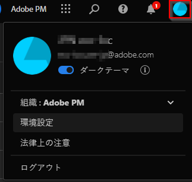

# ユーザー環境設定

[!UICONTROL コンポーネント]／[!UICONTROL ユーザーの環境設定]ページでは、Analysis Workspace 設定（および関連するコンポーネント）を管理できます。ユーザーの環境設定は、*すべて*&#x200B;の新しいプロジェクトまたはパネルに適用されます。

## 一般環境設定

一般環境設定は、ブラウザーでの CJA エクスペリエンスに適用されます。

| 環境設定 | オプション |
| --- | --- |
| ランディングページ | <ul><li>プロジェクトリスト（デフォルト）</li><li>空のプロジェクト</li><li>特定のプロジェクト</li></ul> |
| ヒント | <ul><li>有効（デフォルト）</li><li>無効</li></ul> |

## プロジェクトの環境設定

プロジェクト環境設定が Analysis Workspace で作成された新規プロジェクトおよび新規パネルに適用されます。環境設定は、ワークスペース／プロジェクト／プロジェクト情報および設定で、プロジェクトごとに管理することもできます。

| セクション | 環境設定 | オプション |
| --- | --- | --- |
| **表示** |  |  |
|  | [表示密度](https://experienceleague.adobe.com/docs/analytics-platform/using/cja-workspace/build-workspace-project/view-density.html?lang=ja) | <ul><li>コンパクト</li><li>快適</li><li>拡張（デフォルト）</li></ul> |
|  | [カラーパレット](https://experienceleague.adobe.com/docs/analytics-platform/using/cja-workspace/build-workspace-project/color-palettes.html?lang=ja) | <ul><li>Adobe が提供するパレット（デフォルト）</li><li>カスタム定義パレット</li></ul> |
| **データ** |  |  |
|  | [カレンダー](https://experienceleague.adobe.com/docs/analytics-platform/using/cja-workspace/panels/panels.html?lang=ja#calendar) | **[!UICONTROL 今月]**&#x200B;を含む、すぐに使用できる日付範囲のリスト（デフォルト）  |
|  | [パネルタイプ](https://experienceleague.adobe.com/docs/analytics-platform/using/cja-workspace/panels/panels.html?lang=ja) | <ul><li>フリーフォーム（デフォルト）</li><li>空白</li><li>クイックインサイト</li></ul> |
|  | 数値の形式 | <ul><li>1,000.00（デフォルト）</li><li>1.000,00</li><li>1 000,00</li></ul> |
|  | CSV 区切り文字 | <ul><li>カンマ（デフォルト）</li><li>セミコロン</li><li>コロン</li><li>パイプ</li><li>ピリオド</li><li>空白文字</li><li>タブ</li></ul> |
|  | フリーフォームテーブル | <ul><li>異常値を表示 </li><li>スパークラインを表示</li><li>注釈を表示</li></ul> |

## [!UICONTROL ダークテーマ]

Customer Journey Analytics ユーザーインターフェイスの背景を暗くする場合は、[!UICONTROL ダークテーマ]に切り替えることができます。

1. 右上の Experience Cloud ユーザーアイコンをクリックします。

   

1. **[!UICONTROL ダークテーマ]**&#x200B;トグルを右に切り替えます。

