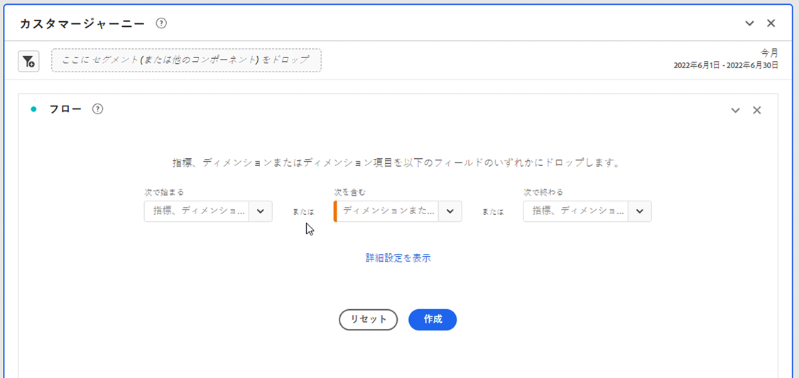
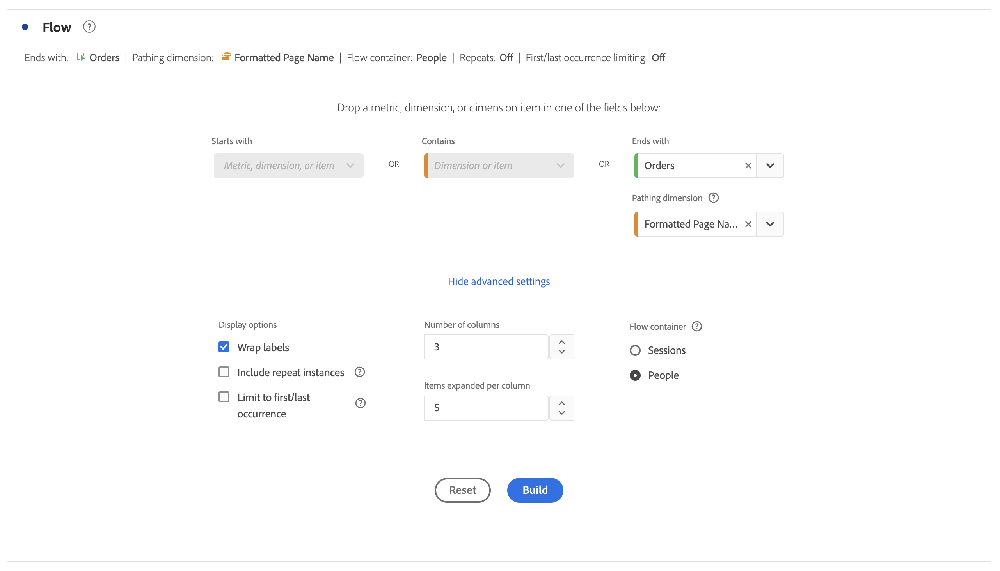
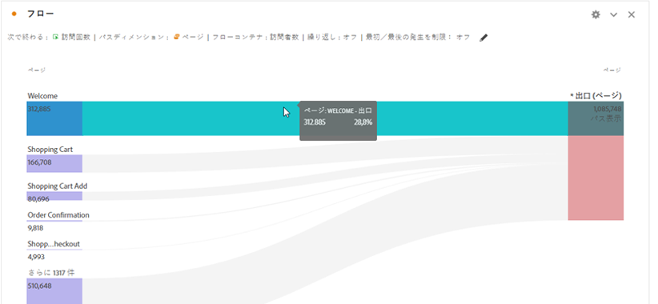
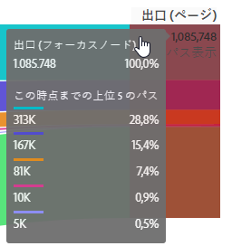
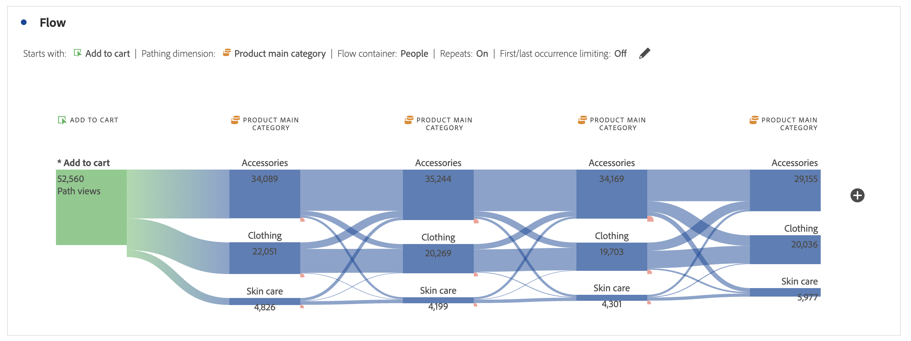
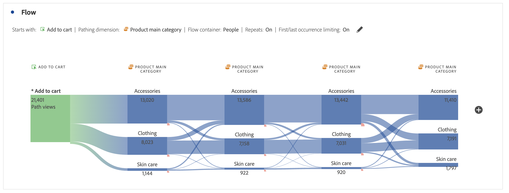
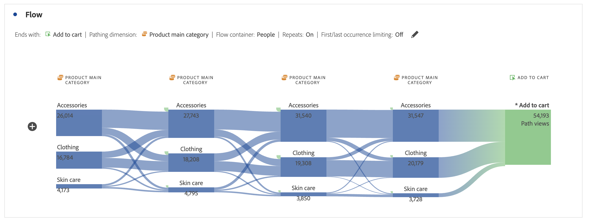
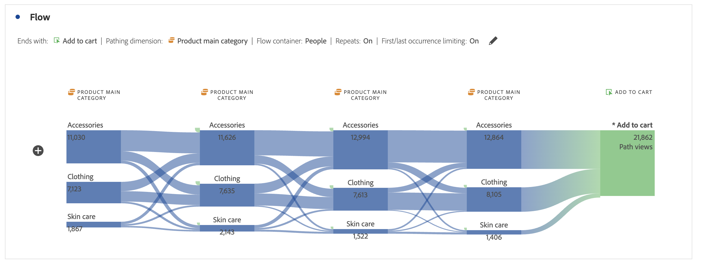

# フロービジュアライゼーションの設定 {#configure-a-flow-visualization}

>[!CONTEXTUALHELP]
>id="workspace_flow_startswith"
>title="次の語句で始まる"
>abstract="このフィールドは、最初のビルドでのみ設定できます。 このフィールドを更新するには、「**[!UICONTROL リセット]**」を選択して、新しいフロービジュアライゼーションを作成します。"

>[!CONTEXTUALHELP]
>id="workspace_flow_contains"
>title="次を含む"
>abstract="このフィールドは、最初のビルドでのみ設定できます。 このフィールドを更新するには、「**[!UICONTROL リセット]**」を選択して、新しいフロービジュアライゼーションを作成します。"

>[!CONTEXTUALHELP]
>id="workspace_flow_endswith"
>title="次の語句で終わる"
>abstract="このフィールドは、最初のビルドでのみ設定できます。 このフィールドを更新するには、「**[!UICONTROL リセット]**」を選択して、新しいフロービジュアライゼーションを作成します。"

>[!CONTEXTUALHELP]
>id="workspace_flow_pathingdimension"
>title="パスディメンション"
>abstract="選択したコンポーネントに続くパスや選択したコンポーネントから来るパスとして使用するディメンションを選択します。"

>[!CONTEXTUALHELP]
>id="workspace_flow_container"
>title="フローコンテナ"
>abstract="パス（の数値）の表示に使用するコンテナを選択します。"

>[!CONTEXTUALHELP]
>id="workspace_flow_include_repeats_disabled"
>title="繰り返しを含める（無効）"
>abstract="繰り返しは、複数値のディメンションを含むフロービジュアライゼーションから削除できません。"

>[!CONTEXTUALHELP]
>id="workspace_flow_include_repeats_default"
>title="繰り返しを含める"
>abstract="フロービジュアライゼーションは、ディメンションのインスタンスに基づいています。 この設定により、ページのリロードなど、繰り返し発生するインスタンスを含めるか除外するかを選択できます。"

>[!CONTEXTUALHELP]
>id="workspace_flow_limit_occurrence"
>title="最初 / 最後の発生に制限"
>abstract="結果は、最初／最後のタッチポイントが入口か出口である場合のパスのみに制限されます。"

>[!CONTEXTUALHELP]
>id="workspace_flow_numberofcolumns"
>title="列の数"
>abstract="このフィールドは、最初のビルドでのみ設定できます。 このフィールドを更新するには、「**[!UICONTROL リセット]**」を選択して、新しいフロービジュアライゼーションを作成します。"

>[!CONTEXTUALHELP]
>id="workspace_flow_itemsexpandedpercolumn"
>title="列ごとに展開される項目数"
>abstract="このフィールドは、最初のビルドでのみ設定できます。 このフィールドを更新するには、「**[!UICONTROL リセット]**」を選択して、新しいフロービジュアライゼーションを作成します。"

>[!CONTEXTUALHELP]
>id="workspace_flow_resettoupdate"
>title="リセットして更新"
>abstract="このフィールドは、最初のビルドでのみ設定できます。 このフィールドを更新するには、「**[!UICONTROL リセット]**」を選択して、新しいフロービジュアライゼーションを作成します。"

フローの可視化は、web サイトやアプリ上の特定のコンバージョンイベントを起点とするジャーニーを把握するのに役立ちます。 特定のコンバージョンイベントに至るまでエンゲージできます。 ビジュアライゼーションは、ディメンション（およびディメンション項目）または指標を通してパスをトレースします。

目的のパスの開始または終了を設定できます。 または、ディメンション項目またはディメンション項目を通過するすべてのパスを分析します。

## 使用

1.  **[!UICONTROL フロー]**&#x200B;ビジュアライゼーションを追加します。 [パネルへのビジュアライゼーションの追加](../freeform-analysis-visualizations.md#add-visualizations-to-a-panel)を参照してください。

1. 次のオプションのいずれかを使用して、フロービジュアライゼーションを固定します。

   * [!UICONTROL **次で始まる**]（指標、ディメンション、または項目）、
   * [!UICONTROL **次を含む**]（ディメンション、または項目）、
   * [!UICONTROL **次で終わる**]（指標、ディメンションまたは項目）

   これらの各カテゴリは、画面上に&#x200B;*ドロップゾーン*&#x200B;として表示されます。 ドロップゾーンは、次の 3 つの方法で設定できます。

   * ドロップダウンメニューを使用して、指標またはディメンションを選択する。
   * ディメンションまたは指標を左側のパネルからドラッグします。
   * ディメンションまたは指標の名前を入力し、ドロップダウンメニューに表示されたら選択します。

   >[!IMPORTANT]
   >
   >計算指標を「**[!UICONTROL 次で始まる]**」または「**[!UICONTROL 次で終わる]**」フィールドで使用することはできません。

1. 指標を選択する場合は、次に示すように、使用する&#x200B;[!UICONTROL **パスディメンション**]&#x200B;を提供し、そのパスディメンションを、選択したコンポーネントへのパスまたは選択したコンポーネントからのパスとして使用する必要があります。 デフォルトは「[!UICONTROL **ページ**]」です。

   

1. （オプション）「**[!UICONTROL 詳細設定を表示]**」を選択して、次のいずれかのオプションを設定します。

   | 設定 | 説明 |
   | --- | --- |
   | **[!UICONTROL ラベルの折り返し]** | 通常、フロー要素のラベルは、画面の領域を節約するために切り捨てられます。しかし、このチェックボックスをオンにすることで完全なラベルを表示できます  （デフォルト = オフ）。 |
   | **[!UICONTROL 繰り返しインスタンスを含める]** | フロービジュアライゼーションは、ディメンションのインスタンスに基づいています。 この設定により、ページのリロードなど、繰り返し発生するインスタンスを含めるか除外するかを選択できます。 ただし、listVar、listProp、s.product、マーチャンダイジング eVar など複数の値を持つディメンションを含むフロービジュアライゼーションから、繰り返しを削除することはできません。 
このオプションはデフォルトでは無効です。
 |
   | **[!UICONTROL 最初／最後の発生件数に制限]** | パスを、ディメンション、項目、指標の、最初または最後の発生件数で始まるパスまたは終わるパスに制限します。 詳しくは、[最初／最後の発生件数に制限](#example-scenario-for-limit-to-firstlast-occurrence)を参照してください。 |
   | **[!UICONTROL 列の数]** | フロー図で必要な列数 最大 5 列まで指定できます。 |
   | **[!UICONTROL 列ごとに展開される項目数]** | 各列に必要な項目数 1 列につき最大 10 個の展開項目を指定できます。 |
   | **[!UICONTROL フローコンテナ]** | **[!UICONTROL グローバルアカウント]** [!BADGE B2B edition]{type=Informative url="https://experienceleague.adobe.com/ja/docs/analytics-platform/using/cja-overview/cja-b2b/cja-b2b-edition" newtab=true tooltip="Customer Journey Analytics B2B Edition"}、**[!UICONTROL アカウント]** [!BADGE B2B edition]{type=Informative url="https://experienceleague.adobe.com/ja/docs/analytics-platform/using/cja-overview/cja-b2b/cja-b2b-edition" newtab=true tooltip="Customer Journey Analytics B2B Edition"}、**[!UICONTROL 商談]** [!BADGE B2B edition]{type=Informative url="https://experienceleague.adobe.com/ja/docs/analytics-platform/using/cja-overview/cja-b2b/cja-b2b-edition" newtab=true tooltip="Customer Journey Analytics B2B Edition"}、**[!UICONTROL 購買グループ]** [!BADGE B2B edition]{type=Informative url="https://experienceleague.adobe.com/ja/docs/analytics-platform/using/cja-overview/cja-b2b/cja-b2b-edition" newtab=true tooltip="Customer Journey Analytics B2B Edition"}、**[!UICONTROL セッション]**&#x200B;および&#x200B;**[!UICONTROL 人物]**&#x200B;を切り替えて、パスを分析できます。 これらの設定は、特定のコンテナレベル（セッション間）でのエンゲージメントを理解したり、分析を単一のセッションに制限したりするのに役立ちます。 |

   >[!IMPORTANT]
   >
   >**[!UICONTROL 列数]**&#x200B;と&#x200B;**[!UICONTROL 列ごとに展開される項目数]**&#x200B;の組み合わせにより、フロービジュアライゼーションの作成に必要な基になるリクエストの数を決定します。 これらの数が多いほど、ビジュアライゼーションのレンダリングに時間がかかります。

1. 「**[!UICONTROL 作成]**」を選択します。

### 例

ユーザーがサイト上で最も人気のあるページに出入りする経路を辿るとします。

1. フロービジュアライゼーションを作成します。
1. [!UICONTROL **ページ**]&#x200B;ディメンションを「**[!UICONTROL 次を含む]**」フィールドにドラッグし、「[!UICONTROL **作成**]」を選択します。
1. フロービジュアライゼーションは、ビジュアライゼーションの中央にあるフォーカスノードに最も多く閲覧されたページで構築されます。 また、そのページにつながるトップページ（フォーカスノードの左側）と、そのページからつながるトップページ（フォーカスノードの右側）も表示されます。
1. フロー内のデータを分析します。詳しくは、[設定](#configure)を参照してください。

## 設定

ビジュアライゼーションの上部に、フロー設定の概要が表示されます。 図のパスは比例しています。 アクティビティが多いパスは、太く見えます。

データをさらに詳しく調べるには、次の複数のオプションがあります。

* フロー図はインタラクティブです。 ダイアグラムにマウスポインターを置いて、表示される詳細を変更します。

* 図でノードを選択すると、そのノードの詳細が表示されます。 折りたたむには、もう一度ノードを選択します。

  複数のノードをフロービジュアライゼーションで拡張したままにすると、レポート時間に影響を与える可能性があります。 一般的なガイドラインとして、一度に10個を超えるノードを拡張しないでください。

  

* 列にフィルターを適用して、特定の結果（包含や除外、除外する、条件を指定するなど）のみを表示できます。

* 左側または右側の  を選択して、列を展開します。

* 出力をカスタマイズするには、「[コンテキストメニュー](#context-menu)」オプションを使用します。

* フローを編集するか、別のオプションで再作成するには、構成の概要の横にある  を選択します。

## フィルター

各列の上にポインタを合わせると、フィルター  が表示されます。 このフィルターを選択すると、フリーフォームテーブルに存在するのと同じフィルターダイアログが表示されます。 [フィルタリングと並べ替え](freeform-table/../../freeform-table/filter-and-sort.md)を参照してください。

* **[!UICONTROL 詳細を表示]**&#x200B;を使用し、詳細設定を設定して、演算子のリストに特定の条件を含めたり、除外したりすることができます。 詳しくは、[フィルタリングと並べ替え](../freeform-table/filter-and-sort.md)を参照してください。
* 列をフィルタリングすると、その特定の列にフィルタリングが反映されます。 青色の  は、列がフィルタリングされていることを示します。  フィルターでは、列が縮小されてフィルターで許可された項目のみが表示されます。 または、フィルターに必要な 1 つの項目を除くすべての項目が削除されます。
* 残りのノードへのデータフローがある限り、すべてのダウンストリームおよびアップストリームの列は、維持されます。
* フィルターを削除するには、 を選択して、フィルターメニューを開きます。 適用されたフィルターを削除してから、「**[!UICONTROL 保存]**」をクリックします。 フローは、フィルタリングされていない、以前の状態に戻ります。

## コンテキストメニュー

次のオプションを使用して、フロービジュアライゼーション内の任意のノードでコンテキストメニューを使用します。

| オプション | 説明 |
|--- |--- |
| **[!UICONTROL このノードにフォーカス]** | 選択したノードにフォーカスを変更します。 フォーカスノードは、フロー図の中央に表示されます。 |
| **[!UICONTROL やり直し]** | 新しいフロー図を作成できる、フリーフォーム図ビルダーに戻ります。 |
| **[!UICONTROL このパスのセグメントを作成]** | セグメントを作成します。 この選択により、新しいセグメントを設定できるセグメントビルダーに移動します。 |
| **[!UICONTROL 分類]** | 利用可能なディメンション、指標、時間でノードを分類します。 |
| **[!UICONTROL フィルター列]** | フリーフォームテーブルで使用できるのと同じフィルターオプションが表示されます。 使用可能なオプションについて詳しくは、[テーブルのフィルタリングと並べ替え](/help/analysis-workspace/visualizations/freeform-table/filter-and-sort.md)の「テーブルへのシンプルなフィルターまたは高度なフィルターの適用」の節を参照してください。 |
| **[!UICONTROL 項目を除外]**&#x200B;または&#x200B;**[!UICONTROL 除外した項目を復元]** | 列から特定のノードを削除して、列の上部にフィルターとして自動的に作成します。 除外した項目を復元するには、コンテキストメニューから、「**[!UICONTROL 除外した項目を復元]**」を選択します。 列の上部にあるセグメントを開き、除外した項目でピルボックスを削除することもできます。 |
| **[!UICONTROL トレンド]** | ノードのトレンド図を作成します。 |
| **[!UICONTROL 次の列を表示]**／**[!UICONTROL 前の列を表示]** | ビジュアライゼーションの次の（右）列または前の（左）列を表示します。 |
| **[!UICONTROL 列を非表示]**&#x200B;n | 選択されている列をビジュアライゼーションから非表示にします。 |
| **[!UICONTROL 列全体を展開]** | 列を展開して、すべてのノードを表示します。 デフォルトでは、上位5つのノードのみが表示されます。 |
| **[!UICONTROL 選択内容からオーディエンスを作成]** | 選択した列に基づいてオーディエンスを作成します。 |
| **[!UICONTROL 列全体を折りたたむ]** | すべてのノードを列内に隠します。 |

## 最初 / 最後の発生に制限

このオプションを使用する場合、次の点に注意してください。

* **[!UICONTROL 最初 / 最後の発生に制限]**&#x200B;は、シリーズの最初または最後の発生のみをカウントします。 **[!UICONTROL 次で始まる]**&#x200B;または&#x200B;**[!UICONTROL 次で終わる]**&#x200B;条件の他のすべての発生は、破棄されます。
* **[!UICONTROL 次で始まる]**&#x200B;フローで使用していた場合、開始条件に一致する最初の発生のみが含まれます。
次の例では、フロー内の各ステップにおける*買い物かごに追加*&#x200B;と&#x200B;*製品メインカテゴリ*&#x200B;の&#x200B;**すべて**&#x200B;の発生件数が含まれます。
  

  次の例では、フローの各ステップにおける&#x200B;*買い物かごに追加*&#x200B;と&#x200B;*製品メインカテゴリ*&#x200B;の&#x200B;**最初**&#x200B;の発生件数のみが含まれます。
  
* **[!UICONTROL 次で終わる]**&#x200B;フローで使用していた場合、終了条件に一致する最後の発生のみが含まれます。
次の例では、フロー内の各ステップにおける*製品メインカテゴリ*&#x200B;と&#x200B;*買い物かごに追加*&#x200B;の&#x200B;**すべて**&#x200B;の発生件数が含まれます。
  

  次の例では、フローの各ステップにおける&#x200B;*製品メインカテゴリ*&#x200B;と&#x200B;*買い物かごに追加*&#x200B;の&#x200B;**最後**&#x200B;の発生のみが含まれます。
  
* 使用される系列は、コンテナに基づいて異なります。 **[!UICONTROL Session]** コンテナを使用する場合、一連のイベントはセッションに限定されます。  他のコンテナのいずれかを使用する場合（例：**[!UICONTROL ユーザー]**&#x200B;または&#x200B;**[!UICONTROL アカウント]** [!BADGE B2B edition]{type=Informative url="https://experienceleague.adobe.com/ja/docs/analytics-platform/using/cja-overview/cja-b2b/cja-b2b-edition" newtab=true tooltip="Customer Journey Analytics B2B Edition"}、または&#x200B;**[!UICONTROL 商談]** [!BADGE B2B edition]{type=Informative url="https://experienceleague.adobe.com/ja/docs/analytics-platform/using/cja-overview/cja-b2b/cja-b2b-edition" newtab=true tooltip="Customer Journey Analytics B2B Edition"}）、一連のイベントは指定されたコンテナに基づいており、複数のセッションにまたがる可能性があります。
* 「**[!UICONTROL 最初／最後の発生に制限]**」オプションは、「**[!UICONTROL 次で始まる]**」または「**[!UICONTROL 次で終わる]**」フィールドで指標またはディメンション項目を使用している場合に、詳細設定で設定できます。

>[!MORELIKETHIS]
>
>[&#x200B; パネルへのビジュアライゼーションの追加](/help/analysis-workspace/visualizations/freeform-analysis-visualizations.md#add-visualizations-to-a-panel)
>[ビジュアライゼーション設定](/help/analysis-workspace/visualizations/freeform-analysis-visualizations.md#settings)
>[ビジュアライゼーションコンテキストメニュー](/help/analysis-workspace/visualizations/freeform-analysis-visualizations.md#context-menu)
>

