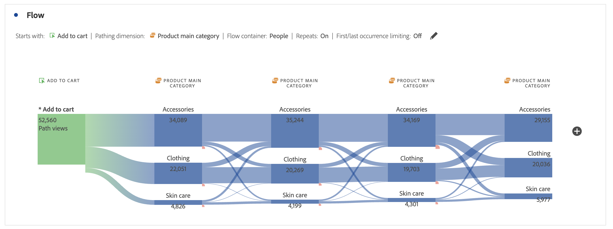

# フロービジュアライゼーションの設定

フロービジュアライゼーションは、web サイトやアプリ上の特定のコンバージョンイベントに起因するジャーニーを理解するのに役立ちます。 または、特定のコンバージョンイベントに至る。 ビジュアライゼーションは、ディメンション（およびディメンション項目）または指標を通過するパスをトレースします。

目的のパスの開始または終了を設定できます。 または、ディメンションまたはディメンション項目を流れるすべてのパスを分析します。

## 用途

1. **[!UICONTROL フロー]** ビジュアライゼーションを追加します。 [ パネルへのビジュアライゼーションの追加 ](../freeform-analysis-visualizations.md#add-visualizations-to-a-panel) を参照してください。

1. 次のオプションのいずれかを使用して、フロービジュアライゼーションを固定します。

   * [!UICONTROL **次で始まる**]（指標、ディメンション、または項目）、
   * [!UICONTROL **次を含む**]（ディメンション、または項目）、
   * [!UICONTROL **次で終わる**]（指標、ディメンションまたは項目）

   各カテゴリは、画面上に *ドロップゾーン* として表示されます。 ドロップゾーンは、次の 3 つの方法で設定できます。

   * ドロップダウンメニューを使用して、指標またはディメンションを選択する。
   * 左側のパネルからディメンションまたは指標をドラッグします。
   * ディメンションまたは指標の名前を入力し始め、ドロップダウンリストに表示されたら選択します。

   >[!IMPORTANT]
   >
   >計算指標は「**[!UICONTROL 次で始まる]**」または「**[!UICONTROL 次で終わる]** フィールドでは使用できません。

1. 指標を選択する場合は、次に示すように、選択したコンポーネントに続くパスまたは選択したコンポーネントから来るパスとして使用するために、[!UICONTROL **パスDimension**] を指定する必要もあります。 デフォルトは「[!UICONTROL **ページ**]」です。

   

1. （オプション）「**[!UICONTROL 詳細設定を表示]**」を選択して、次のいずれかのオプションを設定します。

   | 設定 | 説明 |
   | --- | --- |
   | **[!UICONTROL ラベルの折り返し]** | 通常、フロー要素のラベルは、画面の領域を節約するために切り捨てられます。しかし、このチェックボックスをオンにすることで完全なラベルを表示できます（デフォルト = オフ）。 |
   | **[!UICONTROL 繰り返しインスタンスを含める]** | フロービジュアライゼーションは、ディメンションのインスタンスに基づいています。この設定には、繰り返されるインスタンス（ページの再読み込みなど）を含めたり除外したりするオプションがあります。 ただし、listVar、listProp、s.product、マーチャンダイジング eVar など複数の値を持つディメンションを含むフロービジュアライゼーションから、繰り返しを削除することはできません。 
このオプションはデフォルトでは無効です。
 |
   | **[!UICONTROL 最初／最後の発生件数に制限]** | パスを、ディメンション、項目または指標の、最初または最後の出現で開始または終了するパスに制限します。 詳しくは、[ 最初/最後の発生に制限 ](#example-scenario-for-limit-to-firstlast-occurrence) を参照してください。 |
   | **[!UICONTROL 列の数]** | フロー図で必要な列数最大 5 列まで指定できます。 |
   | **[!UICONTROL 列ごとに展開される項目数]** | 各列に必要な項目数1 列につき最大 10 個の展開項目を指定できます。 |
   | **[!UICONTROL フローコンテナ]** | **[!UICONTROL セッション]** と **[!UICONTROL ユーザー]** を切り替えて、パスを分析できます。 これらの設定により、（複数のセッションをまたいで）人物レベルで人物のエンゲージメントを把握したり、分析を単一のセッションに制限したりできます。 |

   >[!IMPORTANT]
   >
   >**[!UICONTROL 列数]**&#x200B;と&#x200B;**[!UICONTROL 列ごとに展開される項目数]**&#x200B;の組み合わせにより、フロービジュアライゼーションの作成に必要な基になるリクエストの数を決定します。これらの数が多いほど、ビジュアライゼーションのレンダリングに時間がかかります。

1. 「**[!UICONTROL 作成]**」を選択します。

### 例

サイト上の最も人気のあるページと、そのページとの両方からユーザーがたどったパスをトレースするとします。

1. 上記のようにフロービジュアライゼーションを作成します。
1. [!UICONTROL **ページ**]&#x200B;ディメンションを&#x200B;**[!UICONTROL 次を含む]**&#x200B;フィールドにドラッグし、[!UICONTROL **作成**]&#x200B;を選択します。
1. フロービジュアライゼーションは、ビジュアライゼーションの中央に、フォーカスノードに最も多く表示されたページを表示してビルドされます。 また、そのページに続く上部のページ（フォーカスノードの左側）と、そのページから続く上部のページ（フォーカスノードの右側）も表示されます。
1. [ 設定 ](#configure) の説明に従って、フローのデータを分析します。

## 設定する

フロー設定の概要が、ビジュアライゼーションの上部に表示されます。 図のパスは比例します。アクティビティの多いパスは太く表示されます。

データをさらに詳しく調べるには、次の複数のオプションがあります。

* フロー図はインタラクティブです。図にマウスポインターを置いて、表示する詳細情報を変更します。

* 図のノードを選択すると、そのノードの詳細が表示されます。ノードを再度選択すると、折りたたまれます。

  

* 列にフィルターを適用して、特定の結果（包含や除外、除外する、条件を指定するなど）のみを表示できます。

* 左側または右側の  を選択して、列を展開します。

* 出力をカスタマイズするには、「[ コンテキストメニュー ](#context-menu)」オプションを使用します。

* フローを編集するか、別のオプションで再構築するには、設定の概要の横にある  を選択します。

## フィルター

各列の上にマウスポインターを置くと、フィルター  が表示されます。 このフィルターを選択すると、フリーフォームテーブルに存在するのと同じフィルターダイアログが表示されます。 [ フィルターと並べ替え ](freeform-table/../../freeform-table/filter-and-sort.md) を参照してください。

* **[!UICONTROL 詳細を表示]** を使用して、演算子のリストで特定の条件を含めたり、除外したりする詳細設定を設定します。 詳しくは、[ フィルターと並べ替え ](../freeform-table/filter-and-sort.md) を参照してください。
* 列をフィルターすると、その特定の列にフィルターが反映されます。 青い  は、列がフィルターされていることを示します。  フィルターでは、列が縮小されてフィルターで許可された項目のみが表示されます。 または、フィルターに必要な 1 つの項目を除くすべての項目を削除します。
* 残りのノードへのデータフローがある限り、すべてのダウンストリームおよびアップストリームの列は、保持されます。
* フィルターを削除するには、「」を選択して、フィルターメニューを開きます。 適用されたフィルターを削除してから、「**[!UICONTROL 保存]**」をクリックします。フローは、フィルタリングされていない、以前の状態に戻ります。

## コンテキストメニュー

次のオプションを使用して、フロービジュアライゼーション内の任意のノードでコンテキストメニューを使用します。

| オプション | 説明 |
|--- |--- |
| **[!UICONTROL このノードにフォーカス]** | 選択したノードにフォーカスを変更します。フロー図の中央にフォーカスノードが表示されます。 |
| **[!UICONTROL やり直し]** | 新しいフロー図を作成できる、フリーフォーム図ビルダーに戻ります。 |
| **[!UICONTROL このパスのフィルターを作成]** | フィルターを作成します。 これを選択すると、フィルタービルダーに移動し、新しいフィルターを設定できます。 |
| **[!UICONTROL 分類]** | 利用可能なディメンション、指標、時間でノードを分類します。 |
| **[!UICONTROL フィルター列]** | フリーフォームテーブルで使用できるのと同じフィルターオプションが表示されます。 使用可能なオプションの詳細については、「テーブルのフィルタと並べ替え [ の「テーブルに簡易フィルタまたは詳細フィルタを適用する」を参照し ](/help/analysis-workspace/visualizations/freeform-table/filter-and-sort.md) ください。 |
| **[!UICONTROL 項目を除外]** または **[!UICONTROL 除外した項目を復元]** | 列から特定のノードを削除して、列の上部にフィルターとして自動的に作成します。除外した項目を復元するには、右クリック メニューから [**[!UICONTROL 除外した項目を復元]**] を選択します。 また、列の上部にあるフィルターを開いて、先ほど除外した項目を含むピルボックスを削除することもできます。 |
| **[!UICONTROL トレンド]** | ノードのトレンド図を作成します。 |
| **[!UICONTROL 次の列を表示]** / **[!UICONTROL 前の列を表示]** | ビジュアライゼーションの次の（右）列または前の（左）列を表示します。 |
| **[!UICONTROL  列を非表示 ]**n | 選択されている列をビジュアライゼーションから非表示にします。 |
| **[!UICONTROL 列全体を展開]** | 列を展開して、すべてのノードを表示します。デフォルトでは、上位 5 つのノードのみ表示されます。 |
| **[!UICONTROL 選択からオーディエンスを作成]** | 選択された列に基づいてオーディエンスを作成します。 |
| **[!UICONTROL 列全体を折りたたむ]** | すべてのノードを列内に隠します。 |

## 最初 / 最後の発生に制限

このオプションを使用する場合、次の点に注意してください。

* **[!UICONTROL 最初 / 最後の発生に制限]**&#x200B;は、シリーズの最初または最後の発生のみをカウントします。**[!UICONTROL 次で始まる]**&#x200B;または&#x200B;**[!UICONTROL 次で終わる]**&#x200B;条件の他のすべての発生は、破棄されます。
* **[!UICONTROL 次で始まる]** フローで使用していた場合、開始条件に一致する最初の発生のみが含まれます。
次の例では、フローの各ステップに **すべて** 出現する *買い物かごに追加* と *製品メインカテゴリ* が含まれています。
  

  次の例では、フローの各ステップの *買い物かごに追加* と *製品メインカテゴリ* の **最初** の発生のみが含まれます。
  
* **[!UICONTROL 次で終わる]** フローで使用していた場合、終了条件に一致する最後の発生のみが含まれます。
次の例では、フローの各ステップに **すべて** 出現する *製品のメインカテゴリ* と *買い物かごに追加* が含まれています。
  

  次の例では、フローの各ステップの *製品メインカテゴリ* と *買い物かごに追加* の **最後** の発生のみが含まれます。
  
* 使用されるシリーズは、コンテナに基づいて異なります。**[!UICONTROL ユーザー]** コンテナを使用する場合、一連のイベントがセッションになります。 **[!UICONTROL セッション]** コンテナを使用している場合、一連のイベントは、指定された日付範囲での指定されたユーザーに対するすべてのイベントです。
* 「**[!UICONTROL 最初/最後の発生に制限]**」オプションは、「次で始まる ]**または「次で終わる**[!UICONTROL  フィールドで指標またはDimension項目を使用している場合に **[!UICONTROL 詳細設定で設定でき]** す。

>[!MORELIKETHIS]
>
>[ パネルへのビジュアライゼーションの追加 ](/help/analysis-workspace/visualizations/freeform-analysis-visualizations.md#add-visualizations-to-a-panel)
>[ビジュアライゼーション設定 ](/help/analysis-workspace/visualizations/freeform-analysis-visualizations.md#settings)
>[ビジュアライゼーションコンテキストメニュー ](/help/analysis-workspace/visualizations/freeform-analysis-visualizations.md#context-menu)
>

