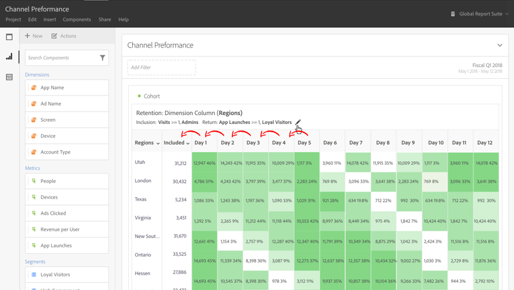

# [!UICONTROL コホート分析]とは

*`cohort`* とは、特定の期間、共通の特性を共有する人々のグループのことです。[!UICONTROL コホート分析は]、例えば、コホートがブランドとどのように関わっているかを学ぶ場合に便利です。トレンドの変更を簡単に見分けて、それに応じて対応できます（[!UICONTROL コホート分析]の説明は、[コホート分析 101](https://en.wikipedia.org/wiki/Cohort_analysis) など、Web 上で参照できます）。

コホートレポートを作成したら、コンポーネント（特定のディメンション、指標およびフィルター）をキュレートして、任意のユーザーとコホートレポートを共有できます。[キュレートおよび共有](/help/analysis-workspace/curate-share/curate.md)を参照してください。

[!UICONTROL コホート分析]では、例えば次の操作をおこなえます。

* 目的のアクションを促進するために設計したキャンペーンを開始する。
* 顧客のライフサイクルのまさに適切なタイミングでマーケティング予算を振り替える。
* 価値を最大化するために、トライアルやオファーを終了するタイミングを認識する。
* 価格やアップグレードパスなどの領域で、A/B テストの着想を得る。

[!UICONTROL コホート分析]は、[!UICONTROL Analysis Workspace] へのアクセス権を持つすべての Customer Journey Analytics ユーザーが利用できます。

[コホート分析のビデオチュートリアル](https://experienceleague.adobe.com/docs/analytics-learn/tutorials/analysis-workspace/cohort-analysis/cohort-analysis-workspace.html?lang=ja) （4:36）

>[!IMPORTANT]
>
>[!UICONTROL  コホート分析 ] では、フィルタリングできない指標（計算指標など）、整数以外の指標（売上高など）、発生件数はサポートしていません。 [!UICONTROL  コホート分析 ] で使用できるのはフィルターで使用できる指標のみで、一度に増やせるのは 1 つのみです。

## コホート分析の機能

次の機能を使用すると、作成するコホートを細かく制御できます。

### [!UICONTROL リテンションテ]ーブル

[!UICONTROL  保持 ] コホートレポートでは人物が返されます。各データセルには、その期間中にアクションを実行したコホート内の人物の生の数と割合が表示されます。 指標は最大 3 個、フィルターは最大 10 個含めることができます。

### [!UICONTROL チャーンテーブル]

[!UICONTROL  チャーン ] コホートはリテンションテーブルの逆であり、コホートの返品条件を満たさなかったユーザーまたは満たさなかったユーザーの経時的な表示です。 指標は最大 3 個、フィルターは最大 10 個含めることができます。

### [!UICONTROL ローリング計算]

「含む」列ではなく、直前の列に基づいてリテンションまたはチャーンを計算できます。

### [!UICONTROL 待ち時間テーブル]

インクルージョンイベントが発生した前後の経過時間を測定します。このツールは、イベント発生前後の分析に役立ちます。「**[!UICONTROL 含む]**」列がテーブルの中央にあり、インクルージョンイベント発生の前と後の期間が両側に表示されます。

### [!UICONTROL カスタムディメンショ]ンコホート

デフォルトの時間に基づくコホートではなく、選択したディメンションに基づいてコホートを作成します。[!UICONTROL マーケティングチャネル]、[!UICONTROL キャンペーン]、[!UICONTROL 製品]、[!UICONTROL ページ]、[!UICONTROL 地域]などのディメンションや、Customer Journey Analytics のその他のディメンションを使用して、これらのディメンションの様々な値に基づいてリテンションがどのように変化しているかを表示します。

コホートレポートを設定および実行する方法については、[コホート分析レポートの設定](/help/analysis-workspace/visualizations/cohort-table/t-cohort.md)を参照してください。
