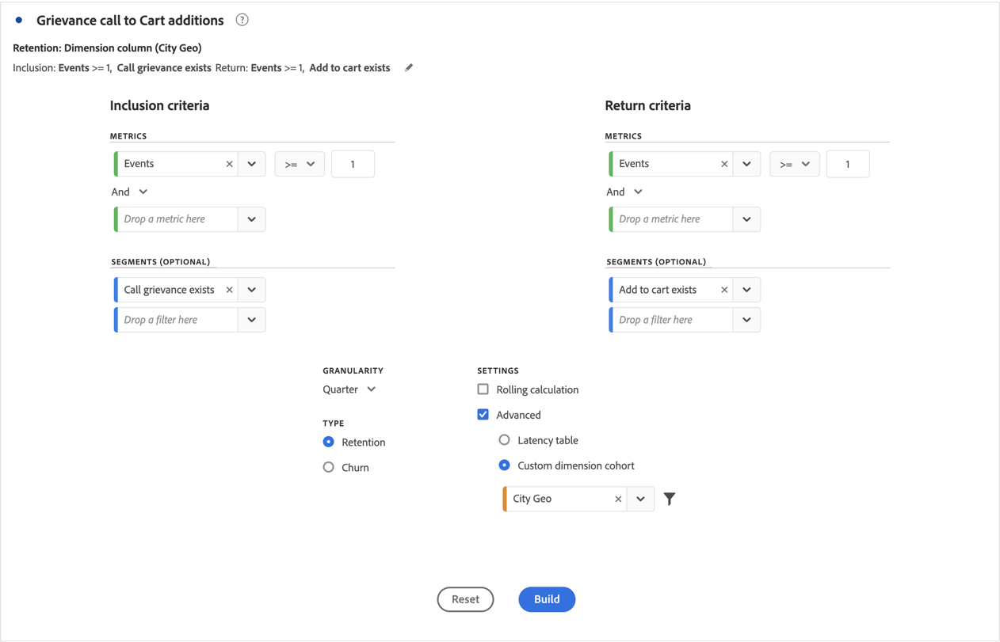

# コホートテーブルの設定

[!UICONTROL コホートテーブル]を作成および設定するには：

1.  **[!UICONTROL コホートテーブル]**&#x200B;ビジュアライゼーションを追加します。[パネルへのビジュアライゼーションの追加](../freeform-analysis-visualizations.md#add-visualizations-to-a-panel)を参照してください。

1. 以下のテーブルに従って、**[!UICONTROL インクルージョン条件]**、**[!UICONTROL 再来訪条件]**、**[!UICONTROL コホートタイプ]**、**[!UICONTROL 設定]**&#x200B;を定義します。

   

   | 要素 | 説明 |
   |--- |--- |
   | **[!UICONTROL インクルージョン条件]** | 最大で、10 個のインクルージョンセグメントおよび 3 個のインクルージョン指標を適用できます。指標は、ユーザーが属するコホートを指定します。例えば、インクルージョン指標が「注文」の場合、コホート分析の期間中に注文したユーザーのみが最初のコホートに含まれます。 指標間のデフォルトの演算子は「AND」ですが、「OR」に変更することもできます。さらに、これらの指標に数値セグメント化を追加できます。 例：`Sessions >= 1`.  |
   | **[!UICONTROL 再来訪条件]** | 最大で、10 個のリターンセグメントおよび 3 個のリターン指標を適用できます。この指標は、ユーザーが保持されたか（リテンション）、保持されなかったか（チャーン）を示します。例えば、再来訪指標がビデオ視聴回数である場合、後続の期間（コホートに追加された期間後）にビデオを視聴したユーザーのみが定着したとして表されます。保持を定量化するもう 1 つの指標はセッション数です。 |
   | [!BADGE B2B edition]{type=Informative url="https://experienceleague.adobe.com/ja/docs/analytics-platform/using/cja-overview/cja-b2b/cja-b2b-edition" newtab=true tooltip="Customer Journey Analytics B2B Edition"} **[!UICONTROL Container ]** | デフォルトでは、コホート分析は個人コンテナに結び付けられます。 Workspace プロジェクトをサポートするアカウントベースの連携で個人を超えるその他のコンテナが利用できる場合は、「**[!UICONTROL コンテナ]**」ドロップダウンメニューからコホート分析用の別のコンテナを選択できます。 |
   | **[!UICONTROL 精度]** | 日、週、月、四半期および年の時間の精度。 |
   | **[!UICONTROL タイプ]** | **[!UICONTROL リテンション]**（デフォルト）：**[!UICONTROL リテンション]**&#x200B;コホートでは、時間の経過と共にユーザーのコホートがどの程度プロパティに戻ってくるかを測定します。再来訪コホートは標準的なコホートであり、再来訪ユーザーやリピートユーザーの行動を示します。緑色は、テーブル内の[!UICONTROL リテンション]コホートを示します。 **[!UICONTROL チャーン&#x200B;]**：**[!UICONTROL &#x200B;チャーン&#x200B;]**（離脱やフォールアウトとも呼ばれる）コホートでは、ユーザーのコホートがどの程度プロパティから離脱するかの推移を測定します。チャーンはリテンションの逆、つまり `Churn = 1 - Retention` です。[!UICONTROL チャーン]は、顧客が戻ってこなかった頻度を示すことで、定着度および改善のチャンスを示す良い指標となります。チャーンを使用して、注目すべき領域（どのコホートセグメントに注目すべきか）を分析し、特定できます。 赤色は、テーブル内の[!UICONTROL チャーン]コホートを示します（**[!UICONTROL &#x200B;フロー&#x200B;]**ビジュアライゼーションのフォールアウトと同様）。  |
   | **[!UICONTROL 設定]** | **[!UICONTROL ローリング計算]**：含める列（デフォルト）ではなく、以前の列に基づいてリテンションまたはチャーンを計算します。[!UICONTROL ローリング計算]では、「再来訪」の期間の計算方法が変わります。通常の計算では、再来訪条件を満たし、「含む」期間に含まれていたユーザーが検索されます。前の期間にコホートに含まれていたかどうかは関係ありません。[!UICONTROL ローリング計算]では、直前の期間で該当するコホートに含まれていたユーザーのうち、「リターン」条件を満たすユーザーが検出されます。したがって、[!UICONTROL  ローリング計算 ] では、「リターン」条件の期間を継続的に満たすユーザーを期間にわたってセグメント化し、ファネルします。 [!UICONTROL 再来訪]条件は、選択した期間に至るまでの各期間に適用されます。  **[!UICONTROL 待ち時間テーブル&#x200B;]**：[!UICONTROL 待ち時間]テーブルは、インクルージョンイベント発生前後の経過時間を測定します。[!UICONTROL 待ち時間テーブル]は、分析前後に使用するのに最適です。例えば、今後の製品やキャンペーンのローンチが予定されていて、ローンチの前後の行動を追跡するとします。[!UICONTROL 待ち時間テーブル]には、直接的な影響を確認するために、前後の動作が並べて表示されます。[!UICONTROL 待ち時間テーブル]のインクルージョン前のセルは、インクルージョン期間に[!UICONTROL インクルージョン]条件を満たし、インクルージョン期間の前の期間に[!UICONTROL 再来訪]条件を満たすユーザー数を計算します。[!UICONTROL 待ち時間テーブル]と[!UICONTROL カスタムディメンションコホート]をまとめて使用することはできません。  **[!UICONTROL カスタムディメンションコホート]**：時間に基づくコホート（デフォルト）ではなく、選択したディメンションに基づくコホートを作成します。多くのユーザーは、時間以外の基準でコホートを分析したいと考えています。新しいカスタムディメンションコホート機能では、顧客が選択したディメンションに基づいてコホートを柔軟に構築することができます。マーケティングチャネル、キャンペーン、製品、ページ、地域などのディメンションを使用し、これらのディメンションの様々な値に基づいて、リテンションがどのように変化しているかを表示します。[!UICONTROL カスタムディメンション]コホートセグメント定義では、ディメンション項目をリターン定義の一部ではなくインクルージョン期間の一部としてのみ適用します。  「[!UICONTROL カスタムディメンションコホート]」オプションを選択した後、任意のディメンションをドロップゾーンにドラッグ＆ドロップできます。ディメンションを追加すると、同じ期間で類似のディメンション項目を比較できます。例えば、市区町村、製品、キャンペーンなどのパフォーマンスを並べて比較できます。コホートテーブルは、上位 14 のディメンション項目を返します。ただし、 セグメントを使用して、目的のディメンション項目のみを表示できます。 [!UICONTROL カスタムディメンションコホート]は、[!UICONTROL 待ち時間テーブル]機能では使用できません。  |

1. 「**[!UICONTROL 作成]**」をクリックします。
1. [!UICONTROL コホートテーブル]を再設定するには、 を選択します。

1. （任意）選択範囲からセグメントまたはオーディエンスを作成します。

   複数のセルを選択して（連続または不連続）、右クリックし、「**[!UICONTROL 選択からセグメントを作成]**」をクリックします。

   

1. [セグメントビルダー](/help/components/segments/seg-builder.md)で、セグメントをさらに編集して、「**[!UICONTROL 保存]**」をクリックします。

   保存したセグメントは、[!UICONTROL Analysis Workspace] の[!UICONTROL セグメント]パネルで使用できます。

## 設定

[!UICONTROL コホートテーブル]の特定の設定を定義できます。

1.  を選択して、[!UICONTROL コホートテーブル]の設定を調整します。

   | 設定 | 説明 |
   |---|---|
   | **割合のみを表示** | 数値を削除し、パーセンテージのみを表示します。 |
   | **割合を整数に四捨五入** | パーセント値を、小数値ではなく、最も近い整数に丸めます。 |
   | **割合の平均行を表示** | テーブルの先頭に新しい行を挿入し、各列の値の平均を加算します。 |

>[!MORELIKETHIS]
>
>[パネルへのビジュアライゼーションの追加](/help/analysis-workspace/visualizations/freeform-analysis-visualizations.md#add-visualizations-to-a-panel)
>>[ビジュアライゼーション設定](/help/analysis-workspace/visualizations/freeform-analysis-visualizations.md#settings)
>>[ビジュアライゼーションコンテキストメニュー](/help/analysis-workspace/visualizations/freeform-analysis-visualizations.md#context-menu)
>

