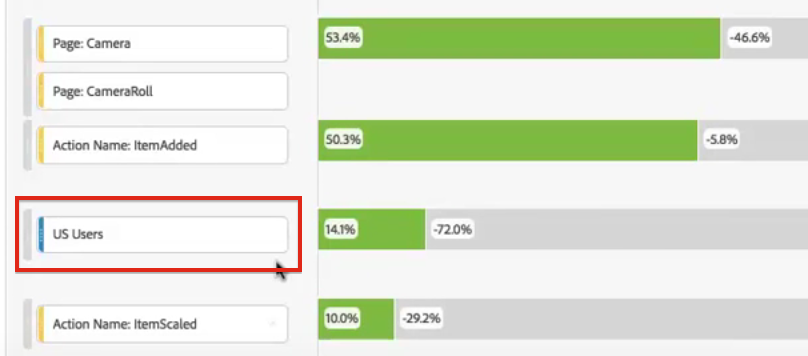

# フォールアウト分析でのフィルターの適用

タッチポイントからフィルターを作成したり、フィルターをタッチポイントとして追加したり、Analysis Workspace の様々なフィルターについて主なワークフローを比較したりできます。

>[!IMPORTANT]
>
>フォールアウトでチェックポイントとして使用されるフィルターでは、フォールアウトビジュアライゼーションの全体的なコンテキストよりも低いレベルのコンテナを使用する必要があります。訪問者コンテキストのフォールアウトを使用する場合、チェックポイントとして使用するフィルターは、訪問またはイベントベースのフィルターである必要があります。 訪問コンテキストフォールアウトを使用する場合、チェックポイントとして使用するフィルターはイベントベースのフィルターである必要があります。 無効な組み合わせを使用すると、フォールアウトは 100% になります。互換性のないフィルターをタッチポイントとして追加すると表示される警告を、フォールアウトビジュアライゼーションに追加しました。フィルターコンテナの特定の無効な組み合わせ（例えば次のような場合）では、無効なフォールアウト図が生じます。

* 訪問者ベースのフィルターを訪問者コンテキストのフォールアウトビジュアライゼーション内のタッチポイントとして使用する
* 訪問者ベースのフィルターを訪問コンテキストのフォールアウトビジュアライゼーション内のタッチポイントとして使用する
* 訪問ベースのフィルターを訪問コンテキストのフォールアウトビジュアライゼーション内のタッチポイントとして使用する

## タッチポイントからのフィルターの作成 {#section_915E8FBF35CD4F34828F860C1CCC2272}

1. 特に関心があり、他のレポートに適用するのに便利そうな特定のタッチポイントからフィルターを作成します。それには、タッチポイントを右クリックし、「**[!UICONTROL タッチポイントからフィルターを作成]**」をクリックします。

   

   フィルタービルダーが開き、選択したタッチポイントに合致する事前定義済みの順次フィルターがあらかじめ設定されています。

   

1. フィルターにタイトルと説明を入力して、保存します。

   これで、希望する任意のプロジェクトでこのフィルターを使用できます。

## タッチポイントとしてのフィルターの追加 {#section_17611C1A07444BE891DC21EE8FC03EFC}

例えば、米国のユーザーのトレンドとフォールアウトへの影響を確認したい場合は、US Users フィルターをフォールアウトにドラッグするだけです。

または、US Users フィルターを別のチェックポイントにドラッグすることで、AND タッチポイントを作成できます。

## フォールアウトでのフィルターの比較 {#section_E0B761A69B1545908B52E05379277B56}

フォールアウトビジュアライゼーションでは、フィルターを何個でも比較できます。

1. 比較するフィルターを左側の[!UICONTROL フィルター]パネルから選択します。この例では、US Users と Non-US Users の 2 つのフィルターを選択しています。
1. それらを上部のフィルタードロップゾーンにドラッグします。

   

1. オプション：「すべての訪問」をデフォルトのコンテナとして維持することも、削除することもできます。

   

1. これで、一方のフィルターがもう一方のフィルターよりパフォーマンスが優れているような 2 つのフィルターや他のインサイトについてフォールアウトを比較できます。
