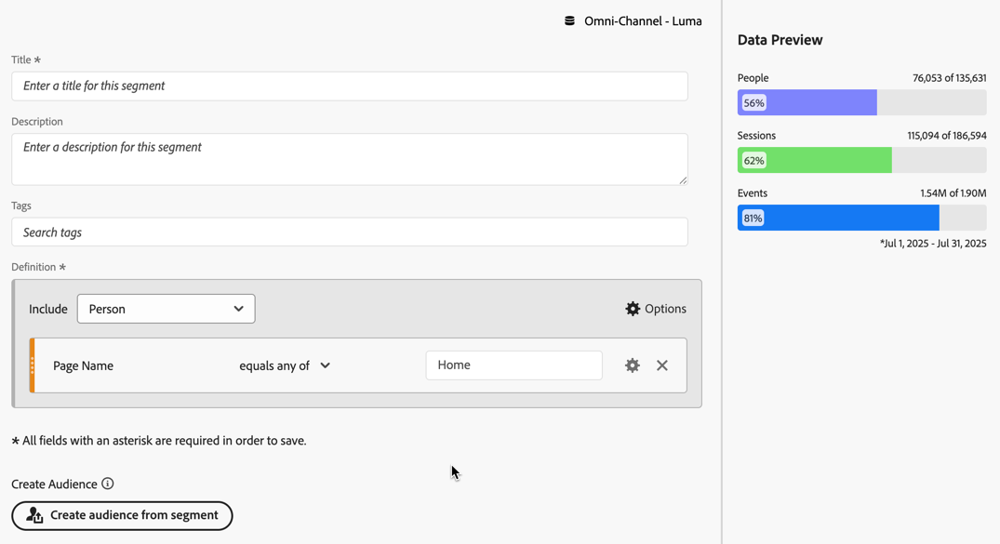

# フォールアウト分析でのセグメントの適用

タッチポイントからセグメントを作成したり、セグメントをタッチポイントとして追加したり、Analysis Workspace の様々なセグメントにわたって主なワークフローを比較したりできます。

>[!IMPORTANT]
>
>フォールアウトでチェックポイントとして使用されるセグメントでは、フォールアウトビジュアライゼーションの全体的なコンテキストよりも低いレベルのコンテナを使用する必要があります。 個人とコンテキストのフォールアウトでは、チェックポイントとして使用されるセグメントは、セッションまたはイベントベースのセグメントである必要があります。 セッションコンテキストのフォールアウトでは、チェックポイントとして使用されるセグメントは、イベントベースのセグメントである必要があります。 無効な組み合わせを使用した場合、フォールアウトは100%になります。 互換性のないセグメントをタッチポイントとして追加すると、フォールアウトビジュアライゼーションに警告が表示されます。 特定の無効なセグメントコンテナの組み合わせは、次のような無効なフォールアウト図につながります。
>
>* 人物ベースのセグメントを、人物コンテキストのフォールアウトビジュアライゼーション内のタッチポイントとして使用する。
>* セッションコンテキストのフォールアウトビジュアライゼーション内で、個人ベースのセグメントをタッチポイントとして使用する。
>* セッションベースのセグメントを、セッションコンテキストのフォールアウトビジュアライゼーション内のタッチポイントとして使用する。

<!-- 
Should we add B2B context here?
* [!BADGE B2B Edition]{type=Informative url="https://experienceleague.adobe.com/en/docs/analytics-platform/using/cja-overview/cja-b2b/cja-b2b-edition" newtab=true tooltip="Customer Journey Analytics B2B Edition"} Usimg a B2B container based segment as a touchpoint inside a non-container based context Fallout visualization.
* 
-->

## タッチポイントからのセグメントの作成

1. 特に関心があり、他のレポートに適用するのに便利そうな特定のタッチポイントからセグメントを作成します。 タッチポイントを右クリックし、**[!UICONTROL タッチポイントからセグメントを作成]**&#x200B;を選択します。

   

   [!UICONTROL &#x200B; セグメントビルダー]が開き、選択したタッチポイントに一致する事前定義済みのシーケンシャルセグメントが事前入力されます。

   

1. セグメントにタイトルと説明を付けて保存します。

   このセグメントは、任意のプロジェクトで使用できるようになりました。

## セグメントのタッチポイントとしての追加

例えば、米国のユーザーの傾向やフォールアウトへの影響を確認したい場合は、米国のユーザーセグメントをフォールアウトにドラッグします。

または、米国のユーザーセグメントを別のチェックポイントにドラッグして、AND タッチポイントを作成することもできます。

## フォールアウトでのセグメントの比較

フォールアウトビジュアライゼーションでは、無数のセグメントを比較できます。

1. 左側の[!UICONTROL &#x200B; セグメント &#x200B;] パネルから、比較するセグメントを選択します。 この例では、3つのセグメントが選択されています。*フライトの詳細：ページバージョン A*、*フライトの詳細：ページバージョン B*、*フライトの詳細：ページバージョン C*。
1. 3つのセグメントをビジュアライゼーションの上部にあるセグメントドロップゾーンにドラッグします。

1. オプション：*すべてのユーザー*&#x200B;をデフォルトコンテナとして保持するか、コンテナを削除できます。

   

1. 3つのセグメントのフォールアウトを比較できるようになりました。例えば、あるセグメントが他のセグメントよりも優れたパフォーマンスを発揮している場所や、他のインサイトが得られています。
