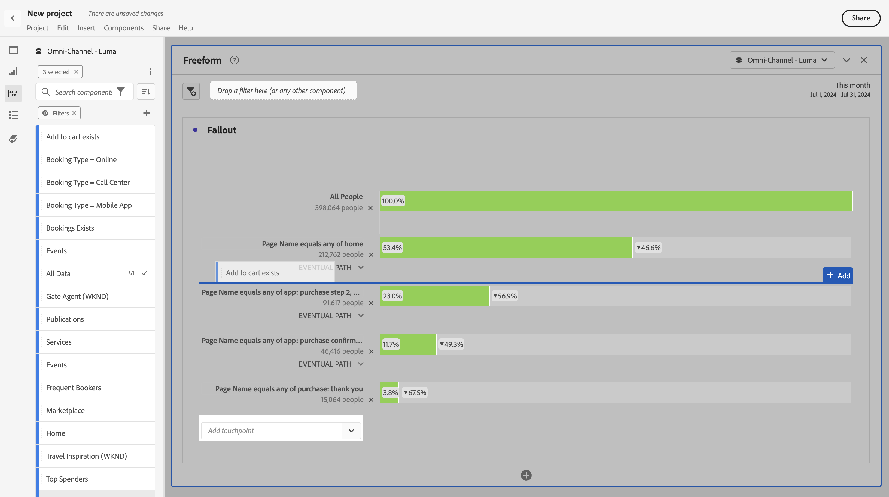

# フォールアウト分析でのフィルターの適用

タッチポイントからフィルターを作成したり、フィルターをタッチポイントとして追加したり、Analysis Workspace の様々なフィルターについて主なワークフローを比較したりできます。

>[!IMPORTANT]
>
>フォールアウトでチェックポイントとして使用されるフィルターでは、フォールアウトビジュアライゼーションの全体的なコンテキストよりも低いレベルのコンテナを使用する必要があります。ユーザーコンテキストのフォールアウトでは、チェックポイントとして使用するフィルターは、訪問ベースまたはイベントベースのフィルターにする必要があります。 訪問コンテキストのフォールアウトを使用する場合、チェックポイントとして使用するフィルターは、イベントベースのフィルターにする必要があります。 無効な組み合わせを使用すると、フォールアウトは 100% になります。 互換性のないフィルターをタッチポイントとして追加すると、フォールアウトビジュアライゼーションに警告が表示されます。 フィルターコンテナの特定の無効な組み合わせ（例えば次のような場合）では、無効なフォールアウト図が生じます。

* ユーザーベースフィルターをユーザーコンテキストのフォールアウトビジュアライゼーション内のタッチポイントとして使用する
* 訪問コンテキストのフォールアウトビジュアライゼーション内のタッチポイントとしてのユーザーベースのフィルターの使用
* 訪問ベースのフィルターを訪問コンテキストのフォールアウトビジュアライゼーション内のタッチポイントとして使用する

## タッチポイントからのフィルターの作成

1. 特に関心があり、他のレポートに適用するのに便利そうな特定のタッチポイントからフィルターを作成します。タッチポイントを右クリックして、「**[!UICONTROL タッチポイントからフィルターを作成]**」を選択します。

   

   [!UICONTROL  フィルタービルダー ] が開き、選択したタッチポイントに一致する事前定義済みの順次フィルターがあらかじめ設定されています。

   

1. フィルターにタイトルと説明を入力して、保存します。

   これで、希望する任意のプロジェクトでこのフィルターを使用できます。

## タッチポイントとしてのフィルターの追加

例えば、米国のユーザーのトレンドとフォールアウトへの影響を確認したい場合は、US Users フィルターをフォールアウトにドラッグするだけです。

または、US Users フィルターを別のチェックポイントにドラッグすることで、AND タッチポイントを作成できます。

## フォールアウトでのフィルターの比較

フォールアウトビジュアライゼーションでは、フィルターを何個でも比較できます。

1. 比較するフィルターを左側の [!UICONTROL  フィルター ] パネルから選択します。 この例では、*フライトの詳細：ページバージョン A*、*フライトの詳細：ページバージョン B*、および *フライトの詳細：ページバージョン C* の 3 つのフィルターを選択します。
1. 3 つのフィルターを、ビジュアライゼーションの上部にあるフィルタードロップゾーンにドラッグします。

1. オプション：*すべての訪問* をデフォルトのコンテナとして維持することも、コンテナを削除することもできます。

   

1. これで、一方のフィルターがもう一方のフィルターよりパフォーマンスが優れているような 3 つのフィルターや他のインサイトについてフォールアウトを比較できます。
