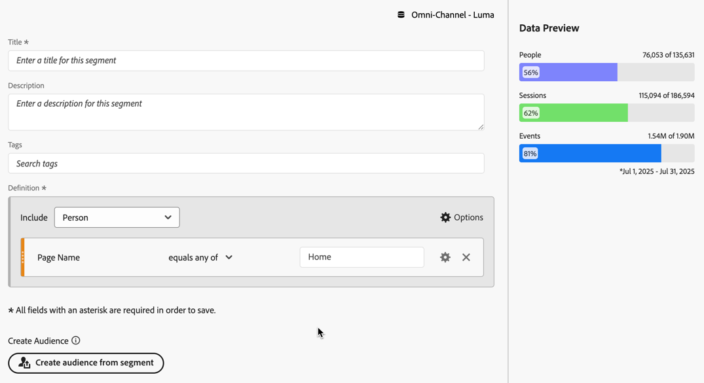

# フォールアウト分析でのセグメントの適用

タッチポイントからセグメントを作成したり、セグメントをタッチポイントとして追加したり、Analysis Workspace の様々なセグメントにわたって主なワークフローを比較したりできます。

>[!IMPORTANT]
>
>フォールアウトでチェックポイントとして使用されるセグメントでは、フォールアウトビジュアライゼーションの全体的なコンテキストよりも低いレベルのコンテナを使用する必要があります。ユーザーコンテキストのフォールアウトの場合、チェックポイントとして使用するセグメントは、セッションまたはイベントベースのセグメントにする必要があります。 セッションコンテキストのフォールアウトを使用する場合、チェックポイントとして使用されるセグメントは、イベントベースのセグメントである必要があります。 無効な組み合わせを使用すると、フォールアウトは 100% になります。 互換性のないセグメントをタッチポイントとして追加すると、フォールアウトビジュアライゼーションに警告が表示されます。 次のような、無効なセグメントコンテナの組み合わせの場合は、無効なフォールアウト図が生じます。
>
>* ユーザーベースのセグメントをユーザーコンテキストのフォールアウトビジュアライゼーション内のタッチポイントとして使用する。
>* ユーザーベースのセグメントをセッションコンテキストのフォールアウトビジュアライゼーション内のタッチポイントとして使用する。
>* セッションベースのセグメントをセッションコンテキストのフォールアウトビジュアライゼーション内のタッチポイントとして使用する。

<!-- Should we add B2B context here?
* [!BADGE B2B Edition]{type=Informative url="https://experienceleague.adobe.com/en/docs/analytics-platform/using/cja-overview/cja-b2b/cja-b2b-edition" newtab=true tooltip="Customer Journey Analytics B2B Edition"} Usimg a B2B container based segment as a touchpoint inside a non-container based context Fallout visualization.
* -->

## タッチポイントからのセグメントの作成

1. 特に関心があり、他のレポートに適用するのに便利そうな特定のタッチポイントからセグメントを作成します。タッチポイントを右クリックして、「**[!UICONTROL タッチポイントからセグメントを作成]**」を選択します。

   

   [!UICONTROL  セグメントビルダー ] が開き、選択したタッチポイントに一致する事前定義済みの順次セグメントが事前入力されます。

   

1. セグメントにタイトルと説明を入力して保存します。

   これで、希望する任意のプロジェクトでこのセグメントを使用できます。

## セグメントのタッチポイントとしての追加

例えば、米国のユーザーのトレンドとフォールアウトへの影響を確認したい場合は、US Users セグメントをフォールアウトにドラッグするだけです。

または、US Users セグメントを別のチェックポイントにドラッグすることで、AND タッチポイントを作成できます。

## フォールアウトでのセグメントの比較

フォールアウトビジュアライゼーションでは、無数のセグメントを比較できます。

1. 比較するセグメントを左側の [!UICONTROL  セグメント ] パネルから選択します。 この例では、*フライトの詳細：ページバージョン A*、*フライトの詳細：ページバージョン B*、*フライトの詳細：ページバージョン C* の 3 つのセグメントが選択されています。
1. 3 つのセグメントをビジュアライゼーションの上部にあるセグメント ドロップゾーンにドラッグします。

1. オプション：*すべてのユーザー* をデフォルトのコンテナとして保持するか、コンテナを削除できます。

   

1. これで、あるセグメントが別のセグメントよりパフォーマンスが優れているような 3 つのセグメントや他のインサイトについてフォールアウトを比較できます。
