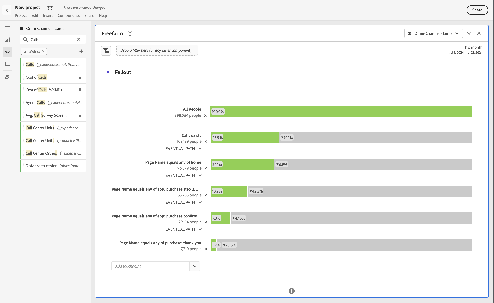

# ディメンション間のフォールアウト

Analysis Workspaceのフォールアウトを使用すると、ファネルとワークフローのタッチポイントとしてディメンションと指標を組み合わせて一致させることができます。 フォールアウトを使用すると、調査するユーザーステップをより柔軟に定義できます。

例えば、ページディメンションに加えて、他のディメンション項目（デバイス名ディメンションからの特定のデバイス名など）をフォールアウトビジュアライゼーションに追加できます。 ディメンションを組み合わせると、ページと特定のアクションが顧客のパスでどのように相互作用するかを視覚化できます。

フォールアウトは動的に更新され、複数のディメンションにわたるフォールアウトを表示できます。

指標を追加することもできます。 例えば、コール指標を追加して、コールが存在し、コールセンターに連絡しているユーザーのパスのみを表示できます。

ディメンションと指標を組み合わせることができます。 既存のディメンションまたは指標の上に別のディメンションまたは指標をドラッグします。 例えば、iPhoneを所有し、コールセンターに連絡した人物のフォールアウトを理解できます。

