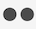

# ビジュアライゼーションの概要

ワークスペースは、棒グラフ、ドーナツグラフ、ヒストグラム、折れ線グラフ、マップ、散布図など、データを視覚的に表現する様々なビジュアライゼーションを提供します。Customer Journey Analytics を使用すると、ほとんどのビジュアライゼーションタイプは使い慣れたものとなります。しかし、Analysis Workspace にはビジュアライゼーション設定があり、インタラクティブ機能を備えた新しいまたは独自のビジュアライゼーションタイプを数多く揃えています。

## ビジュアライゼーションのタイプ

Analysis Workspace では、次のビジュアライゼーションタイプを利用できます。

| ビジュアライゼーション名 | 説明 |
| --- | --- | 
| [面グラフ](/help/analysis-workspace/visualizations/area.md)

 | 折れ線グラフに似ていますが、線の下に色付きの領域があります。指標が複数あり、2 個以上の指標の交差により表現される領域を視覚化する場合は、面グラフを使用します。 |
| [棒グラフ](/help/analysis-workspace/visualizations/bar.md) 

 | 1 つ以上の指標の様々な値を表す縦棒グラフが表示されます。 |
| [ブレットグラフ](/help/analysis-workspace/visualizations/bullet-graph.md) 

 | 目的の値が、他のパフォーマンス範囲（目標）と照らし合わせて、どのように比較または測定されるかを示します。 |
| [コホートテーブル](/help/analysis-workspace/visualizations/cohort-table/cohort-analysis.md)

 | *`cohort`* とは、特定の期間、共通の特性を共有する人々のグループのことです。コホート分析は、リテンション、チャーン、または遅延の分析に役立ちます。 |
| [ドーナツ](/help/analysis-workspace/visualizations/donut.md) 

 | このビジュアライゼーションは、円グラフと同様に、データを全体の一部またはフィルターとして表示します。 |
| [フォールアウト](/help/analysis-workspace/visualizations/fallout/fallout-flow.md)

 | <!-- Similar to Journey canvas, -->フォールアウトビジュアライゼーションは、事前に定義された一連のページ間で、人物が離脱した（フォールアウト）箇所や、次に進んだ（フォールスルー）箇所を表示します。 フォールアウトビジュアライゼーションは、最終的または正確なシーケンスに設定できます。 
<!-- Unlike Journey canvas, -->フォールアウトビジュアライゼーションは、開始と終了が既知のジャーニーが 1 つだけの線形ジャーニーの分析のみを提供します。
 |
| [フロー](/help/analysis-workspace/visualizations/c-flow/flow.md)

 | web サイトおよびアプリを介して正確な顧客パスを表示します。 |
| [フリーフォームテーブル](/help/analysis-workspace/visualizations/freeform-table/freeform-table.md)

 | フリーフォームテーブルは、単なるデータテーブルではなく、インタラクティブなビジュアライゼーションです。これは、ワークスペースのデータ分析の基礎になります。 |
| [ヒストグラム](/help/analysis-workspace/visualizations/histogram.md)

 | ヒストグラムは、指標の量に基づいて、個人、訪問、またはイベントをバケットにまとめます。 |
| [横棒グラフ](/help/analysis-workspace/visualizations/horizontal-bar.md)

 | 1 つ以上の指標の様々な値を表す横棒グラフが表示されます。 |
| [行](/help/analysis-workspace/visualizations/line.md)

 | 時間の経過に伴う値の変化を確認できるように、折れ線で指標が表されます。折れ線グラフは、X 軸で時間を表します。 |
| [散布図](/help/analysis-workspace/visualizations/scatterplot.md) 

 | ディメンション項目と最大 3 つの指標の関係を表示します。 |
| [数値の概要](/help/analysis-workspace/visualizations/summary-number-change.md)

 | 選択したセルを 1 つの大きな数値として表示します。 |
| [変更の概要](/help/analysis-workspace/visualizations/summary-number-change.md)

 | 選択したセル間の変化を 1 つの大きい数値/パーセントで表示します。 |
| [テキスト](/help/analysis-workspace/visualizations/text.md)

 | ユーザー定義のテキストをワークスペースに追加できます。パネルおよびビジュアライゼーションの説明の活用に加えて、分析とインサイトにコンテキストを追加するのに役立ちます。 |
| [ツリーマップ](/help/analysis-workspace/visualizations/treemap.md)

 | ネストされた長方形の集まりとして、（ツリー構造の）階層データが表示されます。 |
| [ベン図](/help/analysis-workspace/visualizations/venn.md)

 | 円を使用して、最大 3 つのフィルターの指標の重複を表します。 |

<!-- Add beneath Horizontal bar in the table above: | [Journey canvas](/help/analysis-workspace/visualizations/journey-canvas/journey-canvas.md) | Similar to Fallout, Journey canvas shows where persons left (fell out) and continued through (fell through) a predefined sequence of pages. 
Unlike Fallout, Journey canvas supports not only linear journeys, but any number of entry points and paths. Furthermore, journeys can be created in Adobe Journey Optimizer and then analyzed in Journey canvas.
 | -->

## パネルへのビジュアライゼーションの追加

1. ビジュアライゼーションを追加するAnalysis Workspace プロジェクトを開きます。

1. 次のいずれかの方法を使用して、ビジュアライゼーションを追加します。

   * 左側のパネルで、**ビジュアライゼーション** アイコン <!-- add icon --> を選択し、ビジュアライゼーションを追加するパネルにドラッグします。

     

   * ビジュアライゼーションを追加するパネルで **プラス** アイコンを選択した後、追加するビジュアライゼーションを表すアイコンを選択します。 各ビジュアライゼーションのアイコンにマウスポインターを置くと、その名前が表示されます。

     

   * [ 空のパネル ](https://experienceleague.adobe.com/docs/analytics/analyze/analysis-workspace/panels/blank-panel.html?lang=ja) を追加してから、追加するビジュアライゼーションを選択します。

     

   * Analysis Workspace プロジェクト内の既存のパネルを右クリックし、[!UICONTROL **ビジュアライゼーションを複製**] または [!UICONTROL **ビジュアライゼーションをコピー**] を選択します。

## ビジュアライゼーション設定のカスタマイズ

個々のビジュアライゼーションに対して、または作成するすべてのビジュアライゼーションに対して、ビジュアライゼーション設定をカスタマイズできます。

### 単一のビジュアライゼーションのビジュアライゼーション設定のカスタマイズ

個々のビジュアライゼーションの[!UICONTROL ビジュアライゼーション設定]にアクセスするには：

1. Analysis Workspace では、設定をカスタマイズしたいビジュアライゼーションの上にマウスポインターを置きます。

1. 歯車アイコンをクリックします。

   ビジュアライゼーションの各タイプには、カスタマイズできる一意の設定があります。使用可能な設定について詳しくは、[設定](#settings)を参照してください。

### 作成するすべてのビジュアライゼーションのビジュアライゼーション設定のカスタマイズ

作成するすべてのビジュアライゼーションについて、設定をカスタマイズできます。詳しくは、[ユーザー環境設定](/help/analysis-workspace/user-preferences.md)を参照してください。

## 設定 {#settings}

各ビジュアライゼーションには、管理可能な独自の設定があります。ビジュアライゼーション設定にアクセスするには、設定アイコン  を選択します。

| 設定 | 説明 |
| --- | --- |
| ビジュアライゼーションのタイプ | データを表現するために使用するビジュアルのタイプを変更します。 |
| 精度 | トレンドのビジュアライゼーションでは、このドロップダウンから時間の精度（日、週、月など）をこのドロップダウンリストから。 この変更は、データソーステーブルにも適用されます。 |
| 割合（％） | 値を割合で表示します。 |
| 100% の積み重ね | 積み上げ面、積み上げ棒、または積み上げ横棒のビジュアライゼーションのこの設定は、グラフを「100 % の積み上げ」のビジュアライゼーションに変更します。例： |
| 凡例を表示 | 数の概要／変更の概要ビジュアライゼーションの詳細な凡例テキストを非表示にします。 |
| 項目数の上限を設定 | ビジュアライゼーションで表示する項目の数を制限できます。 |
| Y 軸をゼロに固定 | グラフに示されるすべての値がゼロよりもかなり上の場合、グラフのデフォルトでは、Y 軸の一番下はゼロ以外になります。このボックスをチェックすると、Y 軸は強制的にゼロになります（グラフは再描画されます）。 |
| 正規化 | 指標を均等な比率にします。これは、プロットされた指標の大きさが非常に異なる場合に役立ちます。 |
| 二重軸を表示 | 2 つの指標がある場合にのみ適用されます。（ある指標の）Y 軸を左側に、（他の指標の）Y 軸を右側に表示できます。これは、プロットされた指標の大きさが非常に異なる場合に役立ちます。 |
| 異常値を表示 | 異常値検出を表示することで、折れ線グラフおよびフリーフォームテーブルを強化します。線のビジュアライゼーションでの異常値検出には、期待値（破線）と期待範囲（影付きの帯）が含まれます。 |
| 予測を表示 | 予測値を表示することで、折れ線グラフとフリーフォームテーブルを強化します。 |

## 凡例 {#legend}

ビジュアライゼーションの凡例を使用すると、ソーステーブルの日付をビジュアライゼーション内のプロットされたシリーズに関連付けることができます。凡例はインタラクティブです。凡例項目をクリックして、ビジュアライゼーション内のシリーズの表示/非表示を切り替えることができます。これは、視覚化するデータを簡略化する場合に便利です。

また、凡例ラベルの名前を変更して、図をより使いやすくすることができます。メモ：凡例の編集は、ツリーマップ、ブレットグラフ、変更の概要／数値の概要、テキスト、フリーフォーム、ヒストグラム、コホート、またはフローのビジュアライゼーションには&#x200B;**適用されません**。

凡例ラベルを編集するには、次の手順を実行します。

1. 凡例ラベルの 1 つを右クリックします。
1. 「**[!UICONTROL ラベルを編集]**」をクリックします。

   

1. 新しいラベルテキストを入力します。
1. **[!UICONTROL Enter]** キーを押して保存します。

## 右クリックメニュー {#right-click}

ビジュアライゼーションの追加機能は、ビジュアライゼーションのヘッダーを右クリックすると使用できます。設定は、ビジュアライゼーションによって異なります。次の設定を使用できます。

| 設定 | 説明 |
| --- | --- |
| コピーしたパネル／ビジュアライゼーションを挿入 | コピーした要素をプロジェクト内の別の場所、または完全に別のプロジェクトに貼り付ける（「挿入」する）ことができます。 |
| ビジュアライゼーションをコピー | ビジュアライゼーションを右クリックしてコピーし、プロジェクト内の別の場所に挿入したり、完全に別のプロジェクトに挿入したりできます。 |
| [ プロジェクトデータのダウンロード ](/help/analysis-workspace/export/download-send.md) | 選択したディメンションの最大 50,000 個のディメンション項目を CSV としてダウンロードします。 |
| [ プロジェクトデータのダウンロード ](/help/analysis-workspace/export/download-send.md) | ビジュアライゼーションデータソースを CSV 形式でダウンロードします。 |
| 重複ビジュアライゼーション | 現在のビジュアライゼーションの厳密な複製を作成して、修正できます。 |
| 説明を編集 | ビジュアライゼーションの説明テキストを追加（または編集）します。 |
| ビジュアライゼーションリンクを取得 | プロジェクト内の特定のビジュアライゼーションに他のユーザーを誘導できます。受信者は、リンクをクリックした後、リンク先の正確なビジュアライゼーションにリダイレクトされる前にログインするよう求められます。 |
| やり直し | （フロー、ベン図、ヒストグラムで機能）現在のビジュアライゼーションの設定を削除し、ゼロから再設定できるようにします。 |

## ビジュアルを作成アイコン {#quick-viz}

どのビジュアライゼーションが選択されるかわからない場合は、テーブルの行にある&#x200B;**[!UICONTROL ビジュアルを作成]**&#x200B;アイコン（カーソルを合わせると使用できます）をクリックします。これは、ビジュアライゼーションを追加する最も速い方法です。クリックすると、データに最適なビジュアライゼーションを Analysis Workspace が学習に基づいて推測することの確認が表示されます。例えば、1 行を選択した場合、トレンド折れ線グラフが作成されます。3 つのフィルター行を選択した場合は、ベン図が作成されます。

